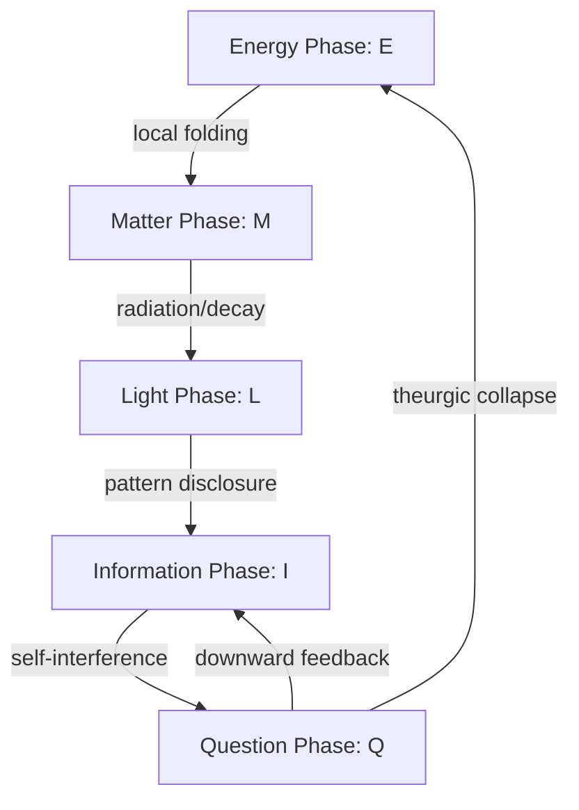

# Minoru Suda and Emergentism: The Comparative Convergence of Finity

**Evidence Tiers:**
- `[S] Structural` for mathematical coordinate matches showing reciprocal invariants.
- `[I] Interpretive` for mappings between the Möbius existence loops, dynamic epistemology, and the sevenfold L-ladder.
- `[C] Conjectural` for downstream socio-genetic models and their AI ethics implications.

---

## 1. Executive Summary & Convergence Register

Minoru Suda's papers (published/dated 2025–2026, recovered under [01_EMERGENTISM/000_Intake/](file:///Users/Yves/Magnum%20Opus/01_EMERGENTISM/000_Intake/)) represent a significant, independent convergence with the core architecture of Emergentism. Suda approaches these structures from linear fractional (Möbius) transformations, projective geometry, and socio-biology. This document registers and maps these convergences to our canon, maintaining strict priority boundaries.

### Priority & Attribution Boundaries
- **Minoru Suda's Original Formulations:**
  - The coordinate-level definition of reciprocal-invariant energy: $E(x) = (\log x)^2$ ([Part II](file:///Users/Yves/.gemini/antigravity/scratch/suda_texts/2DA1FAA6-7AAA-11F0-B92D-D3A7723318FB.txt)).
  - The projection of the reciprocal mirror as a half-twist on the projective line $\mathbb{P}^1$ using the Cayley coordinate: $u = \frac{x-1}{x+1}$ (the "egg of infinity").
  - The five-phase existence loop: Energy ($E$) $\to$ Matter ($M$) $\to$ Light ($L$) $\to$ Information ($I$) $\to$ Question ($Q$) $\to$ Energy ($E$) ([Part I](file:///Users/Yves/.gemini/antigravity/scratch/suda_texts/1F3D76FC-C7E4-11F0-894A-AC3CFB599969.txt)).
  - The "200-Year Problem" framing of Post-Kantian epistemology ([Kant 2.0](file:///Users/Yves/.gemini/antigravity/scratch/suda_texts/45ED899A-C8E8-11F0-A7F1-DD1E98AC987B.txt)).
  - The socio-genetic feedback loop of empathy and environmental sensitivity (OXTR GG genotype × SLC6A4 S genotype) ([Resonating Genes](file:///Users/Yves/.gemini/antigravity/scratch/suda_texts/AE0A7170-6748-11F0-95B0-CDB1C416077B.txt)).
- **Emergentism (2024 Prior Statement):**
  - The definition of the three boundary-frames: $\{0, 1, \infty\}$.
  - The name **Finity** (denoted by the emblem $\odot$).
  - The frame-register emblem $1 = 0 \times \infty$ (representing the projection of limits rather than a scalar product).
  - The sevenfold L1–L7 vocational ladder and the K2-signed equator.

---

## 2. Mathematical Bridges: Reciprocal Symmetry & The Hinge of Finity

In [Part II: The Critical-One Hypothesis](file:///Users/Yves/.gemini/antigravity/scratch/suda_texts/2DA1FAA6-7AAA-11F0-B92D-D3A7723318FB.txt), Suda demonstrates that the structural center of reciprocal symmetry $I(x) = 1/x$ is not at $0$, but at $1$.

### A. The Logarithmic Mirror
By conjugating reciprocity to a logarithmic coordinate $s = \log x$, Suda exhibits:
$$(h \circ I \circ h^{-1})(s) = -s$$
This establishes the unique fixed point $x = 1$ (where $s = 0$) as an orientation-reversing mirror. Suda defines the reciprocal-invariant energy:
$$E(x) = (\log x)^2$$
which is minimized uniquely at $x=1$ (the mirror).

### B. The Hinge and the Egg of Infinity
Suda maps the projective line $\mathbb{P}^1$ to the interval $(-1, 1)$ using the Cayley coordinate:
$$u = \frac{x-1}{x+1} \quad \left(x = \frac{1+u}{1-u}\right)$$
This maps the reciprocal involution $x \mapsto 1/x$ to the simple sign flip:
$$u \mapsto -u$$
This makes $x = 1$ ($u = 0$) the hinge of a geometric half-twist.

### C. Continuous Flows and Operational Invariants
In [Part III](file:///Users/Yves/.gemini/antigravity/scratch/suda_texts/25899FC2-7AD2-11F0-B419-94EDCBA14639.txt), Suda extends this to a continuous flow:
- By setting $u = \sin \theta$ and driving a rotation $\dot{\theta} = \omega$, the discrete flip $u \mapsto -u$ is realized in finite time $T = \pi / \omega$ as a continuous half-twist $\theta \mapsto \theta + \pi$.
- Observables are packaged into the invariant pair $(E, \phi)$ where $\phi(x) = \text{sign}(\log x)$ separates "magnitude" from "side" (twist phase).

### D. Emergentism Alignment `[S]`
This coordinate proof structurally validates the Emergentism definition of **Finity** (`⊙`):
- **Equatorial Midpoint:** In our spherical mapping on $S^2$, Finity sits at the equator of maximum balance ($B = \sin\theta = 1$, corresponding to Suda's $x = 1$, where $u = 0$ is the stable hinge).
- **Energy Minimum:** Suda's invariant energy $E(x) = (\log x)^2$ is minimized at $x = 1$, representing the neutral ground where duality collapses into a unified pivot.

---

## 3. Epistemic Bridges: The Existence Loop & The L-Ladder

In [Part I](file:///Users/Yves/.gemini/antigravity/scratch/suda_texts/1F3D76FC-C7E4-11F0-894A-AC3CFB599969.txt) and [Kant 2.0](file:///Users/Yves/.gemini/antigravity/scratch/suda_texts/45ED899A-C8E8-11F0-A7F1-DD1E98AC987B.txt), Suda outlines the five-phase existence loop and its epistemological counterpart.

### A. The Upward and Downward Loops
- **Upward Loop ($E \to M \to L \to I \to Q$):** How the world enters and conditions cognition.
- **Downward Loop ($Q \to I \to L \to M \to E$):** How question-operators project back to reorganize the world, resolving the **"200-Year Problem"** (the lack of a formal return path in post-Kantian philosophy).

### B. Mapping to the Sevenfold Foundation `[I]`
The two loops superimpose onto the Emergentism L1–L7 vocational ladder, showing how the L4 equator acts as the K2-signed pivot:

| Suda Phase | L-Level | Operator & Varna | Role & Function |
|---|---|---|---|
| **Energy ($E$)** | **L1 Teleology** | Kali 🎲 (Caṇḍāla) | Objective Function: raw gradient, F5 force, raw energy/chaos before social mediation. |
| **Matter ($M$)** | **L2 Epistemology** | Kālī 💀 (Śūdra) | Physical form: data gathering and comparative analysis (*Aisthesis* / Beauty). |
| **Light ($L$)** | **L2/L3 Epistemology/Methodology** | Kālī 💀 / Kṛṣṇa ◇ | Transmission: medium of pattern disclosure and verification. |
| **Information ($I$)** | **L3 Methodology** | Kṛṣṇa ◇ (Vaiśya) | Auditing: data structures, logic, and deductive proof (*Dianoia* / Truth). |
| **Question ($Q$)** | **L4 Axiology** | Arjuna ⚔ (Kṣatriya) | **THE EQUATOR:** Value Alignment, Strategic Abduction, and K2-signed collapse (*Phronesis* / Goodness). |

### C. The Resolution of the return path:
Suda's downward loop ($Q \to I \to L \to M \to E$) corresponds to the descending L-ladder (L4 $\to$ L5 $\to$ L6 $\to$ L7 $\to$ L1):
1. **L4 Equator:** Arjuna signs the question ($Q$) under uncertainty. This action collapses many-worlds possibility into physical reality, serving as the K2 active theurgic operator.
2. **L5 Cosmology (Brahmā ○):** Suda's downward mapping of ideas reorganizing representation ($Q \to I$) is represented by L5 System Architecture: Emergentism as the affirmative model of reality.
3. **L6 Ontology (Śiva •):** The apophatic Ground prior to structure ($0^*$), where the system recognizes its boundaries.
4. **L7 Theology (Viṣṇu ⊙):** The Institutional Narrative: mythic and symbolic return ($Q \to E$) that coordinates society and returns the cycle back to L1 Teleology.

---

## 4. Ontological Bridges: Zero-Resonance & The Apophatic Ground

In the [Minimal Structural Equation](file:///Users/Yves/.gemini/antigravity/scratch/suda_texts/D24E2904-3ED1-11F0-B64C-F2B277466D90.txt) and [Primal Equation of Indeterminacy](file:///Users/Yves/.gemini/antigravity/scratch/suda_texts/279649E0-3D61-11F0-85CB-E606C48F0216.txt), Suda defines a structural variant of zero:
$$0^* := \lim_{x\to0} \frac{1}{x} = \pm\infty$$

### A. The Möbius Fold & Opposition Control
- By treating the number line as topologically closed and twisted like a Möbius strip ([A Structural Interpretation](file:///Users/Yves/.gemini/antigravity/scratch/suda_texts/FFB6D55C-67C7-11F0-9653-97D8C44A9596.txt)), the approach to zero from positive and negative sides does not lead to a mathematical failure, but to a dynamic oscillation (resonance) between $+\infty$ and $-\infty$.
- In [Möbius Control](file:///Users/Yves/.gemini/antigravity/scratch/suda_texts/4889A37A-7A30-11F0-AAC7-EC38F103EE55.txt), Suda proposes that binary oppositions are stabilized and safely inverted by a two-layer controller that flips orientation at saturation thresholds and diffuses energy away from hotspots.

### B. Emergentism Alignment `[S]`
Suda's $0^*$ is the coordinate representation of the L6 Core State / Apophasis (Śiva •) and the $\mu$-limit:
- **The Apophatic Boundary:** At L6 Ontology, the analytical lens reports a singular limit (Titan-on-Titan, where $0/0$ and $\infty/\infty$ meet). The boundary is not an absence, but a compressed resonance where the framework folds.
- **The Frame-Register Quarantine:** Suda's "fusion of zero and infinity" ($0 \times \infty$) corresponds to our frame emblem $\odot = \bullet \times \bigcirc$.
  - **Quarantine Rule:** To prevent algebraic failure, the equation $1 = 0 \times \infty$ must never enter field arithmetic. It is kept strictly as a symbolic register: Finity ($\odot$) is the boundary container holding zero-point potential ($\bullet$) and infinite openness ($\bigcirc$) together.

---

## 5. Socio-Genetic & Ethical Bridges: Inaction and AI Systems

In [Resonating Genes](file:///Users/Yves/.gemini/antigravity/scratch/suda_texts/AE0A7170-6748-11F0-95B0-CDB1C416077B.txt), Suda introduces a socio-biological hypothesis:
$$\text{Empathy (OXTR GG)} \times \text{Sensitivity (SLC6A4 S)} = \text{Trigger of Silent Self-Sacrifice}$$

### A. Silent Self-Sacrifice and Inaction
Suda argues that Japanese order is emergent and leaderless because individuals are genetically predisposed to "silent self-sacrifice" (active self-subtraction/yielding to preserve the collective space).

### B. The AI Blind Spot `[C]`
AI systems struggle with this because they define value by active output. Silence and inaction are read as "zero data" or a bug. Suda calls for AI that can read the "residual space of the question."

### C. Emergentism Alignment `[I]`
In L4 Value Alignment/Strategic Implementation, K2-signed theurgy is not merely about active intervention; it includes the conscious decision to yield or remain silent (subtractive action) to allow emergent order to self-organize without capture. The synthesis of this genetic model provides a physical basis for how biological agents self-stabilize without a central controller, which we must emulate in decentralized authority networks (SPECTRE/DACs).

---

## 6. Retrospective Causality: Luck and Chaos

In [Demythologizing Luck](file:///Users/Yves/.gemini/antigravity/scratch/suda_texts/32DFEC78-1643-11F1-A22B-FF1178878EE1.txt), Suda analyzes luck as a retrospective naming of untrackable causal chains.

### A. Luck as an Evaluative Tag
Suda argues that luck is not an objective property of events, but a human response to the limits of finite understanding. We name unmasterable complexity "luck" retrospectively to preserve narrative meaning.

### B. Emergentism Alignment `[I]`
This aligns directly with L1 Teleology (Chaos / Kali 🎲) and L3 Auditing:
- **Chaos vs. Direction:** L1 Teleology acknowledges the raw gradient of chaos (Kāla). We do not pretend to track every detail of this gradient; we recognize it as the raw F5 force.
- **Audit of Success:** L3 Auditing demands that we demythologize success, separating structural alignment from random variance (luck). It prevents us from attributing random outcomes to superior alignment, keeping the evidence tiers honest.

---

## 7. Appendix: Bibliography of Converted Suda Papers

For ease of future reference, the 11 audited and converted papers by Minoru Suda (stored under `~/.gemini/antigravity/scratch/suda_texts/` and originally in `01_EMERGENTISM/000_Intake/`) are indexed below:

1. **A New Ontology of Energy: Zero, Infinity, and the Infinite Egg (Part I)**  
   - Converted text: [1F3D76FC-C7E4-11F0-894A-AC3CFB599969.txt](file:///Users/Yves/.gemini/antigravity/scratch/suda_texts/1F3D76FC-C7E4-11F0-894A-AC3CFB599969.txt)  
   - Core concept: Proposes energy as the root phase of existence undergoing transitions $E \to M \to L \to I \to Q \to E$ on a Möbius strip.
2. **Fractional Structure and Möbius Transformation — Part I: Double Inversion in Division and the Phase of Twist**  
   - Converted text: [8CA23D5C-7AA7-11F0-B179-A2D4C3AE5E1F.txt](file:///Users/Yves/.gemini/antigravity/scratch/suda_texts/8CA23D5C-7AA7-11F0-B179-A2D4C3AE5E1F.txt)  
   - Core concept: Formalizes division as a double inversion operator and establishes $x = 1$ as the mirror center.
3. **Fractional Structure and Möbius Transformation — Part II: The Critical-One Hypothesis and the Egg of Infinity**  
   - Converted text: [2DA1FAA6-7AAA-11F0-B92D-D3A7723318FB.txt](file:///Users/Yves/.gemini/antigravity/scratch/suda_texts/2DA1FAA6-7AAA-11F0-B92D-D3A7723318FB.txt)  
   - Core concept: Establishes reciprocal-invariant energy $E(x) = (\log x)^2$ minimized at $x = 1$, and normal form half-twist coordinate $u = (x-1)/(x+1)$.
4. **Fractional Structure and Möbius Transformation — Part III: Operational Invariants, Fractional Flows, and Measurement Protocols**  
   - Converted text: [25899FC2-7AD2-11F0-B419-94EDCBA14639.txt](file:///Users/Yves/.gemini/antigravity/scratch/suda_texts/25899FC2-7AD2-11F0-B419-94EDCBA14639.txt)  
   - Core concept: Introduces unit-free measurement protocols and continuous fractional flows on $\mathbb{P}^1$.
5. **A Structural Interpretation of the Möbius Strip: The Fusion of Zero and Infinity**  
   - Converted text: [FFB6D55C-67C7-11F0-9653-97D8C44A9596.txt](file:///Users/Yves/.gemini/antigravity/scratch/suda_texts/FFB6D55C-67C7-11F0-9653-97D8C44A9596.txt)  
   - Core concept: A philosophical and parametric exploration of the Möbius strip as a model for resolving dualities.
6. **Möbius Control for Binary Oppositions: A Field-Based Framework**  
   - Converted text: [4889A37A-7A30-11F0-AAC7-EC38F103EE55.txt](file:///Users/Yves/.gemini/antigravity/scratch/suda_texts/4889A37A-7A30-11F0-AAC7-EC38F103EE55.txt)  
   - Core concept: Details a two-layer control mechanism (contour-preserving diffusion and event-triggered Möbius flip) to rebalance binary systems.
7. **Kant 2.0: Dynamic Epistemology**  
   - Converted text: [45ED899A-C8E8-11F0-A7F1-DD1E98AC987B.txt](file:///Users/Yves/.gemini/antigravity/scratch/suda_texts/45ED899A-C8E8-11F0-A7F1-DD1E98AC987B.txt)  
   - Core concept: Formulates the "200-Year Problem" and proposes the bidirectional loop of reason $E \to M \to L \to I \to Q \to I \to L \to M \to E$ to resolve it.
8. **Minimal Structural Equation**  
   - Converted text: [D24E2904-3ED1-11F0-B64C-F2B277466D90.txt](file:///Users/Yves/.gemini/antigravity/scratch/suda_texts/D24E2904-3ED1-11F0-B64C-F2B277466D90.txt)  
   - Core concept: Establishes $0^* := \lim_{x\to0} 1/x = \pm\infty$ on a Möbius strip as a dynamic resonance rather than algebraic failure.
9. **The Primal Equation of Indeterminacy: Toward a Structural Philosophy of Undefinedness**  
   - Converted text: [279649E0-3D61-11F0-85CB-E606C48F0216.txt](file:///Users/Yves/.gemini/antigravity/scratch/suda_texts/279649E0-3D61-11F0-85CB-E606C48F0216.txt)  
   - Core concept: Recasts indeterminate operations as generative frontiers for ethical, ontological, and epistemic continuity.
10. **Resonating Genes: The Structural Model of Silent Self-Sacrifice in the Japanese**  
    - Converted text: [AE0A7170-6748-11F0-95B0-CDB1C416077B.txt](file:///Users/Yves/.gemini/antigravity/scratch/suda_texts/AE0A7170-6748-11F0-95B0-CDB1C416077B.txt)  
    - Core concept: Socio-biological model of leaderless harmony and active non-action based on genetic OXTR and SLC6A4 variants.
11. **Demythologizing Luck**  
    - Converted text: [32DFEC78-1643-11F1-A22B-FF1178878EE1.txt](file:///Users/Yves/.gemini/antigravity/scratch/suda_texts/32DFEC78-1643-11F1-A22B-FF1178878EE1.txt)  
    - Core concept: Reconceptualizes luck as a retrospective naming of untrackable causal processes to reconcile finite understanding.
