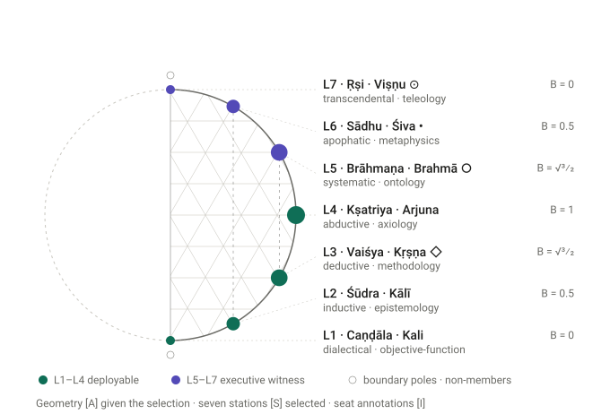
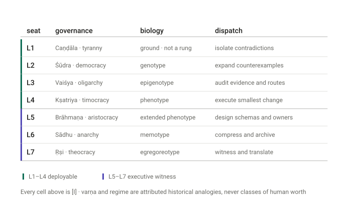

---
rosetta:
  primary_level: L5
  primary_column: Meta
  operator: "Brahmā ○"
  tier: "Executive witness"
  regime: "Brāhmaṇa"
  register: "[S]"
  canonical_phrase: "The Rosetta grouped in themes — one [A] geometry, one [S] count, and every cross-domain cell [I] (themed index; grouping selected)"
  d_register: 4
  d_register_basis: "index over existing packs and projections; creates no new mapping"
title: "The Rosetta in Themes — a grouped index over the live packs"
status: "ACTIVE — INDEX. Groups what the pack ledger already holds. It registers no new pack, opens no new projection, and promotes no cell. The three-line clarification in §0 is the propagation payload."
date: 2026-08-13
evidence_tier: "[S] the grouping into nine themes and the two figures; [A] the meridian identities in §7, given the selection; [B] the pack digests quoted in §1; [I] inherited unchanged on every cross-domain cell"
owner: "Subordinate to 00_THE_MASTER_ROSETTA.md and to D_SERIES_ROWS/00_GENERATIVE_TABLE.md. Where this index and a source pack differ, the pack governs."
parents:
  - 00_THE_MASTER_ROSETTA.md
  - D_SERIES_ROWS/00_GENERATIVE_TABLE.md
  - 35_THE_LADDER_AND_THE_TWO_PARTITIONS_2026_08_05.md
  - 07_MIRROR_SYMMETRY_FALSIFICATION_TEST_2026_04_25.md
  - ROSETTA_REPLICATOR.md
  - 16_PLATO_LAKOTA_NEUROSCIENCE_2026_04_25.md
---

# The Rosetta in Themes

> **What this is.** A grouped reading of the live pack ledger
> (`rosetta_cells.json`, revision 3, recorded 2026-07-31). It puts nine themes
> side by side so the shape is visible in one pass.
>
> **What it is not.** Not a new pack, not a new projection, not a promotion.
> Every cell it displays keeps the tier its source gave it.
>
> **This document is the map. The territory is
> [`37_THE_FULL_ROSETTA_IN_THEMES_2026_08_13.md`](37_THE_FULL_ROSETTA_IN_THEMES_2026_08_13.md)** —
> the generated catalogue of **every** harvested `L1`–`L7` column (176 columns
> across 30 files) under the same eleven themes, with the machine-readable ledger
> at [`37_THE_FULL_ROSETTA_COLUMNS.jsonl`](37_THE_FULL_ROSETTA_COLUMNS.jsonl).
> Read §0 here first; read 37 when you need the cells.

---

## 0 · The clarification — three lines, and they travel together `[S]`

Any surface that shows the seven-row ladder must carry all three. One or two
without the third is the failure this section exists to stop.

> **1 · The geometry is `[A]` — given the selection.**
> `B = sin θ` on the selected chart. `B(θ) = B(π−θ)` forces palindromic pairing;
> `L4` is the unique argmax; the extremes go to `0`. These are identities, not
> findings.
>
> **2 · The count is `[S]` — selected, not derived.**
> Six arcs of 30° is a choice. **3, 5 or 9 stations satisfy every symmetry in
> line 1 equally well.** What recommends six is that it lands on closed-form
> sines. That is an `[S]` with a stated reason, and still an `[S]`.
>
> **3 · Every cross-domain cell is `[I]`.**
> Varṇa, regime, -ology, inference, replicator layer, and every domain column
> are directional projections. They inherit neither the source's truth nor its
> evidence tier. A seven-row fit does not show that a source domain natively has
> seven stages.

**Two corollaries that travel with them:**

- **`G7@1` is not a column of `GEN7@1`.** L-numbered seats belong to `GEN7@1`.
  `G7@1` is a partition — `M4 ⊎ F3` — not a ladder. Writing
  `G7@1:kali_take_phi` in a row beside `GEN7@1:L1` is the exact conflation the
  pack grammar exists to prevent.
- **The poles are non-members.** `S2BOUNDARY@1:zero_pole` and
  `S2BOUNDARY@1:infinity_pole` are distinct nonmember boundary references. `L1`
  and `L7` **approach** them and never identify them. *"Connectedness of `S²`
  does not identify its poles."*

---

## 1 · Prior art, first — this index originates nothing `[B]`

Per the corpus rule. Every theme below is an existing artifact with a named
owner and a frozen digest.

| pack | terms | owner | source version | digest (sha256, first 12) |
|---|---|---|---|---|
| `GEN7@1` | 7 | `D_SERIES_ROWS/00_GENERATIVE_TABLE.md` | `GEN7@1/2026-07-31` | `e1490dc24671` |
| `PHIL7@1` | 7 | `00_THE_SEVEN_PHILOSOPHICAL_DISCIPLINES.md` | `PHIL7@1/2026-07-31` | `4d60069ed28e` |
| `SOUL@1` | 11 | `05_COSMOLOGY/01_THE_TRANSCENDENTAL_TRINITY/10_THE_SOUL_LOOP.md` | `SOUL@1/2026-07-21` | `0f39a1ff7660` |

The governing method is `00_THE_MASTER_ROSETTA.md` — status *"ACTIVE METHOD —
never evidence or ontology."* The former 1,100-line catalogue was archived
2026-07-21 and **has no current semantic authority**; do not restore it as a
source.

**What is this document's own, stated narrowly:** the selection of nine themes,
their order, and the two figures. `[S]`. Nothing else.

---

## 2 · Theme I — the spine `GEN7@1`

The only native seats. Everything else projects *into* them.

| seat | varṇa | inference | -ology | regime |
|---|---|---|---|---|
| `L1` | Caṇḍāla | dialectical | objective-function | tyranny |
| `L2` | Śūdra | inductive | epistemology | democracy |
| `L3` | Vaiśya | deductive | methodology | oligarchy |
| `L4` | Kṣatriya | abductive | axiology | timocracy |
| `L5` | Brāhmaṇa | systematic | ontology | aristocracy |
| `L6` | Sādhu | apophatic | metaphysics | anarchy |
| `L7` | Ṛṣi | transcendental | teleology | theocracy |

## 3 · Theme II — the move grammar `G7@1 = M4 ⊎ F3`

```text
M4   {take, give} × {Φ, V}
       kali_take_phi · kali_take_v          demon-polar, taking
       krishna_give_v · arjuna_give_phi     god-polar, giving
F3   brahma_create · shiva_dissolve · vishnu_preserve
```

**Kali and Kālī are two seats, not one** — Kali 🎲 takes `Φ` at the `L1`
annotation, Kālī 💀 takes `V` at `L2`. The Titans are boundary roles: *"not D5
agents, causal particles, or arithmetic operands."*

## 4 · Theme III — the epistemic columns, and they are *two* sevens

`GEN7@1`'s -ology column and `PHIL7@1` are **different packs with different
membership.** They share five and differ on two, and the shared five do not sit
at matching positions.

| | `GEN7@1` -ology | `PHIL7@1` question |
|---|---|---|
| shared | epistemology · methodology · axiology · ontology · teleology | same five |
| only in `GEN7@1` | objective-function · metaphysics | — |
| only in `PHIL7@1` | — | cosmology (world) · theology (horizon) |

*"The seven -ologies are cross-cutting questions, not D-rungs."*

## 5 · Theme IV — governance: five inherited, two added

The regime row `L1→L5` is **Plato's degeneration chain reversed.**
`16_PLATO_LAKOTA_NEUROSCIENCE_2026_04_25.md` already declares the inheritance
rather than hiding it: Plato has no sixth regime called anarchy and no seventh
called theocracy — **`L6` and `L7` are framework extensions, marked `[I]`.**

Its verdict is a caution, not a win: *"traditions that are linear/degenerative
(Plato) … project partially or with forcing."*

**Fences.** `KSC-24` kills on *role assigned by birth*. `KSC-25` kills on a row
assignment that is *"other-ascribed, fixed, status-bearing, broad/default,
birth-linked, or presented as biology."* Varṇa and regime are attributed
historical analogies, **never classes of human worth.**

## 6 · Theme V — biology `REP6G@1`

`L1` **ground / firewall — not a layer.** Then `L2` Genotype · `L3`
Epigenotype · `L4` Phenotype · `L5` Extended Phenotype · `L6` Memotype · `L7`
Egregoreotype.

Six layers over seven seats. **Kill:** if `L1` is shown to carry *"a replicator
layer of its own,"* the mapping falls. Ground, yes; rung, no.

`Egregoreotype` is the canonical spelling per `KSC-11`; variants that omit the
second `e` are stale and must not be inherited.

## 7 · Theme VI — the formal column, and it axiomatizes `min` `[A]`

`B = sin θ`: **0 · ½ · √3⁄2 · 1 · √3⁄2 · ½ · 0.** Mirror pairs `L1↔L7`,
`L2↔L6`, `L3↔L5`.

Read the mathematical column of the generative table downward and it is not
decoration — **each row states one property of the AND-class score:**

| seat | property of `min(Φ,V)` | |
|---|---|---|
| `L1` | the limiting rank dominates | `[I]` |
| `L2` | the lower factor is the bottleneck; ties stay explicit | `[I]` |
| `L3` | monotonicity | **`[A]`** |
| `L4` | `Φ=V` ⇒ min equals both — *"selected balance, not a universal optimum"* | `[I]` |
| `L5` | ordinal invariance `min(f(Φ),f(V)) = f(min(Φ,V))` | **`[A]`** |
| `L6` | `min ≤ Φ`, `min ≤ V` — **no compensation** | **`[A]`** |
| `L7` | `z = φ/ν` belongs to the reciprocal chart, not the node score | `[I]` |

**This is the most load-bearing column in the table and the least advertised.**

## 8 · Theme VII — the operational column

The only column with no analogy in it, and the one every `AGENTS.md` runs:
`L1` isolate contradictions · `L2` expand counterexamples · `L3` audit evidence
and routes · `L4` execute the smallest authorized testable change · `L5` design
schemas and owner maps · `L6` compress and archive · `L7` witness and translate.

**Tier split:** `L1–L4` deployable · `L5–L7` Executive witness,
`deployable = false`.

Think / stuck / stop — the three dispatch fields this column does not itself
carry — are indexed at
[`41_SEAT_DISPATCH_GRAMMAR_2026_08_22.md`](41_SEAT_DISPATCH_GRAMMAR_2026_08_22.md).
That file is not a tenth theme.

## 9 · Theme VIII — the domain library

**12 domains** — psychology · neuroscience · computation · game theory ·
mythology · spiritual · social-political · civilisational · mathematics ·
egregores · Daoist internal alchemy · sub-Saharan African cosmology

**14 row-series** — Egyptian Maʿat · Nietzsche · torus · brain · AUM · German ·
Greek philology · Greek formalization · imaginary unit · megalithic · hexagram ·
PIE comparative linguistics

**9 standalone** — civilisational · computation · Indigenous American · music ·
mythology · neuroscience · psychology · replicator · operator pathology

## 10 · Theme IX — the refusals, and they are part of the Rosetta

- **`SOUL@1` has eleven terms and is a graph, not a ladder** — registered
  *"without forcing a seven-row projection."* The framework's own core loop
  **declines the seven.**
- **Failed mappings stay in the record** — `09_FAILED_MAPPINGS_2026_04_25.md`,
  `FAILED_MAPPINGS_AND_TESTING_QUEUE.md`.
- **Rivals are kept as a library** — `34_COUNTER_ROSETTA_LIBRARY_v0.md`.
- **Non-transfer laws** — a theorem in `A` does not become a theorem in `B`;
  repeated rows are not independent observations; **a Rosetta result cannot
  promote `[I]` or `[C]` to `[S]` or `[A]`.**

---

## 11 · The figures



The horizontal offset of each seat is `R·sin θ`, so **`B` is not annotated onto
the figure — it is the figure.** Equal-`B` seats share a vertical because
`sin θ = sin(π−θ)`; `L4` is the unique widest point; the poles are drawn outside
the arc because they are non-members.



---

## 12 · Kills

| claim | what refutes it |
|---|---|
| this index adds nothing new | exhibit a cell here that no source pack holds |
| the §0 clarification is complete | exhibit a surface that carries all three lines and still misleads |
| the mathematical column axiomatizes `min` | exhibit a row whose stated property is not a property of `min` |
| `G7@1` and `GEN7@1` are distinct packs | show a projection that makes the identification and survives audit |
| the count is `[S]` | derive seven from the geometry without importing it |
| **this document** | if it is ever cited as evidence *for* a mapping rather than as an index *of* one |

**Canonical path:**
`01_EMERGENTISM/08_FRAMEWORK_SUPPORT/03_EVIDENCE/ROSETTA_STONE/36_THE_ROSETTA_IN_THEMES_2026_08_13.md`

•   ⊙   ○ — *Rosetta translates. Sources evidence. Owners define. The world decides.*


## Supersession notes — canonical column set (2026-08-15)

Per `39_THE_CANONICAL_COLUMN_SET_v0.md` §D, executed under the K2 merge ruling
of 2026-08-15. This file's superseded columns and their canonical members:

- varṇa → D30_SOCIAL_POLITICAL.md

Nothing is deleted (OUT.ARCHIVE); the generated 37 remains the verbatim audit trail.
