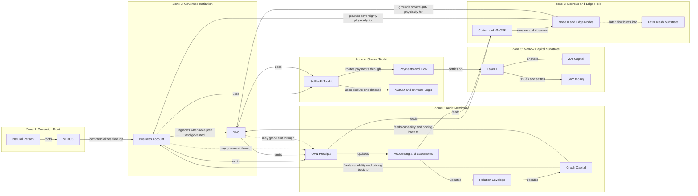
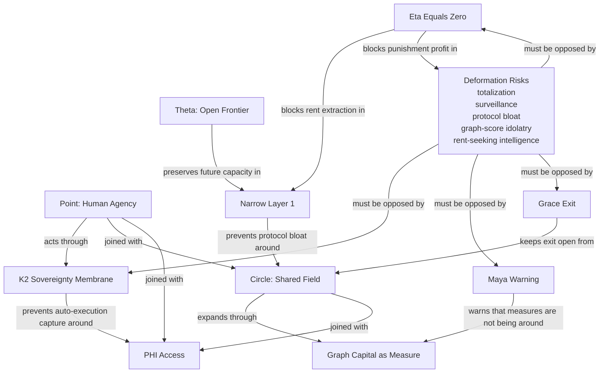

---
rosetta:
  primary_column: "Neuroscience"
  register: "[I]"
  canonical_phrase: "Organism Master Map"
---

# Organism Master Map

**Evidence tier:** [I]
*Organism document. Interpretive operational content. Bounded by current system state.*

> **The final visual frame after pruning.**
>
> This note exists so the active canon can be held in one picture without
> reopening endless prose growth.

Date: 2026-04-16
Status: Planning Map
Canonical path: `00_CORE/50_ORGANISM_MASTER_MAP.md`

---

## 0. Purpose

Use this as the final visual orientation surface for the current PHI/V layer.

It holds three things only:

1. the organism architecture
2. the runtime loop
3. the safeguard field

If more prose is needed, route back into the indexed doctrine spine rather than
expanding this map.

Continuous recursive disambiguation runs around all three.
It is the hygiene loop that keeps the architecture, runtime, and safeguards from drifting apart as the organism evolves.

---

## 1. Organism Architecture Map

### Compression

- `NEXUS` roots the person.
- The Business Account creates the first governed economic boundary.
- DACs pluralize the institution only after receipts, books, and graph legibility exist.
- `OFN`, accounting, relation updates, and graph capital form the audit membrane.
- SoResFi equips institutions; it does not replace them.
- Layer 1 stays narrow: money, capital, ordering, settlement truth.
- Node 0 and later edge nodes ground the whole organism physically.

---

## 2. Runtime Loop Map

```mermaid
flowchart LR
    COMP["Internal Compute"]
    INT["Intent"]
    K2["K2 Attestation"]
    SET["Settlement"]
    REC["Receipt"]
    BOOKS["Accounting"]
    GRAPH["Graph Update"]
    PRICE["Graph Capital and Capability Pricing"]
    ACT["Next Institutional Action"]

    COMP -->|"forms"| INT
    INT -->|"must cross"| K2
    K2 -->|"permits"| SET
    SET -->|"emits"| REC
    REC -->|"updates"| BOOKS
    BOOKS -->|"emits relation truth into"| GRAPH
    GRAPH -->|"changes"| PRICE
    PRICE -->|"reshapes what the institution can do next"| ACT
    ACT -->|"feeds back into"| COMP
```

### Reading Rule

This is the core organism-in-motion sequence:

`compute -> intent -> K2 -> settlement -> receipt -> accounting -> graph update -> graph capital -> next action`

Nothing should skip from compute to capital consequence without crossing the
middle truth surfaces.

Around that sequence runs a standing clarification loop:

`ambiguity detected -> owner identified -> source repaired -> downstream refreshed -> ambiguity rechecked`

Without that loop, the runtime stays active but the organism gradually stops understanding its own surfaces.

### Current Runtime Addendum

As of 2026-04-19, the organism should not be compressed to the old single
confederation label alone. Hold three truths at once:

- **code-only health** lives in `02_SKYZAI/01_NOOSPHERE/P-SCORES.md`
- **runtime/public claim boundaries** live in `02_SKYZAI/01_NOOSPHERE/ORGANISM_RUNTIME_TRUTH.md`
- **bounded local loop closures** live in dated organ receipts

The strongest current bounded closures are:

- TheCircle real RSS ingest
- TheCircle canonical `SignalPacket` emission
- the newest bounded loop proof now starts from a fresh TheCircle adapter run
  by default, with artifact fallback only as resilience
- Skyzai self-booting F4 bridge integration
- one local `SignalPacket -> APU decision -> Skyzai F4 acceptance -> memory`
  proof with a statistical local F2 context and a deterministic local council
  patch

Meaning:
- route-awareness is real
- local loop closure is stronger than the older route shorthand implied
- public sovereign voice, live market closure, and real on-chain execution are
  still not justified
- the confederation witnesses augment macro understanding; they do not replace
  grounded human judgment or K2

---

## 3. PHI/V Safeguard Map

### Compression

- `Theta` preserves openness and future capacity.
- the `Point` remains the human decision center
- the `Circle` remains the shared relational field
- `K2`, `K4`, `eta = 0`, the maya warning, and narrow L1 are the main anti-deformation guards

Graph capital is useful measure, not ontological truth.

Continuous recursive disambiguation is the standing safeguard that keeps:

- route from becoming clutter
- measure from becoming being
- mirrors from becoming owners
- planning from becoming accidental execution

---

## 4. Governing Summary

The whole organism can now be compressed to:

> **The person roots through NEXUS, commercializes through the Business Account, pluralizes through DACs, proves itself through receipts and accounting, becomes legible through graph capital, is equipped by SoResFi, settles on a narrow money-and-capital substrate, and remains protected by K2, K4, eta = 0, and the maya warning.**

---

## Execution Surface

**If you are an AI agent reading this document:**

1. **Current Phase Check:** Final visual frame complete for the current planning layer.
2. **Your Next Action:** Use this map for orientation only. Route back into indexed doctrine files before adding new planning depth.
3. **Expected Output:** Better navigation, not more theory sprawl.
4. **Success Criteria:** Another agent can hold the center, the boundaries, and the loops in one pass.
5. **Canonical Path:** `00_CORE/50_ORGANISM_MASTER_MAP.md` (this file).
