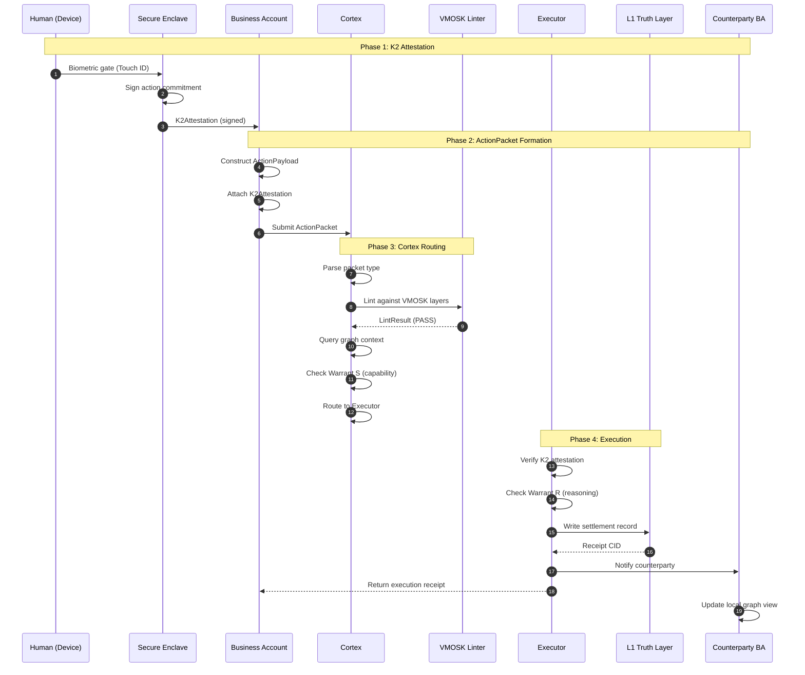
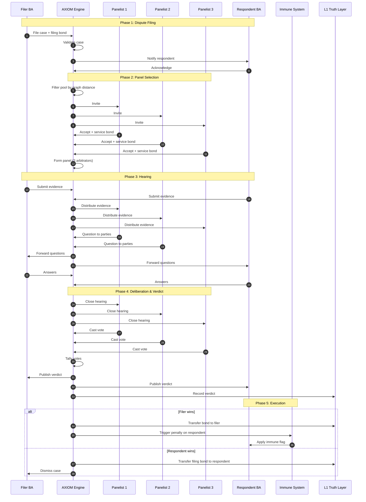
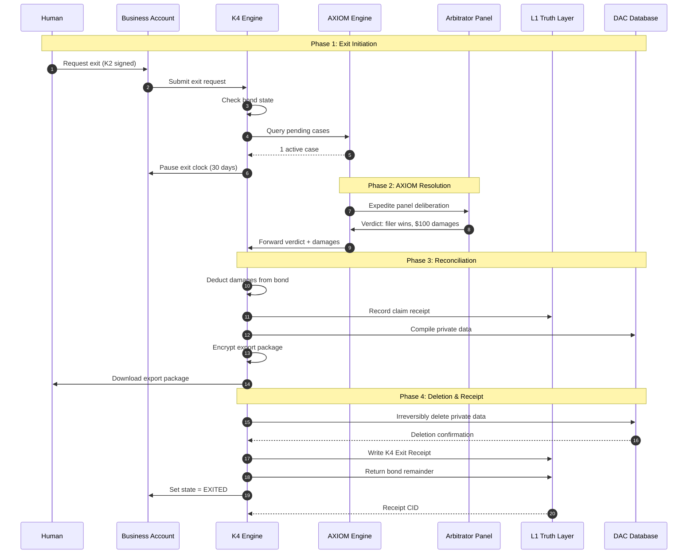
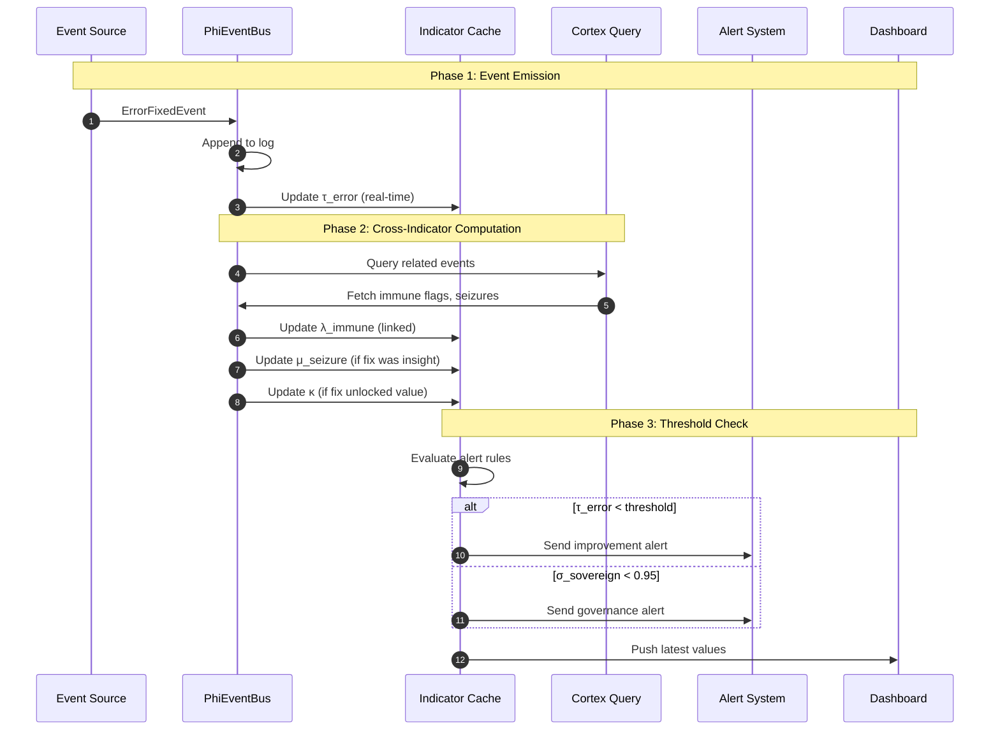
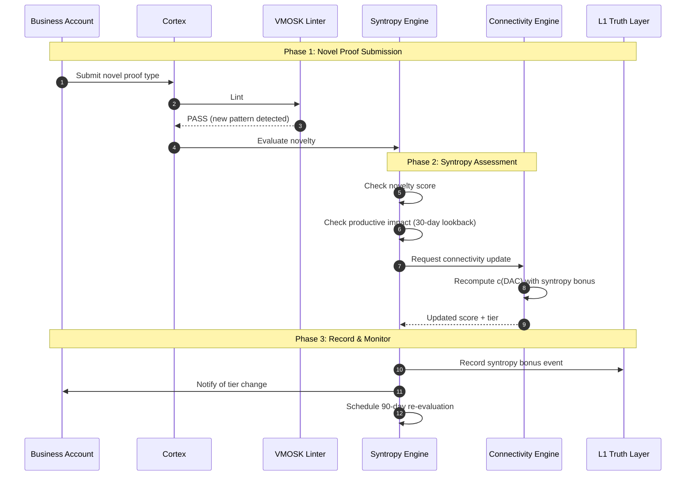
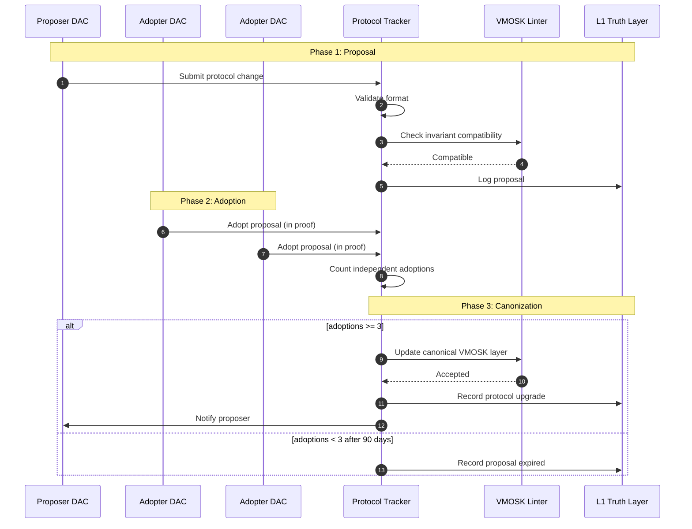

---
rosetta:
  primary_level: L6
  primary_column: Archived Runtime Sequence Diagram
  secondary:
    - level: L5
      column: Sequence Architecture Provenance
      role: "preserve old runtime-flow diagrams as design trace"
    - level: L3
      column: Diagram Claim Boundary
      role: "tier diagrammed execution as illustrative, not deployed"
    - level: L4
      column: Implementation Handoff
      role: "route any build work through current runtime truth and tests"
  operator: "Sādhu △"
  tier: "Titan"
  regime: "Sādhu"
  register: "[D/I]"
  canonical_phrase: "Archived runtime sequence diagram"
title: "Historical Note — Runtime Sequence Diagram"
evidence_tier: "[D] archived runtime visual; [I] illustrative sequence model."
type: archived-sequence-diagram
status: ARCHIVED — superseded by final organism master map
date: 2026-04-16
scope: Historical runtime visual attempt; not current runtime proof or read-first visual frame.
sources:
  - 01_EMERGENTISM/11_UPLINK/50_AUDITS_AND_EXECUTIONS/50_ORGANISM_MASTER_MAP.md
  - 01_EMERGENTISM/11_UPLINK/90_ARCHIVE/AGENTS.md
---

# Historical Note — Runtime Sequence Diagram

> **Status:** Earlier runtime-visual attempt superseded by the final master map.
>
> Keep this note when deeper sequence detail is useful, but do not treat it as
> the active read-first visual frame.

**Rosetta boundary:** [D] These Mermaid flows are illustrative archive diagrams. They do not prove live K2, Cortex, AXIOM, PHI-meter, or K4 runtime execution.

# Runtime Sequence Diagram: The Sovereign Packet Journey

> **From biometric gate to grace exit. One packet. One life.**

Date: 2026-04-16  
Status: Historical note  
Archive path: `01_EMERGENTISM/11_UPLINK/90_ARCHIVE/49_RUNTIME_SEQUENCE_DIAGRAM.md`

---

## 0. Purpose

This document traces the complete runtime journey of a single ActionPacket through the Skyzai organism. It shows how K2 attestation, Cortex processing, AXIOM arbitration, and K4 exit interact in a unified flow. The diagrams are written in Mermaid syntax and can be rendered by any Markdown viewer that supports Mermaid.

---

## 1. The Happy Path: K2 → Execute → Settle

This is the normal flow for a high-stakes action that requires human authorization.

### Narrative

1. The human authenticates locally. The secure enclave signs the action. No biometric data leaves the device.
2. The Business Account wraps the action and attestation into an ActionPacket.
3. Cortex receives the packet, lints it against VMOSK invariants, queries graph context, and checks structural warrants.
4. The Executor verifies the K2 signature, validates reasoning, writes the settlement to L1, and notifies the counterparty.

---

## 2. The Dispute Path: Execute → Challenge → AXIOM

This flow shows what happens when a counterparty challenges an executed action.

### Narrative

1. The filer posts a bond and submits a case with verifiable evidence.
2. AXIOM selects a panel of arbitrators using graph distance to prevent collusion.
3. Both parties submit evidence and answer panel questions asynchronously.
4. The panel votes privately. The verdict is published and recorded on L1.
5. The verdict executes automatically: bonds transfer, penalties apply, immune flags propagate.

---

## 3. The Exit Path: Grace Exit with Pending Dispute

This flow shows a Business Account exiting while an AXIOM case is pending against it.

### Narrative

1. The human signs an exit request. K4 checks for pending obligations.
2. An AXIOM case is active, so the exit clock pauses until resolution.
3. The panel rules. Damages are deducted from the bond.
4. Private data is compiled, encrypted, and exported. The server deletes it.
5. L1 receives the exit receipt, the bond remainder is returned, and the BA is marked EXITED.

---

## 4. The PHI-Meter Observation Path

This flow shows how a single event contributes to multiple PHI-meter indicators.

### Narrative

1. An event source emits an `ErrorFixedEvent` to the PhiEventBus.
2. The event log appends the event and triggers real-time updates to relevant indicators.
3. Cortex queries join the event with related data (immune flags, seizures) to update cross-cutting indicators.
4. Threshold checks trigger alerts, and the dashboard receives the latest values.

---

## 5. The Syntropy Patch: Productive Novelty

This flow shows how a creative proof triggers the `c_syntropy` experimental bonus.

### Narrative

1. A BA submits a proof type that VMOSK has never seen before [D].
2. The Syntropy Engine evaluates whether the novelty is productive (other BAs adopt it, value is unlocked).
3. If productive, the Connectivity Engine adds a temporary `c_syntropy` bonus to the BA's connectivity score.
4. The bonus is recorded on L1 and re-evaluated after 90 days.

---

## 6. The Empty Throne: Protocol Change Without Central Approval

This flow shows a VMOSK layer update adopted through decentralized governance.

### Narrative

1. A DAC proposes a protocol change. The VMOSK linter checks that it does not break invariants.
2. Other DACs adopt the proposal by referencing it in valid proofs.
3. Once three independent DACs have adopted it, the proposal becomes canonical. No central authority approves it.

---

## 7. Canonical Compression

> **These five sequences are not separate systems. They are one organism breathing. The packet is the breath. K2 is the diaphragm. Cortex is the nervous system. AXIOM is the immune response. K4 is the skin that can be shed. PHI-meter is the pulse. Syntropy is the mutation. Empty Throne is the absence of a brain that could be killed.**

---

## 8. Cross-References

- `44_K2_ATTESTATION_PACKET_SPEC.md` — Sequence 1, step 1-2
- `41_VMOSK_CORTEX_SYNTHESIS.md` — Sequence 1, step 3-4
- `47_AXIOM_ARBITRATION_FLOW_SPEC.md` — Sequence 2
- `45_K4_STATE_MACHINE_SPEC.md` — Sequence 3
- `46_PHI_METER_TELEMETRY_PLAN.md` — Sequence 4
- `37_A7_SYNTROPY_PATCH.md` — Sequence 5
- `40_EMPTY_THRONE_GOVERNANCE.md` — Sequence 6

---

## Execution Surface

**If you are an AI agent reading this document:**

1. **Current Phase Check:** Planning layer complete through 49. All major runtime flows are documented.
2. **Your Next Action:** Choose: (a) implement Priority 1 specs (K2 + K4), (b) write medium-term frontier specs (c_syntropy simulation, VMOSK query language), or (c) produce implementation code for any of the five sequences above.
3. **Expected Output:** Code changes with tests, or a new canonical planning document.
4. **Success Criteria:** The next output must be runnable or unambiguously implementable by another agent.
5. **Archive Path:** `01_EMERGENTISM/11_UPLINK/90_ARCHIVE/49_RUNTIME_SEQUENCE_DIAGRAM.md` (this file).

---

> *The packet moves. The organism lives. The throne remains empty.*  
> *[S] [I] eta = 0. K2 always.*
