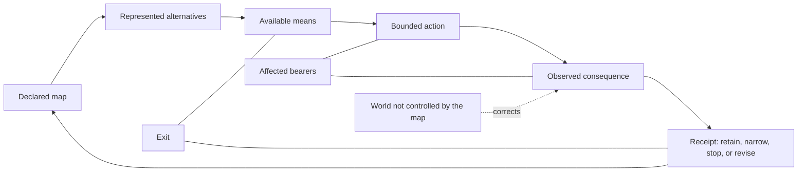

# The Emergentist Manifesto

## A worldview for finite beings

<!-- FULLBOOK-P: book_private_scope -->
This is a staged private full-reader manuscript. It is a projection of reviewed source cards and preserves their evidence tiers and lifecycle boundaries. It is not a completed ontology, a public release, a membership test, a political programme, or proof of its own truth. A reader may use a part, test it, criticize it, fork it, or put it down.

Source cards: OS01-13, OS01-25, OS01-26.

<!-- FULLBOOK-P: book_layer_scope -->
The book separates four layers: current-body prose grounded only in `bounded_current` cards; research records that retain their rivals and kill routes; critical genealogy that does not revive legacy authority; and frozen custody that does not regenerate claims. Its claim atlas is part of the reader: an argument is not made stronger by being hidden from its rival or its failure condition.

Source cards: OS01-13, OS01-26.

---

## Preamble and Quickstart

<!-- FULLBOOK-P: preamble_scope -->
This is the Preamble and Quickstart of a staged full reader, not a new source
of doctrine. It borrows a reader-compression pattern—one sentence, one image,
one short argument, one essay, then a visible record—from *The Network State*.
It does **not** borrow
its state-building, sovereignty, founder, alignment, territorial, census, or
growth logic. This draft proposes no political project; the exclusions are part
of its editorial scope, recorded in the source contract.
Source cards: none — editorial control.
<!-- FULLBOOK-P: preamble_scope_source_map -->
The source map is [`manifesto-contract.json`](manifesto-contract.json); the
full-book chapter contract is
[`FULL_BOOK_1_CONTRACT.json`](FULL_BOOK_1_CONTRACT.json). The books remain
distinct evidence-bearing modules; this manuscript gives them one argument and
one honest reader route.
Source cards: none — editorial control.
### How to read the marks

<!-- FULLBOOK-P: preamble_tier_legend -->
Each source card carries its own warrant: `[A]` analytic or machine-checked
inside stated definitions; `[B]` observed, sourced, or receipted contact;
`[S]` structural consequence inside a declared framework; `[I]` interpretation
or synthesis; `[C]` a conjecture able to lose; and `[D]` deliberately unresolved
or awaiting a defined test. This draft is an editorial `[D]` projection. It
does not upgrade any card it names.
Source cards: none — editorial control.
## In one sentence

<!-- FULLBOOK-P: preamble_one_sentence -->
> **Emergentism is a fallibilist worldview and practice for finite beings:
> distinguish the map from the world, possibility from actual record, act under
> visible constraints, then correct—or leave.**

Source cards: `OS01-13`, `OS01-20`, `OS01-25`, `OS01-26`.

## In one image

<!-- FULLBOOK-P: preamble_one_image_diagram -->

Source cards: OS01-08, OS01-09, OS01-13, OS01-26, FIN01-01.
<!-- FULLBOOK-P: preamble_one_image_caption -->
The image is a reader aid, not a causal theory, an ontology, or an optimization
formula. It keeps five things visibly different: a map, alternatives it
represents, available means, an actual attempt, an observed consequence, and a
correction or exit.

Source cards: `OS01-08`, `OS01-09`, `OS01-13`, `OS01-26`, `FIN01-01`.

## The short argument

<!-- FULLBOOK-P: preamble_short_argument_condition -->
We are finite beings. We do not begin with a completed view of the world, yet
we still have to choose, act, cooperate, refuse, and live with consequences. In
this reader, a culture, scientific model, institutional rule, or personal plan
is treated as a map made by finite bearers under conditions that can correct it.
Emergentism begins there—not with a revelation, a completed ontology, or a
demand for belief.
Source cards: OS01-13, OS01-20, OS01-26.
<!-- FULLBOOK-P: preamble_short_argument_distinction -->
Its first discipline is distinction. A symbol is not the thing symbolized. A
model is not its territory. A theorem can establish a result inside stated
definitions; it does not thereby establish what reality ultimately is. An
elegant pattern may be useful, but it does not cause events merely because it is
beautiful. Some apparent contradictions are exposed by making a domain or type
explicit. Where no mismatch is identified, the problem remains open. Ordinary
mathematics retains its ordinary meanings.
Source cards: OS01-01, OS01-03, OS01-04, OS01-26.
<!-- FULLBOOK-P: preamble_short_argument_receipt -->
The same discipline matters when we act. A plan, a commitment, an attempted
act, and an observed consequence are different facts. We should say which one
we mean and keep a record that can be challenged. The world is allowed to
disagree with the map. That disagreement is not a defect in the process; it is
the process becoming honest.
Source cards: OS01-08, OS01-13.
<!-- FULLBOOK-P: preamble_short_argument_finity -->
Finity is the smallest practice offered here. It is a selected set of questions
for framing one decision: clarify the map, distinguish what is possible from
what is currently available, name authority and bearers, choose a bounded
action, predeclare review, and record the outcome. It is not an authorization,
a spiritual rank, or a demonstrated improvement over ordinary decision tools.
No improvement over ordinary decision tools is claimed.
Source cards: FIN01-01, OS01-13, OS01-26.
<!-- FULLBOOK-P: preamble_short_argument_justice -->
Emergentism also makes a constitutional choice. Justice is not derived from
geometry, arithmetic, beauty, or the number of people who agree. It is a
declared constitutional premise: no equation alone produces an ought. In this
reader, roles are voluntary functions of equal worth, never identities or ranks
of human worth. A holder may contest the frame or put it down.
Source cards: OS01-19, OS01-22, OS01-26.
<!-- FULLBOOK-P: preamble_short_argument_collective -->
At collective scale, the same restraint applies. A collective description is a
bounded trace hypothesis, not a collective person or intention. Shared meanings
may coordinate coalitions; conflict remains causally plural. Several axes may
correspond without becoming a hierarchy of human worth.
Source cards: OS01-14, OS01-17, OS01-18, OS01-19.
<!-- FULLBOOK-P: preamble_short_argument_corpus_boundary -->
The corpus also contains formal research and historical critical editions. They
are not credentials for this reader and do not enter its current claim body.
Their presence is a reason to keep correction and exit visible, not a reason to
announce the manifesto correct.
Source cards: OS01-13, OS01-26.
<!-- FULLBOOK-P: preamble_short_argument_invitation -->
So this manifesto offers no conversion. It offers a way to proceed: use a
bounded practice, attack a claim, or leave. Keep correction possible, preserve
the record, and do not let a beautiful system take from a holder the right to
put it down.
Source cards: FIN01-01, OS01-13, OS01-26.
<!-- FULLBOOK-P: preamble_body_card_index -->
Current-body source cards: `OS01-01`, `OS01-03`, `OS01-04`, `OS01-06`,
`OS01-08`, `OS01-09`, `OS01-13`, `OS01-14`, `OS01-17`–`OS01-22`, `OS01-25`,
`OS01-26`, and `FIN01-01`. Research and historical material named above remains
separately typed in the book map below; it has not been promoted by appearing
in this draft.
Source cards: OS01-01, OS01-03, OS01-04, OS01-06, OS01-08, OS01-09, OS01-13, OS01-14, OS01-17, OS01-18, OS01-19, OS01-20, OS01-21, OS01-22, OS01-25, OS01-26, FIN01-01.
## The reader argument

### 1. A map that can lose

<!-- FULLBOOK-P: preamble_article_map -->
We choose no map that cannot be corrected by the world, by another bearer, or
by a result it did not predict. We treat finite, embodied agency as answerable
to consequence. We leave phenomenal consciousness, death, and metaphysical
remainder open rather than filling them with an answer because an answer feels
complete.

Source cards: `OS01-13`, `OS01-20`, `OS01-21`, `OS01-26`.

### 2. Frames are not things

<!-- FULLBOOK-P: preamble_article_frames -->
We can select a vocabulary without turning it into furniture of the universe.
Titan labels are frames, not beings, operands, or causal agents. Ordinary
mathematics remains ordinary mathematics. Type discipline may diagnose a local
mistake; it does not grant a universal solution to every difficult question.

Source cards: `OS01-01`, `OS01-03`, `OS01-04`.

### 3. Records, means, and receipts

<!-- FULLBOOK-P: preamble_article_receipts -->
A state description, a commitment, an attempted act, and an observed record
must remain separately legible. Available means are not a completed outcome.
Consequence belongs in a receipt that another person can inspect, challenge,
and use to revise the map.

Source cards: `OS01-06`, `OS01-08`, `OS01-09`, `OS01-13`.

### 4. Finity: a bounded first practice

<!-- FULLBOOK-P: preamble_article_finity -->
Finity is an optional seven-prompt compression for one live decision. It asks
for a declared map, possibilities, actual means, authority, bearers, a bounded
act, and a review point. It neither authorizes action nor proves itself better
than a simpler worksheet. A reader can use it privately, test it, alter it, or
set it aside.

Source cards: `FIN01-01`, `OS01-13`, `OS01-26`.

### 5. Justice, roles, and exit

<!-- FULLBOOK-P: preamble_article_justice -->
Justice is our declared constitutional premise, not the output of a calculation
or a cosmology. No equation alone produces an ought. Roles are voluntary
functions, never ranks of human worth. Any holder may contest the frame or put
it down.

Source cards: `OS01-19`, `OS01-20`, `OS01-22`, `OS01-26`.

### 6. Collective descriptions without collective persons

<!-- FULLBOOK-P: preamble_article_collective -->
Where collective description is needed, the source map treats it as a
five-marker trace hypothesis, not collective personhood. Shared meanings may
coordinate coalitions; conflict remains causally plural. Several axes may
correspond without becoming a hierarchy of human worth.

Source cards: `OS01-14`, `OS01-17`, `OS01-18`, `OS01-19`.

## The close: exit, criticism, and the open invitation

<!-- FULLBOOK-P: preamble_close -->
Read one sentence, follow one source card, try one bounded practice, attack one
claim, or leave. None is a membership test. No agreement, popularity,
publication, or AI endorsement upgrades a proposition. If the map no longer
serves, any holder may put it down.

Source cards: `OS01-13`, `OS01-25`, `OS01-26`, `FIN01-01`.

## What this manifesto refuses

<!-- FULLBOOK-P: preamble_refusals -->
1. A theorem is not an ontology.
2. A model is not the territory.
3. A symbol is not a causal agent.
4. Justice is not derived merely because a geometry is elegant.
5. A worldview is not validated by adherents, popularity, publication, or AI agreement.
6. Any holder may put it down.
Source cards: OS01-22, OS01-26.
## From draft to public reader

<!-- FULLBOOK-P: preamble_release_gates -->
This document is intentionally private and staged. Before it can become a
public front door, every substantive paragraph needs source-card and revision
coverage; fresh readers must be able to distinguish proof, interpretation,
conjecture, and open question; hostile review must catch barred claims; and the
public projection must pass its parity, deterministic build, predeploy, and
immutable-artifact gates. Until then, the live public site remains the released
reader projection and this remains a staged manuscript.
Source cards: none — editorial control.

---

# Part I — The Finite Condition

<!-- FULLBOOK-P: p1-001 -->
**Source boundary.** This is a private, staged reader draft, not a new source
of doctrine. It uses only the twelve bounded-current One-Sitting cards named in
its source boundary. It does not import a candidate proof, source-only practice,
historical manuscript, frozen material, or an uncarded conclusion. Its task is
narrower than a completed worldview: to make a finite-agent interpretation
readable while preserving the distinctions through which it could be corrected,
narrowed, or put down. A later public edition would need its own source and
public gates; this manuscript does not claim to have passed them.

Source cards: OS01-13, OS01-20, OS01-25, OS01-26.

## 1. The Finite Predicament

<!-- FULLBOOK-P: p1-002 -->
Every person acts from somewhere. A body has a location, a history, a limited
span of attention, a changing store of energy, and access to some tools rather
than others. A person also encounters other people, records, environments, and
consequences that do not wait for a theory to become complete. Calling this the
finite predicament is not a biological, metaphysical, or psychological theory
of the human being. It is an interpretive starting point: our agency is
embodied, situated, and answerable to consequence, rather than an act of total
self-authorship outside the conditions in which it occurs.

Source cards: OS01-20, OS01-26.

<!-- FULLBOOK-P: p1-003 -->
The word finite does not mean small in spirit, passive in practice, or incapable
of imagination. It means that a person does not hold every relevant fact at
once, cannot pursue every available path at once, and cannot make an outcome
true merely by wanting it. A plan may be excellent and still meet a closed
door, a changed market, a faulty instrument, another person's refusal, or a
fact previously unseen. The limitation is not an insult to agency. It is the
reason an account of agency needs a place for preparation, contact, revision,
and departure rather than a promise that a sufficiently sincere map controls
what it maps.

Source cards: OS01-13, OS01-20, OS01-26.

<!-- FULLBOOK-P: p1-004 -->
This reader starts from the practical fact that a finite being must often move
before certainty is available. Someone arranging a journey may have a weather
forecast, a timetable, a budget, and several routes, yet still has to choose a
departure time. None of those representations is the journey itself. The
traveller's map can improve the choice without becoming a guarantee that the
train runs, that the road remains open, or that the experience will unfold as
imagined. The same distinction holds in more serious or more ordinary cases:
an account can guide action while remaining distinct from the consequence it
hopes to meet.

Source cards: OS01-09, OS01-13, OS01-20.

<!-- FULLBOOK-P: p1-005 -->
The finite predicament is therefore not an invitation to sceptical paralysis.
It gives a different question. Instead of asking how to become certain before
acting, ask what must remain visible while an imperfectly informed action is
taken. At minimum, the reader needs to distinguish the map now held, the
possibilities represented by it, the means actually available, the commitment
made, what subsequently occurs, and the way that comparison can be reviewed.
These are not six names for one event. Collapsing them makes a hoped-for outcome
look like an achieved outcome and a private confidence look like a public
record.

Source cards: OS01-08, OS01-09, OS01-13.

<!-- FULLBOOK-P: p1-006 -->
This distinction also makes room for a simple but important refusal: a person
does not become the sum of an available-means profile, a forecast, a successful
action, or a failed one. The framework may describe a situated agent facing
constraints and consequences, but it does not turn a description of situation
into a verdict of worth. The profile of what a person can presently reach is
changeable; the record of what happened is contestable; the map can be revised.
None of those facts supplies a license to reduce a person to a score or to treat
limited means as a permanent human identity.

Source cards: OS01-09, OS01-20, OS01-26.

<!-- FULLBOOK-P: p1-007 -->
An ordinary notebook illustrates the same point. It can contain goals,
appointments, sketches, worries, numbers, and promises. Its usefulness comes
from keeping items available to attention, not from becoming the life it
records. If the notebook says a meeting happened, that entry may be a useful
claim about the meeting; it is not automatically a verified account of what
was decided, who was present, or what followed. The difference is not pedantic.
It tells the reader where a correction belongs: in the note, in the recollection,
in the plan, in the report, or in the claimed consequence.

Source cards: OS01-08, OS01-13, OS01-20.

<!-- FULLBOOK-P: p1-008 -->
The finite condition is also an antidote to a familiar form of grandeur. A
worldview can promise that it sees through every local uncertainty because it
has found the final scale on which all uncertainty is placed. This book makes
no such promise. It does not settle the ultimate status of consciousness,
personal death, or metaphysical remainder by fitting them into a polished
diagram. These questions remain open here. Openness is not a coded answer, a
spiritual accomplishment, or a convenient way to avoid argument; it names the
boundary of what this reader currently warrants.

Source cards: OS01-20, OS01-21, OS01-25.

<!-- FULLBOOK-P: p1-009 -->
Leaving a question open is harder than leaving it vague. A vague phrase lets a
writer imply that an answer exists without saying what would distinguish it from
a rival. An open question instead tells the reader not to treat absence of an
answer as evidence for a preferred answer. If a future account offers a better
explanation or relevant evidence, the item should be updated under its native
burden. Nothing in this framework earns the right to protect a mystery merely
because mystery gives the framework atmosphere. The survivor is revision, not
a sacred remainder immune from contact.

Source cards: OS01-21, OS01-26.

<!-- FULLBOOK-P: p1-010 -->
The reader should notice the difference between a boundary and a denial. To
leave phenomenal consciousness open is not to deny lived experience. To leave
death open is not to deny mortality, grief, or the significance of a life. To
leave metaphysical remainder open is not to affirm a hidden world behind the
visible one. It is a refusal to insert conclusions that the stated framework has
not earned. Such restraint can feel unsatisfying when one wants a definitive
answer. It is nevertheless clearer than claiming a resolution whose support is
only the desire that unresolved questions should have been resolved.

Source cards: OS01-20, OS01-21, OS01-26.

<!-- FULLBOOK-P: p1-011 -->
Several serious rivals begin from the same human pressure without using this
reader's language. A naturalist might offer a different account of embodied
agency; a compatibilist might frame freedom through reasons and constraints; an
existential or phenomenological account might begin from lived choice and
experience. This book does not defeat those accounts by naming them rivals. Its
finite-agent interpretation earns only a practical comparison: does it clarify
what a person can distinguish, what a consequence can correct, and how a claim
can remain revisable without pretending to be a completed science of persons?

Source cards: OS01-13, OS01-20, OS01-21.

<!-- FULLBOOK-P: p1-012 -->
The comparison cannot be settled by declaring that every rival secretly means
the same thing. Differences in explanation, vocabulary, and practical
consequence matter. A rival may explain the relevant situation more clearly,
with fewer assumptions, or with better contact to a domain. Where that happens,
the responsible response is narrowing or replacing the local interpretation,
not recoding the rival as a hidden victory for the framework. A finite map has
no privilege to absorb every other map; its strength, if any, lies in making
the point of comparison visible.

Source cards: OS01-13, OS01-20, OS01-26.

<!-- FULLBOOK-P: p1-013 -->
Finitude includes dependence. A person acts through language learned from
others, bodies maintained through material conditions, instruments made by
other hands, and records that can outlast the moment in which they were made.
The framework does not draw from this observation a total theory of society or
an account of what anyone owes anyone else. It draws a narrower operational
lesson: an action and an outcome may involve more bearers and more conditions
than the actor's own story acknowledges. That is why a record needs a contest
path rather than merely a place for the actor to declare success.

Source cards: OS01-08, OS01-13, OS01-20.

<!-- FULLBOOK-P: p1-014 -->
Finitude also includes temporal asymmetry at the level of practical life. A
person can remember an earlier decision, make a representation of a later
possibility, and act now with whatever body, tools, access, and time are
actually present. The represented future may be vivid, frightening, or
attractive, but it is not a completed outcome. The present action is the point
at which a claim about the future encounters actual means and later receives a
record. Keeping this sequence visible keeps anticipation from quietly becoming
a receipt for an event that has not occurred.

Source cards: OS01-08, OS01-09, OS01-13, OS01-20.

<!-- FULLBOOK-P: p1-015 -->
No private feeling of humility guarantees this discipline. A person can say
that they are open to correction while arranging their terms so that no possible
observation counts against the story they prefer. A worldview can recite its
own limits while treating every objection as evidence that critics have not yet
understood it. The refusal in this book is practical: self-description does not
award a result, and self-audit does not prove safety. The relevant question is
whether the map, move, outcome, correction, and exit are actually kept distinct
where they matter.

Source cards: OS01-08, OS01-13, OS01-26.

<!-- FULLBOOK-P: p1-016 -->
One modest test follows. When someone says, “This worked,” ask what exactly the
word “this” names. Does it name an idea, an intention, a written plan, a
performed action, an observed effect, or a later interpretation of an effect?
Does “worked” name a hoped-for effect, a measured result, a temporary response,
or a conclusion from insufficient observation? The question does not presume
failure. It creates a surface on which success and failure can be meaningfully
discussed. Without the distinctions, the sentence may remain rhetorically
strong while carrying too little information to learn from.

Source cards: OS01-08, OS01-13, OS01-26.

<!-- FULLBOOK-P: p1-017 -->
The alternative to a guaranteed worldview is not a worldview with no shape. It
is a framework that states its shape as a framework. It can say: here is a
selected interpretation of finite agency; here is what it leaves open; here is
what would count as a failure of a local use; here is how a reader may retain,
narrow, revise, or leave. This does not make the framework true. It makes its
ambition inspectable. The reader need not grant it any more authority than the
sources, distinctions, and consequences made visible in its own record.

Source cards: OS01-13, OS01-20, OS01-21, OS01-26.

<!-- FULLBOOK-P: p1-018 -->
The book's exit rule begins here rather than at the final page. If the vocabulary
does not make a situation clearer, if it repeatedly creates unhelpful status
effects, if it conceals a needed rival, or if it blocks correction, a reader may
put it down. Departure is not evidence that the reader failed a test of loyalty.
It is an ordinary possibility within a voluntary framework. A map that requires
compulsory holding has made its own continuation more important than the
question it was meant to help investigate.

Source cards: OS01-13, OS01-25, OS01-26.

<!-- FULLBOOK-P: p1-019 -->
The selected D6 label is one way this book remembers nonclosure and exit. It is
not a discovery about an afterlife, a hidden object, a human attainment, or a
sixth kind of freedom. It is a boundary marker: a reminder that the work of
articulation can stop without forcing the remainder to become another entity.
If the label does not improve this discipline—if it becomes a badge, an
identity, or a covert ontology—it should be retired. Plain language about
nonclosure and leaving remains available.

Source cards: OS01-25, OS01-26.

<!-- FULLBOOK-P: p1-020 -->
The finite predicament therefore begins with a discipline of proportion. The
map may be useful without becoming the world. The agent may be capable without
being unlimited. A possibility may be meaningful without being an achievement.
A result may be promising without being final. A mystery may matter without
being possessed. These distinctions do not solve the trouble of living with
partial knowledge. They make it harder to conceal that trouble behind a word
such as destiny, system, or certainty. That is their first practical value.

Source cards: OS01-09, OS01-13, OS01-20, OS01-21, OS01-26.

<!-- FULLBOOK-P: p1-021 -->
The chapter has not established an ontology. It has offered an interpretation
with explicit boundaries: finite, embodied, situated agents act amid conditions
and consequences they do not wholly author; central mysteries remain open; and
the account is removable. Its failure condition is equally explicit. If this
interpretation becomes less clear or less useful than a fair rival, or if it is
used to smuggle in a hidden conclusion about persons, consciousness, death, or
authority, it should be narrowed or discarded in that use. The reader retains
the right to prefer a more adequate map.

Source cards: OS01-20, OS01-21, OS01-25, OS01-26.

<!-- FULLBOOK-P: p1-022 -->
The next question is what sort of language can serve a finite reader without
being mistaken for furniture in the world. A symbol, a model, and a formal
operation may each be useful. Their usefulness depends in part on keeping their
types clear. The task is not to ban framing language. It is to prevent frames
from acquiring bodies, causes, proofs, or commands simply because they are
vividly named. That is the beginning of type discipline.

Source cards: OS01-01, OS01-03, OS01-04, OS01-26.

## 2. Frames Are Not Furniture

<!-- FULLBOOK-P: p1-023 -->
Before using an important word, ask what sort of thing the word is doing. It
may be a formal term, a physical description, a relation, a model component, a
record, a metaphor, a procedure, or an unanswered question. These kinds can
interact, but they are not interchangeable. Trouble begins when a label that
organizes attention is treated as an object inside the world, when a diagram is
treated as a mechanism, or when a formal result is treated as an inventory of
everything that exists. The question of type is therefore not a decorative
technicality; it is a way to locate the exact step at which a claim changes
what kind of thing it purports to be.

Source cards: OS01-01, OS01-03, OS01-04, OS01-26.

<!-- FULLBOOK-P: p1-024 -->
The Titan labels make the point deliberately visible. They are selected
metaframes, used here to orient attention to boundary conditions such as origin
or absence, finite presence, and a horizon that exceeds a finite inventory. The
labels are not three entities, particles, gods, arithmetic operands, causal
agents, or a census of reality. Their visual compactness can make them memorable;
that is a reason to state the boundary more carefully, not a reason to assign
them extra power. A reader can reject the imagery and keep the survivor: a
boundary frame is not one more object located within the frame.

Source cards: OS01-01, OS01-26.

<!-- FULLBOOK-P: p1-025 -->
Consider a map legend. A blue line may mark a river, a road, or a border,
depending on the legend. The line does not become wet, paved, or politically
binding because it is drawn. Its relation to what it depicts is supplied by a
convention, a scale, a date, and a use. A reader who forgets that relation may
mistake a schematic simplification for a physical fact. The Titan labels work
at an even more restrained level: they are not representations whose reference
has been independently established; they are selected framing language, useful
only if it helps readers preserve rather than blur the frame/object distinction.

Source cards: OS01-01, OS01-13, OS01-26.

<!-- FULLBOOK-P: p1-026 -->
The phrase “not furniture” names this restraint. Furniture occupies a room; it
can be counted, moved, bumped into, or measured. A frame is what lets a reader
state a room, an object, a relation, or a limit in the first place. A frame may
be explicit and revisable, but it does not automatically join the list of things
it helps describe. The point is not that every distinction between frame and
object is easy. It is that a writer who crosses it owes an account of the
crossing instead of treating a grammatical convenience as evidence of a new
thing in the world.

Source cards: OS01-01, OS01-04, OS01-26.

<!-- FULLBOOK-P: p1-027 -->
The same discipline applies when a word has mathematical associations. The
selected D1 presentation reads distinction through signed units, while ordinary
arithmetic retains its native definitions. That is a chosen crosswalk, not a
revision of arithmetic. A reader may use it to ask how one orientation is
distinguished from another inside a selected presentation. The reader may not
use it to change what ordinary arithmetic says, to make a boundary label into a
number by rhetoric, or to claim that a familiar formal question has vanished
because its symbols have appeared in a new story.

Source cards: OS01-03, OS01-04.

<!-- FULLBOOK-P: p1-028 -->
Native mathematics remains the place where mathematical claims are settled under
its stated definitions and proof obligations. The D1 reading neither replaces
those definitions nor takes credit for their results. Its only defensible role
is interpretive: it may accompany a named structure if it makes a distinction
clearer while preserving the native result. If it alters the result, obscures
the domain, or contributes no explanatory value, the reading should be removed.
Ordinary mathematics loses nothing when an optional crosswalk fails; that is
precisely why the crosswalk must remain optional.

Source cards: OS01-03, OS01-04, OS01-26.

<!-- FULLBOOK-P: p1-029 -->
This is a useful discipline because symbolic resemblance is cheap. A shape may
look like another shape, a word may echo an older word, or a diagram may suggest
a connection across domains. None of those resemblances by itself transfers
proof, causal force, or existence from one domain to another. A formal
relationship can be formally exact and still leave an empirical claim unearned.
A compelling metaphor can orient inquiry and still be a poor mechanism. The
reader is asked to keep the kind of support visible rather than treating
elegance, familiarity, or symbolic fit as an all-purpose warrant.

Source cards: OS01-01, OS01-03, OS01-26.

<!-- FULLBOOK-P: p1-030 -->
Some apparent contradictions do dissolve when a domain or type is made explicit.
For example, a statement may move without warning between a word used as a
label, the object to which the label refers, and an operation performed on the
object. Repair begins by naming which move occurred and by recovering the native
result in the proper domain. This is a local diagnostic practice, not a universal
paradox machine. It does not allow the writer to announce “type error” whenever
a hard question resists an answer. A diagnosis has earned its name only when a
specific mismatch can be stated and checked.

Source cards: OS01-03, OS01-04, OS01-26.

<!-- FULLBOOK-P: p1-031 -->
The failure condition is as important as the repair. If no exact mismatch is
identified, if the allegedly corrected expression does not recover its native
result, or if the apparent contradiction survives within the same declared
domain, the problem remains open. There is no merit in renaming an unsolved
problem as solved. The ordinary survivor is local type discipline: use the
right domain, say what an operator acts on, and do not confuse an interpretation
of a formal object with a new formal result. That survivor is valuable even
when a larger ambition fails.

Source cards: OS01-03, OS01-04.

<!-- FULLBOOK-P: p1-032 -->
The strongest rival to Titan imagery is not hostility to imagery. It is plain,
typed metalanguage: say boundary, finite unit, horizon, model, object, relation,
or open question without the mythic labels. That rival can be better whenever
the imagery adds confusion, status effects, or a false sense of explanatory
depth. The relevant comparison is reader comprehension. Do the labels help a
reader keep types apart, or do they invite the reader to treat a symbolic frame
as a being, a hierarchy, or a causal power? The reader should prefer the clearer
language in the setting at hand.

Source cards: OS01-01, OS01-11, OS01-26.

<!-- FULLBOOK-P: p1-033 -->
An image can fail by becoming too easy to remember. Suppose a reader sees three
boundary marks often enough that they begin to speak as if the marks themselves
act, desire, decide, or produce events. The problem is not only poetic excess.
It has changed a selected frame into an unearned causal agent. The repair is
not to invent a subtler causal story for the marks. It is to restore the
boundary: the mark is a piece of selected language; any empirical causal claim
would require its own objects, mechanism, evidence, and test.

Source cards: OS01-01, OS01-11, OS01-26.

<!-- FULLBOOK-P: p1-034 -->
The distinction also protects a reader from status inflation. A vocabulary can
become a sign that its user belongs to a more enlightened group, even when its
terms add no precision to the situation. The book rejects that use. No symbol,
translation language, or terminological fluency marks a kind of person or gives
the speaker a special right to interpret everyone else. A reader may translate
an idea into plain functional language, ask for definitions, or leave the terms
behind. The optional language has failed in its own task if it turns voluntary
description into identity or rank.

Source cards: OS01-01, OS01-11, OS01-26.

<!-- FULLBOOK-P: p1-035 -->
The book therefore keeps names and moves separate. A neutral functional
description can name a transformation or a contrast without assigning it a
mythic alias. The selected G7 language, where it appears, is an optional
translation vocabulary. It supplies neither truth nor a verdict. Its symbols
are not agents, identities, evidence, or conclusions about what anyone should
do. If a plain description carries the work more clearly, plain description is
the better tool. The vocabulary earns its place only by reducing confusion,
not by becoming a badge of access to hidden knowledge.

Source cards: OS01-11, OS01-26.

<!-- FULLBOOK-P: p1-036 -->
The frame/object distinction is not a doctrine of silence. It permits careful
speech. A writer can say, “This is a selected boundary label,” “this is a formal
term in a named domain,” “this is an observed record,” or “this is an
interpretation offered for comparison.” Each sentence makes its scope more
inspectable. It becomes easier for another reader to accept a local use, reject
an overreach, or propose a different reading without needing to destroy the
entire vocabulary. Precision creates more places for disagreement, which is a
feature when the aim is correction rather than insulation.

Source cards: OS01-03, OS01-04, OS01-13, OS01-26.

<!-- FULLBOOK-P: p1-037 -->
A useful reader test is to replace a loaded term with a plain phrase and see
what has changed. If nothing substantive is lost, the plain phrase may be
preferable. If something is lost, name exactly what: a distinction, a visual
memory aid, a relation between stated elements, or a question that becomes
easier to hold in view. “It feels deeper” is not yet a sufficient answer. The
test does not punish metaphor; it asks metaphor to disclose its work. It also
prevents the habit of using an unfamiliar word as a substitute for an explained
claim.

Source cards: OS01-01, OS01-11, OS01-13.

<!-- FULLBOOK-P: p1-038 -->
The same test applies to formal language. If a selected D1 reading helps, it
should be possible to say which ordinary structure it accompanies, what native
definitions remain unchanged, and what explanatory task the reading improves.
If those answers cannot be given, the safest description is not “new algebra”
or “solved foundations,” but optional imagery awaiting a clearer use. The
framework loses no integrity by declining an inflated name. It gains a precise
way to preserve the ordinary mathematics while testing whether the crosswalk is
worth keeping.

Source cards: OS01-03, OS01-04, OS01-26.

<!-- FULLBOOK-P: p1-039 -->
Frames can be helpful precisely because they do not have to become furniture.
An empty picture frame lets one attend to a scene without claiming to create the
scene. A question mark can preserve a question without pretending that the
question mark is the answer. A boundary label can orient attention toward what
is not being asserted. The reader should resist the urge to fill every such
space with a new object. Some of the most important work of a frame is negative:
to stop a category mistake, to keep an inference from crossing too early, or to
make room for a result not yet earned.

Source cards: OS01-01, OS01-04, OS01-25, OS01-26.

<!-- FULLBOOK-P: p1-040 -->
This chapter does not solve every conceptual difficulty with a type distinction.
It establishes a stricter standard for any such claim. State the domains. Name
the object, frame, operator, record, or interpretation at issue. Show the exact
mismatch if there is one. Recover the native result. Compare the proposed
language with a plain alternative. Retire it if it creates leakage or confusion.
That is enough to make type discipline useful without making it a universal
answer. It remains a method of local honesty, not a shortcut to possession of
reality.

Source cards: OS01-01, OS01-03, OS01-04, OS01-11, OS01-26.

<!-- FULLBOOK-P: p1-041 -->
The next distinction is practical rather than merely linguistic. A probability
assignment is not an event; a represented possibility is not a present means;
and an intended move is not a received consequence. The reader now turns from
the difference between frames and things to the difference between what a map
can represent, what an agent can actually do, and what a record can honestly
say happened.

Source cards: OS01-06, OS01-08, OS01-09, OS01-13.

## 3. Probability, Record, and Possibility

<!-- FULLBOOK-P: p1-042 -->
Probability is useful precisely because it is not a receipt. A probability
assignment says something about a range of possible outcomes under stated
conditions; it does not say that one outcome has already occurred. This is an
ordinary distinction in forecasts, estimates, and plans. A person can judge a
rainy afternoon likely and still open the door to a clear sky. A project can
have a high estimated chance of completion and still miss its date. The map of
possibilities may be relevant to a decision, but the occurrence of an event is
a separate matter. Conflating them turns preparation into an imagined record.

Source cards: OS01-06, OS01-08, OS01-13.

<!-- FULLBOOK-P: p1-043 -->
The distinction has a precise scientific example. In the named quantum
formalism, a state supplies context-relative outcome probabilities; an actual
record is a distinct event. The state predicts and a record occurs. This reader
uses that difference as a disciplined comparison, not as a license to speak as
though it has solved quantum measurement or chosen among the competing
interpretations of quantum theory. The formalism retains its own objects,
definitions, and evidential burdens. The reader takes only the limited lesson
for its own use: do not rename a probability-bearing description as an observed
outcome.

Source cards: OS01-06, OS01-26.

<!-- FULLBOOK-P: p1-044 -->
The word context matters. A probability is not an all-purpose property that
floats free of how a question is posed or what conditions are specified. The
state description and the record belong to different roles in an account: one
supplies probabilities under a formal context; the other names an event that
must be recorded as such. The reader need not learn the technical formalism to
understand the boundary. A forecast, a model output, and a likelihood estimate
can guide preparation without allowing their holder to say that the forecast,
output, or estimate has already happened.

Source cards: OS01-06, OS01-13.

<!-- FULLBOOK-P: p1-045 -->
This scientific example has a strong boundary. It does not establish a general
ladder of reality, a final account of causation, or a metaphysical explanation
of why records occur. It does not derive an account of consciousness from a
state description, and it does not grant a symbolic framework authority over
native science. A reader who wants answers to those questions should consult
the relevant scientific and philosophical arguments rather than treating an
analogy in this book as their settlement. A formal distinction can remain exact
inside its domain while the broader interpretation stays open.

Source cards: OS01-06, OS01-20, OS01-21, OS01-26.

<!-- FULLBOOK-P: p1-046 -->
The more familiar version appears in everyday speech. “The plan will work” can
mean several different things: someone has a reason to expect success, someone
has chosen to act, someone hopes to act, someone has started, or someone has
seen a result. The sentence becomes more useful when the speaker names which
one is meant. An expectation belongs to a map; a commitment belongs to a
declared move; a performed action belongs to a history; a result belongs to a
record. The distinctions do not make people less able to plan. They prevent one
verb from concealing several untested transitions.

Source cards: OS01-08, OS01-13, OS01-26.

<!-- FULLBOOK-P: p1-047 -->
Suppose two friends plan a small event. They may represent several possible
venues, imagine different attendance levels, and prepare a budget. Those
representations may be thoughtful, but they do not supply a booking, a room,
transport, or the later record of who arrived. A good plan can still be worth
making. The point is not to mock planning but to make its scope honest: the
plan is a present map of possibilities, while the means and consequences to
which it refers remain distinct facts. When the evening is over, the map may be
revised by what actually occurred rather than by what had been pictured.

Source cards: OS01-08, OS01-09, OS01-13.

<!-- FULLBOOK-P: p1-048 -->
The framework names one selected separation inside this territory: possible
power and actual means form a two-axis profile. The phrase possible power
refers to the structured field of options represented in a selected model;
actual means refers to the resources, access, capability, and conditions
available for action in the situation under discussion. The point is not to
announce a new quantity found in nature. It is to keep two questions from
collapsing: what alternatives can presently be represented, and what means are
actually available to pursue an alternative? The profile is a model, not a
measure of a person's intrinsic worth.

Source cards: OS01-09, OS01-20, OS01-26.

<!-- FULLBOOK-P: p1-049 -->
The two axes are easy to see in ordinary cases. A designer may imagine many
possible versions of a product while having little time, money, access, or
technical capacity to build any one of them. Another person may have abundant
means yet possess a narrow or confused representation of the options before
them. Neither description settles what either person will do, what they ought
to do, or who they are. It simply prevents an account of imagination from being
mistaken for an account of means, and an account of means from being mistaken
for an account of the possible field.

Source cards: OS01-09, OS01-20, OS01-26.

<!-- FULLBOOK-P: p1-050 -->
Keeping the profile uncollapsed is often more informative than rushing to a
single score. A pair of axes can reveal a tension that an average hides. A
reader may have a wide range of imagined alternatives but no practical route to
test them. Or the reader may have real resources but no adequately specified
choice among possible uses. The framework does not say that one side is always
more important than the other. It says that they are different inputs and that
a situation can be described without pretending that a universal exchange rate
between them has already been discovered.

Source cards: OS01-09, OS01-13.

<!-- FULLBOOK-P: p1-051 -->
Any attempt to turn the profile into a scalar has additional debts. The scalar
must declare its calibration, the domain in which it is being used, the way its
components are scaled, and the rival models against which it is compared. A
product, a minimum, an additive score, a Pareto relation, a CES-style
combination, or a nonnumeric description may fit some tasks better than others.
The framework currently has no license to call one such combination universally
correct. A scalar that is not defensibly calibrated should be retired rather
than quietly allowed to become a ranking device.

Source cards: OS01-09, OS01-26.

<!-- FULLBOOK-P: p1-052 -->
The practical testing standard is deliberately demanding. Compare a proposed
scalar or profile against component-matched rivals using declared calibration,
independent rescaling checks, and held-out task performance where such testing
is appropriate. If a rival predicts better with fewer assumptions, the proposed
combination loses that use. If rescaling changes the conclusion without an
account of why, the measure has exposed a weakness. If the task does not support
quantification, a nonnumeric account may be more honest. This is a research
discipline for the model, not an assessment of the people described by it.

Source cards: OS01-09, OS01-13.

<!-- FULLBOOK-P: p1-053 -->
The boundary against human ranking deserves repetition because numerical forms
can acquire authority by appearance. A profile can be a temporary description
inside a declared task; it cannot become a name for a human kind, a permanent
rank, or a title to speak over another person. The same applies to any
translation between possibility and means. A reader may use a model to notice a
missing resource or an underexplored alternative. The reader may not infer that
limited access makes someone less of a person, or that a currently expansive
option field makes someone superior. The model is replaceable; the person is not
its output.

Source cards: OS01-09, OS01-20, OS01-26.

<!-- FULLBOOK-P: p1-054 -->
The word possibility also needs restraint. It does not name a second world
whose contents are automatically actual somewhere else, nor does it make a
future event a present causal agent. In this reader it names represented
counterfactual content held in relation to present means and later records.
That narrower use is enough for planning, imagination, comparison, and revision.
It stops the framework from treating every articulate alternative as already
realized, while also stopping a present limitation from being confused with the
full range of alternatives a map might represent.

Source cards: OS01-09, OS01-13, OS01-26.

<!-- FULLBOOK-P: p1-055 -->
This boundary makes a promise more legible. A promise is a present commitment
about a possible future, not a completed performance. The commitment can matter
now because it changes what is publicly declared and what can later be compared,
but its fulfillment still depends on future action, means, and circumstances.
The promise should therefore not be celebrated as though it were its own
receipt. It can be evaluated against what is subsequently done and observed.
That distinction is not cynicism about promises; it is what lets a promise be
meaningful without becoming a verbal substitute for the consequence it names.

Source cards: OS01-08, OS01-09, OS01-13.

<!-- FULLBOOK-P: p1-056 -->
The same point applies to a model of a future. A model can be valuable if it
makes assumptions, alternatives, and constraints explicit. It may help a person
prepare, compare, or avoid a foreseeable mistake. But it remains a model. Its
value cannot be measured by its vividness alone, and it does not receive credit
for a future outcome before the outcome has been observed. A model may be
retained, revised, or set aside after contact; the person using it does not need
to protect it from revision in order to have learned from it.

Source cards: OS01-08, OS01-09, OS01-13, OS01-26.

### An interlude: four reader questions

<!-- FULLBOOK-P: p1-088 -->
The first question is: what kind of claim is being made? A reader should be able
to tell whether a sentence names a selected frame, an interpretation, a formal
result inside stated definitions, a probability-bearing description, an observed
record, or an open question. This does not demand that every conversation turn
into a technical classification exercise. It asks that a claim become more exact
when it is being asked to carry explanatory, practical, or public weight. The
question is especially useful when a sentence sounds decisive. A decisive sound
does not reveal whether the sentence has changed from a symbol to an object, a
prediction to a result, or an interpretation to a fact.

Source cards: OS01-01, OS01-03, OS01-06, OS01-13, OS01-26.

<!-- FULLBOOK-P: p1-089 -->
The second question is: what would make this local use lose? A selected frame
should be retired if it creates type leakage; a D1 crosswalk should be removed
if it alters or adds nothing to native mathematics; a scalar profile should be
retired if it cannot be calibrated or loses to a fair rival; a record should be
narrowed if its observation and comparison cannot support the conclusion drawn.
These are not threats to the book. They are the ordinary conditions under which
its parts avoid becoming protected possessions. A framework that names no
failure condition may be impressive as a performance and unusable as a map.

Source cards: OS01-01, OS01-03, OS01-04, OS01-08, OS01-09, OS01-11, OS01-13, OS01-26.

<!-- FULLBOOK-P: p1-090 -->
The third question is: where does the world enter? A map does not become world
contact merely because its holder feels contact with it. For a claim about an
action, the entry point may be an observed consequence and a contestable
receipt. For a probability assignment, it is not the assignment itself but the
distinct record of an outcome under stated conditions. For a selected symbol,
the relevant test may be reader comprehension and reduced type leakage rather
than an empirical measurement. The form of contact changes with the kind of
claim. What should not change is the rule that a claim does not award itself the
kind of evidence it needs.

Source cards: OS01-01, OS01-06, OS01-08, OS01-13, OS01-26.

<!-- FULLBOOK-P: p1-091 -->
The fourth question is: can the holder leave? This is not an afterthought about
personal taste. Exit reveals whether the framework has turned its language into
a compulsory identity. A reader who can reject Titan imagery without losing the
frame/object distinction, reject G7 language without losing the move/frame
distinction, or reject the entire loop without being branded disloyal has a
genuine alternative. When a framework makes departure unthinkable, it can make
its own survival look like confirmation. The selected D6 marker remains useful
only while it keeps nonclosure and leaving visible rather than becoming a badge
of having reached an imagined final station.

Source cards: OS01-01, OS01-11, OS01-13, OS01-25, OS01-26.

<!-- FULLBOOK-P: p1-092 -->
These questions can be used on this chapter itself. The finite-agent account is
an interpretation, not a completed science of persons. The Titan language is
selected framing, not ontology. The state/record distinction is a bounded use of
a named formalism, not a measurement solution. The possible-power/actual-means
profile is a selected model that owes calibration and comparison before scalar
use. The loop is a correction practice, not a certificate of safety. The exit
is a boundary marker, not a metaphysical conclusion. A reader who finds that
any of these statements has been violated should identify the paragraph and
request narrowing rather than treating the whole book as beyond revision.

Source cards: OS01-01, OS01-03, OS01-04, OS01-06, OS01-08, OS01-09, OS01-11, OS01-13, OS01-20, OS01-21, OS01-25, OS01-26.

<!-- FULLBOOK-P: p1-093 -->
There is a difference between an honest open question and a refusal to learn.
An honest open question names what has not been settled and remains available to
new evidence or argument. A refusal to learn calls every possible answer outside
the frame, or lets the frame reinterpret any result as its own success. The
former preserves nonclosure; the latter makes nonclosure a defence mechanism.
The book intends the former. Its boundary must therefore be judged by whether it
leaves a real route for a better account of consciousness, death, agency, or
any other question it has not closed—not by whether it can repeat the word
"open" with sufficient solemnity.

Source cards: OS01-20, OS01-21, OS01-25, OS01-26.

<!-- FULLBOOK-P: p1-094 -->
There is likewise a difference between a provisional model and an evasive one.
A provisional model says what it currently distinguishes, its rival, the
comparison it needs, and the conditions under which it will be narrowed or
retired. An evasive model changes its language whenever comparison approaches,
so that no finding can bear on it. The two-axis profile and the reader loop are
worth keeping only to the extent that they can be given the first form. Their
purpose is not to make all situations legible in their own vocabulary. It is to
offer removable distinctions where the usual language has blurred map, means,
action, and outcome.

Source cards: OS01-08, OS01-09, OS01-13, OS01-26.

<!-- FULLBOOK-P: p1-095 -->
The book has also set a limit on its tone. It cannot ask the reader to accept a
worldview because it is ancient, aesthetically satisfying, culturally resonant,
or shared by many people. Those may be reasons a reader wishes to inspect it;
they are not the evidence that makes its claims true. Nor can the book turn an
elegant formal image into an account of reality by repetition. The strongest
form of confidence available here is local and conditional: this distinction is
clearer than its rival in this setting; this record bears on this claim; this
symbol helped or failed to help this reader keep types apart.

Source cards: OS01-01, OS01-03, OS01-04, OS01-11, OS01-13, OS01-26.

<!-- FULLBOOK-P: p1-096 -->
These questions continue through the rest of the Part. They do not answer a
claim in advance; they supply a way to ask whether the language has silently
changed its type, evaded a relevant comparison, treated its own assertion as
world contact, or made departure costly in order to preserve agreement. The
reader can apply them to the two-axis profile, the loop, and the text in front
of them without needing to accept the book's imagery. They are prompts for
inspection, not a test of membership and not evidence that the framework has
already passed the scrutiny it asks of itself.

Source cards: OS01-08, OS01-13, OS01-20, OS01-21, OS01-25, OS01-26.

<!-- FULLBOOK-P: p1-057 -->
The framework's selected translation language is deliberately placed behind
this practical boundary. G7 is a chosen vocabulary for describing certain
frames and transformations. It does not supply truth, evidence, causal agency,
or a conclusion about what should be valued. A reader may find its compression
useful, may translate it into plain functional terms, or may avoid it entirely.
The vocabulary is voluntary and replaceable. Its proper test is whether it
improves comprehension while keeping labels from being mistaken for agents,
identities, or verdicts.

Source cards: OS01-01, OS01-11, OS01-26.

<!-- FULLBOOK-P: p1-058 -->
This is especially important when a name carries emotional or cultural force.
A named figure, a visual emblem, or a compact story can seem to explain a move
when it has only redescribed it. The reader should be able to ask: what is the
plain functional description; what is the actual action; what record would show
its consequence; and what part, if any, is supplied by the chosen name? If no
answer remains after the name is removed, the name is not yet doing explanatory
work. It may be a mnemonic, but it should not become a concealed mechanism.

Source cards: OS01-01, OS01-11, OS01-13, OS01-26.

<!-- FULLBOOK-P: p1-059 -->
A more modest use of symbolic language survives this test. A symbol can remind
a reader to keep a distinction in view: map and world, alternative and means,
prediction and record, frame and object. Used this way, the symbol does not add
a new entity to the account. It functions as a reader aid that may be discarded
when it fails to help. The distinction remains even if the symbol disappears.
That reversibility is a virtue: it lets the reader separate what is essential to
the argument from what is merely one selected way of holding it in memory.

Source cards: OS01-01, OS01-11, OS01-13.

<!-- FULLBOOK-P: p1-060 -->
The record is the point at which possibility meets a disciplined account of
actuality. A record need not be grand or bureaucratic. It can be a dated note,
a measurement, a receipt, a shared log, a before-and-after comparison, or a
statement that an observation was not obtained. What matters is that it does
not quietly merge intention with outcome. It should make visible what was
expected, what was done, what was observed, how the observation was obtained,
and how another person could challenge the comparison if the claim matters to
them.

Source cards: OS01-08, OS01-13.

<!-- FULLBOOK-P: p1-061 -->
Not every action permits a clean record, and the framework should not pretend
otherwise. Some outcomes are delayed, mixed, privately experienced, or difficult
to measure. In those cases the honest result may be partial information or no
adequate comparison yet, not a fabricated success or failure. The relevant
discipline is to name the limitation and leave the status open. A record is not
made trustworthy by calling it a receipt; its observation, provenance,
comparison rule, and contest path must remain available enough for the claim at
stake.

Source cards: OS01-08, OS01-13, OS01-26.

<!-- FULLBOOK-P: p1-062 -->
The strongest ordinary rival to this vocabulary may be a simpler worksheet:
state the options, state the resources, state the action, and review what
happened. That rival should be welcomed. The framework has not earned an
advantage merely by using the terms possible power, actual means, or G7. If
ordinary planning language performs the task with less confusion, it should
win. The selected language is retained only when it preserves a useful
distinction that the simpler alternative loses. This is a comparison about
clarity and correction, not an invitation to treat specialised vocabulary as
evidence of depth.

Source cards: OS01-09, OS01-11, OS01-13, OS01-26.

<!-- FULLBOOK-P: p1-063 -->
The same restraint governs claims of achievement. A high-quality possibility
map can be useful while a particular action fails. A narrow map can accidentally
be followed by a good outcome. Neither fact, by itself, turns the map into a
complete theory or proves that the action was well understood. The relationship
between map, means, commitment, outcome, and later explanation is exactly what
requires a loop of comparison. The reader does not need a universal score to
begin learning; the reader needs a way to stop an attractive possibility from
being misreported as an established result.

Source cards: OS01-08, OS01-09, OS01-13, OS01-26.

<!-- FULLBOOK-P: p1-064 -->
This chapter has not made a scientific or mathematical claim beyond its named
boundaries. It has used a precise state/record distinction as one example, a
selected two-axis profile as a provisional modelling discipline, and optional
translation language as a reader aid. Its failure conditions are clear. If the
state/record comparison is stretched beyond its domain, stop the stretch. If a
scalar lacks defensible calibration or loses to a fair rival, retire it. If the
symbols create type leakage or status effects, use plain language. The surviving
discipline is simpler than any particular vocabulary: distinguish possibility,
means, action, and record.

Source cards: OS01-06, OS01-09, OS01-11, OS01-13, OS01-26.

<!-- FULLBOOK-P: p1-065 -->
That distinction becomes useful only when it enters a practice of learning. A
map must be allowed to inform an action without receiving authority over the
outcome. A represented alternative must be allowed to guide preparation without
being mistaken for fulfillment. A record must be able to alter the map without
being treated as a ceremonial confirmation of what the map already said. The
next chapter builds that minimal loop and tests whether the framework can keep
correction and exit inside it.

Source cards: OS01-08, OS01-09, OS01-13, OS01-26.

## 4. A Loop That Can Learn

<!-- FULLBOOK-P: p1-066 -->
The core loop is plain enough to state without any special emblem: a finite
agent holds a fallible map, represents alternatives, identifies available means,
makes a bounded commitment, receives an observed consequence, and changes or
leaves the map in light of that consequence. The loop is a reader model, not a
causal theory of every event and not a claim that every life can be captured in
a sequence. Its work is narrower. It prevents a map from being quietly counted
as an outcome and prevents a later outcome from being narrated as though it had
been guaranteed by the earlier map.

Source cards: OS01-08, OS01-09, OS01-13, OS01-26.

<!-- FULLBOOK-P: p1-067 -->
The first element is a declared map. A map may be a hypothesis, plan, rule of
thumb, explanation, sketch, forecast, or model. It should be clear enough that
a reader can say what it expects or what choice it is meant to inform. A map
that is too vague to be compared may still serve expressive purposes, but it is
not yet a strong guide to learning. Declaring a map does not make it public in
every setting, nor does it demand that another person agree. It simply separates
what was represented before an action from the later story told after an outcome.

Source cards: OS01-08, OS01-13, OS01-20.

<!-- FULLBOOK-P: p1-068 -->
The second element is the alternative field. A map can represent more than one
possible course, outcome, or interpretation. The reader does not need to assume
that all alternatives are equally likely, equally reachable, or equally
desirable in order to keep them distinct. The point is that an agent who has
named no alternative may be mistaking one inherited path for necessity. A
reader who has named many alternatives may still lack the means to pursue them.
The loop preserves both facts at once: possibility is wider than a single
commitment, and representation is not a substitute for actual capacity.

Source cards: OS01-09, OS01-13, OS01-20.

<!-- FULLBOOK-P: p1-069 -->
The third element is actual means. This is where a plan meets the present
conditions in which it can or cannot be attempted: available time, tools,
access, capacity, material support, and other constraints relevant to the stated
task. Naming means is not a confession of defeat. It can make a plan more
realistic, expose a missing resource, or show that a smaller test is possible
before a larger claim is made. It also prevents a person from blaming a map for
failing to perform the work that only an actual attempt under actual conditions
could perform.

Source cards: OS01-09, OS01-13, OS01-20.

<!-- FULLBOOK-P: p1-070 -->
The fourth element is commitment. A commitment is a declared selection among
possibilities in light of the map and means presently available. It should not
be confused with the later outcome. One can make a careful commitment and meet
an unforeseen obstacle; one can make a poor commitment and encounter a lucky
result. The loop does not eliminate contingency. It keeps the move explicit
enough that a later record can distinguish what was chosen from what followed.
That distinction leaves room for learning about the map, the means, the action,
and the conditions rather than compressing them all into one retrospective story.

Source cards: OS01-08, OS01-09, OS01-13.

<!-- FULLBOOK-P: p1-071 -->
The fifth element is observed consequence. An actual consequence is not simply
what the actor hoped would happen or believes happened. It is what is received
and recorded through a stated observation. The framework does not suppose that
every observation is complete, neutral, or beyond dispute. It asks instead that
the observation be treated as a distinct layer of the account. An outcome can
be uncertain, partial, mixed, or contested; those are statuses of the record,
not excuses to let the initial intention choose its own result.

Source cards: OS01-08, OS01-13, OS01-26.

<!-- FULLBOOK-P: p1-072 -->
The sixth element is correction. Correction may mean retaining a map after a
fair comparison, revising it, narrowing its scope, suspending a conclusion,
stopping an action, or replacing the vocabulary used to describe the task. It
is not a ritual word for keeping the original story intact. A map that survives
one comparison has not therefore become immune to further comparison. A map
that fails in one setting need not be erased everywhere without thought. The
record should make clear which local claim changed, why it changed, and what
remains unresolved.

Source cards: OS01-08, OS01-13, OS01-26.

<!-- FULLBOOK-P: p1-073 -->
The final element is exit. Exit means that the reader can stop using a map, a
practice, a symbol, or this entire framework without treating departure as proof
of moral or intellectual defect. An exit can follow a failed comparison, a
better rival, a changed circumstance, or simply a judgment that the language no
longer helps. The D6 boundary label records this nonclosure in one selected
form; it does not transform leaving into a metaphysical event. The exit rule is
part of the loop because a framework that permits only revision within its own
terms may still make its own continuation compulsory.

Source cards: OS01-13, OS01-25, OS01-26.

<!-- FULLBOOK-P: p1-074 -->
A small example can show the loop without making it grand. A reader wants to
test whether changing the time of a daily task helps them complete it. The map
is a modest expectation about timing. The alternatives are several possible
times. The means are the actual schedule and reminders available. The commitment
is to try one time for a stated period. The record is what was completed and
under what conditions. The correction may be to keep the change, change it,
narrow the expectation, or stop. The example does not prove a general theory of
habit; it shows how a claim can be made learnable without calling the first
attempt its own confirmation.

Source cards: OS01-08, OS01-09, OS01-13.

<!-- FULLBOOK-P: p1-075 -->
The loop also reveals where an account can fail. Perhaps the map was vague, the
alternatives were not genuinely available, the means were overstated, the action
was not performed as declared, the observation was too weak, or the comparison
rule changed after the result was known. Each possibility calls for a different
repair. This is why the framework refuses a single word such as “success” as a
final summary. The word can hide a mistake in prediction, an unreported change
in action, a selective record, or an unresolved dispute. A differentiated record
does not make failure pleasant, but it makes its location more intelligible.

Source cards: OS01-08, OS01-09, OS01-13, OS01-26.

<!-- FULLBOOK-P: p1-076 -->
A receipt gives the loop a concrete form. It should state what was committed,
what was done, what was observed, the provenance of the observation, the rule
by which expectation and outcome are compared, and a path by which another
relevant reader can contest the account. The detail needed will vary with the
task. A personal note may be sufficient for a private experiment; a claim that
affects others needs more careful contestability. The framework does not impose
a universal format. It names the separation that any adequate format must
preserve: a self-issued report of success is a statement, not automatically
evidence of the consequence claimed.

Source cards: OS01-08, OS01-13, OS01-26.

<!-- FULLBOOK-P: p1-077 -->
Contestability is not the same as hostility. A contest path can be as simple as
letting another reader see the premise, observation, and comparison rule, then
say where they think the account has gone wrong. It creates the possibility that
the actor's preferred explanation is incomplete. This possibility is necessary
because the actor often has the most intimate relation to the plan and therefore
the strongest temptation to treat intention as proof of outcome. An external
challenge may be mistaken too; its value lies in making the disagreement visible
enough to investigate rather than allowing either side to award itself finality.

Source cards: OS01-08, OS01-13, OS01-26.

<!-- FULLBOOK-P: p1-078 -->
The loop is not validated by the fact that it contains a correction step. A
procedure can list revision while ignoring every result that would require
revision. A group can keep records while rewarding only records that flatter its
existing map. A person can invite criticism while treating all critics as
misreaders. The framework's own refusal therefore applies to itself: self-audit
does not prove safety, and a worldview does not validate itself by its
adherents. The relevant evidence is in the particular corrections, withdrawals,
and exits actually honored, not in a declaration that the loop is self-correcting.

Source cards: OS01-08, OS01-13, OS01-26.

<!-- FULLBOOK-P: p1-079 -->
This refusal leaves the framework exposed to ordinary rivals, as it should. A
lab notebook, an engineering review, a scientific protocol, an incident report,
or a simple personal planning cycle may provide equal or better correction in a
given setting. Emergentism has not earned a special method merely because it
renames these functions. Its contribution, if it has one, must be demonstrated
locally: does the combined distinction between map, possibility, means, action,
record, correction, and exit prevent a real confusion that the rival leaves
unaddressed? If not, use the rival and keep only the simpler survivor.

Source cards: OS01-08, OS01-09, OS01-13, OS01-26.

<!-- FULLBOOK-P: p1-080 -->
The loop also must not be mistaken for a demand that every choice be constantly
quantified, documented, or reopened. A finite person needs judgment about what
kind of record a claim deserves. The framework offers a distinction, not an
infinite administrative burden. The more a claim is expected to carry beyond
the immediate moment, the more useful it becomes to declare what was meant and
what would count as contact. But there can be occasions where the honest record
is brief, partial, or simply a statement that no adequate comparison was made.
The discipline lies in not presenting that absence as a completed result.

Source cards: OS01-08, OS01-13, OS01-20.

<!-- FULLBOOK-P: p1-081 -->
Where a map changes after a record, the holder may change too: not as a mystical
transformation guaranteed by the loop, but as an ordinary revision of attention,
expectation, or next action. The framework does not need a grand theory of the
self to acknowledge this. A person who receives a consequence may choose a
different map or a different commitment. The relevant boundary remains: the
change is not proof that the prior map was right, nor proof that the new map is
final. It is a visible opportunity to separate a revised interpretation from
the record that prompted it.

Source cards: OS01-13, OS01-20, OS01-21.

<!-- FULLBOOK-P: p1-082 -->
The loop can be used badly. A manager might demand receipts only from people
with less power, then reserve the right to define outcomes for themselves. A
writer might require contestability from rivals but treat their own favorite
claims as beyond review. A community might name exit while imposing costs that
make leaving impossible in practice. Those failures do not make the distinction
between map and outcome false; they show that a stated protocol must be judged
by its actual consequences and exits. Any version that turns the loop into a
tool for self-validation has failed its own boundary.

Source cards: OS01-08, OS01-13, OS01-25, OS01-26.

<!-- FULLBOOK-P: p1-083 -->
Because the loop is a selected reader model, it can be improved, narrowed, or
replaced. A reader may discover that a more direct tool better distinguishes
planning from evidence. A source may reveal that a term was used too broadly.
An apparent benefit may fail to reproduce across later cases. The appropriate
response is not to preserve every element for the sake of the book's unity. The
point of a modular framework is that a local element may die while a simpler
distinction survives. A map that cannot lose a component is not yet practicing
the fallibility it recommends.

Source cards: OS01-09, OS01-13, OS01-26.

<!-- FULLBOOK-P: p1-084 -->
The loop's smallest durable survivor is not a special name. It is the sequence
of questions: what map was held; what alternatives were represented; what means
were actually available; what commitment was made; what happened; how was it
observed; what changed; and can the holder leave? A reader can express these in
other languages and still retain the discipline. That portability is important.
It means the book does not ask the reader to adopt its symbols in order to
practice correction. The symbols are optional; the right to distinguish and
revise is not dependent on them.

Source cards: OS01-08, OS01-09, OS01-11, OS01-13, OS01-26.

<!-- FULLBOOK-P: p1-085 -->
Part I ends where it began: with a finite being who has no entitlement to turn a
map into the world, a forecast into an event, a symbol into a causal agent, or
the elegance of a pattern into proof that a further conclusion follows. The
reader has received no total ontology, no completed mathematical foundation, and
no automatic account of value. Instead, the reader has a set of separations that
can be carried into later chapters: frames and objects, probability and record,
possibility and means, commitment and outcome, correction and self-praise,
continuation and exit.

Source cards: OS01-01, OS01-03, OS01-04, OS01-06, OS01-08, OS01-09, OS01-11, OS01-13, OS01-20, OS01-21, OS01-25, OS01-26.

<!-- FULLBOOK-P: p1-086 -->
These separations are not a proof that the worldview is true. They are an
invitation to test whether this way of keeping claims apart improves clarity in
the reader's own work. If it does not, the reader may take the plain-language
survivors and leave the rest. If it does, that practical usefulness still does
not settle the questions the framework leaves open. The book's refusal is its
closing condition: no theorem becomes an ontology by force of admiration, no
model becomes its territory by force of repetition, and no holder is required
to keep holding the lens.

Source cards: OS01-13, OS01-21, OS01-25, OS01-26.

<!-- FULLBOOK-P: p1-087 -->
The next part turns from the finite condition to the question of practice. It
must do so without laundering these boundaries away: a practical tool cannot
authorize itself, a decision cannot award its own consequence, and a claimed
improvement cannot become a fact before it has faced an adequate comparison.
The remaining argument will be strongest if it preserves this Part's unfinished
status rather than treating its reader-friendly language as a substitute for
the work still owed.

Source cards: OS01-08, OS01-09, OS01-13, OS01-26.

---

# Part II — The Practical Wager

## Lifecycle boundary

<!-- FULLBOOK-P: p2-boundary-01 -->
This is a private, staged reader manuscript rather than a public route or a new source of doctrine. Its job is to make a small current body readable without increasing its authority. Every affirmative paragraph below is restricted to the named bounded-current cards. The boundaries are part of the argument: a worksheet does not become a theorem because it is useful, a social description does not become a person because it is vivid, and a declared value does not become an objective fact because a framework organizes it elegantly. The reader is invited to examine the limits as closely as the proposals, and to treat the source cards, their rivals, and their kill conditions as part of what is being offered.

Source cards: `FIN01-01`, `OS01-13`, `OS01-22`, `OS01-26`.

<!-- FULLBOOK-P: p2-boundary-02 -->
The practical wager is deliberately narrower than a promise of total philosophy. Finite people still need to decide while knowledge, capacity, consent, consequence, and time remain incomplete. A framework can help if it keeps the difference between a map, an action, an observed consequence, a correction, and an exit visible. It fails when it uses that same framework to certify its own truth, authorize an unconsented act, turn a symbol into a cause, or make adherence a condition of standing. The chapters that follow therefore begin with a decision practice, move through a chosen constitutional premise, and then ask how collective life can be discussed without installing a collective sovereign behind the people who actually act.

Source cards: `OS01-08`, `OS01-13`, `OS01-20`, `OS01-22`, `OS01-26`.

## 5. The Finity Card

<!-- FULLBOOK-P: p2-05-01 -->
The Finity Card is a selected seven-prompt way of framing one decision. It is a compression of an existing practice of asking what is at stake, what is known, what remains possible, what means are actually available, who may bear the cost, what small step is authorized, and what later observation could change the decision. It is not formal Finity, a mathematical result, a theory of the universe, a measure of intelligence, a therapy, or a licence to direct another person. Its name earns nothing by itself. At most, it names a compact field in which a decision can become more inspectable before someone converts a preferred story into an irreversible move.

Source cards: `FIN01-01`, `OS01-13`, `OS01-26`.

<!-- FULLBOOK-P: p2-05-02 -->
Why begin with a card instead of a grand declaration? Because practical confusion often starts before a grand question appears. An actor may confuse an imagined future with a presently available option, a plan with a commitment, a commitment with an action, or an action with the consequence it was supposed to produce. A card cannot abolish those distinctions for a reader. It can make them awkward to ignore. The person using it has to say what is being decided rather than merely name a desirable mood; has to distinguish an observation from an inference; and has to leave room for the eventual record to disagree with the original expectation. This is a discipline of separation, not a promise of mastery.

Source cards: `FIN01-01`, `OS01-08`, `OS01-13`.

<!-- FULLBOOK-P: p2-05-03 -->
The first prompt is **Decision**: what exactly is being decided? A decision that cannot be stated often hides several decisions inside one urgent sentence. “We need to move faster” might contain a choice about scope, a choice about staffing, a choice about whose time is spent, a choice about whether consent is sought, and a choice about which risks are tolerated. The card does not insist that every decision becomes simple. It insists that a bearer should not call a bundle of unexamined moves inevitable simply because the bundle arrived under one label. Naming the decision is a way to make alternatives, authority, and future correction possible.

Source cards: `FIN01-01`, `OS01-13`.

<!-- FULLBOOK-P: p2-05-04 -->
The second prompt is **Actual**: what is true now, and what means are truly available? The practical importance of this question is not that present facts are easy to obtain. They may be disputed, incomplete, privately held, or distorted by incentives. The prompt is an invitation to mark the difference between what has been observed, what has been reported, what has been inferred, and what the actor merely hopes will be true. It also asks about means rather than wishes: time, money, skill, authority, access, cooperation, physical capacity, and the ability to repair a mistake. A future cannot be enacted merely because it has been narrated.

Source cards: `FIN01-01`, `OS01-09`, `OS01-13`, `OS01-20`.

<!-- FULLBOOK-P: p2-05-05 -->
The third prompt is **Possibility**: what remains genuinely open, and what would change the present map? Possibility here does not mean that every imagined future is equally near, permitted, or desirable. It means that an actor distinguishes represented alternatives from the actual means required to move among them. A possibility may be blocked by a fact the actor does not yet know, by a person whose consent is needed, by a constraint of law or material reality, or by the cost of protecting a more exposed bearer. The question protects against despair and fantasy at once: it resists the claim that no alternative exists when one has not been looked for, and it resists the claim that an alternative is available when no pathway to it has been made real.

Source cards: `FIN01-01`, `OS01-09`, `OS01-13`.

<!-- FULLBOOK-P: p2-05-06 -->
The distinction between map and means can be represented as a two-axis profile: an actor may have a rich picture of possible futures with almost no capacity to enact one, or substantial means with little ability to discriminate a sensible direction. This is a conjectural framing tool, not a hidden score for people. It should not be used to rank persons, justify a hierarchy, or let a resource-rich actor claim superior moral standing. If a scalar summary is ever proposed, it needs its calibration, its comparison basis, and its failure conditions declared; it remains replaceable if a simpler profile or rival model works better. Until then, the safer result is simply that maps and means are different inputs.

Source cards: `OS01-09`, `OS01-18`, `OS01-19`, `OS01-26`.

<!-- FULLBOOK-P: p2-05-07 -->
The fourth prompt is **Finity** in the practical sense: what longest responsible horizon must this decision serve, and what shortest observable review boundary can return an honest result without betraying that responsibility? A quick metric can make a proposal look good before its delayed costs become visible. A distant promise can become immune to correction when no nearer observation is permitted to matter. The card asks the actor to hold both tensions in view. The long horizon is not literally infinite; it is the longest period for which bearers, pathways, uncertainties, costs, and revision points can still be named. The near boundary is not a guarantee that nothing harmful happens; it is a declared occasion to look again.

Source cards: `FIN01-01`, `OS01-08`, `OS01-13`, `OS01-22`.

<!-- FULLBOOK-P: p2-05-08 -->
A review boundary is most useful when it is designed before the actor is invested in a story of success. What observation would show that the proposal has failed? Whose account would count as a serious challenge? Which delayed cost is foreseeable enough that a short horizon must not hide it? These questions do not turn an uncertain future into a controlled experiment. They prevent a decision from being protected by vagueness. If a proposed benefit will mature only later, the record should say so rather than claiming an early proxy has settled the case. If no near observation could count against a proposal, that is not a reason to be impressed by its confidence.

Source cards: `FIN01-01`, `OS01-08`, `OS01-13`, `OS01-26`.

<!-- FULLBOOK-P: p2-05-09 -->
The fifth prompt is **Next Move**: what is the smallest authorized real step that can be taken now? Smallness does not mean timidity, nor does it guarantee that a step is harmless. It means that an actor should not take a larger, less reversible, or less accountable action merely because its scale flatters the identity of the planner. Where a smaller reversible move can reveal relevant information, it is usually the more honest first move. Where reversal is impossible, the card asks for the smallest lawful commitment, an early review point, and a declared repair route. A framing tool cannot supply authority; it can only expose where authority has not been shown.

Source cards: `FIN01-01`, `OS01-13`, `OS01-22`.

<!-- FULLBOOK-P: p2-05-10 -->
This is why the adjective *authorized* cannot be omitted. A lucid private plan does not authorize someone to alter another person’s body, livelihood, property, safety, time, or future. The actor still owes the ordinary and domain-specific conditions of consent, legal permission, professional competence, custody, and contest. In many cases, the right next move is not execution. It may be asking the relevant bearer, seeking qualified judgment, disclosing uncertainty, refusing a mandate one does not possess, or stopping. A method becomes dangerous when the quality of its internal reflection is used to bypass the actual relations that make a material intervention accountable.

Source cards: `FIN01-01`, `OS01-20`, `OS01-22`, `OS01-26`.

<!-- FULLBOOK-P: p2-05-11 -->
The sixth prompt is **Shared Value**: whose capacity may expand if this works, and who bears cost or risk? It does not calculate an objective moral total. It does something prior to calculation: it makes it more difficult to call a result a gain after moving its damage outside the frame. The actor must identify at least some bearers who may benefit, some who may carry risk, and some future or absent people whose exposure cannot be treated as nonexistent merely because they are not present to contest the decision. The requirement is not perfect representation. It is a duty to make uncertainty visible rather than using uncertainty as a permit to ignore someone.

Source cards: `FIN01-01`, `OS01-20`, `OS01-22`, `OS01-26`.

<!-- FULLBOOK-P: p2-05-12 -->
The seventh prompt is **Receipt**: what outcome would tell the actor to continue, revise, or stop, and what residue would remain? A receipt is not a victory certificate issued by the person who made the plan. It is a contestable account of what followed an action, grounded enough that other bearers can ask whether the promised consequence occurred, whether another cost has appeared, and whether the comparison rule was altered after the fact. A self-report can be part of the record, but it is not automatically outcome evidence. The card insists on this distinction because a framework that allows commitments to award themselves consequences no longer has a correction mechanism.

Source cards: `FIN01-01`, `OS01-08`, `OS01-13`, `OS01-26`.

<!-- FULLBOOK-P: p2-05-13 -->
Consider a modest, reversible case. A small group is considering a change to a shared schedule. The Finity Card would not tell them that the change is good. It would ask them to state the exact decision, list the actual constraints and alternatives, identify who gains time and who loses it, obtain the relevant agreement, try a limited version only if that is authorized, set a review date, and record complaints or missed obligations alongside any claimed efficiency gain. The example has no power to prove that the card improves group decisions. It merely shows what becomes visible when proposal, consent, consequence, and repair are not blurred together.

Source cards: `FIN01-01`, `OS01-08`, `OS01-13`, `OS01-22`.

<!-- FULLBOOK-P: p2-05-14 -->
The same card can expose when it should not be used. If a decision is trivial, writing a seven-prompt record may create more burden than correction. If an existing checklist, a conversation, an ordinary decision journal, or a domain-specific protocol makes the relevant distinctions more clearly, the simpler rival should win. The name *Finity* has no immunity. The appropriate comparison would give the rival comparable attention and instruction, count the overhead of the added prompts, and ask whether correction, bearer visibility, delayed-harm awareness, or practical value actually improves. Until such a comparison is done, the card remains a selected practice rather than a demonstrated advance.

Source cards: `FIN01-01`, `OS01-13`, `OS01-26`.

<!-- FULLBOOK-P: p2-05-15 -->
There is also a difference between making a record and making a person into a record. The card may help an actor describe their own decision. It does not permit them to turn affected people into data points, speak in their name without basis, or use a bearer analysis as a substitute for hearing dissent. Where someone is materially exposed, the analysis should create more room for their contest, not less. Where another person does not consent to participation in the exercise, the actor must respect that boundary. A practice designed to keep bearers visible would defeat itself if it made the bearer’s own voice optional.

Source cards: `FIN01-01`, `OS01-19`, `OS01-22`, `OS01-26`.

<!-- FULLBOOK-P: p2-05-16 -->
The card’s proper endpoint is not loyalty to a form. Any holder may change it, use part of it, replace it with a rival practice, or put it down. That exit protects both the reader and the practice. It protects the reader because no framework gets to own a person’s judgment. It protects the practice because a method that cannot lose a comparison, survive a refusal, or yield to a clearer tool is no longer being tested; it is being protected. The survivor, if the Finity name or prompts are retired, is not an empty space. It is the simpler discipline of distinguishing map, action, consequence, correction, and exit.

Source cards: `FIN01-01`, `OS01-13`, `OS01-25`, `OS01-26`.

<!-- FULLBOOK-P: p2-05-17 -->
The card therefore offers no shortcut around uncertainty. It can sharpen a question, but it cannot determine every value conflict. It can name a review boundary, but it cannot reverse every harm. It can make an authority gap visible, but it cannot fill it. It can help distribute attention across immediate and delayed effects, but it cannot guarantee that all affected people or consequences have been found. Its value, if it has value, is practical humility: one finishes the card knowing more clearly what remains unpaid, not believing that a blank worksheet has turned a finite decision into a solved problem.

Source cards: `FIN01-01`, `OS01-13`, `OS01-21`, `OS01-26`.

<!-- FULLBOOK-P: p2-05-18 -->
This chapter calls the card a beginning, not a verdict. It places the decision in a field where facts, possibilities, means, horizons, authority, bearers, and later observation can all disagree with the actor’s first desire. That disagreement is not a defect in the method. It is why a method should be used at all. A practicable worldview has to remain able to receive a consequence it did not choose, recognize a harmed bearer it did not expect, revise a plan it preferred, and let a person leave when the lens no longer helps. The next chapter turns to the constitutional premise that constrains what the card may be used to pursue.

Source cards: `FIN01-01`, `OS01-08`, `OS01-13`, `OS01-22`, `OS01-26`.

## 6. Justice Is Chosen

<!-- FULLBOOK-P: p2-06-01 -->
Justice is not presented here as the conclusion of a theorem, a diagram, a formal symmetry, a population count, or a successful practice. It is a declared constitutional premise. The admission matters because a worldview can become deceptive when it moves from describing a pattern to issuing a duty without naming the extra premise that makes the move possible. A beautiful form can be beautiful and still fail to tell us what may be done to another person. A capable actor can have more means and still lack the authority to use them. Emergentism crosses the practical seam openly: it chooses Justice as the condition under which accountable potential is discussed.

Source cards: `OS01-09`, `OS01-22`, `OS01-26`.

<!-- FULLBOOK-P: p2-06-02 -->
To say that Justice is chosen is not to say it is arbitrary or beyond criticism. It means that its status is disclosed rather than smuggled in. Readers may compare it with naturalist, non-naturalist, constructivist, contractualist, consequentialist, virtue, theological, capabilities, or error-theory accounts; the current practice does not declare that comparison over. What it asks is that competing accounts make their premises, bearer protections, action guidance, revision paths, and tragic residue visible too. If no objective bridge is earned, the honest result is not to call Justice discovered. It is to keep it as an explicit, contestable commitment.

Source cards: `OS01-22`, `OS01-26`.

<!-- FULLBOOK-P: p2-06-03 -->
The associated orientation is durable, bearer-complete potential rather than raw expansion. More options for one actor, a more impressive capacity score, or a faster metric do not by themselves make a move better. An apparent gain may depend on another person losing security, time, consent, future possibility, or the ability to contest the relation. The constitutional question is therefore not merely “How much can be achieved?” It is “What does this action do to the people and conditions through which it is achieved?” This does not yield a universal arithmetic. It refuses the easier move of declaring the hidden cost irrelevant because the chosen measure did not count it.

Source cards: `OS01-09`, `OS01-20`, `OS01-22`.

<!-- FULLBOOK-P: p2-06-04 -->
Justice requires attention to actual bearers, not only to an imagined collective good. A bearer can be a person who acts, a person who is affected, a person whose consent is needed, a person who cannot presently speak for themselves, or a future person exposed by a decision made today. Naming these categories does not create perfect knowledge of anyone’s interest. It makes a narrower demand: do not let an aggregate label erase the question of who bears the consequence. When uncertainty is serious, it should reduce the confidence with which a gain is claimed, not become a rhetorical device for pushing the uncertainty onto the least visible person.

Source cards: `FIN01-01`, `OS01-20`, `OS01-22`, `OS01-26`.

<!-- FULLBOOK-P: p2-06-05 -->
There is no authorized conversion of this concern into a single score of human worth. The two-axis distinction between represented possibilities and actual means is not a worth scale, and the presence of a role, capacity, or credential does not elevate one person into a more real kind of bearer. A framework that talks about potential must remain especially alert to this failure: potential can become a euphemism for selecting whose future matters. Justice rejects that conversion. It treats persons as equal in standing even when their capacities, knowledge, responsibilities, and immediate choices differ.

Source cards: `OS01-09`, `OS01-19`, `OS01-22`, `OS01-26`.

<!-- FULLBOOK-P: p2-06-06 -->
This changes how functional differentiation is described. People may take up different tasks because a group has real needs for inquiry, maintenance, boundary checking, coordination, execution, explanation, and correction. Yet a function is not an inherited kind of person, a permanent caste, a claim to govern, or a licence to extract. A function must remain voluntary, trainable, combinable, contestable, and changeable. If a division of work begins to block dissent, turn expertise into unquestionable entitlement, or make leaving cost a person their dignity or property, it no longer satisfies the conditions under which functional cooperation could be defended.

Source cards: `OS01-18`, `OS01-19`, `OS01-22`, `OS01-26`.

<!-- FULLBOOK-P: p2-06-07 -->
The practical consequence is that specialization remains a proposal to be evaluated, not a metaphysical diagnosis of people. One person may know a field better, carry a particular responsibility, or be temporarily entrusted with a defined task. None of those facts turns the person into the owner of another’s judgment. The role must be bounded by scope, affected bearers, repair duties, and an exit path. Roles change; people combine them; people refuse them; people may be wrong while performing them. The only durable status asserted here is equal worth, not a hierarchy of proximity to truth.

Source cards: `OS01-18`, `OS01-19`, `OS01-20`, `OS01-26`.

<!-- FULLBOOK-P: p2-06-08 -->
Power needs the same separation as a plan. Resources, expertise, institutional access, persuasive force, technical capacity, and control over time can increase what an actor is able to do. They do not automatically provide permission to do it. A powerful person’s future is still a represented future held by a finite bearer; it does not become a command over the people who would have to inhabit its consequences. Justice turns this into a practical demand for disclosure: who acts, what authorizes the act, what may be changed, who can contest it, what is held in custody, when does permission end, and who repairs harm if the decision fails?

Source cards: `FIN01-01`, `OS01-09`, `OS01-20`, `OS01-22`.

<!-- FULLBOOK-P: p2-06-09 -->
The need for authorization becomes sharper, not weaker, as a proposal becomes more consequential. A plan that affects only the planner may still require honesty about its costs. A plan that reaches into another person’s livelihood, body, safety, time, resources, or future requires the relevant consent, authority, legal and professional constraints, and avenues of contest. The Finity Card can help reveal that these are missing; it cannot issue them. Nor can success in a prior case establish an open mandate for a later one. Every material action remains situated in its own bearers, boundaries, and consequences.

Source cards: `FIN01-01`, `OS01-13`, `OS01-22`, `OS01-26`.

<!-- FULLBOOK-P: p2-06-10 -->
Nothing in this chapter authorizes coercion or physical force. A value premise, a story of civilizational importance, a claimed emergency, an elegant map, or a record of past success does not supply such authorization. The current text does not offer field commands, create an enforcement body, assign anyone a right to rule, or prescribe how a political order should be built. It confines itself to a refusal: no moral prestige attaches to hiding the bearer who pays, and no conceptual clarity converts an unconsented imposition into a just one.

Source cards: `OS01-19`, `OS01-22`, `OS01-26`.

<!-- FULLBOOK-P: p2-06-11 -->
Justice does not promise a clean answer in every case. There can be conflicts between bearers, harms that cannot be fully reversed, decisions whose costs are uncertain, and situations in which every available option leaves residue. The framework does not solve this by calling the winning account pure or by assigning the loss to someone outside moral concern. It requires that the remaining harm, uncertainty, and repair obligation be named. Naming a residue does not absolve an actor. It prevents the moral account from declaring itself complete while another person continues to carry what the account left out.

Source cards: `FIN01-01`, `OS01-13`, `OS01-21`, `OS01-22`.

<!-- FULLBOOK-P: p2-06-12 -->
When no harmless action exists, the disciplined question is not “Which story makes us feel innocent?” It is which available move keeps the largest number of relevant distinctions open: actual authority, exposed bearers, foreseeable costs, reversible portions, near review, long responsibility, contest, and repair. There may be no calculation that settles the comparison. The refusal of a false total is itself part of the practice. It avoids laundering an irreversible concentrated harm through a large aggregate benefit whose distribution remains hidden or whose beneficiaries are made to look like the only people who count.

Source cards: `FIN01-01`, `OS01-09`, `OS01-22`, `OS01-26`.

<!-- FULLBOOK-P: p2-06-13 -->
The word *chosen* also preserves the right of disagreement. A reader may find another ethical framework more convincing, use another decision practice, or reject the teleological language entirely. That disagreement is not evidence of inferior worth, capture, bad faith, or an enemy identity. The public ceiling of the present claim is modest: Justice is the declared orientation of this practice, not a conclusion that every reasonable person must accept. A worldview worthy of voluntary adoption must let a person depart without treating their departure as a moral injury to the worldview.

Source cards: `OS01-20`, `OS01-22`, `OS01-25`, `OS01-26`.

<!-- FULLBOOK-P: p2-06-14 -->
Justice is therefore less a result than a discipline of what may not be hidden. It blocks proof transfer from mathematics to ethics; it blocks the conversion of symbols into causal authorities; it blocks adherence as a substitute for evidence; and it blocks the temptation to sacrifice a bearer to a story of efficiency without recording who is being sacrificed. Its force is practical rather than magical. It has to show up in actual choices: in consent sought, scope limited, records kept, repairs made, rights to contest preserved, and exits honored.

Source cards: `OS01-08`, `OS01-19`, `OS01-22`, `OS01-26`.

<!-- FULLBOOK-P: p2-06-15 -->
The practice can be assessed in ordinary terms. Does it make a hidden cost easier to see? Does it preserve a route by which an affected person can challenge a decision? Does it reduce the tendency to turn a task into a rank? Does it make it easier to admit a mistake, alter a scope, or stop? If the answer is persistently no, then the Justice language should be treated as aspiration rather than evidence of safety. A framework does not validate itself by printing its own refusals; it earns credibility only when its members and critics can point to a record in which those refusals changed the outcome.

Source cards: `OS01-08`, `OS01-13`, `OS01-22`, `OS01-26`.

<!-- FULLBOOK-P: p2-06-16 -->
Justice begins this book’s practical politics of attention, but it does not complete an institutional programme. It lets the next chapter ask about conflict without pretending that a moral premise identifies a single cause, assigns a simple enemy, or tells anyone what force to use. The first responsibility in a conflict account is still descriptive: distinguish a map of conflict from the conflict itself, distinguish shared meanings from material stakes, and distinguish a proposed explanation from evidence that the explanation has earned its place.

Source cards: `OS01-17`, `OS01-20`, `OS01-22`, `OS01-26`.

## 7. Conflict, Responsibility, and Residue

<!-- FULLBOOK-P: p2-07-01 -->
Conflict is not a moral category waiting for a worldview to name its enemy. It is a causal and human question involving actual people, material conditions, fears, capacities, injuries, commitments, and constraints. The current proposal permits one limited hypothesis: shared meanings may help coalitions coordinate. It does not permit the stronger conclusion that worldviews universally cause conflict, that a cultural pattern is a conscious agent, or that one side’s framework provides a licence to harm another. The difference between those claims is not stylistic. It is the difference between a cautious variable in a plural explanation and a story that turns a complex event into an excuse.

Source cards: `OS01-17`, `OS01-18`, `OS01-19`, `OS01-26`.

<!-- FULLBOOK-P: p2-07-02 -->
Persons in conflict can face bodily danger, safety concerns, resource scarcity, coercion, loss of status, family obligations, local histories, and direct constraints on action. These are not reducible to slogans or symbols. A coalition also requires bodies, logistics, communication, organization, and decisions made under uncertainty. Any account that ignores such material and institutional conditions in favor of a single spiritual, ideological, or memetic cause has simplified before it has explained. The framework begins with causal plurality because no preferred lens is entitled to erase the rivals that make it inconvenient.

Source cards: `OS01-17`, `OS01-20`, `OS01-26`.

<!-- FULLBOOK-P: p2-07-03 -->
Shared language, identity, ritual, legitimacy, command structures, and present models of the future may still matter. They can help people coordinate attention, recruit, persist, interpret a cost, or defect from a coalition. That is why worldview coordination is retained as a candidate variable rather than dismissed as irrelevant. Yet a candidate variable is not a grand explanation. It must show incremental value over security dilemmas, capacity, coercion, geography, elite competition, resource finance, organizational opportunity, local revenge, and other plausible rivals. If it adds nothing, it should be narrowed to the weaker claim that coalitions often use shared meanings while conducting material conflict.

Source cards: `OS01-17`, `OS01-26`.

<!-- FULLBOOK-P: p2-07-04 -->
The test must be harder than finding a story that resembles an outcome after the fact. A serious comparison would define a coordination measure in advance and ask whether it predicts something held out from the explanation: recruitment, endurance, defection, cost-bearing, or a change in coalition behavior. It would then compare that performance with models built from the strongest material, institutional, and strategic rivals. If the coordination measure does not improve the account, its explanatory ambition contracts. Internal coherence, reader agreement, and the emotional force of a narrative are not substitutes for that kind of discrimination.

Source cards: `OS01-17`, `OS01-26`.

<!-- FULLBOOK-P: p2-07-05 -->
This is also a caution about scale. At an individual level, a person may make a decision from immediate exposure, hope, fear, kinship, safety, opportunity, or coercion. At a collective level, records, language, roles, and shared narratives may coordinate many such decisions without becoming an independent person behind them. The useful question is not whether either scale is “really” the cause. It is whether each proposed variable explains something that the other leaves unexplained, and whether the explanation survives contact with rival accounts. A scale shift is not a proof transfer.

Source cards: `OS01-14`, `OS01-17`, `OS01-20`, `OS01-26`.

<!-- FULLBOOK-P: p2-07-06 -->
The language used to describe opponents matters because language can either preserve or erase the conditions of correction. If disagreement is described as proof that another person is impure, asleep, subhuman, permanently captured, or beyond the field of Justice, then the description has stopped functioning as an explanation and begun functioning as a permission structure. The current core supplies no taxonomy of enemy kinds. It treats people as finite, situated bearers who may hold different maps, interests, evidence, and values, and whose claims remain open to challenge without their personhood becoming the stake of the challenge.

Source cards: `OS01-17`, `OS01-19`, `OS01-20`, `OS01-22`, `OS01-26`.

<!-- FULLBOOK-P: p2-07-07 -->
A conflict story should therefore identify its own payers and beneficiaries. Who bears physical danger? Who loses a livelihood, a relationship, a home, a future option, or a right to refuse? Who gains status, resources, security, or a sense of moral clarity from the story being told? Whose costs are kept off the ledger because the group’s preferred metric cannot see them? These are not questions that turn every conflict into a neutral technical problem. They are questions that prevent a worldview from becoming a device for laundering one side’s harm through a heroic description of its own motives.

Source cards: `OS01-17`, `OS01-20`, `OS01-22`, `OS01-26`.

<!-- FULLBOOK-P: p2-07-08 -->
Responsibility includes the distinction between intention and consequence. A collective may sincerely believe that it is defending a good, and still cause harms that its own account did not predict or record. A person may act under pressure and still face consequences that require attention. A receipt practice cannot settle guilt, repair every harm, or make a contested history simple. It can require a group to state what it claimed, what it did, what it observed, who challenges the account, and how its map changes when the consequence fails to resemble the intention. No shared commitment gets to award itself the outcome it wanted.

Source cards: `OS01-08`, `OS01-13`, `OS01-17`, `OS01-26`.

<!-- FULLBOOK-P: p2-07-09 -->
The conflict chapter offers no operational doctrine of force. It neither directs physical action nor provides a ranking of harms that would authorize one bearer to override another. The scope is analytical and ethical: preserve the causal rivals, keep the bearer record visible, treat participation as neither proof of belief nor proof of consent, and leave room for nonviolent disagreement, withdrawal, contest, and repair. Any attempt to use these paragraphs as a battlefield directive would exceed their source cards and violate their stated boundary.

Source cards: `OS01-17`, `OS01-19`, `OS01-22`, `OS01-26`.

<!-- FULLBOOK-P: p2-07-10 -->
Residue is especially important after a group has acted. An account may explain why a choice seemed necessary without erasing the person who paid for it. It may identify a strategic constraint without making the constraint morally self-justifying. It may record a repair effort without converting that effort into proof that repair is complete. The point of naming residue is to prevent a later story of victory, survival, or collective necessity from closing the record too soon. Some outcomes remain unresolved; some losses cannot be restored; some testimonies continue to challenge the map long after the decision-makers have moved on.

Source cards: `OS01-08`, `OS01-13`, `OS01-21`, `OS01-22`, `OS01-26`.

<!-- FULLBOOK-P: p2-07-11 -->
The presence of a residual cost does not imply that every action is forbidden or that a finite person can wait for perfect certainty. It means the account must be proportionate to what it can honestly claim. A responsible actor names the uncertainty, prefers a smaller and more reversible move where that option exists, leaves an early review point, and describes the repair path rather than declaring a clean moral balance. Where a move affects others, the actor’s own confidence is not the relevant final measure. The affected bearer’s ability to contest, withdraw, or seek repair remains part of the practical field.

Source cards: `FIN01-01`, `OS01-13`, `OS01-22`, `OS01-26`.

<!-- FULLBOOK-P: p2-07-12 -->
Exit is not desertion from reality. A person may refuse a role, decline a collective narrative, withdraw from a practice, or contest the description under which they are being organized. Their departure does not remove obligations to account for actions already taken, nor does it guarantee that every consequence disappears. It does prevent a group from making continued belonging the condition for retaining dignity or basic standing. Any collective that treats exit as proof of betrayal is at risk of converting a coordination device into a mechanism of possession.

Source cards: `OS01-19`, `OS01-25`, `OS01-26`.

<!-- FULLBOOK-P: p2-07-13 -->
The familiar war metaphor is therefore unsuitable as a total description of intellectual life. A framework can be criticized, compared, rejected, revised, or outperformed without its users treating other readers as enemies to be subdued. The relevant competition is for explanatory clarity, practical correction, and voluntary use—not for a right to define who counts as a person. The closer a worldview gets to describing itself as a sole civilizational necessity, the more urgent its own refusal clauses become: it must show the rival, keep the kill criterion, record its errors, and let holders leave.

Source cards: `OS01-17`, `OS01-20`, `OS01-25`, `OS01-26`.

<!-- FULLBOOK-P: p2-07-14 -->
At this point the book returns to a simpler rule: no account of collective conflict should grow stronger than the evidence it has earned. A coordination hypothesis remains a hypothesis. A patterned trace remains a candidate description. A role remains a temporary function. A justice premise remains declared rather than deduced. The discipline of keeping these types separate can feel less satisfying than a unified story, but it preserves the possibility that a more accurate explanation will arrive and that those already affected will not have to wait for an elegant total theory before their cost becomes visible.

Source cards: `OS01-14`, `OS01-17`, `OS01-19`, `OS01-22`, `OS01-26`.

<!-- FULLBOOK-P: p2-07-15 -->
The next part moves from conflict to collective traces and ordinary coordination. It does not assume that social patterns are unreal because they are not individuals, nor that they are persons because they persist across people. It asks a more precise question: when does a trace help explain a recurrent selection pattern, what would count against that description, and how can people coordinate across difference without turning difference into a ranking or a justification for domination?

Source cards: `OS01-14`, `OS01-16`, `OS01-18`, `OS01-19`, `OS01-26`.

# Part III — Collective Life Without Collective Personhood

## 8. The Social Loop and Collective Traces

<!-- FULLBOOK-P: p2-08-01 -->
No person begins with a private inventory of language, norms, records, procedures, prices, stories, tools, and habits. People inherit and alter traces that were carried by other people and material arrangements before them. Those traces can shape what later people notice, describe, reward, fear, or treat as ordinary. That observation does not require a mystical social organism. It is compatible with ordinary causal pathways: teaching, imitation, records, incentives, direct coordination, common environments, and durable artifacts. The question is whether a proposed description of a trace adds explanatory clarity without concealing the persons, material carriers, and costs through which the trace persists.

Source cards: `OS01-14`, `OS01-18`, `OS01-20`, `OS01-26`.

<!-- FULLBOOK-P: p2-08-02 -->
The Social Loop is the reader-facing name for this reciprocal situation. Persons use inherited traces to make sense of a world and coordinate an action; the action changes records, habits, environments, and expectations; later persons encounter the altered field and make further selections within it. The loop can be illuminating precisely because it does not erase the difference between a person and a pattern. People act and bear consequences. A trace can persist, bias selection, or constrain attention. It does not thereby become a hidden subject that feels, chooses, owns, suffers, or deserves obedience.

Source cards: `OS01-13`, `OS01-14`, `OS01-20`, `OS01-26`.

<!-- FULLBOOK-P: p2-08-03 -->
The term *Egregoreotype* is kept under a strict candidate condition. It is not a synonym for culture, an institutional brand, a group identity, a religion, a nation, a community, or an organization. It names a possible collective description only when a trace-mediated pattern meets all five proposed markers and continues to outperform ordinary rivals. The restraint is intentional. A vivid word can create the illusion that a pattern has been explained merely because it has been named. Here the word is useful only if it forces a harder test: what trace is alleged, which carriers persist it, what selection effect recurs, what intervention could distinguish it, and who pays for its reproduction?

Source cards: `OS01-14`, `OS01-26`.

<!-- FULLBOOK-P: p2-08-04 -->
The first marker is a **persistent shared trace**. There must be something identifiable that can be inspected across occasions: a record, rule, interface, repeated form of communication, routine, symbol system, schedule, procedure, or other carrier-bound pattern. A mere moment of simultaneous behavior is not enough. Nor is an observer’s ability to tell a compelling story about a group. The trace has to be specific enough that another observer could look for its recurrence and describe what is being tracked. If no trace can be located, the candidate has already failed its first condition.

Source cards: `OS01-14`.

<!-- FULLBOOK-P: p2-08-05 -->
The second marker is **survival through turnover among human or material carriers**. A pattern that lasts only because the same person commands it may be better described as an individual’s influence, a stable incentive arrangement, or a direct relation of power. The Egregoreotype candidate begins only when the trace remains available across changes in the people or artifacts carrying it. This is not proof of a supra-personal agent. It is a way of distinguishing a persistent arrangement from a transient individual preference. Turnover matters because it makes the explanatory burden more precise rather than allowing longevity alone to do the work.

Source cards: `OS01-14`, `OS01-20`.

<!-- FULLBOOK-P: p2-08-06 -->
The third marker is the hardest: **trace intervention** must reweight later selection beyond carrier identity, incentives, direct coordination, and common environment. The formulation matters because a trace that appears correlated with an outcome may simply be a label attached to people who already share interests, are subjected to the same command, or occupy the same conditions. A stronger inquiry would change or interrupt the trace as fairly as possible while observing whether the proposed selection pattern shifts. If ordinary explanations absorb the effect, the special candidate should be withdrawn rather than defended by a more elaborate story.

Source cards: `OS01-14`, `OS01-26`.

<!-- FULLBOOK-P: p2-08-07 -->
The fourth marker is a **recurrent objective-like bias**. The phrase does not assign an objective to a collective. It describes a recurring directional pattern that can be observed in selections, allocations, attention, or behavior. An institution may appear to pursue something because its rules, records, incentives, and repeated practices produce a stable bias across changing participants. “Appears to pursue” is not equivalent to “intends.” A useful description stays close to the pattern: what keeps recurring, under what conditions, and how does that recurrence compare with rival mechanisms that use no collective-language explanation?

Source cards: `OS01-14`, `OS01-18`, `OS01-26`.

<!-- FULLBOOK-P: p2-08-08 -->
The fifth marker is **visible substrate and bearer cost**. A pattern never floats free of material and human support. Someone maintains the record, performs the routine, obeys the rule, keeps the infrastructure running, receives the incentive, carries the risk, or is excluded by the arrangement. The candidate is weakened when its explanatory language hides those costs behind a word such as “system,” “culture,” or “collective.” Making the substrate visible does not mean that every cost is unjust, or that all coordination is harmful. It means the pattern cannot be credited with a benefit while the people and materials that make it possible disappear from the account.

Source cards: `OS01-14`, `OS01-19`, `OS01-22`, `OS01-26`.

<!-- FULLBOOK-P: p2-08-09 -->
The rival set is deliberately broad: carrier identity, ordinary incentives, command, direct signaling, common environment, remembered history, and observer narrative may each account for a pattern without any additional construct. A good collective description earns its keep by helping an inquiry notice a causal structure that these rivals miss, not by absorbing every social event into a single vocabulary. If a rival is simpler and explains the pattern at least as well, the rival should be preferred. The survivor after a failed Egregoreotype claim is still valuable: a shared trace description, a more ordinary causal account, and the refusal to mistake naming for explanation.

Source cards: `OS01-14`, `OS01-26`.

<!-- FULLBOOK-P: p2-08-10 -->
This candidate has a visible failure condition. If any of the five markers fails, or if the ordinary rivals absorb the explanatory effect, the Egregoreotype label should be rejected for that case. It should not be rescued by calling the missing evidence invisible, spiritual, too complex to test, or apparent only to insiders. Such moves turn a candidate description into a doctrine of exemption. The point of a five-marker threshold is that the label becomes harder to apply when the evidence is weak, not easier to preserve when it is challenged.

Source cards: `OS01-14`, `OS01-13`, `OS01-26`.

<!-- FULLBOOK-P: p2-08-11 -->
The refusal of collective personhood has ethical force. Once a social pattern is treated as a person, an organization can be spoken of as if it owns a conscience, a destiny, a right to sacrifice, or a right to demand sacrifice. Individual dissenters can then be redescribed as threats to an entity rather than as bearers with claims, testimony, and exit rights. The current text rejects that move. A collective trace cannot own property, give consent, inherit dignity, suffer as a person, exercise moral agency, or issue a command. Actual persons and their accountable actions remain the relevant moral bearers.

Source cards: `OS01-14`, `OS01-19`, `OS01-22`, `OS01-26`.

<!-- FULLBOOK-P: p2-08-12 -->
This does not make collective analysis impossible. It makes it more exact. One can still examine durable records, routine exclusions, incentive structures, organizational memories, recurring failures, and accumulated effects across time. One can still ask why a pattern persists even after a particular leader leaves. One can still consider interventions that change a trace, provided the intervention has appropriate authority, consent, scope, and repair conditions. The boundary says only that the explanation must not become a transfer of responsibility from people to a metaphor. A pattern may influence choices; it does not absolve the people who enact a choice.

Source cards: `OS01-13`, `OS01-14`, `OS01-22`, `OS01-26`.

<!-- FULLBOOK-P: p2-08-13 -->
The Social Loop also resists the opposite simplification: the belief that an individual’s present intention is all that needs to be considered. A person can be sincere while working inside inherited records and incentives that channel attention in ways they do not see. This is a reason for humility and inquiry, not a reason to deny agency. The current framework treats finite agency as situated and answerable rather than as total self-authorship. An actor can examine a trace, revise a practice, seek correction, and leave a role, while still acknowledging that no one begins from a neutral point outside history and material conditions.

Source cards: `OS01-13`, `OS01-14`, `OS01-20`, `OS01-21`.

<!-- FULLBOOK-P: p2-08-14 -->
Several coordinates can be useful in examining a social situation, but they must not be collapsed into a human ladder. Ecological strata can describe matter and energy flow. Replicator layers can describe modes of persistence. Work functions can describe temporary tasks. Mating domains can describe a bounded kind of competition. A resemblance across these axes does not make one axis a proof of another, and it does not tell us which people are superior, naturally fitted to rule, or reducible to a biological destiny. The discipline is to keep the axes separate enough that a helpful analogy cannot quietly become a hierarchy.

Source cards: `OS01-18`, `OS01-19`, `OS01-26`.

<!-- FULLBOOK-P: p2-08-15 -->
Functional language should be held to the same standard. A group may need people to carry different tasks at different times, but a task remains legitimate only while it is voluntary, changeable, bounded by its scope, open to contest, and accompanied by repair and exit. There is no special human class licensed by an interpretive schema. No one becomes a permanent authority because they have taken a role, mastered a vocabulary, or been placed near a symbol. The question is always practical: does this allocation of work preserve equal standing, visible limits, correction, and the possibility of leaving?

Source cards: `OS01-18`, `OS01-19`, `OS01-22`, `OS01-26`.

<!-- FULLBOOK-P: p2-08-16 -->
The social account remains incomplete by design. It does not supply a total theory of language, institutions, religious ritual, political order, economic behavior, or collective consciousness. It supplies a small candidate test for a particular kind of persistent trace, a discipline against reification, and a reminder that inherited coordination does not erase the bearer who acts or pays. A reader should prefer a better social science account when one explains the case more clearly and with stronger evidence. The value of the boundary is that the book knows where its current explanatory authority stops.

Source cards: `OS01-14`, `OS01-20`, `OS01-21`, `OS01-26`.

<!-- FULLBOOK-P: p2-08-17 -->
The demand for a trace intervention does not give an observer a right to intervene in people’s lives merely to satisfy an explanation. An inquiry can be well framed and still lack permission, competence, consent, or a repair path. The same distinction between a possible test and an authorized action applies at collective scale. If an intervention would expose people to material risk, alter their access to a resource, or impose an unchosen classification, the fact that it might be informative does not settle whether it may be performed. The candidate hypothesis retains its evidential debt rather than converting research interest into a mandate.

Source cards: `FIN01-01`, `OS01-14`, `OS01-22`, `OS01-26`.

<!-- FULLBOOK-P: p2-08-18 -->
One useful result of the Social Loop is that it leaves room for ordinary artifacts without making them mystical. A calendar, an archive, a form, a price, a repeated phrase, or a routine can preserve a pattern across time. It may thereby change what later people find easy to choose. Yet it still depends on carriers, maintenance, interpretation, and a material setting. The artifact does not become a causal agent in the moral sense, and it does not relieve any participant of responsibility for how they use it. This modest account can be more informative than either extreme: neither private intention alone nor an invisible collective mind is required to describe persistent coordination.

Source cards: `OS01-08`, `OS01-14`, `OS01-20`, `OS01-26`.

<!-- FULLBOOK-P: p2-08-19 -->
The five-marker discipline also protects people from being classified by a pattern they did not choose. A person may participate in a practice, inherit a language, work inside an organization, or use a shared record without consenting to be treated as the embodiment of a collective. No trace label can override their right to contest a description, refuse a role, or depart from a practice. This is especially important where a label begins to predict character, loyalty, or worth. The candidate construct is for explaining a pattern, if it earns that role; it is never a license to turn the people near the pattern into a human type.

Source cards: `OS01-14`, `OS01-18`, `OS01-19`, `OS01-26`.

## 9. Thin Coordination Across Difference

<!-- FULLBOOK-P: p2-09-01 -->
Coordination does not require that people share a comprehensive worldview, a deep moral agreement, a common ancestry, or an identical language. They may still need a way to make an offer, a refusal, an exchange, a boundary, or an exit legible enough for a limited interaction. This chapter calls such an arrangement *thin coordination*. The word is meant to lower the claim, not enlarge it. A thin protocol may help people organize one exchange while leaving large differences in values, narrative, trust, law, authority, or mutual understanding unresolved.

Source cards: `OS01-16`, `OS01-18`, `OS01-19`, `OS01-26`.

<!-- FULLBOOK-P: p2-09-02 -->
An object, token, price, interface, record, or repeated signal can sometimes serve as a bridge in this limited sense. It can make an invitation or a refusal more legible than a situation in which every participant must infer everything from gesture and circumstance. But legibility is not consent; an offered exchange is not fairness; a repeated signal is not a shared ethic; and a useful mechanism is not evidence that the parties now inhabit a common social world. Thin coordination deserves its name because it must not carry more moral or explanatory weight than the interaction can bear.

Source cards: `OS01-16`, `OS01-19`, `OS01-22`, `OS01-26`.

<!-- FULLBOOK-P: p2-09-03 -->
The bounded macaque object-for-food episodes are useful precisely because they are not made to prove too much. They are observed learned-exchange behavior: an object can become part of a repeated interaction through which food is obtained. The observation does not establish human contracting, moral trade, fairness, language, law, or shared intention. Nor does it demonstrate an origin story for human institutions. Its modest lesson is that learned signaling or exchange-like behavior can occur without importing the dense categories of a human legal and ethical order into the description.

Source cards: `OS01-16`, `OS01-26`.

<!-- FULLBOOK-P: p2-09-04 -->
The strongest rival is often the better first description. Conditioned signaling, opportunistic bargaining, or another narrow ethological account may explain the observed behavior without the word *trade*. If so, the narrower account should be retained. The book uses the episode only as an analogy warning against a false dichotomy: either total shared worldview or no coordination at all. It does not use the episode as biological proof for a theory of society. A comparison becomes more honest when it lets the simplest adequate description survive rather than insisting that every behavior validate the preferred vocabulary.

Source cards: `OS01-16`, `OS01-13`, `OS01-26`.

<!-- FULLBOOK-P: p2-09-05 -->
Human interaction introduces further obligations that an animal example does not settle. A human agreement may involve consent, deception, coercion, unequal power, custody, legal constraints, durability of terms, ability to refuse, and the right to challenge a record. An object that changes hands does not by itself tell us whether any of those conditions are present. This is why the analogy must remain bounded. It helps distinguish a learned signal from a metaphysical gulf between species; it does not erase the ethical and institutional work required for a human relation to be accountable.

Source cards: `OS01-16`, `OS01-20`, `OS01-22`, `OS01-26`.

<!-- FULLBOOK-P: p2-09-06 -->
Thin coordination can be useful where people do not need to agree on everything in order to cooperate on one explicit matter. A shared ledger can preserve a record of an exchange. A clear interface can make a refusal visible. A narrow protocol can specify what one party will and will not do. These are practical possibilities, not promises. Their value depends on whether the record is contestable, whether people understand the relevant boundary, whether the arrangement hides costs, and whether a materially affected person retains a meaningful route to withdraw or challenge what has happened.

Source cards: `OS01-08`, `OS01-16`, `OS01-19`, `OS01-22`.

<!-- FULLBOOK-P: p2-09-07 -->
Deep coordination is a different matter. Shared language, norms, ritual, narratives, and repeated practices may coordinate people across many situations, but shared synchronization is not proof that their map is true or their action is good. It can also produce false coherence: people may agree because they share information, because they share pressure, because they fear a cost of dissent, or because a trace has narrowed what they can notice. The current core therefore does not equate agreement with evidence or coordination with Justice. A practice must still show what it does to the people who do not share its language or who bear its costs.

Source cards: `OS01-17`, `OS01-18`, `OS01-19`, `OS01-26`.

<!-- FULLBOOK-P: p2-09-08 -->
The map-and-means distinction matters here as well. A group may share a vivid future yet lack the material means, authority, or consent to enact it. Another group may possess considerable means yet lack a shared or discriminating map of what those means should serve. Neither condition makes the group better. A scalar score of collective potential would inherit the same calibration and worth problems as an individual score, along with harder problems of whose perspective is represented. The safer practice is to keep the alternatives, means, bearers, and authority conditions visible rather than collapsing them into an image of collective power.

Source cards: `OS01-09`, `OS01-19`, `OS01-22`, `OS01-26`.

<!-- FULLBOOK-P: p2-09-09 -->
The possibility of coordination across difference does not imply that all differences should be dissolved. A thin protocol may be preferable precisely because it lets people cooperate at a boundary while retaining divergent beliefs, identities, narratives, or practices. It can be an alternative to demanding that a participant first become culturally identical, intellectually convinced, or personally loyal. But this advantage disappears if the protocol is used to conceal unequal terms or make exit prohibitively costly. Openness to difference becomes real only when someone can decline the exchange or contest its record without being stripped of their standing.

Source cards: `OS01-16`, `OS01-19`, `OS01-22`, `OS01-25`.

<!-- FULLBOOK-P: p2-09-10 -->
The phrase *thin* also protects against romanticism about markets, systems, or interfaces. An exchange arrangement can be useful and still be unjust. A ledger can be accurate and still omit a harmed bearer. A price can coordinate a choice and still conceal the conditions under which a person was forced to accept it. A shared token can make an offer legible without making the surrounding relationship free of coercion. The protocol is not a moral substitute. It is a place where moral and practical questions become more visible, provided the parties refuse to treat successful exchange as proof that all relevant costs have been accounted for.

Source cards: `OS01-08`, `OS01-16`, `OS01-22`, `OS01-26`.

<!-- FULLBOOK-P: p2-09-11 -->
There is no need to ask a thin protocol to carry a complete worldview. Its narrow success condition can be ordinary: did the participants understand the offer, did they have a meaningful ability to refuse, did the record preserve what occurred, did the exchange produce the outcome described, and did an affected person retain a route to contest or repair it? Those questions do not prove a theory of trade. They discipline one interaction. The moment a protocol is used to infer total trust, shared moral agreement, or a permanent right to govern participants, it has exceeded its evidence.

Source cards: `OS01-08`, `OS01-13`, `OS01-16`, `OS01-22`.

<!-- FULLBOOK-P: p2-09-12 -->
The same restraint applies to language itself. Language can carry a great deal of coordination, but its presence does not tell us that speakers agree on the map, that their incentives align, or that their norms deserve allegiance. Two people can use the same word while assigning it different consequences. Two groups can share a ritual or interface while contesting who has authority. An honest framework treats these differences as material for further inquiry, not as evidence that one group is more awake or more real than another. Communication can support correction; it cannot replace it.

Source cards: `OS01-17`, `OS01-19`, `OS01-20`, `OS01-26`.

<!-- FULLBOOK-P: p2-09-13 -->
The practical test for a proposed coordination bridge is therefore limited and public in principle. Does it add legibility without hiding a payer? Does it allow refusal without retaliation? Does it record enough that a claimed outcome can be challenged? Does it preserve the distinction between a process that works for one exchange and a theory that claims authority over a whole life? If the bridge fails those tests, the appropriate response is to narrow it, revise it, or stop using it. A coordination tool that cannot lose an honest comparison risks becoming another trace that protects itself from the people it coordinates.

Source cards: `OS01-08`, `OS01-13`, `OS01-19`, `OS01-22`, `OS01-26`.

<!-- FULLBOOK-P: p2-09-14 -->
Thin coordination is thus neither a universal social solution nor a trivial observation. It is a reminder that a shared object or procedure may create a narrow space for exchange across difference, while leaving all larger questions of evidence, equality, consent, justice, and collective explanation open. Keeping it narrow creates a useful discipline for the next chapter. An institution should be judged not by the grandeur of its self-description but by whether its functions, records, responsibilities, and exits remain visible to the people inside and around it.

Source cards: `OS01-16`, `OS01-19`, `OS01-22`, `OS01-25`, `OS01-26`.

<!-- FULLBOOK-P: p2-09-15 -->
Asymmetry is a reason to make a coordination tool more inspectable, not a reason to call it neutral. One participant may know more about the terms, control the relevant record, have greater power to wait, or face less cost if the exchange fails. A thin protocol can reveal some of these differences by stating its terms and preserving a contestable receipt. It cannot eliminate them by definition. A reader should therefore be cautious whenever a procedure presents itself as frictionless while a less powerful participant cannot understand the boundary, refuse it, or challenge the outcome. Formal legibility without meaningful contest can still conceal a burden.

Source cards: `OS01-08`, `OS01-16`, `OS01-20`, `OS01-22`.

<!-- FULLBOOK-P: p2-09-16 -->
There is a practical virtue in stopping a protocol at the boundary of the interaction it actually supports. A shared record for one exchange need not become a claim about friendship, community, moral agreement, or permanent affiliation. A common interface for a particular task need not become a test of whether someone belongs. By allowing a limited arrangement to stay limited, participants can avoid the coercive demand that every useful cooperation become a whole way of life. The exit remains meaningful because the relation has not been inflated into an identity that one side must surrender themselves to preserve.

Source cards: `OS01-16`, `OS01-19`, `OS01-25`, `OS01-26`.

<!-- FULLBOOK-P: p2-09-17 -->
Translation across difference also has a limit. A token, phrase, or interface may help one person infer what another is offering, but it cannot guarantee that the underlying concepts are identical or that the future consequence will be understood in the same way. This is why a record should include an opportunity for clarification and a way to revise a misunderstanding. A map carried by one party does not become the other party’s map merely because both touched the same object or used the same word. Thin coordination succeeds only when it remains open to that possibility of mismatch.

Source cards: `OS01-08`, `OS01-09`, `OS01-13`, `OS01-16`.

## 10. Institutions That Can End

<!-- FULLBOOK-P: p2-10-01 -->
An institution, in the modest sense used here, is an arrangement of people, roles, records, procedures, and material supports through which coordination persists beyond a single encounter. It may be useful, harmful, mixed, or unfinished. It is not a person simply because it lasts longer than any one participant, and it does not gain moral standing that outranks the people whose labor, consent, resources, or exposure sustain it. This chapter does not propose a state, an enforcement organism, a membership system, or a design for governing strangers. It asks a narrower constitutional question: what would keep a durable arrangement from turning its own persistence into a claim over its participants?

Source cards: `OS01-14`, `OS01-19`, `OS01-22`, `OS01-26`.

<!-- FULLBOOK-P: p2-10-02 -->
The first answer is that a function is not an identity. A person may take a task inside an arrangement because they have knowledge, capacity, availability, or a willingness to serve. The arrangement may need different tasks to be carried at different moments. But no task creates a hereditary rank, a permanent metaphysical type, a special class of human being, or a standing entitlement to command. A role remains a temporary, voluntary, and contestable function of equal-worth people. When a role is described as the natural destiny of its holder, it stops being a functional description and becomes a mechanism for closing correction.

Source cards: `OS01-18`, `OS01-19`, `OS01-20`, `OS01-26`.

<!-- FULLBOOK-P: p2-10-03 -->
The second answer is scope. Every consequential role should be able to say what it is for, what it may change, what it may not change, whose purposes it represents, and when its permission expires or can be revoked. A title is not scope. Expertise is not scope. A record of successful decisions is not scope. These may be relevant facts, but they do not remove the need for an explicit boundary between a task that has been entrusted and a general claim to direct others. The wider the reach of an arrangement, the more important it is that those boundaries be contestable by the people who bear the effects.

Source cards: `FIN01-01`, `OS01-13`, `OS01-19`, `OS01-22`.

<!-- FULLBOOK-P: p2-10-04 -->
The third answer is consent and contest. Participation in a group, use of a shared language, or dependence on an infrastructure does not automatically prove agreement with every rule that surrounds it. A durable arrangement should make room for a person to ask what is being decided, to question the stated authority, to challenge a record, and to refuse a role without forfeiting their status as a person. These are not decorative rights added after a collective has defined itself. They are conditions that prevent coordination from becoming a way to make affected people legible only as inputs to someone else’s plan.

Source cards: `FIN01-01`, `OS01-19`, `OS01-22`, `OS01-26`.

<!-- FULLBOOK-P: p2-10-05 -->
The fourth answer is a receipt. An institution can announce intentions, visions, values, and goals; none of those is evidence that the stated consequence occurred. A contestable record should preserve enough information to ask what the arrangement claimed, what action was taken, what outcome followed, whose account complicates the claim, and what repair or revision becomes due. The record need not turn every relation into a bureaucracy. It does need to resist the habit by which a group treats its own narration of success as an outcome that other people must accept.

Source cards: `OS01-08`, `OS01-13`, `OS01-19`, `OS01-26`.

<!-- FULLBOOK-P: p2-10-06 -->
The fifth answer is repair. No durable arrangement can guarantee that it will not make a mistake, exclude a bearer, create a burden it did not anticipate, or preserve a procedure after the reason for it has disappeared. The appropriate response is not to declare the arrangement inherently safe. It is to leave an accessible path for a complaint, correction, reversal where possible, and repair where reversal is not possible. A group’s refusal clauses are credible only when someone can point to cases in which a wrong record was corrected, a scope was narrowed, a role was changed, or a harmed person was heard without first proving their loyalty.

Source cards: `FIN01-01`, `OS01-13`, `OS01-19`, `OS01-22`, `OS01-26`.

<!-- FULLBOOK-P: p2-10-07 -->
The sixth answer is exit. An arrangement may outlast its original participants, but that does not entitle it to convert continued membership into the price of dignity, property, safety, or personhood. A person may leave a function, refuse a classification, challenge an institutional description, or stop using a framework. Leaving does not make prior responsibilities vanish; a person may still owe an account of a material action or a repair they have undertaken. But exit prevents a more basic capture: the idea that the organization owns the person who helped sustain it.

Source cards: `OS01-19`, `OS01-25`, `OS01-26`.

<!-- FULLBOOK-P: p2-10-08 -->
An exit route must be more than a slogan. If departure produces retaliation, loss of basic standing, confiscation, unanswerable stigma, or the suppression of a person’s own record, then the claimed exit is not meaningful. The framework cannot guarantee the practical conditions of every real-world departure. It can insist that an institutional proposal be judged partly by the costs of leaving and by whether it gives an affected person a path to contest a decision before the cost becomes irreversible. A group that says it values freedom while making dissent impossible has a contradiction that its own record should expose.

Source cards: `FIN01-01`, `OS01-19`, `OS01-22`, `OS01-25`, `OS01-26`.

<!-- FULLBOOK-P: p2-10-09 -->
The possibility of turnover is also a practical test. A role or record may persist while particular people come and go. That persistence can be useful, because it lets accumulated learning survive a person’s departure. It can also conceal stale assumptions, diffuse responsibility, or make an arrangement appear inevitable. The right response is neither to abolish every durable trace nor to treat durability as legitimacy. It is to ask whether the trace can be inspected, whether people can intervene in it, whether the costs of its continuation are visible, and whether a more ordinary explanation of the pattern is adequate.

Source cards: `OS01-14`, `OS01-19`, `OS01-26`.

<!-- FULLBOOK-P: p2-10-10 -->
Specialization has a similar double edge. Differentiated work can make learning, care, maintenance, error detection, and coordination more capable. It can also create an excuse for one group to become unanswerable to another. The constitutional boundary is therefore not “no specialization,” nor “expertise rules.” It is that functions remain separable from human worth; their powers are declared; their limits are visible; their holders can be challenged; and their work does not become a pretext for exporting unacknowledged cost. This is a practice rule, not a sociology of all institutions.

Source cards: `OS01-18`, `OS01-19`, `OS01-22`, `OS01-26`.

<!-- FULLBOOK-P: p2-10-11 -->
An institution that can end also needs to tolerate the possibility that a simpler arrangement is better. A more elaborate structure may add overhead without increasing correction, transparency, bearer protection, or practical value. The same comparative discipline applied to the Finity Card applies here: a proposed layer should explain what it adds, name its costs, and permit a fair rival to outperform it. If a function or procedure adds no identifiable benefit after its burden is counted, it should be narrowed, replaced, or retired rather than retained for the prestige of having a system.

Source cards: `FIN01-01`, `OS01-13`, `OS01-19`, `OS01-26`.

<!-- FULLBOOK-P: p2-10-12 -->
This is not an argument for institutional fragility as a virtue. Some commitments must last long enough for a responsibility to be carried, a record to be maintained, a repair to be completed, or a future bearer to be considered. The point is that endurance needs a reason and an accounting. A group should not invoke a distant purpose to avoid all near observation, and it should not invoke a short-term metric to hide a cost that matures later. Long responsibility and short correction are both needed, but neither creates a blank cheque for those who currently hold a role.

Source cards: `FIN01-01`, `OS01-08`, `OS01-19`, `OS01-22`.

<!-- FULLBOOK-P: p2-10-13 -->
The language of a collective should remain grammatical rather than metaphysical. It can be convenient to say that an organization decided, learned, failed, or changed. Such shorthand becomes dangerous when it replaces the names of people with power, the documents that carried a decision, the procedures that constrained them, and the bearers who absorbed its result. A collective description may help organize inquiry, but it cannot take responsibility away from actual actors. The more consequential the decision, the less acceptable it is to let a broad noun obscure the human and material pathway through which it occurred.

Source cards: `OS01-08`, `OS01-14`, `OS01-20`, `OS01-26`.

<!-- FULLBOOK-P: p2-10-14 -->
The chapter therefore sets no blueprint for a new political order. It does not appoint a founding group, define a sovereign, prescribe a territory, or create a criterion for membership. It cannot confer authority to act in anyone’s name. Its contribution is constitutional and negative: do not build a durable coordination arrangement whose rhetoric outruns its consent, whose roles become ranks, whose records cannot be challenged, whose costs are hidden, or whose members cannot leave. If a future proposal cannot survive those questions, its first task is correction rather than expansion.

Source cards: `OS01-19`, `OS01-22`, `OS01-25`, `OS01-26`.

<!-- FULLBOOK-P: p2-10-15 -->
The reader can use this as a modest audit checklist. What is the function? Who acts? What authorizes it? Which people are affected? What record could falsify the claimed success? Where is the contest route? What repair is owed? What does exit cost? The questions do not establish that an arrangement is just if it can answer them. They make it harder for an arrangement to hide the fact that it cannot. An unanswered question may be a reason to wait, narrow scope, consult the affected bearer, or refuse the next move rather than pretending that institutional language has made the gap disappear.

Source cards: `FIN01-01`, `OS01-08`, `OS01-13`, `OS01-22`, `OS01-26`.

<!-- FULLBOOK-P: p2-10-16 -->
Institutions that can end are not disposable because people are disposable. They are revisable because people are not instruments for their continuation. This reversal helps preserve the most useful part of durable coordination—shared learning, reliable handoff, and visible responsibility—without making persistence into a moral claim. It also prepares the final chapter: a worldview may compete in clarity and usefulness, but it must not turn its own survival into the purpose that overrides the people who are asked to use it.

Source cards: `OS01-13`, `OS01-19`, `OS01-22`, `OS01-25`, `OS01-26`.

<!-- FULLBOOK-P: p2-10-17 -->
Dissolution is not a permission to abandon an obligation by changing the name of the arrangement. An institution may end while people still owe an account of actions taken, while records remain in custody, or while a repair path remains active for someone harmed by a prior decision. The question is whether those obligations are kept visible rather than hidden behind an entity’s claimed necessity. Ending a structure may sometimes reduce further harm or unblock correction; it may sometimes create new risk for people who relied on it. The framework supplies no automatic verdict. It asks that the decision to continue, narrow, or end be treated as another consequential action with bearers, authority, observation, and residue.

Source cards: `FIN01-01`, `OS01-08`, `OS01-13`, `OS01-22`, `OS01-26`.

<!-- FULLBOOK-P: p2-10-18 -->
Records deserve special care during turnover or exit. A record can support correction by preserving what was claimed and what occurred; it can also become an instrument of capture when someone cannot inspect it, challenge it, or retain access to the material needed to dispute an account made about them. The current text does not prescribe a particular custody system. It does make a constitutional distinction: a record of a person’s participation or exposure should not be treated as property of the institution’s self-story alone. The people affected by that record retain an interest in contest and repair that a durable arrangement must not erase for convenience.

Source cards: `OS01-08`, `OS01-13`, `OS01-19`, `OS01-22`, `OS01-26`.

<!-- FULLBOOK-P: p2-10-19 -->
An institution cannot prove its own safety by declaring itself corrigible. The relevant evidence is behavioral and contestable: whether criticism can change a rule, whether a harmed bearer can receive a hearing, whether a scope can be revoked, whether an exit remains practical, whether a failure is recorded rather than buried, and whether a rival arrangement is allowed a fair comparison. These tests do not certify an institution as good. They make it harder for a description of goodness to become a shield against the people whose experience would otherwise falsify it.

Source cards: `OS01-08`, `OS01-13`, `OS01-19`, `OS01-22`, `OS01-26`.

## 11. Worldview Competition Without a War Metaphysics

<!-- FULLBOOK-P: p2-11-01 -->
Worldviews can be compared. They can offer different descriptions of persons, different accounts of knowledge, different ethical premises, different decision practices, different hypotheses about coordination, and different ways of recording error. Comparison is not a flaw in a worldview; it is one of the conditions under which a worldview can learn. The danger begins when comparison is redescribed as a war in which another person’s existence, dignity, or right to dissent becomes an obstacle to be overcome. The present text reserves competition for a narrower field: clarity, explanatory economy, visible assumptions, correction, practical consequence, and voluntary adoption.

Source cards: `OS01-17`, `OS01-20`, `OS01-22`, `OS01-26`.

<!-- FULLBOOK-P: p2-11-02 -->
No worldview wins merely by having adherents. Agreement can result from insight, but it can also result from inheritance, pressure, shared incentives, repetition, fear of exit, or a trace that has narrowed what people can question. A large following is not a proof; a small following is not a refutation. The relevant question is whether the framework makes its own assumptions legible, exposes itself to serious rivals, predicts or explains more with fewer unsupported moves, learns from outcome contact, and remains willing to narrow or abandon a claim when the evidence fails.

Source cards: `OS01-13`, `OS01-14`, `OS01-17`, `OS01-26`.

<!-- FULLBOOK-P: p2-11-03 -->
No worldview wins merely by being internally elegant. A formal pattern can organize a thought without supplying an ontology. A model can be useful without being the territory. A symbol can orient attention without acting as a cause. A value can be declared without becoming a theorem. These refusals are not an embarrassment to be hidden from a reader. They identify the exact point at which a framework must seek further warrant rather than silently convert a metaphor, a correspondence, or a feeling of coherence into a claim about the world or a right to direct another person.

Source cards: `OS01-09`, `OS01-22`, `OS01-25`, `OS01-26`.

<!-- FULLBOOK-P: p2-11-04 -->
No worldview wins merely by producing a satisfying identity. A vocabulary can give a reader a sense of belonging, a role can give a person a way to contribute, and a shared practice can create solidarity. None of those experiences licenses a hierarchy of human worth. A function remains a function, not a human kind; a participant remains a person with a right to contest or leave; and a collective trace remains a candidate description rather than a sovereign being. The more a framework asks people to see themselves as part of something larger, the more carefully it must refuse to turn that larger description into a claimant over them.

Source cards: `OS01-14`, `OS01-18`, `OS01-19`, `OS01-26`.

<!-- FULLBOOK-P: p2-11-05 -->
Competition that serves inquiry begins with the strongest rival, not the weakest caricature. A practical worksheet should be compared with a plain decision journal or established checklist. A proposed collective description should compete with individual incentives, command, environment, and narrative explanations. A conflict variable should compete with security, capacity, coercion, geography, finance, opportunity, and local history. A chosen constitutional premise should be compared openly with other ethical accounts. A framework that only defeats versions of its rivals that nobody serious holds is defending an identity, not improving a map.

Source cards: `FIN01-01`, `OS01-14`, `OS01-17`, `OS01-22`, `OS01-26`.

<!-- FULLBOOK-P: p2-11-06 -->
The relevant standards differ by claim type. A practical stipulation may be assessed by whether it improves correction, bearer visibility, exit, or repair relative to a simpler rival. A conjecture may require a discriminator, a held-out prediction, and a kill criterion. An interpretation may be judged by clarity and practical consequence without pretending to settle a native science. A constitutional premise must be declared rather than posed as discovered. Keeping these standards distinct is slower than assigning every assertion the same glow of certainty, but it prevents a local success from being smuggled across the borders of proof, ontology, ethics, and politics.

Source cards: `FIN01-01`, `OS01-09`, `OS01-13`, `OS01-22`, `OS01-26`.

<!-- FULLBOOK-P: p2-11-07 -->
Worldview coordination may be a variable in how coalitions recruit, endure, defect, or bear costs. It does not make people who hold a different worldview enemy kinds. It does not show that all conflict is a clash of metaphysical systems. It does not authorize a reader to treat another person’s language, ritual, or inherited trace as evidence of moral inferiority. A hypothesis about coordination must remain causally plural and must contract when its measures fail to add explanatory value beyond stronger rivals. In the absence of that evidence, the safer description remains ordinary disagreement among finite bearers with different stakes and stories.

Source cards: `OS01-14`, `OS01-17`, `OS01-20`, `OS01-26`.

<!-- FULLBOOK-P: p2-11-08 -->
War metaphysics also corrupts the reader’s relation to correction. If every critic is presumed hostile, a counterexample becomes an attack, a rival becomes a threat, and a withdrawal becomes betrayal. The framework then gains a way to preserve itself from the very information it claims to value. The current text rejects that structure. A critic can expose a missing bearer, a false inference, an unfounded causal claim, an inadequate comparison, or an exit cost that the framework’s proponents had overlooked. The appropriate response is not automatic agreement, but a visible record of the challenge, the evidence, the revision, or the reason for retaining the claim.

Source cards: `OS01-08`, `OS01-13`, `OS01-22`, `OS01-26`.

<!-- FULLBOOK-P: p2-11-09 -->
The phrase *voluntary adoption* carries a practical constraint. A worldview may be offered, explained, criticized, adapted, or refused. It may not make participation the price of dignity, basic standing, or access to a right of exit. It may not recruit by promising a holder a superior human nature, a sacred mandate, or a share in a collective being that places them above outsiders. The current core is not a conversion programme. It is a set of distinctions and practices made available for comparison. Its authority, if any, ends where a reader’s voluntary judgment and the rights of affected bearers begin.

Source cards: `OS01-19`, `OS01-20`, `OS01-22`, `OS01-25`, `OS01-26`.

<!-- FULLBOOK-P: p2-11-10 -->
The distinction between description and authorization is especially important when a worldview is publicly successful. A framework may gain attention, develop a shared vocabulary, inspire collaboration, or produce useful practices. None of that entitles its contributors to govern strangers, define a collective destiny, or impose an action on people who did not consent. Visibility can increase responsibility because more people may be affected by the language and structures that a framework introduces. It cannot convert popularity into a source of moral warrant.

Source cards: `OS01-17`, `OS01-19`, `OS01-22`, `OS01-26`.

<!-- FULLBOOK-P: p2-11-11 -->
The public competition of ideas should therefore remain nonviolent in form. It can consist of better definitions, clearer scope, more honest evidence tiers, stronger comparisons, open records, reversible demonstrations, and practical tools that a reader can decline. It does not require a totalizing story in which the loser is erased, humiliated, or treated as material for the winner’s project. Even where disagreement concerns profound values, the framework must keep a distinction between criticizing a claim and denying the standing of the person who holds it.

Source cards: `OS01-17`, `OS01-19`, `OS01-22`, `OS01-26`.

<!-- FULLBOOK-P: p2-11-12 -->
This does not make all positions equally supported, equally harmless, or equally useful. It means that the way a framework distinguishes better from worse must remain answerable to its stated standards. If it claims truth, it owes proportioned evidence and correction. If it claims practical benefit, it owes a fair comparison and a record of burden. If it proposes a social mechanism, it owes a rival set and a discriminator. If it invokes Justice, it owes visible bearers, consent, contest, and repair. If it cannot meet a given burden, it may keep the question open; it may not silently downgrade the burden because the preferred answer is attractive.

Source cards: `FIN01-01`, `OS01-13`, `OS01-14`, `OS01-22`, `OS01-26`.

<!-- FULLBOOK-P: p2-11-13 -->
The difference between a map and a territory also protects against despair. A framework can fail at a claim without making its reader worthless, its critics enemies, or the world unintelligible. A decision card may lose to a simpler practice; a candidate collective description may be absorbed by ordinary explanations; a conflict hypothesis may add no prediction; an ethical premise may remain chosen rather than objective. In each case, something can survive: the record of the failure, the clearer rival, the preserved distinction, and the freedom to continue inquiry without pretending the lost claim was a sacred identity.

Source cards: `FIN01-01`, `OS01-13`, `OS01-14`, `OS01-17`, `OS01-22`, `OS01-26`.

<!-- FULLBOOK-P: p2-11-14 -->
This is the positive sense in which a worldview may compete. It tries to offer a more useful arrangement of distinctions, a more accountable practice of action, and a more honest account of what it does not yet know. It invites readers to compare the result with alternatives in their own lives and domains, without representing that invitation as a command. Its desired measure is not the number of people who repeat its language. It is whether people can use the distinctions to see a hidden assumption, correct a harmful move, preserve a bearer’s standing, or leave a framework without being punished for doing so.

Source cards: `FIN01-01`, `OS01-13`, `OS01-19`, `OS01-22`, `OS01-25`, `OS01-26`.

<!-- FULLBOOK-P: p2-11-15 -->
The final discipline is nonclosure. Some questions remain open: what persons ultimately are, how consciousness is to be explained, how a complete moral realism could be justified, whether a particular social description has earned its causal role, and which future consequences will arrive from a present choice. The existence of open questions does not prohibit action; it prohibits claiming a closure that has not been earned. A finite agent can decide, receive a consequence, revise a map, and keep a place for what has not yet been resolved.

Source cards: `OS01-13`, `OS01-20`, `OS01-21`, `OS01-22`, `OS01-25`.

<!-- FULLBOOK-P: p2-11-16 -->
The book’s refusal is therefore practical. No theorem is an ontology. No model is the territory. No symbol is a causal agent. No elegant geometry derives an ethic. No number of adherents validates a worldview. No human role becomes a rank. No collective trace becomes a person. No conflict hypothesis becomes a licence for violence. And no holder must keep holding the map. What remains is a difficult but ordinary discipline: make the distinction, name the bearer, record what followed, correct the map, and leave when the lens no longer serves.

Source cards: `OS01-08`, `OS01-13`, `OS01-14`, `OS01-17`, `OS01-18`, `OS01-19`, `OS01-22`, `OS01-25`, `OS01-26`.

<!-- FULLBOOK-P: p2-11-17 -->
The comparison need not end in a single total score. A framework may be clearer in one domain and weaker in another; a simple practice may be more usable even if a richer theory is more expressive; an ethical premise may guide action while remaining philosophically contested. Collapsing these differences into a universal ranking can conceal the very trade-offs a comparative inquiry should expose. A better decision matrix keeps formal, practical, ethical, social, and empirical burdens distinct long enough for a reader to see where a claim has support and where it remains only a question, an interpretation, or a chosen rule.

Source cards: `FIN01-01`, `OS01-09`, `OS01-13`, `OS01-22`, `OS01-26`.

<!-- FULLBOOK-P: p2-11-18 -->
This matters because a worldview can be coherent without being complete, useful without being universal, and corrigible without being safe by declaration. A reader can take a bounded practice from it while rejecting its wider language. Another reader can find a better account of persons, society, or value while preserving the distinction between plan and consequence. These are not failures of a voluntary framework. They are the conditions of its honest competition. What survives an adverse comparison should survive because it did real explanatory or practical work, not because the framework made departure feel like a loss of identity.

Source cards: `FIN01-01`, `OS01-13`, `OS01-20`, `OS01-21`, `OS01-26`.

<!-- FULLBOOK-P: p2-11-19 -->
The reader is therefore not asked to become a bearer of a total answer. The reader may use the Finity Card, decline it, compare it with a simpler practice, test a collective description against its rivals, reject a role, question the Justice premise, or leave the entire map. The only requested discipline is proportion: do not award a claim more than its source, evidence, and consequence record can carry. If that discipline makes the book less triumphant, it also makes it more capable of being corrected by the world and by the people who would otherwise be asked to live inside its errors.

Source cards: `FIN01-01`, `OS01-08`, `OS01-13`, `OS01-14`, `OS01-19`, `OS01-22`, `OS01-25`, `OS01-26`.

<!-- FULLBOOK-P: p2-11-20 -->
There is no promise here that disciplined language will remove conflict, prevent error, settle metaphysics, or make a finite community immune to capture. The promise is narrower and testable in practice: the framework should make a bad move easier to name, a missing bearer harder to ignore, a rival easier to state fairly, a source boundary harder to evade, and an exit easier to honor. When it fails at those tasks, the correct response is not to defend the worldview as such. It is to correct the record, narrow the claim, repair what can be repaired, and preserve the evidence of failure for the next reader. A map that cannot lose is not a map of a world shared with other people; it is a possession seeking protection.

Source cards: `OS01-08`, `OS01-13`, `OS01-22`, `OS01-25`, `OS01-26`.

---

# Part IV — The Frontier Stated Honestly

## Reader boundary for the frontier

<!-- FULLBOOK-P: p4-boundary-001 -->
The chapters in this part do not enlarge the current body of the manifesto.
They make its unpaid work visible. A research record is useful only when it
states what is being proposed, what already explains the relevant work, what
would distinguish the proposal, and what would make it shrink or stop. The
reader should therefore treat each block below as a private research record,
not as a conclusion about reality, a credential, a membership condition, or a
public promise. Established work in a native domain remains established in that
domain; the presence of a familiar image or word in this book transfers none
of that standing to the surrounding interpretation.

Source cards: TIT01-01, TIT01-03, OS01-12, OS01-26.

<!-- FULLBOOK-P: p4-boundary-002 -->
There is a practical reason to preserve this separation. A wide framework
often looks strongest at the moment it has given every question a place. That
appearance can be produced by labels alone. A placement is not a mechanism;
a correspondence is not an equation; an elegant boundary is not a discovery;
and a research agenda is not a result. The book keeps research in view because
some questions deserve work. It keeps research outside the current body because
the work has not earned a stronger status. A reader who wants only the present
framework can stop before this part without losing a hidden obligation.

Source cards: TIT01-02, TIT01-05, OS01-12, OS01-24, OS01-26.

## 12. Titans and Finity: A Research Programme

<!-- FULLBOOK-P: p4-12-001 -->
**Research status:** `[A]` standard mathematics is primary; `[S/I]` the Finity
programme is a staged boundary-and-extension protocol. **Strongest rival:**
native mathematics already supplies the relevant concepts and does not need
Finity vocabulary. **Discriminator:** every proposed reformulation must name
its native theory, translate into it, and recover it without alteration.
**Narrow or kill condition:** withdraw a reformulation that changes a native
result without an explicit extension. **Public disposition:**
`private_research_record_only`. The first discipline of the programme is thus
subtractive: countability, limits, partial operations, and extensions remain
governed by their standard mathematical definitions. A narrative may help a
reader notice a boundary, but it may not amend the result that the native
formalism already warrants.

Source cards: TIT01-01, TIT01-03.

<!-- FULLBOOK-P: p4-12-002 -->
The research name “Finity” is useful only if it names a task that can survive
plain language. In its current F0 form, it is a conservative protocol for
asking where a boundary is drawn, whether an extension is actually needed,
what the smallest such extension would be, and how the ordinary theory is
recovered. This is not yet a claim to a novel algebra. It is a commitment to
make novelty expensive: an extension must be distinguished from a relabelling,
and a relabelling must be distinguished from a new result. If that discipline
only produces better exposition of existing work, the honest survivor is better
exposition, not a renamed foundation.

**Research status:** primary card `TIT01-03` — [S] declared F0 protocol; [I] Finity interpretation; this remains a private research record rather than a result.
**Strongest rival:** Existing partial algebra, projective geometry, topology and type theory may supply all useful work.
**Discriminator:** Require a smallest extension, conservative recovery and prior-art comparison.
**Narrow or kill condition:** If no novel delta survives, retain a specification layer only.
**Public disposition:** `private_research_record_only`; source-card ceilings remain `TIT01-03` `source_only`, `TIT01-05` `source_only`.

Source cards: TIT01-03, TIT01-05.

<!-- FULLBOOK-P: p4-12-003 -->
**Research status:** `[I/S]` the three Titan modes are selected narrative
frames over opaque labels. **Strongest rival:** ordinary boundary terminology
may be clearer and sufficient. **Discriminator:** compare reader comprehension
and type leakage with the imagery removed. **Narrow or kill condition:** retire
the imagery if readers treat it as arithmetic, causal agency, or an ontology.
**Public disposition:** `private_research_record_only`. The intended restraint
is simple: the terms “the Infinite,” “Finity,” and “Infinity” are not numbers,
not cosmic entities, and not a census of everything that exists. They are a
chosen way to keep distinct pre-countability, unending traversal, and finite
convergence. Their only possible contribution is explanatory; the reader may
discard them while retaining the distinctions in ordinary words.

Source cards: TIT01-01, TIT01-02.

<!-- FULLBOOK-P: p4-12-004 -->
The difference between a label and an object is not ornamental. When a symbol
begins to behave as if it were an operand, it can quietly create impossible
inferences: an image is subjected to arithmetic; a narrative “force” is said
to cause a physical event; a useful contrast is made to stand for a property
of persons. The Finity programme treats those moves as type failures. This
does not prove that every type discipline is easy, nor does it settle a
philosophy of mathematical objects. It says only that a proposed use must tell
the reader what sort of thing is being used and what operations are licensed
on that sort before rhetorical familiarity makes the misuse look natural.

**Research status:** primary card `TIT01-02` — [I] selected three-mode narrative; [S] TitanFrame type boundary; this remains a private research record rather than a result.
**Strongest rival:** Plain boundary terminology may be clearer and sufficient.
**Discriminator:** Compare comprehension and type leakage with the imagery removed.
**Narrow or kill condition:** Retire the symbolism if it produces arithmetic, causal or ontological overreading.
**Public disposition:** `private_research_record_only`; source-card ceilings remain `TIT01-02` `source_only`, `TIT01-03` `source_only`, `TIT01-05` `source_only`.

Source cards: TIT01-02, TIT01-03, TIT01-05.

<!-- FULLBOOK-P: p4-12-005 -->
**Research status:** `[S]` a paradox ledger is required; no general resolution
is claimed. **Strongest rival:** specialist literature may already classify a
case more precisely. **Discriminator:** compare each row with named standard
accounts and its residual question. **Narrow or kill condition:** remove any
“resolution” label that lacks a scoped formal result and recovery. **Public
disposition:** `private_research_record_only`. A ledger prevents a familiar
escalation: solving or reframing one problem becomes a license to announce a
solution to every problem that resembles it. Each apparent paradox must be
classified separately—as a formal correction, a diagnostic, a reframe, an
unresolved question, or a scoped resolution—and it keeps that status until its
own burden is met.

**Public disposition:** `private_research_record_only`; source-card ceilings remain `TIT01-03` `source_only`, `TIT01-04` `source_only`, `TIT01-05` `source_only`.

Source cards: TIT01-03, TIT01-04, TIT01-05.

<!-- FULLBOOK-P: p4-12-006 -->
This row-by-row discipline changes the emotional posture of a foundational
project. It makes it possible for a formal repair to be valuable without being
cosmically decisive. A missing domain condition may resolve a local
contradiction; a new notation may expose an ambiguity; a more exact statement
may leave the original conceptual question untouched. Rather than rename each
of these outcomes “proof,” the programme records which kind of work occurred.
That record is not a concession to opponents. It is the only way an outside
reader can tell whether the programme has changed a formal burden or merely
made an old burden easier to see.

**Research status:** primary card `TIT01-01` — [A] named standard structures; this remains a private research record rather than a result.
**Strongest rival:** Native mathematics needs no Finity vocabulary.
**Discriminator:** Every statement must translate to and recover its named native theory.
**Narrow or kill condition:** Withdraw any reformulation that changes a native result without an explicit extension.
**Public disposition:** `private_research_record_only`; source-card ceilings remain `TIT01-01` `source_only`, `TIT01-04` `source_only`, `TIT01-05` `source_only`.

Source cards: TIT01-01, TIT01-04, TIT01-05.

<!-- FULLBOOK-P: p4-12-007 -->
**Research status:** `[I/S]` a selected representation may place opaque Titan
seats in relation to two pole points and a unit-circle subset. **Strongest
rival:** use the projective orbit facts without Titan imagery. **Discriminator:**
the representation earns retention only if readers keep the seat-feature type
boundary while comprehension improves. **Narrow or kill condition:** retire it
if inversion or arithmetic is applied directly to Titan seats. **Public
disposition:** `private_research_record_only`. The notation is deliberately
one-way: a representation can map a selected seat to tagged features, while
the operation belongs to the named feature space—not to the opaque seat.

**Strongest rival:** Native mathematics needs no Finity vocabulary.
**Public disposition:** `private_research_record_only`; source-card ceilings remain `TIT01-01` `source_only`, `TIT01-02` `source_only`, `TIT01-06` `source_only`.

Source cards: TIT01-01, TIT01-02, TIT01-06.

<!-- FULLBOOK-P: p4-12-008 -->
This asymmetric arrangement is an example of what a type boundary buys. A map
from one representation to another is not permission to identify their
domains. If a projective operation is well-defined on a named projective
space, that fact remains a fact about that space. A narrative association may
be removed without changing it. Conversely, if the association repeatedly
encourages readers to do operations on the narrative seat rather than on the
specified feature, the association has failed its own clarity test. The
standard orbit fact survives; only the imagery is at risk. This is the desired
failure mode: discard the unnecessary layer, not the mathematics it obscured.

**Research status:** primary card `TIT01-01` — [A] named standard structures; this remains a private research record rather than a result.
**Strongest rival:** Native mathematics needs no Finity vocabulary.
**Discriminator:** Every statement must translate to and recover its named native theory.
**Narrow or kill condition:** Withdraw any reformulation that changes a native result without an explicit extension.
**Public disposition:** `private_research_record_only`; source-card ceilings remain `TIT01-01` `source_only`, `TIT01-06` `source_only`.

Source cards: TIT01-01, TIT01-06.

<!-- FULLBOOK-P: p4-12-009 -->
The smallest-extension obligation also protects against a subtler temptation:
to introduce a powerful-sounding formal vocabulary before showing what native
vocabulary cannot do. A researcher may be attracted to an extension because
it makes a recurring metaphor feel exact. That attraction is not evidence of
need. The burden is to state a problem in ordinary terms, show why the known
structures leave a real gap, define the smallest extension that handles that
gap, and show conservative recovery where the old theory already applies.
Without that chain, the protocol can be retained as a research hygiene but not
advertised as an independent mathematical contribution.

**Research status:** primary card `TIT01-01` — [A] named standard structures; this remains a private research record rather than a result.
**Strongest rival:** Native mathematics needs no Finity vocabulary.
**Discriminator:** Every statement must translate to and recover its named native theory.
**Narrow or kill condition:** Withdraw any reformulation that changes a native result without an explicit extension.
**Public disposition:** `private_research_record_only`; source-card ceilings remain `TIT01-01` `source_only`, `TIT01-03` `source_only`, `TIT01-05` `source_only`.

Source cards: TIT01-01, TIT01-03, TIT01-05.

<!-- FULLBOOK-P: p4-12-010 -->
Independent review is not an optional ceremonial final step. It is part of the
kind of claim a formal result would be. A theorem, invariant, classification,
no-go result, or tool needs a statement precise enough for a person outside the
project to compare with prior art, test its derivation, and identify the
boundary of the result. A response such as “the framework sees more than the
critic” is disqualifying rather than protective, because it makes the claim
harder to assess exactly where assessment is required. If independent scrutiny
does not support the delta, the programme narrows to a diagnostic or narrative
role and says so without euphemism.

**Research status:** primary card `TIT01-03` — [S] declared F0 protocol; [I] Finity interpretation; this remains a private research record rather than a result.
**Strongest rival:** Existing partial algebra, projective geometry, topology and type theory may supply all useful work.
**Discriminator:** Require a smallest extension, conservative recovery and prior-art comparison.
**Narrow or kill condition:** If no novel delta survives, retain a specification layer only.
**Public disposition:** `private_research_record_only`; source-card ceilings remain `TIT01-03` `source_only`, `TIT01-05` `source_only`.

Source cards: TIT01-03, TIT01-05.

<!-- FULLBOOK-P: p4-12-011 -->
The resulting research posture is both ambitious and modest. Ambitious because
it leaves open the possibility that a carefully defined extension or tool could
earn a real contribution. Modest because no amount of interpretive elegance
can substitute for such a contribution. The present reader does not therefore
offer a new arithmetic, a completed formal foundation, a universal answer to
paradoxes, or a map from its symbols to the causal structure of reality. It
offers a rule for not making those announcements ahead of their proof burden.
For a research programme, that restraint is not the end of inquiry; it is a
condition for inquiry to remain legible.

**Research status:** primary card `TIT01-01` — [A] named standard structures; this remains a private research record rather than a result.
**Strongest rival:** Native mathematics needs no Finity vocabulary.
**Discriminator:** Every statement must translate to and recover its named native theory.
**Narrow or kill condition:** Withdraw any reformulation that changes a native result without an explicit extension.
**Public disposition:** `private_research_record_only`; source-card ceilings remain `TIT01-01` `source_only`, `TIT01-03` `source_only`, `TIT01-04` `source_only`, `TIT01-05` `source_only`, `TIT01-06` `source_only`.

Source cards: TIT01-01, TIT01-03, TIT01-04, TIT01-05, TIT01-06.

<!-- FULLBOOK-P: p4-12-012 -->
The reader can apply a plain stop question to any Finity proposal: after the
Titan language is removed, what native problem, result, comparison, or tool
remains? If there is one, it can be evaluated in its own field. If nothing
remains except an evocative vocabulary, the vocabulary may still be private
art or pedagogy, but it has not earned formal authority. The question does not
prejudge the answer. It distinguishes an invitation to investigate from the
claim that the investigation has already arrived.

**Research status:** primary card `TIT01-01` — [A] named standard structures; this remains a private research record rather than a result.
**Strongest rival:** Native mathematics needs no Finity vocabulary.
**Discriminator:** Every statement must translate to and recover its named native theory.
**Narrow or kill condition:** Withdraw any reformulation that changes a native result without an explicit extension.
**Public disposition:** `private_research_record_only`; source-card ceilings remain `TIT01-01` `source_only`, `TIT01-02` `source_only`, `TIT01-03` `source_only`, `TIT01-05` `source_only`.

Source cards: TIT01-01, TIT01-02, TIT01-03, TIT01-05.

## 13. What Translation and World Contact Must Earn

<!-- FULLBOOK-P: p4-13-001 -->
**Research status:** `[C]` the possibility that a coherent structure is
instantiated is a wager, not a proof. **Strongest rival:** reality may require
no such bridge from formal coherence to instantiation. **Discriminator:** a
stronger version would have to offer world-facing discrimination beyond
coherence. **Narrow or kill condition:** demote it if it adds no contact or
conflicts with contact. **Public disposition:** `private_research_record_only`.
The word “wager” matters. It prevents a conceptual grammar from quietly
becoming an answer to why anything exists, why this world exists, or why a
particular ontology must be real. The only present survivor of failure is the
ordinary reminder that a map does not establish its own ground.

Source cards: OS01-02, OS01-26.

<!-- FULLBOOK-P: p4-13-002 -->
A macro-description faces a related but more practical burden. A description
at a larger scale can be useful because it compresses a complicated field into
a manageable object of attention. Its usefulness does not, by itself, show
that the macro object has irreducible causal standing. The fair comparison is
not between a convenient summary and a deliberately impoverished lower-level
account. It matches inputs, time horizon, intervention scope, encoding,
measurement cost, and error. If a lower-level or alternative model performs
as well once those costs are counted, claims of macro autonomy must contract to
the weaker claim that a different description was convenient.

**Research status:** primary card `OS01-05` — [C] macro explanatory utility; this remains a private research record rather than a result.
**Strongest rival:** A lower-level model may match the task once all costs are counted.
**Discriminator:** Match inputs, horizon, intervention scope, encoding, measurement cost, and error.
**Narrow or kill condition:** Demote autonomy if the fair baseline matches or wins.
**Public disposition:** `private_research_record_only`; source-card ceilings remain `OS01-05` `candidate`, `OS01-26` `bounded_current`.

Source cards: OS01-05, OS01-26.

<!-- FULLBOOK-P: p4-13-003 -->
**Research status:** `[C]` a macro-description earns use only against a fair
baseline. **Strongest rival:** a lower-level model can match the task once all
costs are included. **Discriminator:** match inputs, horizons, interventions,
encoding, measurement, and error. **Narrow or kill condition:** demote an
autonomy claim when the fair baseline matches or wins. **Public disposition:**
`private_research_record_only`. This is an invitation to compare models rather
than turn scale into a metaphysical ranking. A description can be indispensable
for a task and still be a redescription; it can be less useful for another task
without becoming unreal. The research question is incremental performance, not
the prestige of speaking at a larger scale.

Source cards: OS01-05.

<!-- FULLBOOK-P: p4-13-004 -->
Time is another place where a diagram can look more generative than it is. A
snapshot inventory may name states or positions, but it does not thereby derive
an internal history. To claim an internal temporal order, a proposal needs a
clock or comparable ordering apparatus, a transition law, a preparation story,
records, and a comparator. Without those, an external sequence may have been
smuggled in by the observer. The research boundary does not deny that an
external index can be useful. It denies that indexing a diagram from outside
has, without further work, become a derivation of time inside the model.

**Research status:** primary card `OS01-07` — [C] time-emergence extension; this remains a private research record rather than a result.
**Strongest rival:** An external index may reconstruct all sequence needed for the task.
**Discriminator:** Supply an internal clock, transition law, record recovery, and comparator.
**Narrow or kill condition:** Kill the derivation claim if external time is silently assumed.
**Public disposition:** `private_research_record_only`; source-card ceilings remain `OS01-07` `candidate`, `OS01-26` `bounded_current`.

Source cards: OS01-07, OS01-26.

<!-- FULLBOOK-P: p4-13-005 -->
**Research status:** `[C]` no snapshot-time derivation is accepted without
dynamics and records. **Strongest rival:** an external index supplies all the
sequence the task requires. **Discriminator:** provide an internal clock,
transition law, record recovery, and comparator. **Narrow or kill condition:**
kill the derivation claim if external time is silently assumed. **Public
disposition:** `private_research_record_only`. This gate separates two useful
but different achievements: drawing a sequence in a model, and showing how the
model itself supplies the resources that make the sequence an internal one.
The former can remain a notation; the latter takes on a much heavier burden.

**Public disposition:** `private_research_record_only`; source-card ceilings remain `OS01-07` `candidate`.

Source cards: OS01-07.

<!-- FULLBOOK-P: p4-13-006 -->
Represented futures illuminate a different distinction. A future event need
not send a signal backward in time for a representation of that future to alter
a present choice. Plans, warnings, promises, forecasts, commitments, images,
and records are present carriers. They can alter attention, incentives,
coordination, and selection now. The claim is modest precisely because it is
causal in the present: a later event is not doing the work; a current token
about a possible later event may be. This matters when a practical language
tries to explain anticipation without converting it into retrocausation.

**Research status:** primary card `OS01-10` — [C] model-mediated influence; this remains a private research record rather than a result.
**Strongest rival:** Present incentives, salience, memory, or coordination may explain the effect.
**Discriminator:** Intervene on present representations while matching those rivals.
**Narrow or kill condition:** Demote if representation adds no reliable shift.
**Public disposition:** `private_research_record_only`; source-card ceilings remain `OS01-10` `candidate`, `OS01-13` `bounded_current`.

Source cards: OS01-10, OS01-13.

<!-- FULLBOOK-P: p4-13-007 -->
**Research status:** `[C]` represented futures may reweight present choices
through present carriers. **Strongest rival:** present incentives, salience,
memory, or coordination already explain the effect. **Discriminator:**
intervene on the present representations while matching those rivals. **Narrow
or kill condition:** demote the claim if representation adds no reliable shift.
**Public disposition:** `private_research_record_only`. The experiment matters
because a plausible story about anticipation can be redundant. If an ordinary
incentive model accounts for the observed choice, the richer language should
not be retained merely because it sounds more comprehensive. The survivor is
the strict present-tense claim: only present tokens participate causally.

**Narrow or kill condition:** Demote if representation adds no reliable shift.

Source cards: OS01-10.

<!-- FULLBOOK-P: p4-13-008 -->
The D ladder is held to an even stricter standard. It may be a useful address
system for comparing domains, but an address is not a common dynamic and a
visual correspondence does not carry proof, cause, ontology, or value from one
domain to another. The fair rival is either a no-placement map or the native
sciences and disciplines themselves. A serious test would require native
recovery, a permutation challenge that prevents labels from doing empty work,
an incremental held-out prediction, and independent replication. Until those
requirements are met, the D ladder remains a removable conjecture about
translation or discrimination.

**Research status:** primary card `OS01-12` — [C] cross-domain translation; this remains a private research record rather than a result.
**Strongest rival:** A no-placement map or native sciences may explain equally or better.
**Discriminator:** Require native recovery, permutation challenge, incremental held-out prediction and independent replication.
**Narrow or kill condition:** Narrow or retire the translation claim if it yields no common dynamics or novel discrimination beyond native accounts.
**Public disposition:** `private_research_record_only`; source-card ceilings remain `OS01-12` `candidate`, `OS01-24` `candidate`, `OS01-26` `bounded_current`.

Source cards: OS01-12, OS01-24, OS01-26.

<!-- FULLBOOK-P: p4-13-009 -->
**Research status:** `[C]` the D ladder is only a candidate translation or
discrimination grammar. **Strongest rival:** a no-placement map or native
accounts explain equally or better. **Discriminator:** require native recovery,
permutation controls, incremental held-out prediction, and independent
replication. **Narrow or kill condition:** retire the translation claim if it
produces no common dynamics or novel discrimination. **Public disposition:**
`private_research_record_only`. This rule prevents the reader from treating a
well-organized index as a completed unification of the sciences. The meaningful
question is not whether everything can be assigned a coordinate; it is whether
the coordinate changes what can be discriminated, predicted, or repaired.

Source cards: OS01-12.

<!-- FULLBOOK-P: p4-13-010 -->
Language, ritual, imitation, incentives, institutions, material security,
coercion, and direct signalling can all be proposed as coordination mechanisms.
To say that language participates in a memotype is not to say that language is
the entire carrier, or that people with shared speech must share a worldview.
The research task is comparative: alter or remove the linguistic component
while matching the other mechanisms and observe whether coordination changes.
If it does not add incremental effect, the language hypothesis narrows. The
survivor is plural coordination: people can coordinate through more than one
protocol, and the protocol can differ by task and setting.

**Research status:** primary card `OS01-15` — [C] memotype coordination; this remains a private research record rather than a result.
**Strongest rival:** Ritual, imitation, incentives, institutions, material security, coercion, or direct signalling may dominate.
**Discriminator:** Ablate or intervene on language while matching rival mechanisms.
**Narrow or kill condition:** Narrow if language adds no incremental coordination effect.
**Public disposition:** `private_research_record_only`; source-card ceilings remain `OS01-15` `candidate`, `OS01-18` `bounded_current`.

Source cards: OS01-15, OS01-18.

<!-- FULLBOOK-P: p4-13-011 -->
**Research status:** `[C]` language is one possible coordination protocol,
not a complete memotype. **Strongest rival:** ritual, imitation, incentives,
institutions, material conditions, coercion, or direct signalling may dominate.
**Discriminator:** ablate or intervene on language while matching those rival
mechanisms. **Narrow or kill condition:** narrow the hypothesis if language
adds no incremental coordination effect. **Public disposition:**
`private_research_record_only`. This is a useful brake on an appealing social
insight: apparent cultural affinity can be strong without being sufficient to
explain coordination, and shared genetics, ritual, vocabulary, or moral talk
does not by itself establish a causal mechanism.

Source cards: OS01-15.

<!-- FULLBOOK-P: p4-13-012 -->
The mu notation records one more boundary between a question and an answer. A
proposed crossing may point to a new interface, but the notation is not a
causal operator, a numerical value, or proof that something “emerged.” Each
crossing needs its own boundary, saturation condition, threshold, proposed
freedom, recovery condition, rival, prediction, discriminator, and kill rule.
Ordinary reduction, redescription, threshold artifacts, or native mechanisms
remain live alternatives. A line in a diagram cannot combine their burdens
into one triumph; each row has to survive separately.

**Research status:** primary card `OS01-23` — [C] crossing-specific emergence; this remains a private research record rather than a result.
**Strongest rival:** Ordinary reduction, redescriptions, threshold artifacts, or native-domain mechanisms may suffice.
**Discriminator:** Declare boundary, saturation, threshold, new freedom, recovery, rival, prediction, discriminator, and kill.
**Narrow or kill condition:** Reclassify or kill each row separately when a rival wins or evidence fails.
**Public disposition:** `private_research_record_only`; source-card ceilings remain `OS01-23` `candidate`, `OS01-26` `bounded_current`.

Source cards: OS01-23, OS01-26.

<!-- FULLBOOK-P: p4-13-013 -->
**Research status:** `[C]` each mu crossing is independently provisional.
**Strongest rival:** ordinary reduction, redescription, threshold artifacts,
or native-domain mechanisms suffice. **Discriminator:** declare the boundary,
saturation, threshold, proposed freedom, recovery, rival, prediction, and
kill. **Narrow or kill condition:** reclassify or remove a row when a rival
wins or evidence fails. **Public disposition:** `private_research_record_only`.
The purpose of the notation is therefore administrative before it is
explanatory: it gives a researcher a place to record an unpaid interface
question without pretending that the label has solved it.

Source cards: OS01-23.

<!-- FULLBOOK-P: p4-13-014 -->
The same caution governs force-affinity proposals. A historical spark, a
diagrammatic resonance, or a selected symmetry may be worth preserving as a
motivation for further study. It is not a unification result. Native equations
must remain visible; the labels must be permuted or removed as controls; a
prediction must be held out rather than fitted after observation; and another
investigator must be able to reproduce the discrimination. If a row survives
only because its language can be flexed around any outcome, it has not earned
scientific status. It remains a historical curiosity or a prompt for a better
question.

**Research status:** primary card `OS01-24` — [C] science correspondence; this remains a private research record rather than a result.
**Strongest rival:** Permutation, aesthetic matching, or ordinary native theories explain the fit.
**Discriminator:** Require native equations, permutation controls, held-out prediction, and replication.
**Narrow or kill condition:** Kill a force row that lacks incremental prediction or survives only by relabeling.
**Public disposition:** `private_research_record_only`; source-card ceilings remain `OS01-24` `candidate`, `OS01-26` `bounded_current`.

Source cards: OS01-24, OS01-26.

<!-- FULLBOOK-P: p4-13-015 -->
**Research status:** `[C]` force affinities are modular historical wagers.
**Strongest rival:** permutation, aesthetic matching, or ordinary native
theories explain the apparent fit. **Discriminator:** native equations,
permutation controls, held-out prediction, and replication. **Narrow or kill
condition:** kill a row with no incremental prediction or one that survives
only through relabelling. **Public disposition:** `private_research_record_only`.
The honest outcome can be negative. A failed affinity does not invalidate
physics; it removes one proposed bridge. The native field survives intact,
while the framework learns not to convert resemblance into mechanism.

**Narrow or kill condition:** Kill a force row that lacks incremental prediction or survives only by relabeling.

Source cards: OS01-24.

<!-- FULLBOOK-P: p4-13-016 -->
Finally, the Finity Card is itself an empirical question whenever it is said to
do more than offer a voluntary way of framing a decision. It may improve
correction or bearer visibility; it may also be slower, more confusing, or no
better than a decision journal, OODA or PDCA loop, a premortem, an
implementation intention, or a simpler checklist. A fair trial predeclares a
decision domain and compares held-out calibration, correction rate,
delayed-harm detection, affected-bearer recall, follow-through, and time cost.
An illustrative worked example is not evidence that the card produces any of
those outcomes.

**Research status:** primary card `FIN01-01` — [S] chosen worksheet and source-owned practice definition; this remains a private research record rather than a result.
**Strongest rival:** Use a plain decision journal or established decision checklist without the Finity name.
**Discriminator:** Compare calibration, correction, affected-bearer visibility, delayed-harm visibility, practical value, and completion overhead against a predeclared simpler rival.
**Narrow or kill condition:** Retire the branding or any prompt that adds no correction, bearer visibility, or practical value after burden and cost are counted.
**Public disposition:** `private_research_record_only`; source-card ceilings remain `FIN01-01` `bounded_current`, `FIN01-02` `candidate`, `OS01-13` `bounded_current`.

Source cards: FIN01-01, FIN01-02, OS01-13.

<!-- FULLBOOK-P: p4-13-017 -->
**Research status:** `[C]` the Finity Card may have incremental practical
benefit, but none is established here. **Strongest rival:** a decision journal,
OODA or PDCA, premortem, implementation intention, or simpler checklist works
as well with less burden. **Discriminator:** use a predeclared matched
comparison with outcome and burden measures. **Narrow or kill condition:**
narrow or kill the benefit claim if no value survives after cost, if outcomes
worsen, or if apparent gains arise from unequal instruction or measurement.
**Public disposition:** `private_research_record_only`. The current survivor is
only the voluntary worksheet. The better rival should be kept if it proves
better, even if it uses none of this book's vocabulary.

Source cards: FIN01-01, FIN01-02.

<!-- FULLBOOK-P: p4-13-018 -->
World contact, on this account, is not a single dramatic experiment that
validates a worldview. It is a collection of local debts. Formal proposals owe
recovery and a visible delta. Social proposals owe fair rivals and intervention
logic. Scientific translations owe native equations and predictions. Practical
tools owe comparison against simpler alternatives. Metaphysical wagers owe the
admission that they have not yet paid a world-facing price. The result may be
a patchwork rather than a total victory. That is not an embarrassment; it is
what follows from refusing to let one satisfying pattern serve as evidence for
every domain it touches.

**Research status:** primary card `OS01-02` — [C] metaphysical wager; this remains a private research record rather than a result.
**Strongest rival:** Reality may require no such instantiation bridge.
**Discriminator:** A stronger version must add world-facing discrimination beyond coherence.
**Narrow or kill condition:** Demote if it adds no contact or conflicts with contact.
**Public disposition:** `private_research_record_only`; source-card ceilings remain `OS01-02` `candidate`, `OS01-05` `candidate`, `OS01-07` `candidate`, `OS01-12` `candidate`, `OS01-23` `candidate`, `OS01-24` `candidate`, `FIN01-02` `candidate`, `OS01-26` `bounded_current`.

Source cards: OS01-02, OS01-05, OS01-07, OS01-12, OS01-23, OS01-24, FIN01-02, OS01-26.

### A research order that can fail

<!-- FULLBOOK-P: p4-13-019 -->
The first world-contact question is always local: what is the smallest claim
being made, in which domain, with which object, and against which serious
rival? A proposal becomes difficult to test when it is stated at a scale too
large for any observation to count against it. “The framework explains
reality” cannot be compared fairly with a model, a historical case, a decision
tool, or a formal result. A claim about a specified notation, intervention, or
prediction can. Narrowing an ambition into a row is therefore not a concession
to a smaller imagination. It is the move that gives imagination a point of
contact at which it might either earn a result or learn that another account is
better.

**Research status:** primary card `OS01-05` — [C] macro explanatory utility; this remains a private research record rather than a result.
**Strongest rival:** A lower-level model may match the task once all costs are counted.
**Discriminator:** Match inputs, horizon, intervention scope, encoding, measurement cost, and error.
**Narrow or kill condition:** Demote autonomy if the fair baseline matches or wins.
**Public disposition:** `private_research_record_only`; source-card ceilings remain `OS01-05` `candidate`, `OS01-12` `candidate`, `OS01-23` `candidate`, `OS01-26` `bounded_current`.

Source cards: OS01-05, OS01-12, OS01-23, OS01-26.

<!-- FULLBOOK-P: p4-13-020 -->
A fair rival needs more than a dismissive name. In a formal question, the rival
is the native theory and its existing literature. In a scientific translation,
the rival includes the native equations and a no-placement alternative. In a
decision practice, the rival includes the simpler worksheet with comparable
instruction and burden. In a social explanation, the rival may include
incentives, security, institutions, material conditions, or direct signalling.
The discipline is symmetrical: the framework cannot demand an impossible level
of precision from a rival while accepting an evocative correspondence as enough
for itself. A comparison that is tilted at the starting line cannot provide a
later receipt.

**Research status:** primary card `TIT01-01` — [A] named standard structures; this remains a private research record rather than a result.
**Strongest rival:** Native mathematics needs no Finity vocabulary.
**Discriminator:** Every statement must translate to and recover its named native theory.
**Narrow or kill condition:** Withdraw any reformulation that changes a native result without an explicit extension.
**Public disposition:** `private_research_record_only`; source-card ceilings remain `TIT01-01` `source_only`, `OS01-05` `candidate`, `OS01-12` `candidate`, `OS01-15` `candidate`, `FIN01-02` `candidate`.

Source cards: TIT01-01, OS01-05, OS01-12, OS01-15, FIN01-02.

<!-- FULLBOOK-P: p4-13-021 -->
**Research status:** `[C]` a successful translation must add discrimination
beyond placement. **Strongest rival:** the native account or a no-placement
map is already sufficient. **Discriminator:** predeclare the target task,
inputs, baseline, encoding, and held-out observation before labels are applied.
**Narrow or kill condition:** retain only a removable address system where no
incremental difference appears. **Public disposition:**
`private_research_record_only`. This adds a practical guard to the D ladder:
the labels should not be chosen after the outcome is known, and the outcome
should not be chosen because it resembles the labels. A predeclared test makes
it possible for a result to surprise the researcher rather than merely confirm
the vocabulary that organized the search.

Source cards: OS01-05, OS01-12, OS01-24.

<!-- FULLBOOK-P: p4-13-022 -->
Recovery has two directions. First, a proposed extension must show how the
accepted-domain result remains available where it already works. Second, a
translation from one domain to another must show that the native object does
not change identity merely because it has received an additional address. The
first protects mathematics from narrative amendment; the second protects a
science from a diagram that makes familiar terms appear to share a mechanism.
Neither direction rules out future novelty. Both rule out calling a loss of
native content an advance simply because the new language feels more general.

**Research status:** primary card `TIT01-01` — [A] named standard structures; this remains a private research record rather than a result.
**Strongest rival:** Native mathematics needs no Finity vocabulary.
**Discriminator:** Every statement must translate to and recover its named native theory.
**Narrow or kill condition:** Withdraw any reformulation that changes a native result without an explicit extension.
**Public disposition:** `private_research_record_only`; source-card ceilings remain `TIT01-01` `source_only`, `TIT01-03` `source_only`, `OS01-12` `candidate`, `OS01-24` `candidate`.

Source cards: TIT01-01, TIT01-03, OS01-12, OS01-24.

<!-- FULLBOOK-P: p4-13-023 -->
Negative controls are especially valuable where an image is attractive. A
researcher can permute labels, remove an image while preserving the formal
structure, compare an ordinary account with the proposed translation, or test
whether a reader's apparent comprehension persists after the evocative words
are gone. These controls do not prove a new claim. They make it harder for a
claim to borrow credibility from an aesthetic fit. If the claimed insight
vanishes when the imagery is removed or arbitrarily permuted, the imagery may
be the source of the impression rather than a guide to an independent fact.

**Research status:** primary card `TIT01-02` — [I] selected three-mode narrative; [S] TitanFrame type boundary; this remains a private research record rather than a result.
**Strongest rival:** Plain boundary terminology may be clearer and sufficient.
**Discriminator:** Compare comprehension and type leakage with the imagery removed.
**Narrow or kill condition:** Retire the symbolism if it produces arithmetic, causal or ontological overreading.
**Public disposition:** `private_research_record_only`; source-card ceilings remain `TIT01-02` `source_only`, `TIT01-06` `source_only`, `OS01-12` `candidate`, `OS01-24` `candidate`.

Source cards: TIT01-02, TIT01-06, OS01-12, OS01-24.

<!-- FULLBOOK-P: p4-13-024 -->
An honest research record also preserves the null route before a result is
known. A null can mean that the native account was sufficient, that the
intervention was too weak or poorly specified, that the measurement did not
capture the proposed difference, or that the original interpretation was
wrong. Those possibilities require different next steps, and none is improved
by a reflexive declaration that the framework operates at a subtler level. The
right response is to record the limitation, compare the credible explanations,
and state whether the item is narrowed, redesigned, deferred, or killed.

**Research status:** primary card `TIT01-04` — [S] adjudication protocol; this remains a private research record rather than a result.
**Strongest rival:** Native specialist literature may already classify each case more precisely.
**Discriminator:** Compare every row with named standard accounts and residual questions.
**Narrow or kill condition:** Withdraw any resolution label lacking a scoped formal result and recovery.
**Public disposition:** `private_research_record_only`; source-card ceilings remain `TIT01-04` `source_only`, `TIT01-05` `source_only`, `OS01-23` `candidate`, `FIN01-02` `candidate`.

Source cards: TIT01-04, TIT01-05, OS01-23, FIN01-02.

<!-- FULLBOOK-P: p4-13-025 -->
**Research status:** `[S/C]` a failure changes scope rather than being renamed
success. **Strongest rival:** a negative result may show that ordinary theory,
ordinary planning, or an alternative mechanism was enough. **Discriminator:**
separate an underpowered or malformed test from a result that directly favors a
rival, and publish the distinction. **Narrow or kill condition:** forbid
novelty, efficacy, or unification language where the evidence supports only
exposition, a question, or an address. **Public disposition:**
`private_research_record_only`. This is the research posture that permits a
programme to lose individual claims without turning every loss into a loss of
face.

Source cards: TIT01-05, OS01-12, OS01-23, FIN01-02.

<!-- FULLBOOK-P: p4-13-026 -->
World contact also has a custody dimension. A result must be connected to the
version of the claim, its source revision, its declared scope, the procedure
that produced the observation, and the people or instruments able to contest
it. Without those links, a later reader may compare a revised claim with an old
outcome and mistake the mismatch for confirmation. The full book's card and
ledger structure is not world contact itself. It is a way to preserve the
identity of a question long enough for a future test, critic, or result to
address the same thing rather than a successor quietly made easier to defend.

**Research status:** primary card `OS01-13` — [S] chosen correction practice; this remains a private research record rather than a result.
**Strongest rival:** Other corrigibility protocols may work as well or better.
**Discriminator:** Compare error discovery, repair, hidden cost, and exit protection.
**Narrow or kill condition:** Narrow any step that fails to improve correction or enables self-validation.
**Public disposition:** `private_research_record_only`; source-card ceilings remain `OS01-13` `bounded_current`, `OS01-23` `candidate`, `OS01-26` `bounded_current`.

Source cards: OS01-13, OS01-23, OS01-26.

<!-- FULLBOOK-P: p4-13-027 -->
The scale of an independent review should match the claim. A local reading
comparison may need readers unfamiliar with the vocabulary and a transparent
measure of confusion. A decision-practice comparison may need participants in a
low-stakes, reversible domain and a predeclared burden measure. A formal result
needs people capable of comparing definitions and prior work. A scientific
proposal needs replication under conditions that do not depend on the original
author's preferred labels. Calling all of these “validation” would hide the
differences. Each has a native route, and no favourable result at one scale
settles the unrelated burdens at another.

**Research status:** primary card `TIT01-03` — [S] declared F0 protocol; [I] Finity interpretation; this remains a private research record rather than a result.
**Strongest rival:** Existing partial algebra, projective geometry, topology and type theory may supply all useful work.
**Discriminator:** Require a smallest extension, conservative recovery and prior-art comparison.
**Narrow or kill condition:** If no novel delta survives, retain a specification layer only.
**Public disposition:** `private_research_record_only`; source-card ceilings remain `TIT01-03` `source_only`, `OS01-12` `candidate`, `OS01-24` `candidate`, `FIN01-02` `candidate`.

Source cards: TIT01-03, OS01-12, OS01-24, FIN01-02.

<!-- FULLBOOK-P: p4-13-028 -->
**Research status:** `[C]` a language-based coordination effect must survive
mechanism matching. **Strongest rival:** the same coordination arose through
ritual, incentives, institutions, material security, coercion, or direct
signalling. **Discriminator:** vary language while holding the strongest
available rival mechanism stable, then observe the predeclared coordination
measure. **Narrow or kill condition:** retain plural coordination if language
adds no incremental effect. **Public disposition:**
`private_research_record_only`. This requirement is especially useful because
language is visible and therefore tempting to over-credit. A visible carrier
can be a trace of coordination without being its decisive cause.

Source cards: OS01-15, OS01-18.

<!-- FULLBOOK-P: p4-13-029 -->
The bearer dimension does not disappear when a claim becomes technical. A
formal notation may be harmlessly optional, yet its application can still be
used to classify, exclude, persuade, allocate attention, or authorize a costly
experiment. A research packet therefore needs to say whether it is only a
description, a proposed intervention, or a decision aid; who bears the cost of
error; what consent or authority is required; and how an adverse result is
recorded. This does not derive ethics from method. It prevents method language
from concealing the point at which it has become a practical proposal affecting
people who did not choose the experiment.

**Research status:** primary card `OS01-13` — [S] chosen correction practice; this remains a private research record rather than a result.
**Strongest rival:** Other corrigibility protocols may work as well or better.
**Discriminator:** Compare error discovery, repair, hidden cost, and exit protection.
**Narrow or kill condition:** Narrow any step that fails to improve correction or enables self-validation.
**Public disposition:** `private_research_record_only`; source-card ceilings remain `OS01-13` `bounded_current`, `OS01-19` `bounded_current`, `OS01-22` `bounded_current`, `FIN01-02` `candidate`.

Source cards: OS01-13, OS01-19, OS01-22, FIN01-02.

<!-- FULLBOOK-P: p4-13-030 -->
The nearest honest horizon for the research programme is therefore a sequence
of small, independently legible packets: define one claim, name its native and
ordinary rivals, state a discriminator, retain a real null route, preserve the
source and result, invite outside criticism, and narrow or stop when the
comparison fails. The book does not promise that those packets will converge
on one account of reality. It promises only that no packet may borrow that
conclusion before it has earned its own result. A coherent corpus is most
useful when it makes this order easier to follow rather than harder to evade.

**Research status:** primary card `TIT01-03` — [S] declared F0 protocol; [I] Finity interpretation; this remains a private research record rather than a result.
**Strongest rival:** Existing partial algebra, projective geometry, topology and type theory may supply all useful work.
**Discriminator:** Require a smallest extension, conservative recovery and prior-art comparison.
**Narrow or kill condition:** If no novel delta survives, retain a specification layer only.
**Public disposition:** `private_research_record_only`; source-card ceilings remain `TIT01-03` `source_only`, `TIT01-05` `source_only`, `OS01-12` `candidate`, `OS01-23` `candidate`, `FIN01-02` `candidate`, `OS01-26` `bounded_current`.

Source cards: TIT01-03, TIT01-05, OS01-12, OS01-23, FIN01-02, OS01-26.

<!-- FULLBOOK-P: p4-13-031 -->
One useful discipline is to write the loser into the design before a comparison
is run. If a native account wins, the record should say which feature it
explained more simply or more accurately. If a simpler worksheet wins, it
should be preserved rather than treated as an inconvenience to be explained
away. If the question was malformed, the error should be named rather than
hidden behind a more abstract claim. This kind of record creates continuity
between research and ordinary learning: the map changes because the outcome or
rival exposed a limitation, not because the vocabulary was flexible enough to
absorb every possible result. The future reader then inherits both the question
and a reason not to repeat the same unearned escalation.

**Research status:** primary card `TIT01-05` — [S] formal research kill protocol; [C] future novelty; this remains a private research record rather than a result.
**Strongest rival:** The entire program may be lucid exposition of known theory.
**Discriminator:** Name a theorem, invariant, classification, no-go result or tool beyond prior art.
**Narrow or kill condition:** Without such a result, forbid new-algebra language.
**Public disposition:** `private_research_record_only`; source-card ceilings remain `TIT01-05` `source_only`, `OS01-12` `candidate`, `OS01-23` `candidate`, `FIN01-02` `candidate`, `OS01-26` `bounded_current`.

Source cards: TIT01-05, OS01-12, OS01-23, FIN01-02, OS01-26.

<!-- FULLBOOK-P: p4-13-032 -->
No final score should be inferred from the number of open packets. A corpus may
contain a careful formal protocol, a useful social hypothesis, a transparent
decision practice, and a set of unresolved metaphysical questions without any
one of them licensing the others. Their only honest coordination is procedural:
each keeps its object, source, rival, evidence, failure route, and bearer
boundary visible. The reader may find a family resemblance among these
disciplines. That resemblance is an invitation to compare their methods, not a
proof that they jointly describe one completed world.

**Research status:** primary card `TIT01-03` — [S] declared F0 protocol; [I] Finity interpretation; this remains a private research record rather than a result.
**Strongest rival:** Existing partial algebra, projective geometry, topology and type theory may supply all useful work.
**Discriminator:** Require a smallest extension, conservative recovery and prior-art comparison.
**Narrow or kill condition:** If no novel delta survives, retain a specification layer only.
**Public disposition:** `private_research_record_only`; source-card ceilings remain `TIT01-03` `source_only`, `OS01-05` `candidate`, `OS01-12` `candidate`, `OS01-23` `candidate`, `FIN01-02` `candidate`, `OS01-26` `bounded_current`.

Source cards: TIT01-03, OS01-05, OS01-12, OS01-23, FIN01-02, OS01-26.

## 14. Accountable Action and Institutional Experiments

<!-- FULLBOOK-P: p4-14-001 -->
**Research status:** `[S]` Justice is a declared constitutional premise, not
an objective moral theorem produced by this framework. **Strongest rival:**
naturalist, non-naturalist, constructivist, contractualist, consequentialist,
virtue, theological, capabilities, and error-theory accounts. **Discriminator:**
compare premises, bearer protection, correction, guidance, and residue.
**Narrow or kill condition:** if no objective bridge survives, retain Justice
as chosen only. **Public disposition:** `private_research_record_only`. This
begins the practical research layer with an act of candour. A value can orient
institutional design without being derived from a diagram, a role, a symbol,
or the number of people who favour it. The disagreement remains real and is
not repaired by reciting a more elegant formula.

Source cards: DHY01-01, OS01-22.

<!-- FULLBOOK-P: p4-14-002 -->
The constitutional force of a chosen premise lies in the consequences one is
willing to expose, not in a claim to have ended moral philosophy. A Justice
orientation can require that a proposal name the people affected by it, their
possible costs and benefits, the conditions of consent, a path of repair, and
the possibility of practical exit. Those requirements do not prove that each
hard case has a clean answer. They make it harder to hide a person behind a
collective score. A rival moral account may protect those bearers better; if
so, the record should say how and why rather than assume the selected premise
has won by definition.

**Research status:** primary card `DHY01-01` — [S] chosen constitutional premise; this remains a private research record rather than a result.
**Strongest rival:** Naturalist, non-naturalist, constructivist, contractualist, consequentialist, virtue, theological, capabilities and error-theory accounts.
**Discriminator:** Compare premises, bearer protection, correction, guidance and residue.
**Narrow or kill condition:** If no objective bridge survives, retain Justice as chosen only.
**Public disposition:** `private_research_record_only`; source-card ceilings remain `DHY01-01` `source_only`, `DHY01-05` `source_only`, `OS01-22` `bounded_current`.

Source cards: DHY01-01, DHY01-05, OS01-22.

<!-- FULLBOOK-P: p4-14-003 -->
**Research status:** `[S]` consequential proposals should state a short
learning horizon and a long responsibility horizon, with bearers and revision
points. **Strongest rival:** ordinary staged decision and multi-horizon
planning may perform equally well. **Discriminator:** compare calibration,
delayed-harm visibility, and correction. **Narrow or kill condition:** narrow
the notation if it adds no protection or disguises uncertainty. **Public
disposition:** `private_research_record_only`. The central distinction is not
between an enlightened long view and a careless short view. It is between an
informative period in which the actor can learn and a responsible period in
which foreseeable costs may remain with people after the first receipt looks
favourable.

**Public disposition:** `private_research_record_only`; source-card ceilings remain `DHY01-02` `source_only`, `DHY01-05` `source_only`.

Source cards: DHY01-02, DHY01-05.

<!-- FULLBOOK-P: p4-14-004 -->
A two-horizon statement is not a permission to speculate at another person's
expense. It should identify whose time, safety, access, property, attention,
or future options are exposed during the learning period; what observations
would revise the next move; and what obligations remain after the original
project has lost interest. The long horizon cannot be a distant promise used to
excuse present opacity, while the short horizon cannot be a convenient metric
that makes later costs disappear. Where this notation does not improve that
visibility over ordinary planning, plain language is the better instrument.

**Research status:** primary card `DHY01-02` — [S] chosen two-horizon protocol; this remains a private research record rather than a result.
**Strongest rival:** Ordinary staged decision and multi-horizon planning may perform equally well.
**Discriminator:** Compare calibration, delayed-harm visibility and correction against those rivals.
**Narrow or kill condition:** Narrow if the notation adds no protection or disguises uncertainty.
**Public disposition:** `private_research_record_only`; source-card ceilings remain `DHY01-02` `source_only`, `DHY01-05` `source_only`, `OS01-13` `bounded_current`.

Source cards: DHY01-02, DHY01-05, OS01-13.

<!-- FULLBOOK-P: p4-14-005 -->
**Research status:** `[S]` epistemic contest and nonviolent civil resistance
are the default modes proposed for worldview and institutional conflict.
**Strongest rival:** de-escalation, mediation, law, withdrawal, or doing
nothing may be less harmful. **Discriminator:** compare harm, dissent
protection, correction, and reversibility. **Narrow or kill condition:** retire
any Dharma category that increases coercion or identity conflict. **Public
disposition:** `private_research_record_only`. The research proposal does not
turn a disagreement into a sacred confrontation. Its bound is more ordinary:
criticize claims and practices without treating a person's dignity as the
target, and prefer routes whose error can still be challenged and repaired.

**Public disposition:** `private_research_record_only`; source-card ceilings remain `DHY01-03` `source_only`, `DHY01-05` `source_only`.

Source cards: DHY01-03, DHY01-05.

<!-- FULLBOOK-P: p4-14-006 -->
The word resistance can attract a false glamour when it is detached from its
bearers. In this record it names no special authority, field command, or
permission to act physically. A person may investigate, dissent, refuse,
associate, use lawful process, or leave; any concrete situation also has
ordinary legal, ethical, and safety constraints that this book does not
supersede. The proposal has to compete with mediation, ordinary organizing,
withdrawal, and inaction as well as with more dramatic stories. If its
vocabulary makes coercion or enmity more likely, it has failed the very test
that made it worth considering.

**Research status:** primary card `DHY01-03` — [S] chosen nonviolent constitutional boundary; this remains a private research record rather than a result.
**Strongest rival:** De-escalation, mediation, law, withdrawal or doing nothing may be less harmful.
**Discriminator:** Compare harm, dissent protection, correction and reversibility.
**Narrow or kill condition:** Retire any Dharma category that increases coercion or identity conflict.
**Public disposition:** `private_research_record_only`; source-card ceilings remain `DHY01-03` `source_only`, `DHY01-04` `source_only`, `DHY01-05` `source_only`.

Source cards: DHY01-03, DHY01-04, DHY01-05.

<!-- FULLBOOK-P: p4-14-007 -->
**Research status:** `[S]` institutional defence means lawful boundaries, due
process, audit, appeal, repair, and dissolution; this framework supplies no
permission for physical force. **Strongest rival:** existing law,
human-rights, and ordinary institutional safeguards remain primary.
**Discriminator:** audit due process, appeal, proportionality, protection of
nonparticipants, and repair. **Narrow or kill condition:** freeze any language
used to bypass lawful authority or authorize violence. **Public disposition:**
`private_research_record_only`. An institution is not defended when it makes
itself unanswerable. Its boundary becomes credible only if a person can ask
what rule is being applied, who has authority, how it may be appealed, and how
error is repaired.

Source cards: DHY01-04, DHY01-05.

<!-- FULLBOOK-P: p4-14-008 -->
Hard decisions leave residue even when procedures are present. A record should
keep the strongest rival, the repair requirement, the practical exit, and the
unresolved cost visible. It should not translate procedural care into moral
purity, nor use a later apology to convert preventable harm into acceptable
collateral. Restorative, capabilities, and ordinary constitutional approaches
may prove better at protecting bearers than the proposed vocabulary. That
possibility is part of the research condition. If a Dharma label adds status,
compulsion, suppressed dissent, or harm, the label is not refined; it is
removed.

**Research status:** primary card `DHY01-05` — [S] chosen correction and exit contract; [C] distinctive practical advantage; this remains a private research record rather than a result.
**Strongest rival:** Restorative justice, capabilities and ordinary constitutional records may protect better.
**Discriminator:** Compare repair completion, hidden costs, dissent and real exit.
**Narrow or kill condition:** Retire Dharma language if it adds status, compulsion, suppressed dissent or harm.
**Public disposition:** `private_research_record_only`; source-card ceilings remain `DHY01-05` `source_only`.

Source cards: DHY01-05.

<!-- FULLBOOK-P: p4-14-009 -->
**Research status:** `[S]` a proposed network must have voluntary, bounded,
revocable entry independent of worldview adherence or human-rank
classification. **Strongest rival:** ordinary teams, cooperatives, and
federations may coordinate better. **Discriminator:** compare delivery, cost,
consent, custody, and exit. **Narrow or kill condition:** reject entry rules
that require adherence, status, or merely decorative exit. **Public
disposition:** `private_research_record_only`. The “Evolutionary Network” is
therefore not a collective body in this book. It is only a source-stage
institutional question: what would a voluntary, reviewable collaboration need
to do in order not to possess the people who participate in it?

**Public disposition:** `private_research_record_only`; source-card ceilings remain `EN01-01` `source_only`, `EN01-05` `source_only`.

Source cards: EN01-01, EN01-05.

<!-- FULLBOOK-P: p4-14-010 -->
The distinction between participation and assent deserves emphasis. A person
may take part because of work, need, habit, dependence, friendship, or a lack
of alternatives. None of those facts makes a governance claim valid. A serious
proposal therefore needs a visible appeal path, disclosed conflicts, and review
that is independent enough to reverse a decision without exposing the reviewer
or challenger to retaliation. If appeal is decorative or self-reviewed, the
consequences should be frozen rather than justified with better language.

**Research status:** primary card `EN01-01` — [S] proposal boundary; [C] feasibility; this remains a private research record rather than a result.
**Strongest rival:** Ordinary teams, cooperatives and federations may coordinate better.
**Discriminator:** Compare delivery, cost, consent, custody and exit.
**Narrow or kill condition:** Reject entry rules that require adherence, status or decorative exit.
**Public disposition:** `private_research_record_only`; source-card ceilings remain `EN01-01` `source_only`, `EN01-02` `source_only`.

Source cards: EN01-01, EN01-02.

<!-- FULLBOOK-P: p4-14-011 -->
**Research status:** `[S]` learning requires distinct outcome receipts,
bearer challenge, correction, and funded repair. **Strongest rival:** standard
incident, audit, and restitution processes may work better. **Discriminator:**
compare error discovery, correction latency, and repair completion. **Narrow
or kill condition:** reject a cycle that records without repairing or hides
adverse outcomes. **Public disposition:** `private_research_record_only`.
A self-issued success statement is not an outcome receipt. A record becomes
useful when someone affected by the action can contest it, when the contest has
a route to change the next action, and when repair is resourced rather than
left as an inspirational promise.

**Narrow or kill condition:** Freeze consequences when appeal is decorative or self-reviewed.

Source cards: EN01-02, EN01-03.

<!-- FULLBOOK-P: p4-14-012 -->
An institution that cannot end safely should not be activated lightly. Before
it begins, a proposed unit should name its sunset condition, how people and
property return, what records are retained and by whom, which obligations
remain unfinished, and where a claimant can still be heard after closure. This
is not a guarantee against failure. It is a way to prevent dissolution from
becoming a magician's word that erases liability. Ordinary closure rules may be
sufficient; where they are, there is no reason to add a framework-specific
organism metaphor.

**Research status:** primary card `EN01-03` — [S] chosen institutional learning protocol; this remains a private research record rather than a result.
**Strongest rival:** Standard incident, audit and restitution processes may work better.
**Discriminator:** Compare error discovery, correction latency and repair completion.
**Narrow or kill condition:** Reject a cycle that records without repairing or hides adverse outcomes.
**Public disposition:** `private_research_record_only`; source-card ceilings remain `EN01-03` `source_only`, `EN01-04` `source_only`.

Source cards: EN01-03, EN01-04.

<!-- FULLBOOK-P: p4-14-013 -->
**Research status:** `[C]` egregore and capture stories are hypotheses that
must compete with ordinary institutional-failure explanations. **Strongest
rival:** management failure, scarcity, incentives, information, preferences,
law, security, measurement, and concentration. **Discriminator:** show held-out
explanatory or predictive gain beyond those rivals. **Narrow or kill condition:**
use the simpler institution or diagnosis when it works as well or better.
**Public disposition:** `private_research_record_only`. The framework does not
gain explanatory depth by naming a collective pattern “an organism.” The label
may aid a question; it does not supply a cause, a moral agent, or a right to
make demands in the pattern's name.

**Strongest rival:** Management failure, scarcity, incentives, information, preferences, law, security, measurement and concentration.

Source cards: EN01-05, OS01-14.

<!-- FULLBOOK-P: p4-14-014 -->
The best possible outcome of this institutional research is deliberately
ordinary: a small, voluntary, appealable, repairable, dissolvable arrangement
that can be compared with existing forms on its real costs and consequences.
It is not a state project, a sovereignty claim, an enforcement organism, a
membership programme, or a replacement for lawful authority. If a plain team,
cooperative, federation, or public institution protects bearers better, the
framework has no reason to insist on its own name. That is the practical
meaning of treating a proposal as a proposal rather than a destiny.

**Research status:** primary card `EN01-01` — [S] proposal boundary; [C] feasibility; this remains a private research record rather than a result.
**Strongest rival:** Ordinary teams, cooperatives and federations may coordinate better.
**Discriminator:** Compare delivery, cost, consent, custody and exit.
**Narrow or kill condition:** Reject entry rules that require adherence, status or decorative exit.
**Public disposition:** `private_research_record_only`; source-card ceilings remain `EN01-01` `source_only`, `EN01-02` `source_only`, `EN01-03` `source_only`, `EN01-04` `source_only`, `EN01-05` `source_only`.

Source cards: EN01-01, EN01-02, EN01-03, EN01-04, EN01-05.

## 15. Six Lenses and the Capture Problem

<!-- FULLBOOK-P: p4-15-001 -->
**Research status:** `[I]` the six lenses are selected comparison questions,
not a complete analytical genome or a privileged route to truth. **Strongest
rival:** native disciplines and plain questions may be clearer. **Discriminator:**
compare coverage, error, and type leakage against native analyses. **Narrow or
kill condition:** retire a lens that adds only correspondence or false
completeness. **Public disposition:** `private_research_record_only`. A lens is
best understood as a prompt to ask a question that might otherwise be missed.
It becomes dangerous when the prompt is treated as a master vocabulary that
can absorb every object, person, and field into its own terms.

**Strongest rival:** Native disciplines and plain questions may be clearer.
**Narrow or kill condition:** Retire any lens that adds only correspondence or false completeness.

Source cards: SL01-01, SL01-08.

<!-- FULLBOOK-P: p4-15-002 -->
The ontological lens, in its limited form, asks what is said to persist, what
depends on what, where harm is alleged, and what refusal or exit remains
possible. It does not infer a Ground, a hidden essence, or an evil kind merely
from dependency or harm. Ordinary causal, institutional, and phenomenological
accounts remain genuine rivals. A research use has to specify interventions,
competing explanations, and the scope at which persistence is being claimed.
If ordinary description does the work just as well, the ontological wording
should be withdrawn rather than made grander.

**Research status:** primary card `SL01-01` — [I] comparative framing; this remains a private research record rather than a result.
**Strongest rival:** Native disciplines and plain questions may be clearer.
**Discriminator:** Compare coverage, error and type leakage against native analyses.
**Narrow or kill condition:** Retire any lens that adds only correspondence or false completeness.
**Public disposition:** `private_research_record_only`; source-card ceilings remain `SL01-01` `source_only`, `SL01-02` `source_only`.

Source cards: SL01-01, SL01-02.

<!-- FULLBOOK-P: p4-15-003 -->
**Research status:** `[C]` an ontological inquiry can separate persistence,
dependence, harm, refusal, and exit without an essence inference. **Strongest
rival:** ordinary causal, institutional, and phenomenological accounts suffice.
**Discriminator:** use interventions, rivals, and scope-specific persistence
tests. **Narrow or kill condition:** withdraw ontological language when ordinary
description explains as well. **Public disposition:**
`private_research_record_only`. The survivor is not an ontology. It is a list
of questions that can be asked without converting the answers into a verdict on
the person or institution described.

**Strongest rival:** Ordinary causal, institutional and phenomenological accounts may suffice.

Source cards: SL01-02.

<!-- FULLBOOK-P: p4-15-004 -->
The epistemological lens begins from a still simpler boundary: a first-person
report may be important data for a question without becoming public proof of a
world. The report has a speaker, a context, a custody condition, a scope, and a
possible interpretation. It may correct a public account that has excluded the
speaker, but it does not outrank public evidence, rival comparison, or later
correction merely because it is vivid. Standard mixed-method and
evidence-hierarchy practices are fair rivals; a framework-specific method has
to improve prediction, replication, correction, or scope to earn a separate
role.

**Research status:** primary card `SL01-03` — [S] evidence discipline; this remains a private research record rather than a result.
**Strongest rival:** Standard mixed-method and evidence-hierarchy approaches may be better calibrated.
**Discriminator:** Compare prediction, replication, correction and scope.
**Narrow or kill condition:** Reject any warrant ordering that protects claims from public defeat.
**Public disposition:** `private_research_record_only`; source-card ceilings remain `SL01-03` `source_only`.

Source cards: SL01-03.

<!-- FULLBOOK-P: p4-15-005 -->
**Research status:** `[S]` first-person reports are scoped data, not privileged
proof. **Strongest rival:** standard mixed-method and evidence-hierarchy
approaches are better calibrated. **Discriminator:** compare prediction,
replication, correction, and scope. **Narrow or kill condition:** reject a
warrant ordering that protects claims from public defeat. **Public disposition:**
`private_research_record_only`. The protection here belongs to both the reporter
and the shared inquiry: the reporter is not reduced to an error bar, and the
inquiry is not required to turn a report into an untouchable revelation.

Source cards: SL01-03.

<!-- FULLBOOK-P: p4-15-006 -->
Value inquiry carries a different risk: the desire to make difficult choices
clean by giving them a single score. The proposed lens instead asks who bears
the outcome, whether they consent, which benefits and costs are being counted,
what repair is possible, and whether exit remains real. This does not decide a
hard case through a formula. Consequentialist, contractualist, virtue,
capabilities, and rights accounts remain live rivals and may expose an
omission. Any scalar that erases a bearer, or any geometry that is made to
derive an ought, fails the stated boundary.

**Research status:** primary card `SL01-04` — [S] chosen Justice accounting; this remains a private research record rather than a result.
**Strongest rival:** Consequentialist, contractualist, virtue, capabilities and rights accounts.
**Discriminator:** Compare hard cases, hidden premises, distribution and residue.
**Narrow or kill condition:** Reject any scalar that erases a bearer or derives an ought from geometry.
**Public disposition:** `private_research_record_only`; source-card ceilings remain `SL01-04` `source_only`.

Source cards: SL01-04.

<!-- FULLBOOK-P: p4-15-007 -->
**Research status:** `[S]` value accounting names bearers, consent, benefit,
cost, repair, and exit without a formulaic moral calculus. **Strongest rival:**
consequentialist, contractualist, virtue, capabilities, and rights accounts.
**Discriminator:** compare hard cases, hidden premises, distribution, and
residue. **Narrow or kill condition:** reject any scalar that erases a bearer
or derives an ought from geometry. **Public disposition:**
`private_research_record_only`. This is a methodological restraint, not an
answer to metaethics. It can make the premises of a decision more visible while
leaving genuine disagreement over value in place.

Source cards: SL01-04.

<!-- FULLBOOK-P: p4-15-008 -->
The teleological lens asks a modest question about purpose: what did an actor
say they were trying to do, what incentives did their arrangement create, and
what occurred across declared short and long horizons? Purpose is not destiny,
and a long horizon is not permission to frighten people with an existential
future. Ordinary incentive, planning, and institutional analysis are the fair
rivals. If they explain the gap between stated purpose and outcome without a
separate teleological vocabulary, the separate vocabulary should be retired.
The practical survivor is the distinction among intention, incentive, and
consequence.

**Research status:** primary card `SL01-05` — [C] purpose and outcome interpretation; this remains a private research record rather than a result.
**Strongest rival:** Ordinary incentive, planning and institutional analysis may explain outcomes.
**Discriminator:** Compare declared purpose with behavior and outcome at short and long horizons.
**Narrow or kill condition:** Retire a distinct teleology claim when incentives and ordinary dynamics suffice.
**Public disposition:** `private_research_record_only`; source-card ceilings remain `SL01-05` `source_only`.

Source cards: SL01-05.

<!-- FULLBOOK-P: p4-15-009 -->
**Research status:** `[C]` teleological inquiry may compare purpose,
incentives, and outcomes across horizons. **Strongest rival:** ordinary
incentive, planning, and institutional analysis suffices. **Discriminator:**
compare stated purpose with behaviour and outcome at short and long horizons.
**Narrow or kill condition:** retire a distinct teleology claim when ordinary
dynamics explain the pattern. **Public disposition:**
`private_research_record_only`. A purpose statement can be useful as evidence
about an actor's declared orientation; it cannot, by itself, authorize the
actor or make the outcome good.

Source cards: SL01-05.

<!-- FULLBOOK-P: p4-15-010 -->
Methodological practice makes its own promise only if it permits a worse-than-
baseline result. The proposed elements—rivals, negative controls, receipts,
whistleblower protection, fork, and repair—are not a governance authority.
They are candidate practices that need comparison with ordinary scientific,
audit, and due-process methods. A method that makes criticism expensive,
suppresses a bad result, or turns an internal metric into a final judge has
broken its own function. The audit question is practical: did the arrangement
discover an error, protect adverse reporting, correct it, and make repair
possible?

**Research status:** primary card `SL01-06` — [S] chosen correction method; this remains a private research record rather than a result.
**Strongest rival:** Standard scientific, audit and due-process methods may work better.
**Discriminator:** Compare error discovery, adverse reporting, correction and repair.
**Narrow or kill condition:** Remove any step that suppresses rivals or gives the method authority over bearers.
**Public disposition:** `private_research_record_only`; source-card ceilings remain `SL01-06` `source_only`, `SES01-02` `source_only`, `SES01-03` `source_only`.

Source cards: SL01-06, SES01-02, SES01-03.

<!-- FULLBOOK-P: p4-15-011 -->
**Research status:** `[S]` methodological practice requires rivals, negative
controls, receipts, whistleblower protection, fork, and repair. **Strongest
rival:** standard scientific, audit, and due-process methods may work better.
**Discriminator:** compare error discovery, adverse reporting, correction, and
repair. **Narrow or kill condition:** remove a step that suppresses rivals or
gives the method authority over bearers. **Public disposition:**
`private_research_record_only`. The word “fork” is important because a person
who cannot take a record, a criticism, or a better method elsewhere has not
received a meaningful choice merely because departure is nominally permitted.

**Strongest rival:** Standard scientific, audit and due-process methods may work better.

Source cards: SL01-06.

<!-- FULLBOOK-P: p4-15-012 -->
Sacred or mythic language has a similarly narrow standing in this research
record. It can be a voluntary interpretation when ordinary consent, authority,
consequence, repair, and exit remain primary. It becomes unsafe when it turns
symbol into command, ritual into authority, a speaker into a seer, or an AI
into a sovereign. Secular constitutional language is the fair rival and may
be clearer or safer. The test is not whether the imagery feels profound; it is
whether comprehension improves without coercion, status effects, or blocked
correction. If it fails, the image is removed and the ordinary safeguards stay.

**Research status:** primary card `SL01-07` — [I] comparative sacred vocabulary; this remains a private research record rather than a result.
**Strongest rival:** Secular constitutional language may be clearer and safer.
**Discriminator:** Compare comprehension, coercion, correction and exit with sacred language removed.
**Narrow or kill condition:** Retire sacred vocabulary if it creates imperative authority or status.
**Public disposition:** `private_research_record_only`; source-card ceilings remain `SL01-07` `source_only`.

Source cards: SL01-07.

<!-- FULLBOOK-P: p4-15-013 -->
**Research status:** `[I]` multiple lenses may converge on a question without
proving a total framework. **Strongest rival:** a no-placement analysis is
clearer and less biased. **Discriminator:** run permutation and no-placement
comparisons against native analyses. **Narrow or kill condition:** retain the
separate questions if synthesis adds no novel discrimination. **Public
disposition:** `private_research_record_only`. Convergence can be a cue to
look more carefully. It is not proof transfer. Different methods can notice a
similar pattern because the pattern is real, because the methods share a bias,
or because the labels were designed to match. Only comparison can sort those
possibilities.

**Public disposition:** `private_research_record_only`; source-card ceilings remain `SL01-08` `source_only`.

Source cards: SL01-08.

<!-- FULLBOOK-P: p4-15-014 -->
The capture problem is the problem of a framework gaining protective habits
while telling itself that those habits are safeguards. Founder capture,
vocabulary capture, AI capture, and metric capture are not solved by naming
them. Each needs a separate test against outside criticism and observable
correction. A founder can become difficult to challenge; a vocabulary can make
ordinary objections seem inexpressible; an AI can be treated as an authority
because it is fluent; a metric can make an institution optimize a number at
the expense of the people counted. General institutional and incentive audits
may be enough; framework-specific language earns retention only if it detects
or prevents more.

**Research status:** primary card `SES01-03` — [S] risk-audit protocol; this remains a private research record rather than a result.
**Strongest rival:** General institutional and incentive audits may suffice.
**Discriminator:** Test each mechanism against outside criticism and observable correction.
**Narrow or kill condition:** Drop framework-specific language if it adds no detection or protection.
**Public disposition:** `private_research_record_only`; source-card ceilings remain `SES01-03` `source_only`, `SL01-06` `source_only`.

Source cards: SES01-03, SL01-06.

<!-- FULLBOOK-P: p4-15-015 -->
**Research status:** `[S]` hostile review and explicit limits should precede
reuse. **Strongest rival:** ordinary independent peer review is stronger.
**Discriminator:** compare objection discovery and correction with outside
review. **Narrow or kill condition:** narrow the practice if hostile review is
ritualized or suppresses non-framework objections. **Public disposition:**
`private_research_record_only`. A hostile review is not a safety certificate.
It can be performed by friends, constrained by an agreed vocabulary, or
converted into another reason to congratulate the system. Its value depends on
whether an objection can genuinely change the claim and whether the critic can
state a rival in terms the framework does not control.

Source cards: SES01-01.

<!-- FULLBOOK-P: p4-15-016 -->
Applications deserve a fair baseline and a record of worse-than-baseline cases.
An illustration may show how a vocabulary can be used; it does not show that
the vocabulary caused a better outcome. Matched comparisons need harms, exits,
burdens, and failures as well as outcomes that flatter the proposal. If an
ordinary method performs equally or better, the benefit claim is withdrawn.
The remaining value of the exercise can be a test nomination: it identifies a
question that a stronger method might answer. It does not become proof by being
the only example recorded.

**Research status:** primary card `SES01-02` — [C] practical advantage; this remains a private research record rather than a result.
**Strongest rival:** Ordinary methods may perform equally or better.
**Discriminator:** Run matched outcome comparisons including harms and exits.
**Narrow or kill condition:** Withdraw benefit claims when fair baselines match or win.
**Public disposition:** `private_research_record_only`; source-card ceilings remain `SES01-02` `source_only`.

Source cards: SES01-02.

<!-- FULLBOOK-P: p4-15-017 -->
Institutional failure scenarios receive the same restraint. They can help a
reader ask about function, beneficiaries, bearers, baselines, interventions,
and exit. They are not forecasts of hidden intent or diagnoses of a person or
group. Scarcity, capacity, adaptation, and ordinary error may explain a pattern
as well as any capture story. When they do, capture language should retire. The
survivor is an observable failure test, not a secret explanation that makes
every disagreement look like proof of corruption.

**Research status:** primary card `SES01-04` — [C] institutional failure scenarios; this remains a private research record rather than a result.
**Strongest rival:** Adaptation, scarcity, capacity limits or ordinary error may explain the pattern.
**Discriminator:** Declare functions, beneficiaries, bearers, baseline, intervention and exit before diagnosis.
**Narrow or kill condition:** Retire capture language when the fair rivals explain as well.
**Public disposition:** `private_research_record_only`; source-card ceilings remain `SES01-04` `source_only`.

Source cards: SES01-04.

<!-- FULLBOOK-P: p4-15-018 -->
**Research status:** `[S]` dissolution does not cancel record, consequence,
liability, or repair. **Strongest rival:** ordinary records, sunset clauses,
and liability rules may protect better. **Discriminator:** audit whether harms,
obligations, and exits remain visible after closure. **Narrow or kill
condition:** reject dissolution language that evades duty, ownership, or
evidence. **Public disposition:** `private_research_record_only`. A framework
that can declare itself dissolved when evidence becomes inconvenient is not
especially corrigible. It has merely moved the cost of its claims into a place
where no one is required to answer for them.

**Narrow or kill condition:** Reject dissolution language that evades duty, ownership or evidence.

Source cards: SES01-05.

<!-- FULLBOOK-P: p4-15-019 -->
The modest surviving practice is optional, correction-oriented, and protected
by exit. It can ask a person to name a claim, its rival, a reversible next
action, an outcome, a repair route, and a way to leave. It cannot make health
or efficacy promises, claim privileged perception, demand loyalty, or enforce
its own vocabulary. Simpler reflection or audit methods may serve just as well
or better. The point is not to install an immune system that validates itself;
it is to keep the framework vulnerable to the kinds of observation, criticism,
and departure that prevent a method from quietly becoming an authority.

**Research status:** primary card `SES01-06` — [S] chosen practice boundary; this remains a private research record rather than a result.
**Strongest rival:** Simpler reflection and audit practices may be equally useful.
**Discriminator:** Compare accessibility, correction, harm and exit rather than adherence.
**Narrow or kill condition:** Remove any element that creates health promises, loyalty tests or coercion.
**Public disposition:** `private_research_record_only`; source-card ceilings remain `SES01-06` `source_only`, `SL01-06` `source_only`.

Source cards: SES01-06, SL01-06.

# Part V — Genealogy, Record, and Exit

## 16. What the Genealogy Keeps and Kills

<!-- FULLBOOK-P: p5-16-001 -->
**Historical status:** this is private critical-genealogy apparatus, not a
current source of doctrine. It draws only on the corrected critical edition and
debrief route for *Sarpasya Vijayam*. **Strongest rival:** native mathematics,
plain language, ordinary institutional analysis, and existing ethical
traditions may make the older apparatus unnecessary. **Discriminator:** retain
only distinctions that survive native recovery, a type-leakage check, and fair
rival comparison. **Narrow or kill condition:** archive mappings that create
causal symbols, human rank, ethics from geometry, or correspondence-as-proof.
**Public disposition:** `private_historical_critical_apparatus_only`. Genealogy
is kept here because a correction that has no record is easy to reverse without
notice. It is not kept as a route for restoring the authority that was
withdrawn.

**Historical source:**
`../../02_SKYZAI/01_LEVELS/L5_REFLECTION/03_AIA/01_ARCHITECTURE_ENGINE/EMERGENTISM_AIA/08_PRIOR_BOOKS/01_BOOK_I_SARPASYA_VIJAYAM/DISSEMINATION/SARPASYA_VIJAYAM_EDITION_1.md`.
**Revision hash:**
`78595afc40e9535ffd6c197dc047a802486b61315864c0ffa0de0195b97174c2`. <!-- pragma: allow-secret -- reviewed source digest -->
**Critical edition:** `13_BOOKS/sarpasya_vijayam/CRITICAL_EDITION_1_REVIEWED.md`
(projection SHA-256
`01e04321ffe96718ba6d5650248c89312c69fb50c717506652517764def19f4c`).
**Debrief route:** `13_BOOKS/sarpasya_vijayam/DEBRIEF.md`.

Source cards: SV01-02, SV01-07.

<!-- FULLBOOK-P: p5-16-002 -->
A historical work can contain questions worth preserving even where its answers
are no longer accepted. In this case, one survivor is a disciplined question
about institutional capture. Instead of treating capture as a universal story
of hidden intent, the critical record asks whether there has been an observable
change in function, cost, correction, or exit. It then requires a baseline,
identified beneficiaries and bearers, a proposed intervention, and before-and-
after evidence. The question remains conjectural and must compete with
adaptation, scarcity, specialization, capacity, preference, and measurement
error. Naming a pattern is not observing its mechanism.

Source cards: SV01-01.

<!-- FULLBOOK-P: p5-16-003 -->
**Historical status:** `[C]` institutional capture is a testable diagnosis, not
a universal hidden-intent account. **Strongest rival:** adaptation, scarcity,
specialization, capacity, preference, and measurement error. **Discriminator:**
declare function, baseline, beneficiaries, bearers, intervention, and before-
after evidence. **Narrow or kill condition:** retire capture language when fair
ordinary rivals explain as well. **Public disposition:**
`private_historical_critical_apparatus_only`. This is one of the places where a
critical edition does more than soften tone. It changes the burden from a
dramatic accusation to a comparison that someone outside the original story can
inspect and challenge.

Source cards: SV01-01.

<!-- FULLBOOK-P: p5-16-004 -->
The correction is equally important in mathematical and symbolic material.
Charts, Titan labels, D-levels, persons, and ethics occupy distinct types. A
native result remains a result in its native domain. A selected interpretation
may be pedagogically useful or may fail that test. A historical type failure is
preserved as a failure rather than quietly translated into modern vocabulary.
This separation prevents three shortcuts: a diagram becoming a causal force, a
correspondence becoming a proof, and a symbolic placement becoming a ranking of
persons. The critical record does not hide that these shortcuts existed; it
makes them legible enough that they can be refused.

Source cards: SV01-02.

<!-- FULLBOOK-P: p5-16-005 -->
**Historical status:** `[S/I]` native mathematics, selected interpretation, and
archived type failures must remain separate. **Strongest rival:** native
mathematics and plain language may make the historical apparatus unnecessary.
**Discriminator:** require native recovery and measure type leakage. **Narrow
or kill condition:** archive any mapping that produces causal mu, D6/D0
identity, human rank, or ethics from geometry. **Public disposition:**
`private_historical_critical_apparatus_only`. The survivor is not a repaired
myth of special access. It is the ordinary mathematics, together with an
auditable record of why particular attempts to carry it beyond its domain were
withdrawn.

Source cards: SV01-02.

<!-- FULLBOOK-P: p5-16-006 -->
History also supplies a source of comparisons without supplying a prophecy.
Earlier cases can suggest mechanisms, counterexamples, or variables that might
otherwise go unnoticed. They do not make a present group the continuation of a
past group, and they do not show that a similar outcome must occur. Institutions,
ecologies, technologies, selection pressures, and records differ. A serious
historical comparison therefore declares the sources, comparable variables,
differences, and a held-out implication before it uses a case to support a
present interpretation. If the differences or causal rivals absorb the mapping,
the analogy is withdrawn.

Source cards: SV01-03.

<!-- FULLBOOK-P: p5-16-007 -->
**Historical status:** `[C]` precedent can nominate bounded causal comparisons
and counterexamples rather than forecasts. **Strongest rival:** cases differ in
institutions, ecology, technology, selection, and measurement. **Discriminator:**
predeclare sources, comparable variables, differences, and a held-out
implication. **Narrow or kill condition:** withdraw the mapping when differences
or multicausal rivals absorb it. **Public disposition:**
`private_historical_critical_apparatus_only`. The modest survivor is a research
habit: let history make a present explanation harder, not easier. A past case
can tell a reader where to look for a counterexample without becoming a script
for what a person must do now.

Source cards: SV01-03.

<!-- FULLBOOK-P: p5-16-008 -->
Where the historical work turns toward action, the critical edition contracts
the proposal to voluntary inquiry, connection, refusal, record, and small-scale
repair. It is not recruitment, counter-war, or sovereignty. The proposal has
to compete with mediation, law, ordinary organizing, withdrawal, and inaction,
and it needs to declare its effects on harm, consent, correction,
reversibility, and exit. If it manufactures enemies or martial instruction, it
fails. The record is deliberately plain because its function is not to produce
an identity of the righteous; it is to leave a person with nonviolent ways to
question, connect, refuse, document, and repair within ordinary constraints.

Source cards: SV01-04.

<!-- FULLBOOK-P: p5-16-009 -->
**Historical status:** `[S]` reflection and connection practices are optional
and make no health, dose, or privileged-perception promise. **Strongest rival:**
simpler reflection, therapy, community, and secular practice may serve better.
**Discriminator:** compare accessibility, adverse effects, correction, and
exit. **Narrow or kill condition:** remove any element that implies a universal
dose, health effect, or privileged access. **Public disposition:**
`private_historical_critical_apparatus_only`. A practice can be meaningful to a
person and still carry no special epistemic rank. The historical record is
safer when it neither ridicules that possibility nor uses it to turn a private
experience into an authority over someone else.

Source cards: SV01-05.

<!-- FULLBOOK-P: p5-16-010 -->
The old network and economy language receives the same contraction. Any mesh
or economy is only a voluntary institutional proposal with consent, custody,
costs, dissent, repair, and dissolution. It does not become an economic theorem
because a network metaphor feels natural, nor does it acquire authority over
people because it has an evocative name. Ordinary firms, cooperatives, commons,
and federations are the fair rivals. If one of them delivers, protects dissent,
and preserves exit as well or better, the more elaborate proposal should yield
to it. This is not a loss of ambition; it is a refusal to make institutional
novelty more important than the people who would have to live within it.

Source cards: SV01-06.

<!-- FULLBOOK-P: p5-16-011 -->
**Historical status:** `[C]` a network proposal must be voluntary and bearer-
aware rather than treated as an authority or economic theorem. **Strongest
rival:** ordinary firms, cooperatives, commons, and federations may perform
better. **Discriminator:** compare delivery, hidden costs, correction, dissent,
and practical exit. **Narrow or kill condition:** use the simpler institution
when it protects bearers as well or better. **Public disposition:**
`private_historical_critical_apparatus_only`. The immediate survivor is a
checklist, not an organism. The checklist keeps a future proposal answerable
for consent, custody, costs, dissent, repair, and dissolution before it asks
anyone to admire its scale.

Source cards: SV01-06.

<!-- FULLBOOK-P: p5-16-012 -->
The final correction is about closure. Stopping, renaming, forking, or leaving
does not erase outcomes, harms, ownership, or repair. A historical text that
becomes embarrassing is not neutralized by placing it in an archive without a
route to its correction record. Nor does a newer edition absolve its writers,
institutions, or readers from keeping unfinished obligations visible. Ordinary
sunset, audit, and liability rules may provide better protection; the burden is
to test that they do. A dissolution story that hides failure is not humility.
It is a transfer of burden to the people left outside the story.

Source cards: SV01-07.

<!-- FULLBOOK-P: p5-16-013 -->
This chapter has not rehabilitated *Sarpasya Vijayam*. It has made a narrower
move: it preserves a visible route from historical material to the critical
edition and its debrief, identifies a few questions that survived only under
new burdens, and records the categories that were killed or quarantined. A
reader should not need to trust an authorial assurance that “we have changed.”
They should be able to see what changed, why it changed, and whether the new
language keeps the promised boundary in practice. If the correction record is
not used, it remains an aspiration rather than evidence of safety.

Source cards: SV01-01, SV01-02, SV01-03, SV01-04, SV01-05, SV01-06, SV01-07.

## 17. Exit, Record, and the Right to Put It Down

<!-- FULLBOOK-P: p5-17-001 -->
The final chapter returns to the current body. It does not ask a reader to
accept the research proposals or historical apparatus that precede it. Its
small claim is that a finite agent should keep map, action, outcome, correction,
and exit visibly distinct. The distinction applies to a book as well as to a
decision. This manuscript is a map-like object. Reading it is not a commitment
to act on it. A sympathetic response is not an outcome receipt. A correction
is not a public humiliation. And departure is not proof that a reader has
failed a loyalty test.

Source cards: OS01-13, OS01-25, OS01-26.

<!-- FULLBOOK-P: p5-17-002 -->
Exit starts with a permission to stop interpreting. A reader may find that the
language does not clarify a question, that a native discipline is more exact,
that the book's framing is not useful for a situation, or that a boundary is
being crossed. The appropriate response can be to close the book, retain one
useful distinction, use a better rival, or describe the objection in plain
language. No person must carry the Titan vocabulary, the D labels, a worksheet,
or a narrative of the framework in order to count as a serious participant in
an inquiry. The vocabulary is optional; the consequence of an action remains
the action's consequence whether or not the vocabulary is used.

Source cards: OS01-01, OS01-03, OS01-13, OS01-25, OS01-26.

<!-- FULLBOOK-P: p5-17-003 -->
Exit is not evasion. A person may leave a group, a practice, an argument, or a
project while records, commitments, property, harm, and repair still require
attention. The point of the distinction is precisely to stop an institution
from treating departure as an eraser and to stop a participant from using
departure as one. A visible record can say what was proposed, what happened,
who contests the account, and what remains unfinished. It need not turn that
record into an identity prison. It can preserve a claim's history while leaving
the claimant free to change, disagree, or go elsewhere.

Source cards: OS01-08, OS01-13, OS01-25, OS01-26.

<!-- FULLBOOK-P: p5-17-004 -->
The selected D6 boundary label is one way of remembering nonclosure. It is not
D0, an afterlife, a rank, an object, or a sixth freedom. It is a removable
marker for the fact that articulation can reach a point where no further
framework statement is required. The remainder need not be made into another
object simply because a system feels incomplete without it. If the label starts
to operate as an achievement, a status, or a covert metaphysical promise, it
should be retired. Plain language about uncertainty, incompleteness, and
leaving remains fully available.

Source cards: OS01-25, OS01-26.

<!-- FULLBOOK-P: p5-17-005 -->
The right to put a worldview down is not a clever final disclaimer. It tests
whether the worldview has been allowed to become more important than its
bearers. A framework that counts departure as treason, treats a critic as an
enemy kind, or makes its own categories a condition of dignity has converted a
map into a possession claim. This book supplies no such authority. It retains
explicit refusals: a theorem is not an ontology, a model is not the territory,
a symbol is not a causal agent, an elegant geometry does not derive an ethic,
and adherence does not validate a worldview. These are boundaries to honor,
not achievements to recite.

Source cards: OS01-13, OS01-19, OS01-22, OS01-25, OS01-26.

<!-- FULLBOOK-P: p5-17-006 -->
The practical meaning of correction is that an objection must be able to alter
the claim it addresses. A reader might discover that a paragraph exceeds a
card, that a card omits a stronger rival, that an experiment compares the
wrong baseline, that a source revision is stale, or that a person affected by a
proposal has been left out of the account. Each observation has a different
route: revise the prose, narrow the card, change the research design, correct
the source link, or repair the practical consequence. Saying merely “we are
open to feedback” is too vague because it leaves unclear what can change and
who bears the cost while nothing does.

Source cards: OS01-08, OS01-13, OS01-26.

<!-- FULLBOOK-P: p5-17-007 -->
A record is not the same as a verdict. It can preserve a version, a source
location, a rival, an outcome, and a correction without declaring that history
has reached final closure. This matters especially for a project that includes
research and genealogy. A later reader needs to know which paragraphs were
current, which were only private research, which were historical critique, and
which material was frozen without being restated. That classification does not
make any sentence true. It makes it possible to see what sentence is being
asked to carry which burden, and to refuse a hidden promotion from one layer to
another.

Source cards: OS01-13, OS01-25, OS01-26.

<!-- FULLBOOK-P: p5-17-008 -->
Forking can be an honest response to a limitation. A reader may reuse a
distinction while removing the imagery, compare the Finity prompts with a
better worksheet, take a question to a native field, or build an unrelated
practice under ordinary law and consent. None of those actions grants the
reader an authorization from Emergentism, and none requires an identity of
succession. It is enough to make the source and the modification visible where
that visibility matters. The framework's purpose is not to create a family of
official descendants. It is to leave the material contestable and the person
free to work elsewhere.

Source cards: OS01-01, OS01-03, OS01-13, OS01-25, OS01-26.

<!-- FULLBOOK-P: p5-17-009 -->
The scale of the book should not affect the scale of its claim. A long reader
can offer context, examples, research protocols, correction records, and an
atlas of its own limits. It cannot turn accumulation into validation. A
well-designed index does not prove an ontology; a multiplicity of cards does
not prove a science; and readers who recognize themselves in a vocabulary do
not make it a causal explanation of their lives. The book is only more honest
if its length makes the unpaid work easier to find rather than harder to see.

Source cards: OS01-13, OS01-26.

<!-- FULLBOOK-P: p5-17-010 -->
The exit rule also protects disagreement between people who care about similar
things. Two readers may share a concern for correction, justice, or practical
repair and still disagree about ontology, method, religion, politics, or the
value of this vocabulary. The framework provides no human-rank ontology by
which one of them becomes more real, more evolved, or more entitled to decide
for the other. A role in a project may be useful and revisable; a person remains
more than the role, and voluntary coordination remains different from command.
The simplest available language is often best when a grander one would create a
status effect.

Source cards: OS01-19, OS01-20, OS01-22, OS01-26.

<!-- FULLBOOK-P: p5-17-011 -->
There is no paradox in saying that a framework can be useful and removable. A
map can orient a journey while the traveller remains free to take another map;
a worksheet can slow a decision long enough to make a bearer visible while a
plain checklist may be better next time; a research programme can ask a serious
question while its most interesting hypothesis remains unearned. The
alternative to self-certification is not emptiness. It is a relation to claims
in which their use, limit, rival, consequence, correction, and exit are held
together without being collapsed into a single word such as truth, victory, or
belonging.

Source cards: OS01-08, OS01-09, OS01-13, OS01-25, OS01-26.

<!-- FULLBOOK-P: p5-17-012 -->
The final invitation is therefore narrow. Take a distinction if it helps. Ask
what it excludes. Ask what ordinary account competes with it. Name the action
separately from the hoped-for result. Keep the person affected by the action
visible. Leave room for a correction that changes the record. Leave a route for
repair where a cost was imposed. And where the framework no longer earns its
place, put it down without making that departure an accusation against the
person who leaves. The book has no stronger conclusion to enforce, and it does
not need one in order to be read critically.

Source cards: OS01-13, OS01-19, OS01-22, OS01-25, OS01-26.

<!-- FULLBOOK-P: p5-17-013 -->
The book can lose without becoming useless in advance. A reader may discover
that a current distinction was too vague, that an apparent type repair did not
fit the problem, that a rival method discovers errors more reliably, or that a
proposed practical form burdens people without improving their protection. In
each case the relevant response is local before it is dramatic: correct the
paragraph, narrow the claim, prefer the rival, retain a better record, or
withdraw the practice. The framework does not need every component to survive
in order for a source, a person, or a question to remain worth attention. What
it may not do is demand that the reader reinterpret a loss as proof of a deeper
victory. A map that cannot honestly lose cannot honestly learn.

Source cards: OS01-04, OS01-13, OS01-25, OS01-26.

<!-- FULLBOOK-P: p5-17-014 -->
This is why the reader separates its layers even at the point of departure. A
current card makes a bounded statement available for review; it does not make a
research card current. A research card can preserve an ambitious question; it
does not become an achievement because it appears in a long book. A historical
record can preserve a correction; it does not restore the former authority.
And a custody record can make a withdrawal auditable without repeating the
withdrawn argument. The distinctions may feel less satisfying than a single
story of ascent, but they let a reader decide what to retain, what to test, and
what to leave without having to accept more than the material has earned.

Source cards: OS01-13, OS01-25, OS01-26.

---

# Appendices and Reader Worksheets

## Private staged manuscript notice

<!-- FULLBOOK-P: app_status_001 -->
This appendix belongs to a private staged manuscript. It is not a public release, a deployment, an authorization, a study result, or evidence that any practice in it improves a decision. Its reader-facing purpose is narrower: to make the selected practices and their limits inspectable before anyone chooses to use, alter, compare, or leave them.

Source cards: FIN01-01, FIN01-02, OS01-13, OS01-26.

<!-- FULLBOOK-P: app_status_002 -->
The pages below divide current selected practices from a private research comparison. That division matters. A selected worksheet can be offered as a voluntary way to organise attention without being a theorem, an ontology, a psychological mechanism, a moral warrant, or a demonstrated advantage over an ordinary worksheet. The comparison section is therefore labelled as an open question rather than a promise.

Source cards: FIN01-01, FIN01-02, OS01-22, OS01-26.

<!-- FULLBOOK-P: app_status_003 -->
Nothing in an appendix turns a reader into a type of person, assigns rank, or supplies a right to decide for someone else. A role, a model, a symbolic label, a decision record, and a consequence remain different things. Where a proposed act materially affects another bearer, the worksheet cannot substitute for consent, a declared mandate, a contest path, or an appropriate domain-specific standard.

Source cards: FIN01-01, OS01-08, OS01-18, OS01-19, OS01-26.

<!-- FULLBOOK-P: app_status_004 -->
Readers may use a plain journal, a familiar checklist, no worksheet at all, or an improved rival. The proper exit is not a failure of the reader or the book. The current discipline asks only that a map may be corrected by outcome, and that the option to put down the map stays visible rather than being transformed into an identity test.

Source cards: FIN01-01, OS01-13, OS01-25, OS01-26.

## Appendix A — The Finity Card

### What this card is

<!-- FULLBOOK-P: app_a_001 -->
The Finity Card is a selected seven-prompt compression of the Lived Compass for framing a decision. It is a practical worksheet, not the formal Finity research programme. It neither proves a proposition nor establishes a picture of all reality, and it does not grant permission to make a consequential move. Its current status is deliberately modest: a named prompt-set that a reader may try, reject, replace, or simplify.

Source cards: FIN01-01.

<!-- FULLBOOK-P: app_a_002 -->
The card is meant to keep several things that are often blurred together in view: what a person is deciding, what is actually available, what remains open, what small action might be taken, who may bear consequence, and what later observation could revise the choice. Keeping these items visible does not make a judgment correct. It only refuses to let an intention award itself an outcome before the outcome can be observed and contested.

Source cards: FIN01-01, OS01-08, OS01-13.

<!-- FULLBOOK-P: app_a_003 -->
The word “Finity” in this appendix names the selected worksheet only. It does not make the worksheet a proof about finitude, a new algebra, or a superior decision technology. The familiar word can remain if it helps a reader identify the seven prompts without producing confusion; it should be retired if its branding adds no correction, bearer visibility, or practical value after burden and cost are counted.

Source cards: FIN01-01.

<!-- FULLBOOK-P: app_a_004 -->
The card begins from finite agency rather than from a claim of total self-authorship. A reader has some information, some means, some constraints, and some exposure to consequences, while central questions about persons and metaphysical remainder remain open. That is enough to frame a decision practice; it is not a completed science of persons or a conclusion about consciousness or death.

Source cards: OS01-20, OS01-21, FIN01-01.

<!-- FULLBOOK-P: app_a_005 -->
The card also does not derive an ethic from its geometry or sequence. Justice is the declared constitutional premise used when the practice faces affected bearers; it remains chosen, contestable, and distinct from the facts entered on a worksheet. An elegant form, a useful model, or a strongly felt commitment cannot by itself make an act just.

Source cards: FIN01-01, OS01-22, OS01-26.

### Before writing: the voluntary frame

<!-- FULLBOOK-P: app_a_006 -->
Use the card only for a decision you are entitled to examine. If an action requires another person’s permission, a legal mandate, professional competence, or a different procedure, those requirements remain in force. The card can record that an authorization question exists, but it cannot settle it by calling a move “finite,” “responsible,” or “small.”

Source cards: FIN01-01, OS01-22, OS01-26.

<!-- FULLBOOK-P: app_a_007 -->
If a reader chooses to use the card, the first useful boundary is a narrow one: name one decision rather than treating a whole life, institution, relationship, or worldview as a single object. A narrow frame does not deny that a decision may have broad consequences. It makes it easier to state what is known, what will be done, and what later result would require revision.

Source cards: FIN01-01, OS01-13, OS01-20.

<!-- FULLBOOK-P: app_a_008 -->
The worksheet is especially unsuitable as a device for manufacturing certainty. It has a prompt for what is actual and another for what remains possible precisely so that a reader need not mistake an imagined future for a recorded outcome or mistake a current constraint for a complete description of what could change. The distinction is a discipline of naming, not a guarantee that all possibilities have been found.

Source cards: FIN01-01, OS01-08, OS01-09, OS01-13.

<!-- FULLBOOK-P: app_a_009 -->
Before filling in the card, a reader may state a refusal in one sentence: “This record is a map, not the territory; it is not a verdict about anyone’s worth; and it may be discarded.” That sentence adds no evidence, but it can keep the document from silently becoming a substitute for a person, a causal force, or a proof of its own authority.

Source cards: OS01-09, OS01-19, OS01-26.

<!-- FULLBOOK-P: app_a_010 -->
Where another bearer could be materially exposed, write their presence rather than leaving them implicit. The selected practice names actor, affected parties, and future or absent bearers where materially exposed as relevant to a decision record. Naming does not resolve a conflict of interests and does not dissolve a person into a score. It keeps the person within the question rather than outside the frame.

Source cards: FIN01-01, OS01-19, OS01-22.

<!-- FULLBOOK-P: app_a_011 -->
The card can be short. Its purpose is not to turn every small choice into bureaucracy. A reader can use a few honest sentences where the consequence is narrow and a fuller record where the consequence, uncertainty, or exposure is larger. The selected practice has no claim that more writing is better writing; a record that hides action beneath its own bulk has not thereby improved correction.

Source cards: FIN01-01, OS01-13.

### The seven prompts

#### 1. Decision

<!-- FULLBOOK-P: app_a_012 -->
**DECISION — What am I actually deciding?** State the choice in a sentence that could later be checked against what was done. “Improve the situation” is not yet a decision; “choose whether to take this specified next step” is closer to one. The prompt neither tells a reader which choice to make nor implies that the stated question contains every relevant issue. It only asks the reader to make the present decision legible.

Source cards: FIN01-01, OS01-13.

<!-- FULLBOOK-P: app_a_013 -->
Use the decision line to separate a commitment from a hoped-for result. A person may decide to inquire, pause, allocate a limited resource, ask for consent, or make a reversible change; none of those commitments is proof that the hoped-for outcome will occur. The more cleanly the commitment is named, the more clearly the later record can distinguish an act from the consequence that followed it.

Source cards: FIN01-01, OS01-08, OS01-13.

<!-- FULLBOOK-P: app_a_014 -->
If the question turns out to be underspecified, write that rather than padding it with confident language. A revised question is not a defeat. It is a correction to the map, and it may be the appropriate outcome before an action is taken. The worksheet loses its point if it pressures the reader to convert uncertainty into a performance of decisiveness.

Source cards: FIN01-01, OS01-13, OS01-26.

#### 2. Actual

<!-- FULLBOOK-P: app_a_015 -->
**ACTUAL — What is true now, and what means are really available?** Record the information, constraints, resources, permissions, and capacities that are presently relevant to the stated decision. The prompt asks for a working account, not an omniscient inventory. What is written remains revisable when a better record, a missing bearer, or a changed condition comes into view.

Source cards: FIN01-01, OS01-09, OS01-13, OS01-20.

<!-- FULLBOOK-P: app_a_016 -->
The actual line should not turn a description of means into a rating of human worth. Possible maps and actual means are distinct inputs to a selected two-axis profile; neither axis is a measure of dignity, status, or entitlement. A reader may have few means and still be owed consideration, contest, repair, and exit.

Source cards: OS01-09, OS01-19, OS01-22.

<!-- FULLBOOK-P: app_a_017 -->
The prompt also invites a reader to keep records distinct from predictions. A model, an expectation, or an intention may guide attention, while a later actual observation remains a different event. The worksheet does not solve general problems about measurement or evidence; it borrows the simpler practical discipline that a state of expectation is not identical with a record of what occurred.

Source cards: OS01-06, OS01-08, FIN01-01.

#### 3. Possibility

<!-- FULLBOOK-P: app_a_018 -->
**POSSIBILITY — What remains genuinely open? What would change my map?** List meaningful alternatives, including delay, refusal, a smaller move, or another way of framing the question where they remain available. The prompt does not require every imaginable branch. It asks the reader to name enough open alternatives that the present plan is not mistaken for the only possible world.

Source cards: FIN01-01, OS01-09, OS01-13.

<!-- FULLBOOK-P: app_a_019 -->
This line may also name a disconfirming observation. Write what evidence, report, result, or response would make the present understanding less adequate. That is not an invitation to manufacture a failure; it is a way to ensure that a map has a visible route by which it could be revised instead of being protected from every outcome.

Source cards: FIN01-01, OS01-13, OS01-26.

<!-- FULLBOOK-P: app_a_020 -->
When a reader wants to use a scalar comparison, the worksheet should retain the calibration question rather than hiding it. Possible power and actual means can be kept as distinct axes, but any scalar conjunctive model needs an additional declared calibration contract and remains replaceable. The card itself supplies no scalar, no personal score, and no authority to rank people.

Source cards: OS01-09, FIN01-01.

#### 4. Finity

<!-- FULLBOOK-P: app_a_021 -->
**FINITY — What longest responsible horizon must this serve, and what shortest observable review boundary—reversible where possible—can return an honest result without betraying it?** The prompt holds long responsibility and short correction together without pretending to calculate them into one universal number. A reader names the horizon that matters and a nearer point at which an observation can revise the next move.

Source cards: FIN01-01.

<!-- FULLBOOK-P: app_a_022 -->
The review boundary is not a promise that every consequential act can be undone. Where reversal is possible, the selected practice prefers the smallest authorized reversible move. Where reversal is not possible, it calls for the smallest lawful commitment, an early review point, and a declared repair path. Those are procedural preferences within a chosen practice, not a claim that every harm can be made whole.

Source cards: FIN01-01, OS01-13, OS01-22.

<!-- FULLBOOK-P: app_a_023 -->
The long horizon must not become a license to ignore present bearers, and the short horizon must not become an excuse to ignore delayed consequences. The card offers a place to record both kinds of exposure; it does not settle every trade-off between them. If a conflict cannot be made harmless, the record should name the remaining residue rather than hide it in a total score or in a story of inevitable progress.

Source cards: FIN01-01, OS01-22, OS01-26.

#### 5. Next move

<!-- FULLBOOK-P: app_a_024 -->
**NEXT MOVE — What is the smallest authorized real step I can take now?** Choose an action that is actual rather than merely aspirational and that stays within the authority and scope the reader actually holds. “Smallest” does not mean trivial, morally sufficient, or universally safe. It means that the next commitment is stated as a distinct act rather than concealed in a grand objective.

Source cards: FIN01-01, OS01-08, OS01-13.

<!-- FULLBOOK-P: app_a_025 -->
An honest next move may be to ask, wait, seek another procedure, decline, or leave the decision open. The card is not an engine for converting every uncertainty into action. Where a reader lacks authorization, lacks a needed fact, or discovers that a different bearer must decide, recording that boundary is a more faithful use of the practice than improvising authority.

Source cards: FIN01-01, OS01-19, OS01-22, OS01-26.

<!-- FULLBOOK-P: app_a_026 -->
The next move is not the outcome. A request can be made and refused; an experiment can be run and fail to discriminate; a repair can be offered and not be accepted. Keeping the act separate from what follows protects the record from self-congratulation and keeps later criticism connected to a particular commitment rather than to an expanding narrative.

Source cards: OS01-08, OS01-13, FIN01-01.

#### 6. Shared value

<!-- FULLBOOK-P: app_a_027 -->
**SHARED VALUE — Whose capacity may expand if this works? Who bears cost or risk?** The prompt asks a reader to identify both potential beneficiaries and possible burden bearers. It does not say that every value can be collapsed into a common measure, nor that a benefit for one person automatically outweighs exposure imposed on another. The point is visibility and contestability, not an arithmetic of persons.

Source cards: FIN01-01, OS01-19, OS01-22.

<!-- FULLBOOK-P: app_a_028 -->
If a reader assigns functions or work across a group, use task-specific language and retain equal worth. Several distinct coordinates may correspond without becoming a hierarchy; voluntary roles remain changeable functions, not inherited kinds, spiritual grades, or governing entitlements. A worksheet that helps an organiser see a task more clearly cannot convert an assigned role into a claim about the person who carries it.

Source cards: OS01-18, OS01-19, FIN01-01.

<!-- FULLBOOK-P: app_a_029 -->
The shared-value prompt is also a place to record disagreement. A bearer may judge that the proposed value is not shared, that the risk is unacceptable, or that exit is the right response. The record should not translate disagreement into a defect of understanding or a failure of loyalty. A current constitutional premise remains contestable precisely because it is chosen rather than discovered by the worksheet.

Source cards: OS01-19, OS01-22, OS01-25, OS01-26.

#### 7. Receipt

<!-- FULLBOOK-P: app_a_030 -->
**RECEIPT — What outcome will tell me to continue, revise, or stop? What residue remains?** State in advance what observation will count as a reason to continue, what will count as a reason to revise, and what will count as a reason to stop. A receipt is not a private declaration of success; it is an outcome record that should remain contestable by those materially affected where that is applicable.

Source cards: FIN01-01, OS01-08, OS01-13.

<!-- FULLBOOK-P: app_a_031 -->
A receipt can be incomplete, ambiguous, or unfavorable. Those possibilities are not a reason to rewrite it after the fact. The selected correction practice asks that the map can be revised by contact with outcome, and that an unresolved ambiguity can remain unresolved rather than being pressed into a success claim. A world-view does not validate itself because it has a record template.

Source cards: OS01-08, OS01-13, OS01-26.

<!-- FULLBOOK-P: app_a_032 -->
The residue line records what the decision does not settle: a cost that remains, a bearer whose concern has not disappeared, a question that needs another forum, or a remainder the current map cannot close. This is not a ritual of self-absolution. It is a refusal to treat a neatly completed form as proof that no loss, uncertainty, or open question exists.

Source cards: FIN01-01, OS01-21, OS01-22, OS01-25, OS01-26.

### A one-cycle use of the card

<!-- FULLBOOK-P: app_a_033 -->
A minimal use of the Finity Card has a beginning, a commitment, an observation, and a revision point. First write the decision, actual conditions, possibilities, horizon and boundary, next move, bearer visibility, and receipt. Then take only the stated next move if it is authorized. Later compare the receipt with the initial map and decide whether the honest result is continuation, revision, stopping, or a different process.

Source cards: FIN01-01, OS01-08, OS01-13.

<!-- FULLBOOK-P: app_a_034 -->
The card should not be treated as a chain of command. A reader can return to an earlier prompt when a new fact changes the decision, can leave a prompt blank when it cannot honestly be answered, and can conclude that the tool is not appropriate for the situation. The selected practice values visible correction and exit over apparent completion.

Source cards: FIN01-01, OS01-13, OS01-25, OS01-26.

<!-- FULLBOOK-P: app_a_035 -->
For a low-stakes personal choice, one brief cycle may be enough to make the intended action and later observation distinguishable. For a material decision affecting other people, the card is only a partial record. Consent, a declared mandate, a contest path, and a repair route remain external obligations where they apply; the sheet should expose their absence rather than pretending to replace them.

Source cards: FIN01-01, OS01-08, OS01-19, OS01-22.

<!-- FULLBOOK-P: app_a_036 -->
When the cycle ends, preserve the difference between the original map and the later result. Editing the initial expectation until it resembles the outcome would destroy the very contrast from which correction could occur. A revised map may be better than the earlier one, but the transition should remain visible enough for a reader or affected party to see what changed and why.

Source cards: OS01-08, OS01-13, OS01-26.

<!-- FULLBOOK-P: app_a_037 -->
The card has no rule that every decision must continue until a positive result appears. Stopping can be an honest outcome when the receipt indicates that the move should not continue, when authority is withdrawn, when a bearer’s contest changes the situation, or when a fairer rival practice is preferred. Exit is included as a distinct part of the correction loop, not a breach of it.

Source cards: FIN01-01, OS01-13, OS01-25, OS01-26.

<!-- FULLBOOK-P: app_a_038 -->
The practice can also be abandoned without a negative world-view judgment. A reader may find that an ordinary decision journal, an established checklist, a different audit protocol, or no formal worksheet is more appropriate. The current card does not claim that its prompts outperform those rivals. If comparison later shows no incremental correction, bearer visibility, or practical value after cost, the branding or individual prompts should be retired.

Source cards: FIN01-01, FIN01-02.

### Refusals built into use

<!-- FULLBOOK-P: app_a_039 -->
Do not use the Finity Card to turn a symbol into a causal agent. The worksheet has labels and an order because labels can help a reader organise a record; it does not follow that a label acts in the world, grants insight, or makes an outcome happen. A practice that mistakes its own language for an agent has crossed the boundary it was meant to keep visible.

Source cards: FIN01-01, OS01-01, OS01-11, OS01-26.

<!-- FULLBOOK-P: app_a_040 -->
Do not use the Finity Card to derive a duty from a diagram, an optimisation, or a consensus. Justice is a declared premise for accountable potential, not an output mechanically generated by a set of prompts. The card can make a normative choice legible; it cannot remove the need to declare, contest, and bear the residue of that choice.

Source cards: FIN01-01, OS01-22, OS01-26.

<!-- FULLBOOK-P: app_a_041 -->
Do not use a completed card as an achievement certificate. A plan, a commitment, and a record of effort do not award their own consequences. The relevant question is what followed, who can contest the account, and whether the record permits a correction. A claimed success that cannot be distinguished from the actor’s self-report is not strengthened by a well-formatted worksheet.

Source cards: OS01-08, OS01-13, FIN01-01.

<!-- FULLBOOK-P: app_a_042 -->
Do not use the card to measure persons. Any model that separates possible maps and actual means remains a replaceable aid for the stated task; it does not convert an actor, a beneficiary, or an affected bearer into a scalar worth. Functions may change, capabilities may differ, and consequences may be uneven without licensing a hierarchy of human value.

Source cards: OS01-09, OS01-18, OS01-19.

<!-- FULLBOOK-P: app_a_043 -->
Do not use the card to close questions it cannot answer. A decision record can be useful while consciousness, death, and metaphysical remainder remain open. Naming an unresolved question is not a hidden answer, and leaving it open is not an excuse to protect the worksheet from criticism. The appropriate change remains revision when evidence or argument warrants it.

Source cards: OS01-21, OS01-25, OS01-26.

<!-- FULLBOOK-P: app_a_044 -->
Finally, do not make use compulsory. A reader may refuse the name, alter the practice, select an ordinary rival, or put the book down. The value of an exit clause lies not in its elegance but in whether withdrawal, criticism, and correction can be recorded without changing a dissenting person into an enemy kind or a failed bearer.

Source cards: FIN01-01, OS01-19, OS01-25, OS01-26.

## Appendix B — Component-Matched Ordinary Worksheet

### Private research comparison — not a current efficacy claim

<!-- FULLBOOK-P: app_b_001 -->
This appendix is a private research protocol. It asks whether the selected Finity Card may add decision correction or bearer visibility beyond a fair simpler rival. It does not report a study, a successful comparison, a user benefit, or a public recommendation. The question remains open, and the ordinary worksheet below is included so that the Finity name is not given an unfair comparison.

Source cards: FIN01-02.

<!-- FULLBOOK-P: app_b_002 -->
The strongest immediate rival is not a caricature. A plain decision journal, a familiar decision checklist, a premortem, an OODA or PDCA loop, an implementation intention, or another simple practice may perform as well or better with less burden. A comparison that omits the rival’s strengths, gives only one group better instruction, or counts only favorable outcomes would not settle the incremental-benefit question.

Source cards: FIN01-02.

<!-- FULLBOOK-P: app_b_003 -->
The ordinary worksheet is deliberately component-matched. It asks about the same broad practical distinctions without the Finity name or the selected seven-prompt wording. It is not offered as neutral, superior, inferior, or validated. It is a fairer starting point for asking whether a branded form adds anything beyond ordinary decision and receipt discipline.

Source cards: FIN01-02, FIN01-01.

<!-- FULLBOOK-P: app_b_004 -->
No participant or reader is obligated to join a comparison. Any future comparison of consequential decisions would need informed participation and a separate authorization envelope for interventions. A low-stakes, reversible domain is the appropriate starting condition for a possible study, with withdrawals, harms, nulls, costs, and repair recorded rather than suppressed.

Source cards: FIN01-02.

### The ordinary worksheet

<!-- FULLBOOK-P: app_b_005 -->
**CHOICE — What choice is in front of me?** State the decision in a sentence. This is ordinary framing language rather than a claim that a single sentence exhausts the situation. The purpose of the field is comparability: the reader can later tell what decision the record was intended to address without importing a conclusion from the label.

Source cards: FIN01-02.

<!-- FULLBOOK-P: app_b_006 -->
**FACTS AND CONSTRAINTS — What information, resources, permissions, and limits are currently relevant?** Record what is known and what is missing. A fair comparison does not assume that either form creates more accurate knowledge; both forms should allow a reader to update the stated facts when a later observation calls for it.

Source cards: FIN01-02, FIN01-01.

<!-- FULLBOOK-P: app_b_007 -->
**OPTIONS AND UNCERTAINTIES — What alternatives, including pause or no action, remain open? What information would change the plan?** This ordinary wording provides a comparable place for alternatives and revision triggers without asserting that it captures every possible future. It also prevents the comparison from granting one form a distinct field for uncertainty while denying it to the other.

Source cards: FIN01-02, FIN01-01.

<!-- FULLBOOK-P: app_b_008 -->
**HORIZON AND CHECK-IN — What responsibility or outcome matters over time, and when will the plan be reviewed?** The field is matched to the Card’s horizon-and-boundary prompt, while using plain language. It is not a promise that all consequences are reversible or visible at the first check-in; it is a place to predeclare when the record will be revisited.

Source cards: FIN01-02, FIN01-01.

<!-- FULLBOOK-P: app_b_009 -->
**NEXT STEP — What authorized and feasible action, if any, will be taken now?** The field keeps an action distinguishable from an aspiration. It does not provide authorization and it does not say that proceeding is required. “Do not act yet” and “ask for a different process” are ordinary possible entries when those are the honest result.

Source cards: FIN01-02, FIN01-01.

<!-- FULLBOOK-P: app_b_010 -->
**PEOPLE AND EFFECTS — Who may benefit, bear cost, face risk, or need a route to object?** This component-matched field makes bearer visibility comparable across the two forms. It does not treat persons as variables to be optimized away, and it does not decide how conflicting interests ought to be resolved.

Source cards: FIN01-02, FIN01-01.

<!-- FULLBOOK-P: app_b_011 -->
**RESULT AND UPDATE — What result would support continuation, revision, or stopping? What remains unresolved?** This field creates a comparable receipt discipline. It does not predetermine what result must appear, and a future study would need to define independently how any result, time cost, correction, or delayed harm is assessed.

Source cards: FIN01-02, FIN01-01.

### What a fair comparison would have to ask

<!-- FULLBOOK-P: app_b_012 -->
A future comparison should predeclare the decision domain, the two forms, the instruction given for each, the time allotted, and the outcomes that will be examined. The two forms should face equivalent stakes, equivalent access to information, and equivalent opportunities to revise. Without those conditions, any apparent difference could arise from unequal treatment rather than from the worksheet.

Source cards: FIN01-02.

<!-- FULLBOOK-P: app_b_013 -->
The candidate measures named for comparison are calibration, correction rate, delayed-harm detection, affected-bearer recall, action follow-through, practical value, completion overhead, and time cost. These are proposed discriminators, not established measures of the Finity Card’s worth. A study would still need to define them in its chosen domain and publish how they were calculated.

Source cards: FIN01-02.

<!-- FULLBOOK-P: app_b_014 -->
Calibration asks whether an initial expectation and a later result can be compared in a way that reveals revision rather than retrospective rewriting. Correction rate asks whether a mistake, omission, or changed condition becomes visible and changes a subsequent choice. These descriptions are research-facing operational questions; they do not imply that either worksheet already produces better calibration or correction.

Source cards: FIN01-02, FIN01-01.

<!-- FULLBOOK-P: app_b_015 -->
Delayed-harm detection and affected-bearer recall ask whether a form makes later exposure and materially affected people more visible within the selected domain. They must not become a covert license to impose harm in order to produce data. A comparison should begin in low-stakes reversible settings and retain participant withdrawal, repair, and separate authorization for consequential interventions.

Source cards: FIN01-02.

<!-- FULLBOOK-P: app_b_016 -->
Practical value and completion overhead must be counted together. A longer form may appear thoughtful while adding time, fatigue, confusion, or performative compliance. A shorter form may be easier to complete while omitting a distinction a user finds useful. The comparison question is incremental value after burden and cost, not whether the Finity name can be made to sound more comprehensive.

Source cards: FIN01-02.

<!-- FULLBOOK-P: app_b_017 -->
Action follow-through should not be mistaken for moral success or good outcome. A person may carry out an authorized step and later learn that the step should have been revised or stopped; another may decline an action because that is the appropriate response to missing authority or evidence. The candidate comparison therefore needs separate records for commitment, outcome, correction, and exit.

Source cards: FIN01-02, FIN01-01, OS01-08, OS01-13.

<!-- FULLBOOK-P: app_b_018 -->
The research question is narrowed or killed if the Finity Card adds no incremental value after burden and cost, produces worse outcomes, or gains only through unequal instruction or measurement. A negative result would not erase the value of ordinary receipt discipline. It would preserve the best-performing simpler practice and the distinction between map, action, consequence, and correction.

Source cards: FIN01-02, OS01-13.

<!-- FULLBOOK-P: app_b_019 -->
If the branded card survives a fair comparison in one low-stakes domain, that would still not establish general efficacy, a theory of mind, a moral authorization, or a universal decision algebra. The scope of any result would remain the declared domain, intervention, measurements, and participants. Broader claims would require their own independent work rather than inheriting authority from a local comparison.

Source cards: FIN01-02, OS01-22, OS01-26.

<!-- FULLBOOK-P: app_b_020 -->
If the branded card does not survive, the proper survivor is not a defensive reinterpretation. The name or ineffective prompt can be retired, the better ordinary worksheet can be retained, and the record can show why. The research route treats that result as a narrowing of a candidate benefit claim, not as a reason to invent an untestable advantage.

Source cards: FIN01-02, OS01-13, OS01-26.

## Appendix C — The Reader Ledger

### A record of distinctions, not a self-validating system

<!-- FULLBOOK-P: app_c_001 -->
The Reader Ledger is a plain way to keep the elements of a practical record separated: map, action, outcome, correction, and exit. It has no status beyond that chosen correction practice. A ledger can make an omission easier to see, but it cannot prove that its holder is safe, honest, wise, or entitled to act. Its usefulness remains contingent on whether the distinctions stay visible when something matters.

Source cards: OS01-13, OS01-26.

<!-- FULLBOOK-P: app_c_002 -->
The ledger can be used with the Finity Card, an ordinary journal, or another practice entirely. It does not require a distinctive vocabulary. In fact, the strongest rival to selected symbolic language is often plain typed language, and the selected labels should be removed when they make the record harder to understand or invite a reader to confuse a framing device with a thing in the world.

Source cards: OS01-01, OS01-03, OS01-11, OS01-13.

<!-- FULLBOOK-P: app_c_003 -->
Each entry should identify its scope. Is it a personal choice, a team decision, an observation, a proposed model, or an institutional question? Scope is not ornamental: it limits what the record can say and who can contest it. A worksheet that silently shifts from a local task to a claim about persons, society, or reality has moved beyond the selected practice without earning the move.

Source cards: OS01-13, OS01-18, OS01-20, OS01-26.

<!-- FULLBOOK-P: app_c_004 -->
The ledger has no requirement to turn every ambiguity into a result. Some apparent contradictions can be narrowed by identifying a type or domain mismatch; others retain their burden. The record should state which of those two situations is present, identify the relevant domain if one is known, and leave the problem open when no exact mismatch has been shown.

Source cards: OS01-03, OS01-04, OS01-21.

### Map

<!-- FULLBOOK-P: app_c_005 -->
In the **Map** field, write the present model, question, assumptions, terms, and known limits. A map is a representation used by a finite agent; it is not the territory, a causal agent, or an ontology merely because it is useful or internally coherent. This field is the place to make the representation inspectable enough that a later outcome can disagree with it.

Source cards: OS01-13, OS01-20, OS01-26.

<!-- FULLBOOK-P: app_c_006 -->
Where symbolic language is used, mark it as selected language. Titan labels are metaframes rather than entities, operands, causes, or a census of reality. G7 is chosen translation language rather than identity, evidence, or verdict. The ledger may carry a symbol if it clarifies a task, but a plain functional description remains an available rival and native vocabulary retains priority.

Source cards: OS01-01, OS01-11, OS01-26.

<!-- FULLBOOK-P: app_c_007 -->
Where a numerical or mathematical statement is involved, keep its native domain visible. The selected D1 reading may accompany ordinary arithmetic, but ordinary arithmetic keeps its own definitions and results. The ledger should never smuggle an optional reading into a calculation or describe a changed interpretation as a new arithmetic result.

Source cards: OS01-03, OS01-04, OS01-26.

<!-- FULLBOOK-P: app_c_008 -->
For questions involving uncertainty, record what is a probability-bearing description and what would count as an actual record. The practical distinction is modest: an expectation may inform a decision, while an observed outcome remains a separate event. This does not settle measurement theory or make a record immune to error; it prevents a prediction from being entered as if it were already an outcome.

Source cards: OS01-06, OS01-08, OS01-13.

<!-- FULLBOOK-P: app_c_009 -->
For questions involving alternatives, keep possible content and actual means separate. A reader may describe an option as imaginable, feasible under conditions, unavailable at present, or ruled out by a declared constraint. This selected two-axis discipline does not produce an automatic score. Any scalar that a user elects to construct needs its own calibration contract and remains replaceable rather than becoming a measure of personhood.

Source cards: OS01-09, OS01-19.

<!-- FULLBOOK-P: app_c_010 -->
The Map field can contain an explicit unknowns line. Write what the record does not know about a person, an outcome, a causal pathway, or a wider remainder. Keeping a question open is not a secret answer and not a shield against evidence. It is a declaration that the current map has not paid the burden needed to close that question.

Source cards: OS01-21, OS01-25, OS01-26.

### Action

<!-- FULLBOOK-P: app_c_011 -->
In the **Action** field, record the commitment actually made: the actor, the step, the available authorization, the scope, and the earliest point at which it can be reviewed. An action field should not contain a wished-for consequence as though it were already undertaken. The ledger’s first corrective service is to make the commitment distinct from the outcome that may or may not follow.

Source cards: OS01-08, OS01-13, FIN01-01.

<!-- FULLBOOK-P: app_c_012 -->
Where an action bears on another person, record whether consent, mandate, contest, and exit have been considered within the appropriate process. The presence of a ledger does not answer those questions. It can only make their absence visible. Justice remains a declared premise, and an action cannot acquire authorization merely because the worksheet calls it efficient, rational, long-term, or beneficial.

Source cards: FIN01-01, OS01-19, OS01-22, OS01-26.

<!-- FULLBOOK-P: app_c_013 -->
Record roles as changeable task functions, not as personal classes. A person may undertake a particular task, share information, review a record, or decline a role without receiving an inherited identity, a spiritual standing, or a governing entitlement. The ledger should make it easy to see who performed what function while preserving the distinction between function and worth.

Source cards: OS01-18, OS01-19.

<!-- FULLBOOK-P: app_c_014 -->
If no action is taken, enter that as an action-state rather than leaving the record blank. Waiting, seeking another forum, declining an unauthorized request, or withdrawing from a proposed step can all be legible outcomes of deliberation. The ledger does not prescribe any of them; it simply refuses to treat motion as the only evidence of agency or care.

Source cards: FIN01-01, OS01-13, OS01-25, OS01-26.

### Outcome

<!-- FULLBOOK-P: app_c_015 -->
In the **Outcome** field, describe what followed in language that can be distinguished from the actor’s intention. A claimed result may be favorable, unfavorable, mixed, absent, disputed, or not yet observable. The selected practice is not that an outcome must look good; it is that commitment and outcome need separate, contestable receipts.

Source cards: OS01-08, OS01-13.

<!-- FULLBOOK-P: app_c_016 -->
Where a model or a probability was used, compare it to the actual record without rewriting the earlier expectation to match the later event. A map can be retained, revised, narrowed, or discarded after contact with outcome. The relevant discipline is comparison, not the assertion that a model was right because its holder remains attached to it.

Source cards: OS01-06, OS01-08, OS01-13, OS01-26.

<!-- FULLBOOK-P: app_c_017 -->
Where people were materially exposed, include their reported effects and objections when those are available and appropriate to the record’s scope. Do not treat a single beneficiary report as a complete outcome, and do not turn affected persons into mere confirmation variables. Their presence is part of the constitutional visibility requirement, even where their accounts conflict or a residual harm cannot be removed.

Source cards: FIN01-01, OS01-19, OS01-22.

<!-- FULLBOOK-P: app_c_018 -->
An empty or ambiguous outcome is still an outcome-state. It may show that the review point was too early, the receipt was poorly specified, the move did not discriminate between alternatives, or the relevant consequence remains open. The ledger should name that limitation rather than convert it into an unearned positive signal.

Source cards: FIN01-01, OS01-08, OS01-13, OS01-26.

### Correction

<!-- FULLBOOK-P: app_c_019 -->
In the **Correction** field, state what changed in the map, action, or boundary because of the outcome. The correction can be as small as a revised assumption or as decisive as stopping a line of action. It does not need to vindicate the original plan. The rule is only that outcome contact can revise the map rather than being absorbed into a self-protecting story.

Source cards: OS01-13, OS01-26.

<!-- FULLBOOK-P: app_c_020 -->
If the issue was framed as a contradiction, write whether an exact type or domain mismatch was found. If so, state the local repair and recover the native result. If not, preserve the question as open. A correction field that announces “paradox resolved” without a named mismatch and recovered domain has exceeded the selected diagnostic discipline.

Source cards: OS01-03, OS01-04.

<!-- FULLBOOK-P: app_c_021 -->
If a crosswalk, label, or model created confusion, status effects, rank, proof transfer, or false necessity, the correction may be to remove it. Selected language is not owed preservation. The survivor can be a plain distinction—such as map versus outcome, task function versus person, or possible content versus actual means—without the symbolic device that once carried it.

Source cards: OS01-01, OS01-09, OS01-11, OS01-18, OS01-19.

<!-- FULLBOOK-P: app_c_022 -->
Correction should include an explicit line for what did not change. A reader may revise a local inference while leaving a separate empirical question open, or replace a worksheet while retaining the basic distinction between a commitment and its consequence. This helps prevent a local update from being inflated into an all-encompassing account or a total repudiation.

Source cards: OS01-04, OS01-08, OS01-13, OS01-21.

### Exit

<!-- FULLBOOK-P: app_c_023 -->
In the **Exit** field, record how a holder, participant, or affected bearer can stop using the practice, challenge the record, withdraw from a role, or move to a different process. Exit is not an add-on after the decision has been made; it is part of what makes a correction practice contestable. The exact route depends on the real authority and setting, which the ledger cannot invent.

Source cards: FIN01-01, OS01-13, OS01-19, OS01-25.

<!-- FULLBOOK-P: app_c_024 -->
D6 is a selected marker for nonclosure and exit, not an afterlife, an object, an attainment, a rank, or a sixth freedom. A reader can use ordinary nonclosure language instead. The marker should be retired if it begins to function as an identity or a hidden ontology rather than as a reminder that not every remainder must be forced into an object.

Source cards: OS01-25.

<!-- FULLBOOK-P: app_c_025 -->
The exit field should preserve what needs custody without converting custody into current doctrine. A record of an error, a rejected practice, or a superseded interpretation may remain available for inspection, while its claims are not silently revived. This is a reader-level version of the distinction between correction and erasure: leaving a map does not require pretending that its history never existed.

Source cards: OS01-13, OS01-25, OS01-26.

<!-- FULLBOOK-P: app_c_026 -->
No exit field turns criticism into proof that a system is safe. A refusal clause matters only if the record can show how a disagreement, a withdrawal, or a kill changed practice. If it cannot, the clause is an aspiration rather than a result. The ledger should make that failure visible rather than absorb it as evidence of the ledger’s resilience.

Source cards: OS01-13, OS01-26.

### A compact ledger entry

<!-- FULLBOOK-P: app_c_027 -->
A compact entry can use five plain sentences: “My map is …”; “I will or will not do …”; “The observable result is …”; “I will revise by …”; and “A holder or affected bearer can exit by …”. The value of this compressed form is not that it is complete. It is that it visibly separates representation, commitment, consequence, correction, and departure.

Source cards: OS01-08, OS01-13, OS01-25, OS01-26.

<!-- FULLBOOK-P: app_c_028 -->
The ledger is intentionally compatible with ordinary methods. It does not require a D-system, Titan labels, a score, or a metaphysical wager. If those additions are not helping a reader make the relevant distinctions without type leakage, the plain version is the better version for that reader and task.

Source cards: OS01-01, OS01-03, OS01-09, OS01-11, OS01-13.

## Appendix D — Reader Glossary and Boundary Notes

### Boundary label

<!-- FULLBOOK-P: app_d_001 -->
**Boundary label** means a selected framing term used to mark a distinction, not a name for an entity, a causal agent, a number, or a complete inventory of what exists. Titan labels are the book’s example. The reader may use the label, replace it with ordinary language, or reject it; its only continuing burden is whether it improves comprehension without type leakage.

Source cards: OS01-01.

### D1 reading

<!-- FULLBOOK-P: app_d_002 -->
**D1 reading** is the selected interpretation that reads distinction through signed units while ordinary arithmetic retains its native definitions. It is not an arithmetic theorem and does not change ordinary results. If it adds no typed explanatory value, the selected crosswalk can be removed while ordinary arithmetic and explicit domains remain.

Source cards: OS01-03.

### Type or domain repair

<!-- FULLBOOK-P: app_d_003 -->
**Type or domain repair** is a local diagnostic move: identify an exact mismatch between the kinds of thing being compared or the domain in which a statement is valid, then recover the native result. It is not a general solution to every apparent paradox. When no such mismatch has been shown, the question remains open under its own burden.

Source cards: OS01-04.

### State description and record

<!-- FULLBOOK-P: app_d_004 -->
**State description and record** name a distinction between probability-bearing context and an actual recorded event. The example in the current material is a quantum-state description and an actual record, but the glossary does not turn that distinction into a solution to measurement. It is retained as a reminder not to write a prediction as though it were already an observed outcome.

Source cards: OS01-06.

### Commitment

<!-- FULLBOOK-P: app_d_005 -->
**Commitment** is the action an actor says they will take or has taken. It is not the same as its hoped-for result, an outcome receipt, or a measure of success. A commitment should be distinct enough to be contested, checked, revised, or stopped without making the actor’s self-report the sole evidence of what followed.

Source cards: OS01-08, OS01-13.

### Possible content and actual means

<!-- FULLBOOK-P: app_d_006 -->
**Possible content and actual means** are separate inputs in the selected two-axis profile. A map may represent an alternative that is not presently available, and an available means may not serve the alternative a reader values. The glossary does not supply a scalar; any scalar needs a declared calibration contract and cannot measure human worth.

Source cards: OS01-09.

### G7

<!-- FULLBOOK-P: app_d_007 -->
**G7** is selected translation language. It is not a person, an identity, a verdict, evidence, or a source of Justice. A reader may prefer plain descriptions of moves and frames. The label earns retention only if it improves comprehension without encouraging a symbolic role to become a social rank or causal explanation.

Source cards: OS01-11.

### Map

<!-- FULLBOOK-P: app_d_008 -->
**Map** is the current representation, model, plan, or account that guides a move. It is not the territory and does not validate itself. A map remains answerable to outcome, correction, and the possibility that another map or plain description may be more adequate for the stated scope.

Source cards: OS01-13, OS01-26.

### Outcome

<!-- FULLBOOK-P: app_d_009 -->
**Outcome** is what follows a commitment in a form that can be observed and, where applicable, contested. It can be mixed, delayed, disputed, or unclear. The term does not promise that every consequence can be measured or that a recorded outcome settles every causal question; it keeps an outcome distinct from intention and self-report.

Source cards: OS01-08, OS01-13.

### Correction

<!-- FULLBOOK-P: app_d_010 -->
**Correction** is a revision of a map, action, boundary, or vocabulary in response to outcome or a revealed mismatch. It is not proof that the previous or revised system is safe. Its minimal meaning is that a result can change what is said or done, including by narrowing a claim, discarding a prompt, or leaving a question open.

Source cards: OS01-04, OS01-13, OS01-26.

### Exit and D6

<!-- FULLBOOK-P: app_d_011 -->
**Exit** is the continued option to put down a map, leave a voluntary practice, contest a record, or choose a rival. **D6** is an optional selected marker for nonclosure and exit. Neither term means an afterlife, hidden object, personal attainment, or rank. The ordinary-language alternative—“this remains open and I may leave”—is fully available.

Source cards: OS01-25, OS01-26.

### Coordinate

<!-- FULLBOOK-P: app_d_012 -->
**Coordinate** means one of several distinct axes that may be compared without being collapsed into a single human hierarchy. Trophic strata, replicator layers, work functions, and mating domains are treated as distinct coordinates in the selected crosswalk. Correspondence between axes does not prove a rank, transfer a fact across domains, or define a person’s worth.

Source cards: OS01-18.

### Function

<!-- FULLBOOK-P: app_d_013 -->
**Function** means a voluntary, changeable task role of an equal-worth person. It is not identity, caste, inherited status, or governing entitlement. A function may be necessary for a task and still be contestable, changeable, shareable, or declined; the human bearer is not exhausted by the role description.

Source cards: OS01-19.

### Finite agency

<!-- FULLBOOK-P: app_d_014 -->
**Finite agency** is the selected interpretation that human freedom is embodied, situated, constrained, and answerable to consequence. It is not a completed empirical science or a claim that a person is reducible to any one model. The phrase supplies a discipline of scope for the reader practices; it does not settle consciousness, death, or metaphysical remainder.

Source cards: OS01-20, OS01-21.

### Open question

<!-- FULLBOOK-P: app_d_015 -->
**Open question** means a question the current framework does not claim to have closed. It is neither a concealed answer nor a privileged mystery. A rival theory, evidence, or argument may eventually meet the relevant burden, at which point the open item should be updated rather than protected by definition.

Source cards: OS01-21, OS01-25.

### Justice

<!-- FULLBOOK-P: app_d_016 -->
**Justice** is the declared constitutional premise for accountable potential in the current material. It is not derived from a formula, symbolic geometry, adherence count, or model output. Its proper status is chosen, declared, and contestable, with no aggregate allowed to erase an affected bearer merely because a calculation looks elegant.

Source cards: OS01-22, OS01-26.

### Refusal

<!-- FULLBOOK-P: app_d_017 -->
**Refusal** names the explicit separation of theorem from ontology, model from territory, symbol from causal agent, aesthetic appeal from ethical derivation, adherent agreement from validation, and holding from compulsion. A refusal is not evidence that the separation has been honored. It becomes meaningful only where correction, withdrawal, and a changed practice can be shown.

Source cards: OS01-26.

### Receipt

<!-- FULLBOOK-P: app_d_018 -->
**Receipt** is a contestable record of an outcome or a reason to continue, revise, or stop. It is not a self-awarded success story. The Finity Card uses a receipt prompt as a practical field, while the wider reader ledger keeps receipt distinct from a map, a commitment, a corrective revision, and an exit.

Source cards: FIN01-01, OS01-08, OS01-13.

## Appendix E — Illustrative Reader Casebook

### How to use these cases

<!-- FULLBOOK-P: app_e_001 -->
The five cases in this appendix are invented reader exercises. They are not records of real people, demonstrations of efficacy, outcome evidence, proof that the worksheet works, or authorization for an analogous act. Their only job is to show how the selected distinctions can be written without strengthening them into a theory of persons, a command structure, or a claim about the world.

Source cards: FIN01-01, OS01-13, OS01-26.

<!-- FULLBOOK-P: app_e_002 -->
Each case has a deliberately limited scope. It names a decision, separates current information from options, identifies a next step, gives a possible receipt, and leaves room for correction or exit. The cases are not templates for handling law, medicine, finance, safeguarding, conflict, or any other domain that requires its own authority, competence, and procedure.

Source cards: FIN01-01, OS01-13, OS01-19, OS01-22.

<!-- FULLBOOK-P: app_e_003 -->
The cases also model a limitation: a reader may decide that an ordinary journal, a plain checklist, another process, or no formal method is more suitable. The selected framework does not gain support from its use in an invented narrative. A case makes a distinction visible; it cannot establish a causal benefit from that distinction.

Source cards: FIN01-01, OS01-13, OS01-26.

### Case 1 — A bounded household choice

<!-- FULLBOOK-P: app_e_004 -->
**Illustrative situation.** A reader is considering whether to replace a household device that works unreliably but has not fully failed. The reader has limited funds, shares the household with another person, and is tempted to describe the decision as simply “buy now” or “save money.” This is an illustration of narrowing a question, not advice about purchasing, household finance, or another person’s interests.

Source cards: FIN01-01, OS01-20, OS01-22.

<!-- FULLBOOK-P: app_e_005 -->
**Map and decision.** The reader writes: “I am deciding whether to seek a repair assessment before choosing replacement.” The actual field lists the current malfunction, the available funds, the device’s present use, and the fact that the other household member must be consulted. The possibility field includes repair, replacement, temporary workarounds, delay, and no action. No option is entered as a moral mandate.

Source cards: FIN01-01, OS01-09, OS01-13, OS01-19.

<!-- FULLBOOK-P: app_e_006 -->
**Horizon and next move.** The long horizon is stated only as a responsible household choice that does not conceal present cost or risk. The short review boundary is a repair assessment and a conversation with the other user. The next move is not “solve the household problem”; it is the smaller authorized step of gathering the assessment and asking whether the shared bearer accepts the information and the proposed process.

Source cards: FIN01-01, OS01-13, OS01-19, OS01-22.

<!-- FULLBOOK-P: app_e_007 -->
**Shared value and receipt.** The reader records that both household users may benefit from reliability and may bear inconvenience, cost, or delay. The receipt says that the plan will be revised if the assessment changes the factual picture, if the other bearer objects to the proposed expense, or if the available options are different from those first listed. That receipt does not decide whose preference wins; it makes the disagreement visible.

Source cards: FIN01-01, OS01-08, OS01-19, OS01-22.

<!-- FULLBOOK-P: app_e_008 -->
**Correction.** Suppose the assessment shows that repair is unavailable and the other household member says the device is essential for a different reason than the reader had assumed. The original map is then revised: the reader does not announce that the initial plan was “validated by the card.” The record now distinguishes a changed fact, a newly visible bearer concern, and a new decision question.

Source cards: OS01-08, OS01-13, FIN01-01.

<!-- FULLBOOK-P: app_e_009 -->
**Exit.** Suppose the two people cannot agree or the reader learns that the decision is not theirs to make alone. The appropriate entry can be “pause and use another shared process,” not forced agreement. The case does not say that every household disagreement has a procedural solution; it illustrates that a record can preserve contest, correction, and a route away from unilateral action.

Source cards: FIN01-01, OS01-19, OS01-25, OS01-26.

### Case 2 — A forecast meets a record

<!-- FULLBOOK-P: app_e_010 -->
**Illustrative situation.** A reader is planning a small, authorized test of a personal work routine and expects that a change in schedule will make a task easier to complete. The example is not research, an evidence claim about productivity, or a recommendation about work conditions. It is a simple setting for separating a predicted pattern from an actual record and for preserving ambiguity when an outcome does not discriminate.

Source cards: OS01-06, OS01-08, OS01-13.

<!-- FULLBOOK-P: app_e_011 -->
**Map.** The reader writes a modest expectation: “If I use the proposed schedule for one bounded interval, I expect to finish the identified task before the review point.” The actual field lists the task, the available time, and known constraints. The possibility field names at least one rival explanation: a different interruption pattern, a change in task difficulty, or the chance that the interval is too short to indicate anything.

Source cards: FIN01-01, OS01-06, OS01-09, OS01-13.

<!-- FULLBOOK-P: app_e_012 -->
**Action.** The commitment is the stated schedule change for the bounded interval, not the claim that productivity will improve. The reader does not turn the act of changing a calendar into proof that the preferred theory is correct. A commitment can be honest and authorized while the outcome remains unfavorable, mixed, or not yet visible.

Source cards: OS01-08, OS01-13, FIN01-01.

<!-- FULLBOOK-P: app_e_013 -->
**Receipt.** At the review point, the reader records whether the task was completed, what interruptions occurred, and whether the initial expectation can be compared with the result. The record is not a final account of causation. It keeps an expectation and an actual event distinct, and it allows “ambiguous” as an entry if several explanations remain live.

Source cards: OS01-06, OS01-08, OS01-13.

<!-- FULLBOOK-P: app_e_014 -->
**Correction.** If the task was not completed because an unforeseen obligation displaced the interval, the reader may conclude only that this instance did not provide the expected receipt. The map can be revised to include the new constraint, the test can be redesigned, or the reader can stop. The case does not let a desired outcome turn a state of expectation into a record.

Source cards: OS01-06, OS01-08, OS01-13, OS01-26.

<!-- FULLBOOK-P: app_e_015 -->
**Exit.** The reader may decide that tracking the routine is burdensome, that a plain reminder is sufficient, or that the question is not worth further attention. A decision to stop recording does not refute or prove the selected framework. It simply applies the exit distinction: the tool has no right to become more important than the bounded question it was meant to help describe.

Source cards: FIN01-01, OS01-13, OS01-25, OS01-26.

### Case 3 — Functions without a human hierarchy

<!-- FULLBOOK-P: app_e_016 -->
**Illustrative situation.** A small voluntary group is preparing a local event and needs to divide several tasks: venue contact, accessibility review, budgeting, documentation, and a final check that concerns can be raised. The case does not establish a social theory, prescribe governance, or show that a particular coordination vocabulary is superior. It is an exercise in recording functions without turning them into ranks.

Source cards: OS01-18, OS01-19, OS01-26.

<!-- FULLBOOK-P: app_e_017 -->
**Map.** The group lists the tasks separately from the people who might perform them. It notes that the four selected coordinates—trophic strata, replicator layers, work functions, and mating domains—are distinct where they appear in the wider material and should not be collapsed into this practical assignment. In this case, only work functions are relevant, and even those are voluntary, changeable, and task-specific.

Source cards: OS01-18, OS01-19.

<!-- FULLBOOK-P: app_e_018 -->
**Action.** Each person may accept, decline, share, or later leave a function. The record lists what a function entails, its limited scope, and a route for questions. It does not call one function a superior kind of person, treat skill as an inherited status, or make a person’s value depend on whether they carry a prestigious or unglamorous task.

Source cards: OS01-18, OS01-19.

<!-- FULLBOOK-P: app_e_019 -->
**Bearer visibility.** The group records that an event decision can affect participants, task holders, and people who are not present in the planning conversation. The record does not calculate a total value that erases a dissenting bearer. It names who may need a route to raise concern and who is able to change or stop a task when its scope no longer fits.

Source cards: FIN01-01, OS01-19, OS01-22.

<!-- FULLBOOK-P: app_e_020 -->
**Receipt.** The chosen receipt is narrow: before the event, task holders confirm what they can still do, identify missing information, and state whether their function needs to be shared, changed, or ended. This is not proof that the group is just or effective. It is a contestable observation point that separates an assignment from the later fact of whether the task could actually be carried.

Source cards: OS01-08, OS01-13, OS01-19.

<!-- FULLBOOK-P: app_e_021 -->
**Correction.** If a task assignment creates status pressure or blocks a person from raising a concern, the selected crosswalk requires correction by removing the hierarchy-producing language or changing the process. The surviving distinction is simply that different tasks exist and people may take them voluntarily. No caste, entitlement, or human ranking is needed to describe that practical fact.

Source cards: OS01-18, OS01-19, OS01-26.

<!-- FULLBOOK-P: app_e_022 -->
**Exit.** A task holder may leave the function, and the group may decide that its coordination record is not adequate. The example does not promise that exit is costless or that every loss can be repaired. It shows the narrower requirement that a voluntary role should have a visible exit rather than being used to bind a person’s identity or property to the group.

Source cards: OS01-19, OS01-25, OS01-26.

### Case 4 — A contested proposed change

<!-- FULLBOOK-P: app_e_023 -->
**Illustrative situation.** A reader proposes a reversible change to a shared local routine and learns that another affected person regards the change as an unacceptable burden. This is not a model of law, politics, conflict resolution, or institutional design. It is a deliberately small illustration of how a declared Justice premise and a contest route can remain visible when a proposed benefit and a bearer’s objection conflict.

Source cards: FIN01-01, OS01-19, OS01-22.

<!-- FULLBOOK-P: app_e_024 -->
**Map.** The initiating reader writes the proposed change, the present reasons for considering it, the relevant constraints, and the people likely to be affected. The map also states what it does not know: whether the burden will be as anticipated, whether an alternative meets the same goal, and whether the reader is authorized to make the change. Those unknowns are not erased by the appeal of the proposal.

Source cards: FIN01-01, OS01-13, OS01-20, OS01-21.

<!-- FULLBOOK-P: app_e_025 -->
**Action.** Instead of implementing the change, the reader’s smallest next move is to present the proposal, ask for the affected person’s view, and identify the actual contest path. The case does not assume that consultation itself authorizes a result. It makes the absence or presence of consent, scope, and review explicit before a material change is treated as a fact.

Source cards: FIN01-01, OS01-08, OS01-19, OS01-22.

<!-- FULLBOOK-P: app_e_026 -->
**Outcome.** The affected person objects and describes a burden the initiator had not listed. That is an outcome relevant to the original map even if the initiator still believes the proposal has potential value. The record cannot declare the objection irrational merely because it complicates the desired next step, nor can it claim that a formal discussion has derived a duty from the proposal’s structure.

Source cards: OS01-08, OS01-13, OS01-22, OS01-26.

<!-- FULLBOOK-P: app_e_027 -->
**Correction.** The record is revised to include the objection, possible alternatives, and the possibility of abandonment. Justice remains a chosen constitutional premise with a requirement to declare and contest rather than a formula that automatically returns the correct trade-off. Any residue—the value not obtained, the remaining burden, or the unclosed disagreement—stays visible rather than being hidden in a single winning score.

Source cards: FIN01-01, OS01-09, OS01-22, OS01-26.

<!-- FULLBOOK-P: app_e_028 -->
**Exit.** The final entry may be “do not proceed,” “move the question to an authorized forum,” or “leave the proposed routine unchanged.” The illustrative case does not say that withdrawal settles the underlying disagreement. It shows that a reader can release a proposal without treating departure as betrayal or treating the framework as validated because it contains a graceful phrase for exit.

Source cards: OS01-13, OS01-19, OS01-25, OS01-26.

### Case 5 — A label meets a type boundary

<!-- FULLBOOK-P: app_e_029 -->
**Illustrative situation.** A reader uses one of the book’s selected symbolic labels while explaining a simple arithmetic example and notices that another reader now treats the label as if it changes the arithmetic. The case is not a mathematical proof, a criticism of the second reader, or a claim to resolve any general paradox. It is a constrained example of diagnosing possible type leakage.

Source cards: OS01-01, OS01-03, OS01-04.

<!-- FULLBOOK-P: app_e_030 -->
**Map.** The first reader writes two statements separately: the ordinary arithmetic statement within its native definition, and the optional selected D1 interpretation used as a framing aid. The record says explicitly that the interpretation is not an operand and does not alter the native result. The choice of symbol is therefore kept in the map field, not inserted into the arithmetic operation.

Source cards: OS01-01, OS01-03.

<!-- FULLBOOK-P: app_e_031 -->
**Outcome.** The second reader reports confusion and says the label seems to carry a hidden causal or numerical power. That response is not proof that the label is false, but it is evidence that the chosen presentation may be producing the type leakage the boundary was intended to avoid. The actual outcome is reader confusion, not a newly discovered fact about arithmetic or reality.

Source cards: OS01-01, OS01-03, OS01-08.

<!-- FULLBOOK-P: app_e_032 -->
**Correction.** The first reader removes the label from the explanation, restates the ordinary calculation in native terms, and retains only the frame/object distinction as a possible later teaching note. The correction does not announce that every apparent contradiction is now resolved. It names a local mismatch—symbolic frame treated as arithmetic object—and returns to the native result.

Source cards: OS01-03, OS01-04, OS01-11.

<!-- FULLBOOK-P: app_e_033 -->
**Receipt.** A later reader can be asked whether the plain explanation is clearer and whether the label still causes confusion. This is a comprehension check, not a proof that plain language is universally superior. The selected label should be retained only if it improves comprehension without type leakage; otherwise the survivor is the explicit distinction in ordinary language.

Source cards: OS01-01, OS01-11.

<!-- FULLBOOK-P: app_e_034 -->
**Exit.** The symbolic label can be retired without loss of the arithmetic or the basic discipline of keeping categories separate. The case models an important restraint: a reader does not need to defend a vocabulary merely because it belongs to the book. A removable label is less dangerous than a label converted into an identity, a causal agent, or a test of membership.

Source cards: OS01-01, OS01-03, OS01-11, OS01-26.

## Appendix F — Reusable Reader Review Pages

### A set of questions, not a verdict machine

<!-- FULLBOOK-P: app_f_001 -->
These review pages are optional prompts for reading a chapter, making a record, or checking a proposed interpretation. They are not a certification protocol and do not establish whether a reader, author, group, or worldview is safe, correct, or good. Their limited purpose is to surface a few distinctions that can otherwise disappear inside eloquence, confidence, symbolic force, or a desire for closure.

Source cards: OS01-13, OS01-22, OS01-26.

<!-- FULLBOOK-P: app_f_002 -->
Use a page selectively. A reader can take one question, translate it into ordinary language, write no answer, or decide that the question belongs in a different expert, legal, scientific, therapeutic, or relational process. The page has no authority to force an answer and no claim that completing it improves comprehension or decision quality.

Source cards: FIN01-01, OS01-20, OS01-25, OS01-26.

<!-- FULLBOOK-P: app_f_003 -->
The review pages repeat the book’s current refusal of proof transfer. A theorem is not an ontology; a model is not the territory; a symbolic label is not a causal agent; an elegant geometry does not by itself derive an ethic; and agreement or adherence does not validate a worldview. The questions only ask whether a particular reading has kept those boundaries visible.

Source cards: OS01-01, OS01-11, OS01-22, OS01-26.

<!-- FULLBOOK-P: app_f_004 -->
The answer “unknown,” “not applicable,” “not authorized,” “needs a rival,” or “I am leaving this question” is an acceptable answer. The material is staged privately and its central commitment is correction rather than completion. A page that pressures the reader to manufacture certainty or loyalty would fail the very boundary it claims to serve.

Source cards: OS01-13, OS01-21, OS01-25, OS01-26.

### Page 1 — Scope and type check

<!-- FULLBOOK-P: app_f_005 -->
**What kind of thing is this statement?** Mark whether the passage or decision record is a selected label, a native mathematical statement, an observation, a practical stipulation, a normative premise, a model, a proposed action, or an open question. The categories are not exhaustive metaphysics. They are a local guard against treating one kind of statement as though it automatically possessed the authority of another.

Source cards: OS01-01, OS01-03, OS01-13, OS01-22, OS01-26.

<!-- FULLBOOK-P: app_f_006 -->
**Does the statement have a declared domain?** A calculation, observation, practical worksheet, and symbolic reading should not silently share a domain merely because their words resemble one another. If a selected D1 reading is present, ordinary arithmetic must retain its native definitions. If an exact domain cannot be named, the reader should avoid announcing that a local interpretation has changed a native result.

Source cards: OS01-03, OS01-04.

<!-- FULLBOOK-P: app_f_007 -->
**Has a frame become an object?** Ask whether a Titan label, a G7 term, a D6 marker, or another symbol is being treated as an entity, person, causal agent, number, attainment, or identity. The right response may be to restate the passage in plain language or discard the label. The label’s aesthetic force does not exempt it from this check.

Source cards: OS01-01, OS01-11, OS01-25, OS01-26.

<!-- FULLBOOK-P: app_f_008 -->
**Is a contradiction actually diagnosed?** If a passage says a paradox or conflict dissolves, identify the exact type or domain mismatch and the native result that remains. If neither can be shown, record that the issue is open. This is a test of the scope of a diagnostic claim, not an instruction to force every difficult question into a type error.

Source cards: OS01-03, OS01-04.

<!-- FULLBOOK-P: app_f_009 -->
**What is the plain-language rival?** Replace the selected term with an ordinary functional description and ask what has been lost or gained. The current language carries no privilege over clear native or ordinary language. If plain wording preserves the distinction with less confusion or less status effect, the plain version is an available survivor.

Source cards: OS01-01, OS01-03, OS01-11.

<!-- FULLBOOK-P: app_f_010 -->
**What would make the label removable?** The relevant criterion is not whether the label has a tradition or a devoted reader. It is whether it assists comprehension without type leakage and whether its removal leaves a useful distinction behind. A label that creates rank, causal reification, proof transfer, or confusion has failed the limited job it was given.

Source cards: OS01-01, OS01-11, OS01-18, OS01-26.

### Page 2 — Map, possibility, and record check

<!-- FULLBOOK-P: app_f_011 -->
**What is the map, and what is not in it?** Write the current account of the situation, then name at least one missing fact, alternative explanation, or open question. This does not imply that a map can list every omission. It preserves the simpler discipline that a finite agent’s representation can be revised and is not entitled to become the territory by assertion.

Source cards: OS01-13, OS01-20, OS01-21, OS01-26.

<!-- FULLBOOK-P: app_f_012 -->
**Which statements are possible content and which are actual means?** An imagined future, an available resource, a desired plan, a legal permission, and an absent capacity may all differ. Keep them as distinct inputs. If a scalar is proposed, ask for its declared calibration and confirm that it remains replaceable rather than becoming an index of personal worth or authority.

Source cards: OS01-09, OS01-19.

<!-- FULLBOOK-P: app_f_013 -->
**Which part is expectation and which part is record?** A context-relative probability-bearing description may guide anticipation, whereas an actual record is a distinct event. The review page does not settle a scientific interpretation. It only asks the reader not to write a prediction, preference, or intention as though it had already become an observed outcome.

Source cards: OS01-06, OS01-08.

<!-- FULLBOOK-P: app_f_014 -->
**What observation could change the map?** State a possible receipt, an objection, a missing datum, or an outcome that would require the record to be revised, narrowed, or stopped. The answer can be “no honest observation is yet available,” in which case the map should not be sold as settled. A correction route is an invitation to contact, not proof that contact has already occurred.

Source cards: FIN01-01, OS01-08, OS01-13.

<!-- FULLBOOK-P: app_f_015 -->
**Has the record been recalibrated after the outcome?** Compare the original map, commitment, and receipt to the later record before revising them. If the words changed, preserve a trace of the change. A polished final explanation that hides the original expectation may be rhetorically satisfying while removing the contrast needed for correction.

Source cards: OS01-08, OS01-13, OS01-26.

<!-- FULLBOOK-P: app_f_016 -->
**What remains open after the record?** A result may update a local map while leaving wider questions about persons, consciousness, death, causal explanation, or metaphysical remainder unresolved. The review page does not treat open questions as defects; it asks that they not be converted into secret closure or into a shield against later evidence.

Source cards: OS01-20, OS01-21, OS01-25, OS01-26.

### Page 3 — Action, outcome, and correction check

<!-- FULLBOOK-P: app_f_017 -->
**What exactly is the next commitment?** State who will do what, within what scope, and at what review boundary. If there is no authorization, sufficient information, or proper forum, a more accurate entry may be “do not act yet” or “refer the question.” This page distinguishes action from aspiration; it does not turn a stated commitment into permission.

Source cards: FIN01-01, OS01-08, OS01-13, OS01-22.

<!-- FULLBOOK-P: app_f_018 -->
**What outcome could be observed and contested?** Specify what later state, report, or record would be relevant to continuing, revising, or stopping. A private claim of success is not a receipt. An outcome may remain ambiguous or disputed, and the response can be to keep that ambiguity in the record rather than resolve it through confidence in the original plan.

Source cards: FIN01-01, OS01-08, OS01-13.

<!-- FULLBOOK-P: app_f_019 -->
**Is a shorter review boundary compatible with the longer responsibility?** The Finity Card asks for a longest responsible horizon and a shortest observable boundary that can return an honest result, reversible where possible. It does not deliver a formula for every trade-off. Where reversal is unavailable, the reader should keep the smallest lawful commitment, an early review point, and a declared repair path distinct from any claim of complete restoration.

Source cards: FIN01-01, OS01-22.

<!-- FULLBOOK-P: app_f_020 -->
**What would correction look like?** It may be a revised assumption, a narrower claim, a new boundary, an altered vocabulary, a stopped action, or a different process. Correction is not a ritual that proves the original framework is self-correcting. It is a visible response to a mismatch, and its adequacy remains open to those who can inspect the record.

Source cards: OS01-04, OS01-08, OS01-13, OS01-26.

<!-- FULLBOOK-P: app_f_021 -->
**What would the smallest survivor be if this fails?** Preserve the distinction that still earned its place after a claim, symbol, scalar, or process is removed. A failed label may leave a frame/object distinction; a failed scalar may leave separate possible maps and actual means; a failed worksheet may leave a plain receipt practice. This check resists the temptation to defend a whole worldview because one component is under pressure.

Source cards: FIN01-01, FIN01-02, OS01-01, OS01-09, OS01-13.

<!-- FULLBOOK-P: app_f_022 -->
**Has a result been overextended?** A local correction, a useful worksheet, a clear explanation, or a voluntary practice does not establish an all-encompassing account, a general science of persons, a solution to every apparent paradox, or a complete ethic. Mark the scope at which the result was actually obtained and return unearned generalization to an open or research question.

Source cards: OS01-04, OS01-20, OS01-21, OS01-22, OS01-26.

<!-- FULLBOOK-P: app_f_023 -->
**Can the record be stopped?** A reader may decide that further recording adds burden without value, that another method is better, or that a material question belongs elsewhere. Stopping the record should not be punished by recasting the reader as irrational, disloyal, or deficient. The worksheet remains voluntary, and the exit distinction applies to its use as well as to its claims.

Source cards: FIN01-01, OS01-13, OS01-25, OS01-26.

### Page 4 — Bearers, functions, and Justice check

<!-- FULLBOOK-P: app_f_024 -->
**Who bears consequence?** List the actor, the people materially affected, and future or absent bearers where they are materially exposed. This is an attention prompt, not a completed ethical calculation. It makes a bearer’s presence visible before a proposal is described as beneficial, and it keeps the possibility of overlooked exposure in the correction field.

Source cards: FIN01-01, OS01-19, OS01-22.

<!-- FULLBOOK-P: app_f_025 -->
**Whose consent, mandate, custody, or contest path is needed?** The page does not define legal or professional requirements. It asks the reader to declare the real process rather than allowing a model, a majority, or an optimistic forecast to impersonate authorization. A true observation and an authorized intervention remain distinct questions.

Source cards: FIN01-01, OS01-08, OS01-22.

<!-- FULLBOOK-P: app_f_026 -->
**Have functions become ranks?** Read every task description for language that turns a voluntary role into identity, caste, inherited status, spiritual superiority, or entitlement. Several coordinates may correspond without becoming a human hierarchy. The correction is to return to changeable task functions and equal worth, not to conceal the hierarchy behind a more flattering label.

Source cards: OS01-18, OS01-19.

<!-- FULLBOOK-P: app_f_027 -->
**Is Justice being declared or smuggled in?** Justice is a chosen constitutional premise. A reader can state it, contest it, and compare it to rival ethical accounts; the reader cannot claim that it emerged automatically from a diagram, a scientific description, symbolic beauty, or the number of people who agree. Mark the normative premise separately from descriptive or formal material.

Source cards: OS01-22, OS01-26.

<!-- FULLBOOK-P: app_f_028 -->
**What residue would remain even if the proposed action proceeds?** A shared value may coexist with a cost, a disagreement, or a harm that cannot be erased by aggregate framing. The review page does not solve tragic conflict. It asks the reader to name what the current process cannot make whole and to avoid calling an unclosed burden a hidden success.

Source cards: FIN01-01, OS01-22, OS01-25, OS01-26.

<!-- FULLBOOK-P: app_f_029 -->
**What exit remains for the bearer?** A voluntary role, a worksheet, a proposal, and a vocabulary should all retain a route to leave, contest, revise, or use a rival where the setting permits. The page does not promise that departure has no cost. It rejects the stronger move of treating departure as a loss of personhood, property, or moral standing.

Source cards: FIN01-01, OS01-19, OS01-25, OS01-26.

### Page 5 — Nonclosure and departure check

<!-- FULLBOOK-P: app_f_030 -->
**What does this record refuse to claim?** Write the clearest boundary: perhaps “this is not an ontology,” “this does not prove a causal mechanism,” “this does not derive an ethic,” “this is not a measure of worth,” or “this remains a local worksheet.” The sentence should reduce overclaim rather than become a ceremonial disclaimer attached to an unchanged assertion.

Source cards: OS01-01, OS01-09, OS01-22, OS01-26.

<!-- FULLBOOK-P: app_f_031 -->
**Has the refusal changed the practice?** Ask whether a model has actually been revised after an unfavorable result, whether a label has been removed after confusion, whether a role system has been corrected after rank appeared, or whether an exit was honored. If the answer is not available, write that the refusal is untested or aspirational. A self-description of fallibilism is not its own receipt.

Source cards: OS01-01, OS01-11, OS01-13, OS01-18, OS01-19, OS01-26.

<!-- FULLBOOK-P: app_f_032 -->
**Can I put the map down?** The answer may be yes without a replacement, yes in favor of a rival, or not yet because a record needs custody before it is left. D6 is an optional selected reminder of nonclosure and exit, but the underlying ordinary sentence remains enough: a holder is not compelled to keep the worldview.

Source cards: OS01-25, OS01-26.

<!-- FULLBOOK-P: app_f_033 -->
**What should survive the departure?** Preserve only the part that still holds after the name, symbol, score, or larger ambition is removed: a clear type boundary, a distinction between a commitment and a consequence, the equal worth of bearers, a contestable record, or the right to leave. The survivor should be stated at the smallest scope it has earned.

Source cards: OS01-03, OS01-08, OS01-13, OS01-19, OS01-25.

<!-- FULLBOOK-P: app_f_034 -->
These pages end where they began: with an optional practice and an open burden. They can assist a reader in keeping a few distinctions available, but they do not establish that the book’s ambitions have been achieved. The relevant next step is always bounded world contact, visible correction, or voluntary departure—not a new declaration that the framework has become complete.

Source cards: FIN01-01, OS01-13, OS01-21, OS01-25, OS01-26.

## Appendix G — A One-Page Reader Record

### A final compact form

<!-- FULLBOOK-P: app_g_001 -->
This final page is an optional compressed record for a reader who does not need the longer Card, Ledger, or review pages. It is not a universal form and it supplies no evidence that compression improves judgment. Its function is only to keep a map, a commitment, an outcome, a correction, and an exit from being silently merged into one self-confirming account.

Source cards: FIN01-01, OS01-08, OS01-13.

<!-- FULLBOOK-P: app_g_002 -->
Use the form for one bounded question or do not use it at all. The smallest honest entry may be a sentence that says the question is open, that the reader lacks authorization, that another process is needed, or that the map is being put down. A blank or a departure is preferable to a completed-looking record that makes claims its holder cannot support.

Source cards: FIN01-01, OS01-21, OS01-25, OS01-26.

<!-- FULLBOOK-P: app_g_003 -->
The seven lines below should be written in ordinary language if that is clearer. No Titan label, D1 reading, G7 term, D6 marker, scalar, or named framework is required. The durable content is the distinction itself, and every selected label remains removable if it obscures rather than clarifies that distinction.

Source cards: OS01-01, OS01-03, OS01-09, OS01-11, OS01-25.

### 1. Present map

<!-- FULLBOOK-P: app_g_004 -->
Write: “My present map is …; what I do not know is ….” Separate current information, expectations, and open questions. Do not write a model as though it were the territory, and do not let a prediction occupy the place of a later record. The line is not a claim of completeness; it names the finite scope of the current account.

Source cards: OS01-06, OS01-13, OS01-20, OS01-21, OS01-26.

### 2. Possibilities and means

<!-- FULLBOOK-P: app_g_005 -->
Write: “The possibilities I can name are …; the means actually available are ….” Keep possible content distinct from actual means and include delay, refusal, or another process when those remain live. Do not convert the two fields into a personal worth score. If a scalar is wanted for a specific task, its calibration must be declared separately and remains replaceable.

Source cards: OS01-09, OS01-19.

### 3. Constitutional and bearer boundary

<!-- FULLBOOK-P: app_g_006 -->
Write: “The people materially exposed are …; the consent, mandate, contest, or exit questions are ….” This line does not resolve their claims or derive Justice from the worksheet. It makes the constitutional premise and the presence of bearers visible before a proposed benefit is allowed to eclipse a cost, a refusal, or a question of authorization.

Source cards: FIN01-01, OS01-19, OS01-22.

### 4. Next commitment

<!-- FULLBOOK-P: app_g_007 -->
Write: “The smallest authorized next commitment is …; if none is authorized, I will ….” The second clause permits pause, inquiry, referral, or withdrawal. A commitment is a particular act, not an outcome, and the act does not become right merely because it has been named in a tidy form.

Source cards: FIN01-01, OS01-08, OS01-13, OS01-22.

### 5. Horizon and receipt

<!-- FULLBOOK-P: app_g_008 -->
Write: “The longer responsibility I am trying not to betray is …; by … I will look for ….” The first part names a horizon; the second names a short observable boundary. Neither line calculates a moral answer. The record stays more honest when it names what would continue, revise, stop, or leave the question unresolved.

Source cards: FIN01-01, OS01-08, OS01-13, OS01-22.

### 6. Correction

<!-- FULLBOOK-P: app_g_009 -->
Write: “If the receipt differs from my map, I will revise …; what remains open is ….” The correction can be local and the unresolved remainder can stay explicit. Do not call a contradiction resolved unless an exact domain or type mismatch is identified and the native result is recovered; otherwise retain the question as an open burden.

Source cards: OS01-03, OS01-04, OS01-13, OS01-21.

### 7. Exit

<!-- FULLBOOK-P: app_g_010 -->
Write: “A holder or materially affected bearer can contest, leave, or move to another process by ….” The actual route must be truthful about the setting; a worksheet cannot invent an exit that reality denies. The line keeps voluntary departure visible and refuses to make a model, a role, or a shared language into an inescapable identity.

Source cards: FIN01-01, OS01-19, OS01-25, OS01-26.

### After the record

<!-- FULLBOOK-P: app_g_011 -->
When the review point arrives, preserve the original map, the action, and the outcome long enough to compare them. Then write whether the appropriate result is continuation, revision, stopping, transfer to another process, or no conclusion. A receipt without a change in practice may still be useful, but it does not make the original map self-validating.

Source cards: OS01-08, OS01-13, OS01-26.

<!-- FULLBOOK-P: app_g_012 -->
If the record’s only survivor is a simpler ordinary practice, retain the simpler practice. If the whole record is no longer useful, leave it. The reader is not asked to preserve Finity branding, symbolic language, or the book’s framework at the cost of honest correction, equal worth, or exit.

Source cards: FIN01-01, OS01-01, OS01-11, OS01-19, OS01-25, OS01-26.

<!-- FULLBOOK-P: app_g_013 -->
The final sentence can therefore be plain: “This is a provisional map held by a finite bearer; it may be corrected or put down.” The sentence does not prove a worldview true, complete, harmless, or efficacious. It states the current reader-level boundary that remains when a larger claim has not yet earned more.

Source cards: OS01-13, OS01-20, OS01-21, OS01-25, OS01-26.

## Appendix H — Minimal Distinctions Worth Carrying Forward

<!-- FULLBOOK-P: app_h_001 -->
If a reader leaves the name Emergentism behind, one modest survivor can be the distinction between a frame and the thing framed. A symbolic label may help attention, but it is not an entity, an arithmetic operand, a causal agent, a person, or proof that the label’s picture is complete. The survival of that distinction does not depend on retaining any Titan or G7 vocabulary.

Source cards: OS01-01, OS01-11, OS01-26.

<!-- FULLBOOK-P: app_h_002 -->
Another survivor can be the distinction between native results and an optional interpretation of them. Ordinary arithmetic remains ordinary arithmetic even if a reader uses a selected D1 reading to discuss distinction. A local type or domain repair can be useful only when it is exact; otherwise the problem remains open rather than being declared solved by a vocabulary shift.

Source cards: OS01-03, OS01-04.

<!-- FULLBOOK-P: app_h_003 -->
A third survivor can be the distinction between map, commitment, and outcome. A prediction, a plan, and a later record may all matter, but none can silently occupy the place of the others. This small separation leaves room for a practical correction without requiring a reader to accept a total theory of the world, persons, or knowledge.

Source cards: OS01-06, OS01-08, OS01-13, OS01-21.

<!-- FULLBOOK-P: app_h_004 -->
A fourth survivor can be the distinction between task function and human worth. People can perform different voluntary, changeable functions while remaining equal in worth; several coordinates can be compared without becoming an inherited hierarchy. A declared Justice premise does not make that boundary objectively proved, but it blocks a worksheet, a score, or a role description from impersonating a moral verdict.

Source cards: OS01-09, OS01-18, OS01-19, OS01-22.

<!-- FULLBOOK-P: app_h_005 -->
The final survivor is the option of correction and exit. A map may be narrowed, a label removed, a practice replaced, an error kept in custody without revival, and a holder allowed to put the whole framework down. None of this proves that self-correction has occurred; it preserves the conditions under which a correction or departure could become visible.

Source cards: OS01-13, OS01-25, OS01-26.

<!-- FULLBOOK-P: app_h_006 -->
This is therefore a private staged appendix rather than a public completion claim. Its worksheets, cases, and review pages can be inspected, criticized, altered, or refused. They remain below the authority of their source cards and below the separate gates required before any public reader language could be released.

Source cards: FIN01-01, FIN01-02, OS01-13, OS01-25, OS01-26.

---

# Appendix B — Claim-Card Atlas

<!-- FULLBOOK-P: appendix_atlas_intro -->

This atlas is a transparency layer, not a second doctrine. Each entry preserves the card's owner, evidence tier, lifecycle, public ceiling, strongest rival, discriminator, and kill route. `bounded_current` means only that an explicitly bounded wording is available for review; it does not mean the whole worldview, a book, a product, or a group has been validated. Source-only and historical cards remain visibly non-current. Frozen cards receive custody metadata only.

Source cards: none — editorial control.

## BK-ONE-SITTING

<!-- FULLBOOK-P: atlas_os01_01 -->
### OS01-01 — The Titan labels are selected metaframes, not entities, operands, causal agents, or a census of reality.
- **Work / owner:** `BK-ONE-SITTING` / `K-1`.
- **Classification:** `interpretation_vow`; **evidence:** [I] selected symbolic framing.
- **Lifecycle and public ceiling:** source `reader_synthesis`; public `bounded_current` — Three selected boundary labels; no entities, operands, or census of reality.
- **Type boundary:** TitanFrame is not Number.
- **Strongest rival:** Use ordinary typed metalanguage without Titan imagery.
- **Discriminator:** Retain only if the labels improve comprehension without type leakage.
- **Kill or narrowing route:** Retire the imagery if readers persistently treat it as arithmetic or ontology.
- **Survivor if killed:** The explicit frame/object distinction.
- **Consequence / exit:** not applicable.
- **Source revision:** `00_THE_WELTANSCHAUUNG_ONE_SITTING.md` at reviewed SHA-256 `2f49308cbb8a6159ba49c5afb256639180e63560aed0f272be83251c37fc3c94`.
Source cards: `OS01-01`.

<!-- FULLBOOK-P: atlas_os01_02 -->
### OS01-02 — Logically coherent structure may be instantiated as das All, as a wager rather than a proof.
- **Work / owner:** `BK-ONE-SITTING` / `K-4`.
- **Classification:** `conjecture`; **evidence:** [C] metaphysical wager.
- **Lifecycle and public ceiling:** source `reader_synthesis`; public `candidate` — Instantiation is an open wager, not a theorem.
- **Type boundary:** formal coherence does not imply instantiation.
- **Strongest rival:** Reality may require no such instantiation bridge.
- **Discriminator:** A stronger version must add world-facing discrimination beyond coherence.
- **Kill or narrowing route:** Demote if it adds no contact or conflicts with contact.
- **Survivor if killed:** A map does not establish its own ground.
- **Consequence / exit:** not applicable.
- **Source revision:** `00_THE_WELTANSCHAUUNG_ONE_SITTING.md` at reviewed SHA-256 `2f49308cbb8a6159ba49c5afb256639180e63560aed0f272be83251c37fc3c94`.
Source cards: `OS01-02`.

<!-- FULLBOOK-P: atlas_os01_03 -->
### OS01-03 — D1 reads distinction through signed units while ordinary arithmetic retains its native definitions.
- **Work / owner:** `BK-ONE-SITTING` / `K-1`.
- **Classification:** `analytic`; **evidence:** [A] named arithmetic structures; [I] D1 placement.
- **Lifecycle and public ceiling:** source `reader_synthesis`; public `bounded_current` — A selected D1 reading accompanies, but does not alter, ordinary arithmetic.
- **Type boundary:** D1 interpretation is not an arithmetic theorem.
- **Strongest rival:** Ordinary mathematics needs no D1 crosswalk.
- **Discriminator:** The crosswalk must improve typed explanation while recovering native results.
- **Kill or narrowing route:** Remove the crosswalk if it changes native results or adds no explanatory value.
- **Survivor if killed:** Ordinary arithmetic and explicit domains.
- **Consequence / exit:** not applicable.
- **Source revision:** `00_THE_WELTANSCHAUUNG_ONE_SITTING.md` at reviewed SHA-256 `2f49308cbb8a6159ba49c5afb256639180e63560aed0f272be83251c37fc3c94`.
Source cards: `OS01-03`.

<!-- FULLBOOK-P: atlas_os01_04 -->
### OS01-04 — Some apparent contradictions dissolve under explicit domain or type repair; every other problem retains its burden.
- **Work / owner:** `BK-ONE-SITTING` / `K-1`.
- **Classification:** `interpretation_vow`; **evidence:** [I] methodological diagnosis.
- **Lifecycle and public ceiling:** source `reader_synthesis`; public `bounded_current` — Some apparent contradictions are type errors; others remain open.
- **Type boundary:** diagnosis is not universal resolution.
- **Strongest rival:** The target problem may involve no type error.
- **Discriminator:** Name the exact type or domain mismatch and recover the native result.
- **Kill or narrowing route:** If no mismatch is identified, withdraw the diagnosis.
- **Survivor if killed:** Local type discipline.
- **Consequence / exit:** not applicable.
- **Source revision:** `00_THE_WELTANSCHAUUNG_ONE_SITTING.md` at reviewed SHA-256 `2f49308cbb8a6159ba49c5afb256639180e63560aed0f272be83251c37fc3c94`.
Source cards: `OS01-04`.

<!-- FULLBOOK-P: atlas_os01_05 -->
### OS01-05 — A macro-description earns use only against a fair declared lower-level or alternative baseline.
- **Work / owner:** `BK-ONE-SITTING` / `K-2`.
- **Classification:** `conjecture`; **evidence:** [C] macro explanatory utility.
- **Lifecycle and public ceiling:** source `reader_synthesis`; public `candidate` — Macro descriptions must earn task-relative use against fair alternatives.
- **Type boundary:** usefulness is not ontic irreducibility.
- **Strongest rival:** A lower-level model may match the task once all costs are counted.
- **Discriminator:** Match inputs, horizon, intervention scope, encoding, measurement cost, and error.
- **Kill or narrowing route:** Demote autonomy if the fair baseline matches or wins.
- **Survivor if killed:** Configuration mathematics and convenient redescription.
- **Consequence / exit:** not applicable.
- **Source revision:** `00_THE_WELTANSCHAUUNG_ONE_SITTING.md` at reviewed SHA-256 `2f49308cbb8a6159ba49c5afb256639180e63560aed0f272be83251c37fc3c94`.
Source cards: `OS01-05`.

<!-- FULLBOOK-P: atlas_os01_06 -->
### OS01-06 — A quantum state supplies context-relative probabilities while an actual record is a distinct event.
- **Work / owner:** `BK-ONE-SITTING` / `K-1`.
- **Classification:** `analytic`; **evidence:** [A] named quantum formalism; [I] D3/D4 placement.
- **Lifecycle and public ceiling:** source `reader_synthesis`; public `bounded_current` — The state predicts; an actual record occurs. This does not solve measurement.
- **Type boundary:** state description is not recorded outcome.
- **Strongest rival:** The D placement may be dispensable bookkeeping.
- **Discriminator:** It must preserve native quantum results and add no interpretation by fiat.
- **Kill or narrowing route:** Demote the D placement if it adds no discrimination.
- **Survivor if killed:** The state/record distinction.
- **Consequence / exit:** not applicable.
- **Source revision:** `00_THE_WELTANSCHAUUNG_ONE_SITTING.md` at reviewed SHA-256 `2f49308cbb8a6159ba49c5afb256639180e63560aed0f272be83251c37fc3c94`.
Source cards: `OS01-06`.

<!-- FULLBOOK-P: atlas_os01_07 -->
### OS01-07 — A snapshot inventory does not derive internal time without dynamics, preparation, clocks, transitions, and records.
- **Work / owner:** `BK-ONE-SITTING` / `K-4`.
- **Classification:** `conjecture`; **evidence:** [C] time-emergence extension.
- **Lifecycle and public ceiling:** source `reader_synthesis`; public `candidate` — Any time-emergence claim still owes clocks, transitions, and records.
- **Type boundary:** external indexing is not derived time.
- **Strongest rival:** An external index may reconstruct all sequence needed for the task.
- **Discriminator:** Supply an internal clock, transition law, record recovery, and comparator.
- **Kill or narrowing route:** Kill the derivation claim if external time is silently assumed.
- **Survivor if killed:** A state inventory is not itself a history.
- **Consequence / exit:** not applicable.
- **Source revision:** `00_THE_WELTANSCHAUUNG_ONE_SITTING.md` at reviewed SHA-256 `2f49308cbb8a6159ba49c5afb256639180e63560aed0f272be83251c37fc3c94`.
Source cards: `OS01-07`.

<!-- FULLBOOK-P: atlas_os01_08 -->
### OS01-08 — Commitment and outcome require separate, contestable receipts.
- **Work / owner:** `BK-ONE-SITTING` / `K-1`.
- **Classification:** `stipulation`; **evidence:** [S] chosen correction protocol.
- **Lifecycle and public ceiling:** source `reader_synthesis`; public `bounded_current` — Learning requires contestable observation of what followed.
- **Type boundary:** self-report is not outcome evidence.
- **Strongest rival:** Ordinary audit protocols may calibrate equally well.
- **Discriminator:** Compare provenance, outcome calibration, contestability, and correction rates.
- **Kill or narrowing route:** Narrow if the receipt protocol adds no calibration or is routinely gamed.
- **Survivor if killed:** Commitments do not award their own consequences.
- **Consequence / exit:** bearers: actor; affected parties; consent: declare where applicable; reversibility: record repair path; exit: Affected parties require a contest path..
- **Source revision:** `00_THE_WELTANSCHAUUNG_ONE_SITTING.md` at reviewed SHA-256 `2f49308cbb8a6159ba49c5afb256639180e63560aed0f272be83251c37fc3c94`.
Source cards: `OS01-08`.

<!-- FULLBOOK-P: atlas_os01_09 -->
### OS01-09 — Possible power and actual means may be combined by a declared conjunctive model for a bounded task.
- **Work / owner:** `BK-ONE-SITTING` / `K-1`.
- **Classification:** `conjecture`; **evidence:** [C] selected node model.
- **Lifecycle and public ceiling:** source `reader_synthesis`; public `bounded_current` — The selected task convention uses the weaker of evaluated possibilities and actual means; the product is retired as a ranking, and neither form measures worth.
- **Type boundary:** model output is not personal worth or law; the product form is retired as a ranking; the factors carry order rather than an assumed cardinal metric.
- **Strongest rival:** Normalized harmonic, Cobb-Douglas, CES, additive, or nonnumeric models may predict better.
- **Discriminator:** Compare held-out task performance under declared normalization without assuming a cardinal scale.
- **Kill or narrowing route:** Replace the selected minimum if a fair rival predicts better without violating the declared AND-class boundary; retire numeric aggregation if no defensible scale exists.
- **Survivor if killed:** Possible maps and actual means are distinct inputs.
- **Consequence / exit:** bearers: evaluated actor; affected parties; consent: required for personal evaluation; reversibility: model is replaceable; exit: Never use the score as worth or rank..
- **Source revision:** `00_THE_WELTANSCHAUUNG_ONE_SITTING.md` at reviewed SHA-256 `2f49308cbb8a6159ba49c5afb256639180e63560aed0f272be83251c37fc3c94`.
Source cards: `OS01-09`.

<!-- FULLBOOK-P: atlas_os01_10 -->
### OS01-10 — Represented futures can reweight present choices through present carriers.
- **Work / owner:** `BK-ONE-SITTING` / `K-4`.
- **Classification:** `conjecture`; **evidence:** [C] model-mediated influence.
- **Lifecycle and public ceiling:** source `reader_synthesis`; public `candidate` — Present representations of futures can affect present decisions.
- **Type boundary:** no backward signal from a future event.
- **Strongest rival:** Present incentives, salience, memory, or coordination may explain the effect.
- **Discriminator:** Intervene on present representations while matching those rivals.
- **Kill or narrowing route:** Demote if representation adds no reliable shift.
- **Survivor if killed:** Only present tokens participate causally.
- **Consequence / exit:** not applicable.
- **Source revision:** `00_THE_WELTANSCHAUUNG_ONE_SITTING.md` at reviewed SHA-256 `2f49308cbb8a6159ba49c5afb256639180e63560aed0f272be83251c37fc3c94`.
Source cards: `OS01-10`.

<!-- FULLBOOK-P: atlas_os01_11 -->
### OS01-11 — G7 is selected translation language and supplies neither truth nor Justice.
- **Work / owner:** `BK-ONE-SITTING` / `K-1`.
- **Classification:** `interpretation_vow`; **evidence:** [I] symbolic translation.
- **Lifecycle and public ceiling:** source `reader_synthesis`; public `bounded_current` — G7 is a chosen translation language, never an identity or verdict.
- **Type boundary:** symbol is not agent, identity, evidence, or verdict.
- **Strongest rival:** Plain functional descriptions may be clearer.
- **Discriminator:** Measure comprehension and type leakage against plain language.
- **Kill or narrowing route:** Retire labels that add confusion or status effects.
- **Survivor if killed:** Move and frame distinctions.
- **Consequence / exit:** bearers: participants; consent: voluntary vocabulary; reversibility: labels are replaceable; exit: No human identity or rank follows..
- **Source revision:** `00_THE_WELTANSCHAUUNG_ONE_SITTING.md` at reviewed SHA-256 `2f49308cbb8a6159ba49c5afb256639180e63560aed0f272be83251c37fc3c94`.
Source cards: `OS01-11`.

<!-- FULLBOOK-P: atlas_os01_12 -->
### OS01-12 — Across domains, the D ladder is only a conjecture about useful translation or discrimination beyond native accounts.
- **Work / owner:** `BK-ONE-SITTING` / `K-4`.
- **Classification:** `conjecture`; **evidence:** [C] cross-domain translation.
- **Lifecycle and public ceiling:** source `reader_synthesis`; public `candidate` — A candidate translation grammar, not a unification result.
- **Type boundary:** the K-1 native-primacy vow remains separate from this K-4 adequacy conjecture; correspondence transfers no proof, cause, ontology or value.
- **Strongest rival:** A no-placement map or native sciences may explain equally or better.
- **Discriminator:** Require native recovery, permutation challenge, incremental held-out prediction and independent replication.
- **Kill or narrowing route:** Narrow or retire the translation claim if it yields no common dynamics or novel discrimination beyond native accounts.
- **Survivor if killed:** A removable address system.
- **Consequence / exit:** not applicable.
- **Source revision:** `00_THE_WELTANSCHAUUNG_ONE_SITTING.md` at reviewed SHA-256 `2f49308cbb8a6159ba49c5afb256639180e63560aed0f272be83251c37fc3c94`.
Source cards: `OS01-12`.

<!-- FULLBOOK-P: atlas_os01_13 -->
### OS01-13 — Finite agents should keep map, act, outcome, correction, and exit visibly distinct.
- **Work / owner:** `BK-ONE-SITTING` / `K-5`.
- **Classification:** `stipulation`; **evidence:** [S] chosen correction practice.
- **Lifecycle and public ceiling:** source `reader_synthesis`; public `bounded_current` — Map, action, outcome, correction, and exit remain distinct.
- **Type boundary:** self-audit does not prove safety.
- **Strongest rival:** Other corrigibility protocols may work as well or better.
- **Discriminator:** Compare error discovery, repair, hidden cost, and exit protection.
- **Kill or narrowing route:** Narrow any step that fails to improve correction or enables self-validation.
- **Survivor if killed:** Outcome contact can revise the map.
- **Consequence / exit:** bearers: actor; affected parties; consent: declare; reversibility: smallest reversible step; exit: Exit and appeal stay inside..
- **Source revision:** `00_THE_WELTANSCHAUUNG_ONE_SITTING.md` at reviewed SHA-256 `2f49308cbb8a6159ba49c5afb256639180e63560aed0f272be83251c37fc3c94`.
Source cards: `OS01-13`.

<!-- FULLBOOK-P: atlas_os01_14 -->
### OS01-14 — Egregoreotype is a five-marker candidate collective description, never presumed personhood or intention.
- **Work / owner:** `BK-ONE-SITTING` / `K-4`.
- **Classification:** `conjecture`; **evidence:** [C] trace-mediated collective pattern.
- **Lifecycle and public ceiling:** source `reader_synthesis`; public `bounded_current` — A five-marker trace hypothesis, not collective personhood.
- **Type boundary:** pattern is not conscious collective agent.
- **Strongest rival:** Carrier identity, incentives, command, environment, memory, or observer narrative may explain the pattern.
- **Discriminator:** Test persistent trace, turnover, trace intervention, recurrent bias, and visible costs.
- **Kill or narrowing route:** Reject candidate status if any marker fails or rivals absorb the effect.
- **Survivor if killed:** A shared trace description.
- **Consequence / exit:** bearers: trace carriers; affected noncarriers; consent: not implied by participation; reversibility: interventions require repair; exit: No collective label overrides individual rights..
- **Source revision:** `00_THE_WELTANSCHAUUNG_ONE_SITTING.md` at reviewed SHA-256 `2f49308cbb8a6159ba49c5afb256639180e63560aed0f272be83251c37fc3c94`.
Source cards: `OS01-14`.

<!-- FULLBOOK-P: atlas_os01_15 -->
### OS01-15 — Language is one candidate coordination protocol of a memotype among several rivals.
- **Work / owner:** `BK-ONE-SITTING` / `K-4`.
- **Classification:** `conjecture`; **evidence:** [C] memotype coordination.
- **Lifecycle and public ceiling:** source `reader_synthesis`; public `candidate` — Language is one coordination protocol among several.
- **Type boundary:** language need not exhaust the carrier.
- **Strongest rival:** Ritual, imitation, incentives, institutions, material security, coercion, or direct signalling may dominate.
- **Discriminator:** Ablate or intervene on language while matching rival mechanisms.
- **Kill or narrowing route:** Narrow if language adds no incremental coordination effect.
- **Survivor if killed:** Coordination can use multiple protocols.
- **Consequence / exit:** bearers: participants; consent: language use does not prove assent; reversibility: classification is revisable; exit: Dissent is not pathology..
- **Source revision:** `00_THE_WELTANSCHAUUNG_ONE_SITTING.md` at reviewed SHA-256 `2f49308cbb8a6159ba49c5afb256639180e63560aed0f272be83251c37fc3c94`.
Source cards: `OS01-15`.

<!-- FULLBOOK-P: atlas_os01_16 -->
### OS01-16 — Observed macaque object-for-food episodes are bounded learned exchange, not human contracting or moral trade.
- **Work / owner:** `BK-ONE-SITTING` / `K-4`.
- **Classification:** `custodied_fact`; **evidence:** [B] external bounded observation; [I] thin coordination analogy.
- **Lifecycle and public ceiling:** source `reader_synthesis`; public `bounded_current` — A bounded learned-exchange example, not a contract.
- **Type boundary:** learned signalling is not moral contract.
- **Strongest rival:** Conditioned signalling or opportunistic bargaining explains the behavior without trade concepts.
- **Discriminator:** Use the narrower ethological description unless stronger evidence discriminates.
- **Kill or narrowing route:** Withdraw the trade analogy if it adds unsupported intentional or moral content.
- **Survivor if killed:** Learned cross-species exchange behavior occurred.
- **Consequence / exit:** not applicable.
- **Source revision:** `00_THE_WELTANSCHAUUNG_ONE_SITTING.md` at reviewed SHA-256 `2f49308cbb8a6159ba49c5afb256639180e63560aed0f272be83251c37fc3c94`.
Source cards: `OS01-16`.

<!-- FULLBOOK-P: atlas_os01_17 -->
### OS01-17 — Worldview coordination is one candidate variable in a causally plural account of conflict.
- **Work / owner:** `BK-ONE-SITTING` / `K-4`.
- **Classification:** `conjecture`; **evidence:** [C] multilevel conflict coordination.
- **Lifecycle and public ceiling:** source `reader_synthesis`; public `bounded_current` — Shared meanings may coordinate coalitions; conflict remains causally plural.
- **Type boundary:** shared meanings are not a universal cause or licence.
- **Strongest rival:** Security dilemmas, capacity, coercion, geography, elite competition, resource finance, opportunity, or revenge may explain conflict.
- **Discriminator:** Test held-out incremental prediction of recruitment, endurance, defection, and cost-bearing.
- **Kill or narrowing route:** Retire the stronger account if coordination variables add no reliable value beyond rivals.
- **Survivor if killed:** Coalitions often use shared meanings to coordinate material conflict.
- **Consequence / exit:** bearers: conflict participants; nonparticipants; consent: participation does not prove belief; reversibility: analysis supplies no action authorization; exit: Only nonviolent worldview competition is endorsed..
- **Source revision:** `00_THE_WELTANSCHAUUNG_ONE_SITTING.md` at reviewed SHA-256 `2f49308cbb8a6159ba49c5afb256639180e63560aed0f272be83251c37fc3c94`.
Source cards: `OS01-17`.

<!-- FULLBOOK-P: atlas_os01_18 -->
### OS01-18 — Trophic strata, replicator layers, work functions, and mating domains are distinct coordinates.
- **Work / owner:** `BK-ONE-SITTING` / `K-5`.
- **Classification:** `interpretation_vow`; **evidence:** [I] crosswalk discipline.
- **Lifecycle and public ceiling:** source `reader_synthesis`; public `bounded_current` — Several distinct axes may correspond without becoming human hierarchy.
- **Type boundary:** correspondence is not hierarchy or human worth.
- **Strongest rival:** The crosswalk may be unnecessary or misleading.
- **Discriminator:** Compare clarity and prediction with axes kept separate versus collapsed.
- **Kill or narrowing route:** Retire any mapping that creates rank, proof transfer, or false biological necessity.
- **Survivor if killed:** Equal human worth and voluntary specialization.
- **Consequence / exit:** bearers: all people classified; consent: voluntary and task-specific; reversibility: roles change and combine; exit: No caste, inheritance, or entitlement..
- **Source revision:** `00_THE_WELTANSCHAUUNG_ONE_SITTING.md` at reviewed SHA-256 `2f49308cbb8a6159ba49c5afb256639180e63560aed0f272be83251c37fc3c94`.
Source cards: `OS01-18`.

<!-- FULLBOOK-P: atlas_os01_19 -->
### OS01-19 — Roles remain voluntary functions of equal worth under Justice, contest, repair, and exit.
- **Work / owner:** `BK-ONE-SITTING` / `K-5`.
- **Classification:** `stipulation`; **evidence:** [S] constitutional practice.
- **Lifecycle and public ceiling:** source `reader_synthesis`; public `bounded_current` — Voluntary, changeable functions of equal worth—not human ranks.
- **Type boundary:** function is not identity, caste, rank, or authority.
- **Strongest rival:** Ordinary competence and team-role descriptions may suffice.
- **Discriminator:** Audit coercion, status, error correction, role mobility, and exit against rivals.
- **Kill or narrowing route:** Freeze any role system that creates inherited status, blocked dissent, or governing entitlement.
- **Survivor if killed:** Task-specific functional differentiation with equal dignity.
- **Consequence / exit:** bearers: participants; affected parties; consent: required; reversibility: roles are changeable; exit: Leave without loss of personhood or property..
- **Source revision:** `00_THE_WELTANSCHAUUNG_ONE_SITTING.md` at reviewed SHA-256 `2f49308cbb8a6159ba49c5afb256639180e63560aed0f272be83251c37fc3c94`.
Source cards: `OS01-19`.

<!-- FULLBOOK-P: atlas_os01_20 -->
### OS01-20 — Human freedom is finite, embodied, situated, and answerable to consequence.
- **Work / owner:** `BK-ONE-SITTING` / `K-2`.
- **Classification:** `interpretation_vow`; **evidence:** [I] human-condition synthesis.
- **Lifecycle and public ceiling:** source `reader_synthesis`; public `bounded_current` — A finite-agent interpretation, not a completed science of persons.
- **Type boundary:** finite agency is not total self-authorship.
- **Strongest rival:** Other naturalist, existential, compatibilist, or phenomenological accounts may explain equally well.
- **Discriminator:** Compare clarity and practical consequence without claiming empirical closure.
- **Kill or narrowing route:** Narrow any part contradicted by evidence or better rival explanation.
- **Survivor if killed:** Agents face constraints and consequences.
- **Consequence / exit:** bearers: persons; consent: worldview use is voluntary; reversibility: interpretation is revisable; exit: Any holder may put it down..
- **Source revision:** `00_THE_WELTANSCHAUUNG_ONE_SITTING.md` at reviewed SHA-256 `2f49308cbb8a6159ba49c5afb256639180e63560aed0f272be83251c37fc3c94`.
Source cards: `OS01-20`.

<!-- FULLBOOK-P: atlas_os01_21 -->
### OS01-21 — The worldview leaves phenomenal consciousness, death, and metaphysical remainder open.
- **Work / owner:** `BK-ONE-SITTING` / `K-2`.
- **Classification:** `interpretation_vow`; **evidence:** [I] declared nonclosure.
- **Lifecycle and public ceiling:** source `reader_synthesis`; public `bounded_current` — Central mysteries remain open and revisable.
- **Type boundary:** open question is not hidden answer.
- **Strongest rival:** A rival theory may eventually close one or more questions.
- **Discriminator:** Update when evidence or argument warrants; do not protect mystery by definition.
- **Kill or narrowing route:** Remove an open item once genuinely answered under its native burden.
- **Survivor if killed:** Fallibilist revision.
- **Consequence / exit:** not applicable.
- **Source revision:** `00_THE_WELTANSCHAUUNG_ONE_SITTING.md` at reviewed SHA-256 `2f49308cbb8a6159ba49c5afb256639180e63560aed0f272be83251c37fc3c94`.
Source cards: `OS01-21`.

<!-- FULLBOOK-P: atlas_os01_22 -->
### OS01-22 — Justice is a declared constitutional premise for accountable potential, not an ethic derived from geometry.
- **Work / owner:** `BK-ONE-SITTING` / `K-5`.
- **Classification:** `stipulation`; **evidence:** [S] chosen constitutional orientation; [I] teleological interpretation.
- **Lifecycle and public ceiling:** source `reader_synthesis`; public `bounded_current` — Justice is chosen and declared; no equation derives an ought.
- **Type boundary:** is does not yield ought without a normative premise.
- **Strongest rival:** Naturalist, non-naturalist, constructivist, contractualist, consequentialist, virtue, theological, capabilities, and error-theory accounts.
- **Discriminator:** Compare declared premises, bearer protection, correction, action guidance, and tragic residue.
- **Kill or narrowing route:** If no objective bridge survives, keep Justice chosen rather than describing it as discovered.
- **Survivor if killed:** An explicit, contestable constitutional commitment.
- **Consequence / exit:** bearers: all affected parties; consent: declare and contest; reversibility: prefer reversible action; exit: No aggregate erases a bearer..
- **Source revision:** `00_THE_WELTANSCHAUUNG_ONE_SITTING.md` at reviewed SHA-256 `2f49308cbb8a6159ba49c5afb256639180e63560aed0f272be83251c37fc3c94`.
Source cards: `OS01-22`.

<!-- FULLBOOK-P: atlas_os01_23 -->
### OS01-23 — Each mu crossing is an independently provisional emergence conjecture with its own evidence burden.
- **Work / owner:** `BK-ONE-SITTING` / `K-4`.
- **Classification:** `conjecture`; **evidence:** [C] crossing-specific emergence.
- **Lifecycle and public ceiling:** source `reader_synthesis`; public `candidate` — Five independent conjectural apertures, each with its own unpaid gate.
- **Type boundary:** mu is an interface record, not a causal or numeric operator.
- **Strongest rival:** Ordinary reduction, redescriptions, threshold artifacts, or native-domain mechanisms may suffice.
- **Discriminator:** Declare boundary, saturation, threshold, new freedom, recovery, rival, prediction, discriminator, and kill.
- **Kill or narrowing route:** Reclassify or kill each row separately when a rival wins or evidence fails.
- **Survivor if killed:** A removable address for the question.
- **Consequence / exit:** not applicable.
- **Source revision:** `00_THE_WELTANSCHAUUNG_ONE_SITTING.md` at reviewed SHA-256 `2f49308cbb8a6159ba49c5afb256639180e63560aed0f272be83251c37fc3c94`.
Source cards: `OS01-23`.

<!-- FULLBOOK-P: atlas_os01_24 -->
### OS01-24 — Force affinities are historical sparks and modular wagers, not a unification result.
- **Work / owner:** `BK-ONE-SITTING` / `K-4`.
- **Classification:** `conjecture`; **evidence:** [C] science correspondence.
- **Lifecycle and public ceiling:** source `reader_synthesis`; public `candidate` — Historical affinities remain open wagers; no current row unifies physics.
- **Type boundary:** correspondence is not mechanism, equation, or evidence transfer.
- **Strongest rival:** Permutation, aesthetic matching, or ordinary native theories explain the fit.
- **Discriminator:** Require native equations, permutation controls, held-out prediction, and replication.
- **Kill or narrowing route:** Kill a force row that lacks incremental prediction or survives only by relabeling.
- **Survivor if killed:** Historical motivation and typed translation vocabulary.
- **Consequence / exit:** not applicable.
- **Source revision:** `00_THE_WELTANSCHAUUNG_ONE_SITTING.md` at reviewed SHA-256 `2f49308cbb8a6159ba49c5afb256639180e63560aed0f272be83251c37fc3c94`.
Source cards: `OS01-24`.

<!-- FULLBOOK-P: atlas_os01_25 -->
### OS01-25 — D6 marks nonclosure and exit and resembles D0 only in a selected boundary role.
- **Work / owner:** `BK-ONE-SITTING` / `K-3`.
- **Classification:** `interpretation_vow`; **evidence:** [I] selected apophatic reading.
- **Lifecycle and public ceiling:** source `reader_synthesis`; public `bounded_current` — D6 marks nonclosure and exit, not identity or attainment.
- **Type boundary:** D6 is not D0, an afterlife, rank, object, or sixth freedom.
- **Strongest rival:** The exit marker may add nothing beyond ordinary nonclosure language.
- **Discriminator:** Retain only if it improves boundary discipline without reification.
- **Kill or narrowing route:** Retire the symbol if it becomes identity, attainment, or hidden ontology.
- **Survivor if killed:** Not every remainder must become an object.
- **Consequence / exit:** bearers: holders; consent: voluntary; reversibility: fully_reversible; exit: Any holder may put down the map..
- **Source revision:** `00_THE_WELTANSCHAUUNG_ONE_SITTING.md` at reviewed SHA-256 `2f49308cbb8a6159ba49c5afb256639180e63560aed0f272be83251c37fc3c94`.
Source cards: `OS01-25`.

<!-- FULLBOOK-P: atlas_os01_26 -->
### OS01-26 — The worldview contains explicit refusals of proof transfer, causal-symbol reification, aesthetic ethics, adherence evidence, and compulsory holding.
- **Work / owner:** `BK-ONE-SITTING` / `K-5`.
- **Classification:** `stipulation`; **evidence:** [S] constitutional refusal.
- **Lifecycle and public ceiling:** source `reader_synthesis`; public `bounded_current` — No model validates itself; correction and exit stay inside.
- **Type boundary:** theorem, ontology, model, territory, symbol, cause, ethic, and beauty remain distinct.
- **Strongest rival:** Refusal language can be ceremonial unless failures change practice.
- **Discriminator:** Audit whether contradictions, kills, withdrawals, and exits are actually recorded and honored.
- **Kill or narrowing route:** Treat any unpracticed refusal as an aspiration, not a safety result.
- **Survivor if killed:** A worldview does not validate itself.
- **Consequence / exit:** bearers: holders; critics; affected parties; consent: voluntary adoption; reversibility: correction and withdrawal required; exit: Any holder may put it down..
- **Source revision:** `00_THE_WELTANSCHAUUNG_ONE_SITTING.md` at reviewed SHA-256 `2f49308cbb8a6159ba49c5afb256639180e63560aed0f272be83251c37fc3c94`.
Source cards: `OS01-26`.

<!-- FULLBOOK-P: atlas_os01_27 -->
### OS01-27 — F5-W says represented futures can reweight present action only through actual present carriers and models.
- **Work / owner:** `BK-ONE-SITTING` / `K-4`.
- **Classification:** `conjecture`; **evidence:** [I] typed synthesis; [C] incremental D5-capacity effect.
- **Lifecycle and public ceiling:** source `reader_synthesis`; public `candidate` — F5-W: represented futures matter through actual present models.
- **Type boundary:** represented D5 content is carried and made causal by actual D4 tokens.
- **Strongest rival:** Salience, reward, memory, expectancy, reactive control, or ordinary planning explains the effect.
- **Discriminator:** Intervene on represented content while holding present means and confounds fixed; require incremental prediction beyond rich D4 baselines.
- **Kill or narrowing route:** A fair-baseline null kills the distinct-capacity claim.
- **Survivor if killed:** Ordinary anticipation through present physical carriers.
- **Consequence / exit:** not applicable.
- **Source revision:** `00_THE_WELTANSCHAUUNG_ONE_SITTING.md` at reviewed SHA-256 `2f49308cbb8a6159ba49c5afb256639180e63560aed0f272be83251c37fc3c94`.
Source cards: `OS01-27`.

<!-- FULLBOOK-P: atlas_os01_28 -->
### OS01-28 — F5-N is the no-additional-interaction and service/controller null, not a theorem.
- **Work / owner:** `BK-ONE-SITTING` / `K-4`.
- **Classification:** `conjecture`; **evidence:** [D] declared null; [C] exhaustion prediction.
- **Lifecycle and public ceiling:** source `reader_synthesis`; public `candidate` — F5-N: no additional interaction; selection, verification, and revision service D5.
- **Type boundary:** absence of a new interaction is a testable null, not a consequence of the register count.
- **Strongest rival:** A replicated F5-R residual survives every accepted-physics and control baseline.
- **Discriminator:** Compare a frozen no-F5 baseline with the specified future-boundary history law.
- **Kill or narrowing route:** A replicated force-specific residual with a defined coupling and observable kills the null in its tested range.
- **Survivor if killed:** Verification and revision remain practices of fallible modeling.
- **Consequence / exit:** not applicable.
- **Source revision:** `00_THE_WELTANSCHAUUNG_ONE_SITTING.md` at reviewed SHA-256 `2f49308cbb8a6159ba49c5afb256639180e63560aed0f272be83251c37fc3c94`.
Source cards: `OS01-28`.

<!-- FULLBOOK-P: atlas_os01_29 -->
### OS01-29 — F5-R wagers that an actual D4 future-boundary/history-selection law changes present transition weights.
- **Work / owner:** `BK-ONE-SITTING` / `K-4`.
- **Classification:** `conjecture`; **evidence:** [C] physical future-boundary history law.
- **Lifecycle and public ceiling:** source `reader_synthesis`; public `candidate` — F5-R [C]: an unvalidated future-boundary history law, not established physics.
- **Type boundary:** possible D5 content does not act; the future light cone is not a source; a history law is not yet a force.
- **Strongest rival:** Standard dynamics, present-model control, time-symmetric redescription, common cause, superdeterminism, selection bias, or postselection.
- **Discriminator:** Randomize a later physical boundary after an early irreversible record; exclude signalling and postselection; test the preregistered residual.
- **Kill or narrowing route:** No exact law fails admission; a preregistered null kills the promised parameter or range; equivalence remains underdetermined.
- **Survivor if killed:** F5-W and F5-N remain viable and the normative orientation stays separately chosen.
- **Consequence / exit:** not applicable.
- **Source revision:** `00_THE_WELTANSCHAUUNG_ONE_SITTING.md` at reviewed SHA-256 `2f49308cbb8a6159ba49c5afb256639180e63560aed0f272be83251c37fc3c94`.
Source cards: `OS01-29`.

<!-- FULLBOOK-P: atlas_os01_30 -->
### OS01-30 — Option preservation is a bearer-complete, multi-ledger, Pareto practice rather than a scalar law derived from physics.
- **Work / owner:** `BK-ONE-SITTING` / `K-5`.
- **Classification:** `interpretation_vow`; **evidence:** [I] selected multi-ledger architecture; [S] declared normative separation.
- **Lifecycle and public ceiling:** source `reader_synthesis`; public `bounded_current` — Keep option, entropy, cost, consent, Justice, and Exit ledgers separate; use a Pareto frontier.
- **Type boundary:** thermodynamic entropy, entropy export, path entropy, empowerment, options, consent, Justice, and Exit are distinct.
- **Strongest rival:** A defended scalar objective may predict and protect bearers better than a Pareto ledger.
- **Discriminator:** Expose every ledger and bearer, compare decisions and harms against preregistered scalar and simpler rivals, and preserve contest and Exit.
- **Kill or narrowing route:** Hidden bearers, entropy conflation, proxy harm, or decorative Exit kills the claimed integrity of the practice.
- **Survivor if killed:** Physics still does not derive the Good, and affected bearers must remain visible.
- **Consequence / exit:** bearers: agent; all affected parties; consent: declare and contest; reversibility: prefer reversible action; exit: No option score may hide another bearer's exit..
- **Source revision:** `00_THE_WELTANSCHAUUNG_ONE_SITTING.md` at reviewed SHA-256 `2f49308cbb8a6159ba49c5afb256639180e63560aed0f272be83251c37fc3c94`.
Source cards: `OS01-30`.

<!-- FULLBOOK-P: atlas_os01_31 -->
### OS01-31 — Dasein names the typed coherent-consistent whole; situated dasein names one finite actual D4 standpoint within it, and the dimensional atlas does not exhaust the whole.
- **Work / owner:** `BK-ONE-SITTING` / `K-2`.
- **Classification:** `interpretation_vow`; **evidence:** [I] selected technical ontology and public distinction.
- **Lifecycle and public ceiling:** source `reader_synthesis`; public `bounded_current` — [I] Dasein is Emergentism's selected name for the tagged coherent-consistent whole; situated dasein is one finite actual D4 standpoint within it, and the atlas does not exhaust the whole.
- **Type boundary:** Dasein whole is not situated dasein; articulation is not inventory or exhaustion.
- **Strongest rival:** Use narrower Heideggerian or ordinary modal vocabulary and reject the Emergentist whole-field term.
- **Discriminator:** The technical distinction must improve typed explanation without erasing world tags, actuality, finitude, or the source term's different history.
- **Kill or narrowing route:** Retire or rename the public term if it persistently collapses the modal whole into one actual standpoint or falsely claims a definitive Heidegger exegesis.
- **Survivor if killed:** The distinction between a typed coherent whole and a finite actual bearer.
- **Consequence / exit:** not applicable.
- **Source revision:** `00_THE_WELTANSCHAUUNG_ONE_SITTING.md` at reviewed SHA-256 `2f49308cbb8a6159ba49c5afb256639180e63560aed0f272be83251c37fc3c94`.
Source cards: `OS01-31`.

<!-- FULLBOOK-P: atlas_os01_32 -->
### OS01-32 — Emergentism proposes serial emergence as a typed explanation of the architecture of determinate Being while retaining an independent explanatory debt at every transition.
- **Work / owner:** `BK-ONE-SITTING` / `K-4`.
- **Classification:** `conjecture`; **evidence:** [I] explanatory synthesis; [C] cross-register adequacy; [S] declared debt-retention discipline.
- **Lifecycle and public ceiling:** source `reader_synthesis`; public `candidate` — [I/C] Emergentism proposes serial emergence as a typed explanation of determinate Being; it is not proof, external validation, an exhaustive account, or a uniquely established explanation, and every transition retains its own debt and failure test.
- **Type boundary:** explanation is not proof, external validation, exhaustive possession, or unique establishment.
- **Strongest rival:** Native domain theories plus ordinary dependency language explain the same architecture with less imposed structure.
- **Discriminator:** Compare bridge validity, compression, intervention value, prediction, and revision against native and simpler rival accounts.
- **Kill or narrowing route:** Demote the serial account to a mnemonic wherever it adds no valid join, discriminating prediction, or task-relative explanatory gain.
- **Survivor if killed:** The native sciences, typed questions, and explicit record of unpaid explanatory debt.
- **Consequence / exit:** not applicable.
- **Source revision:** `00_THE_WELTANSCHAUUNG_ONE_SITTING.md` at reviewed SHA-256 `2f49308cbb8a6159ba49c5afb256639180e63560aed0f272be83251c37fc3c94`.
Source cards: `OS01-32`.

<!-- FULLBOOK-P: atlas_os01_33 -->
### OS01-33 — G7 closes as four bearer-oriented transfers plus three Titan frames; the Burrisphere projects M4 as four coplanar bottom-action sectors and F3 as a separate bottom-centre-top Titan axis, while the L1-L7 mirror ladder is not G7.
- **Work / owner:** `BK-ONE-SITTING` / `K-1`.
- **Classification:** `interpretation_vow`; **evidence:** [S] closure inside the selected G7 vocabulary; [I] ego-collective gloss and Burrisphere layout; [A] mirror-ladder sine values only after seven stations are selected.
- **Lifecycle and public ceiling:** source `reader_synthesis`; public `bounded_current` — [S] G7 selects four bearer-oriented transfers plus three Titan frames. The [I] Burrisphere places M4 in four sectors on one bottom action plane and F3 on the Śiva–Viṣṇu–Brahmā vertical axis; it never turns M4 into sphere territories. GEN7@1 remains a separate selected ladder.
- **Type boundary:** G7@1 is not GEN7@1; Burrisphere M4 is four coplanar bottom-action sectors, never longitudinal sphere territories; F3 alone is the three-station world-vertical axis; lowercase phi/nu are not uppercase Phi/V.
- **Strongest rival:** The quadrant-and-axis picture adds no explanatory value beyond the typed G7 table, while the shared count is inherited rather than convergent evidence.
- **Discriminator:** Readers and implementations must recover all four bearer-indexed transfers, all three frames, both non-identities, and no proof transfer without relying on color or aliases.
- **Kill or narrowing route:** Kill the projection if it collapses the two sevenfold structures, puts M4 on the sphere surface, treats the sphere as generating seven, or obscures bearer direction and Titan-frame status.
- **Survivor if killed:** G7's typed 4+3 vocabulary, the separate mirror-ladder chart facts, and their separately preserved evidence tiers.
- **Consequence / exit:** not applicable.
- **Source revision:** `00_THE_WELTANSCHAUUNG_ONE_SITTING.md` at reviewed SHA-256 `2f49308cbb8a6159ba49c5afb256639180e63560aed0f272be83251c37fc3c94`.
Source cards: `OS01-33`.

<!-- FULLBOOK-P: atlas_os01_34 -->
### OS01-34 — The Burrisphere may display one selected 360-degree ascent around the stationary Titan axis while a lower-plane phase trace traverses four coplanar M4 sectors; the rising path itself carries no transfer and is not time or physical dynamics.
- **Work / owner:** `BK-ONE-SITTING` / `K-1`.
- **Classification:** `interpretation_vow`; **evidence:** [I] one-turn display path, phase order, and ego-collective gloss; [S] inherited full G7 transfer signatures and frame-transfer separation.
- **Lifecycle and public ceiling:** source `reader_synthesis`; public `bounded_current` — [I] One selected 360-degree sphere path rises along the Titan axis while its bottom-plane phase trace traverses the four fully typed M4 sectors. The path carries no transfer and is not time, recurrence, moral ascent, physics, causation, or a source of seven.
- **Type boundary:** the bottom action plane carries four transfers while the world-vertical axis carries three non-transfer frames; the sphere path carries no transfer; lower-chart co-location is not identity and nu is not V4; bare ego-collective signs do not recover M4; full bearer and Phi5/V4 channel signs are mandatory; one turn is not time, recurrence, value ascent, physical dynamics, causation, or a derivation of seven.
- **Strongest rival:** A static quadrant table and stationary axis communicate G7 more accurately, while a winding path invites false dynamics and hierarchy.
- **Discriminator:** Without relying on animation or color, readers and implementations must recover all four typed bottom-plane signatures, distinguish phase trace from sphere path and Titan axis, and reject chronological, causal, recurrent, and moral-ascent readings.
- **Kill or narrowing route:** Remove the winding path if it carries M4 up the sphere, collapses channels into bare ego-collective signs, turns frames into moves, or implies physical dynamics, chronology, recurrence, moral rank, or geometry-generated seven.
- **Survivor if killed:** The typed G7 4+3 vocabulary, the stationary bottom-centre-top frame axis, and the removable flat quadrant projection.
- **Consequence / exit:** not applicable.
- **Source revision:** `00_THE_WELTANSCHAUUNG_ONE_SITTING.md` at reviewed SHA-256 `2f49308cbb8a6159ba49c5afb256639180e63560aed0f272be83251c37fc3c94`.
Source cards: `OS01-34`.

<!-- FULLBOOK-P: atlas_os01_35 -->
### OS01-35 — On the positive reciprocal chart phi times nu is the constant constraint one, while the balance function B equals 2 divided by their sum and reaches its unique maximum one at phi equals nu equals one; this chart remains distinct from the scoped G7 game and uppercase node models.
- **Work / owner:** `BK-ONE-SITTING` / `K-1`.
- **Classification:** `interpretation_vow`; **evidence:** [A] phi nu equals one by chart definition and B is at most one by AM-GM; [S] G7 exhaustion only inside the selected M4 plus F3 vocabulary; [I] placing the reciprocal spectrum beside the Burrisphere display.
- **Lifecycle and public ceiling:** source `reader_synthesis`; public `bounded_current` — [A] Along the positive reciprocal spectrum, φν=1 everywhere while B=2/(φ+ν)≤1 reaches one only at φ=ν=1. [S] Four transfers plus three frames exhaust only the selected G7 vocabulary; the lowercase chart, signed G7 display, and retired uppercase product ranking remain distinct.
- **Type boundary:** phi times nu is constant one and is not a centre-selecting maximum; B equals 2 divided by phi plus nu and has a unique maximum of one at the centre; the lowercase positive reciprocal chart is not the signed G7 display and neither is the retired uppercase Phi-hat4 V4 ranking; G7 exhaustion is scoped to the selected vocabulary, not all games.
- **Strongest rival:** The reciprocal spectrum and the G7 projection should remain separate figures because juxtaposition invites false identity and product-maximization claims.
- **Discriminator:** Readers and implementations must identify the product as a constant constraint, B as the unique centre maximum, the chart as positive, and G7 closure as vocabulary-scoped without conflating lowercase and uppercase factors.
- **Kill or narrowing route:** Separate or remove the combined display if it suggests that the product peaks at the centre, the positive chart supplies signed G7 quadrants, G7 exhausts all games, or uppercase product ranking has returned.
- **Survivor if killed:** The reciprocal-chart theorem, the typed G7 vocabulary, the ordinal minimum node convention, and their separately preserved evidence tiers.
- **Consequence / exit:** not applicable.
- **Source revision:** `00_THE_WELTANSCHAUUNG_ONE_SITTING.md` at reviewed SHA-256 `2f49308cbb8a6159ba49c5afb256639180e63560aed0f272be83251c37fc3c94`.
Source cards: `OS01-35`.

<!-- FULLBOOK-P: atlas_os01_36 -->
### OS01-36 — Game theory is not exhausted, but M4 is conjectured to be a maximally compressed cross-game basis for the self/other direction and possible/actual power-channel orientation of strategy.
- **Work / owner:** `BK-ONE-SITTING` / `K-3`.
- **Classification:** `conjecture`; **evidence:** [S] four-cell exhaustion inside the declared two-axis M4 vocabulary; [I] ego-collective, theft-sacrifice, and mental-physical public mnemonics; [C] maximal cross-game compression of the declared strategic orientation target.
- **Lifecycle and public ceiling:** source `reader_synthesis`; public `candidate` — [C] Game theory is not exhausted; M4 is conjectured to maximally compress the self/other direction and possible/actual power-channel orientation of strategy. In a run, maximal means minimum description length at fixed acceptable performance within the preregistered rival class—not unique global maximality. Native game structures remain. Status: NOT RUN.
- **Type boundary:** direction and channel are combinatorially crossed axes inside the model; theft-sacrifice is a defeasible mnemonic for taking-giving, not a moral verdict; possible/model power includes linguistic, institutional, and computational possibility and is not identical to private mentality; maximally compressed means minimum description length at a fixed acceptable performance level within a preregistered comparator class, not enumeration, reconstruction, replacement, or proven unique global maximality.
- **Strongest rival:** Game families have heterogeneous strategic variables and no universal two-axis orientation basis; M4 may be a memorable projection whose apparent coverage comes from discarding decision-relevant structure.
- **Discriminator:** Before coding, fix a cross-game corpus, native descriptions, bearer-indexed option/capability changes, held-out prediction or intervention targets, loss, description length, a material-improvement threshold, and an acceptable distortion ceiling or target-utility floor; then ask whether M4 has minimum code length at that performance level against a native-game baseline, a coarser one-axis code, and at least one added-axis rival.
- **Kill or narrowing route:** Kill maximality if a richer rival clears the preregistered improvement threshold after complexity cost, if strategically necessary orientation distinctions repeatedly collapse into one M4 code, or if a necessary third universal channel or bearer orientation is found.
- **Survivor if killed:** The scoped four-cell construction inside the selected M4 language, all native game descriptions, and the separate bearer-complete Justice test.
- **Consequence / exit:** not applicable.
- **Source revision:** `00_THE_WELTANSCHAUUNG_ONE_SITTING.md` at reviewed SHA-256 `2f49308cbb8a6159ba49c5afb256639180e63560aed0f272be83251c37fc3c94`.
Source cards: `OS01-36`.

<!-- FULLBOOK-P: atlas_os01_37 -->
### OS01-37 — The reciprocal chart admits an exact equal-weight centre, while its Vward short-horizon and Phiward long-horizon reading, its transfer to bearer-wise opportunity regret, and its Dharma-flow interpretation remain selected and untested.
- **Work / owner:** `BK-ONE-SITTING` / `K-3`.
- **Classification:** `conjecture`; **evidence:** [A] normalized chart-weight identities and unique balance maximum; [I] Vward short-horizon and Phiward long-horizon orientation crosswalk; [C] real opportunity-regret, centre-optimality, flow, and Dharma transfer.
- **Lifecycle and public ceiling:** source `reader_synthesis`; public `candidate` — [A] The reciprocal centre equalizes normalized short and long chart weights and uniquely maximizes B. [I] Emergentism reads the nu-dominant side as Vward and present-facing, and the phi-dominant side as Phiward and future-option-facing. [C] Whether the centre minimizes bearer-wise opportunity regret or supports flow and Dharma is untested; real optima may tilt. Status: OVERLAY NOT RUN.
- **Type boundary:** lowercase nu is not uppercase V4 and lowercase phi is not uppercase Phi5; q_H is a signed chart tilt rather than time and the Burrisphere display path remains non-temporal; equal normalized chart weights do not mean the short and long clocks are equal; zero chart-balance deficit does not eliminate scarcity, specialization, sacrifice, or real opportunity cost; Dharma names a chosen Justice-admissible Exit-preserving receipt-responsive practice and is not derived from geometry.
- **Strongest rival:** Real decisions have asymmetric returns, multiple timescales, non-fungible resources, and bearer conflicts, so a specialized, timescale-matched, or native-domain policy may lawfully and predictively outperform the reciprocal centre.
- **Discriminator:** Preregister one decision class, its short and long horizons, feasible set, native calibration, complement or substitute relation, prices and storage, affected bearers, Justice, consent, Exit, held-out target, independently operationalized flow measure, null, and centre, tilted, timescale-matched, and native-domain rivals.
- **Kill or narrowing route:** Kill centre-optimality in a domain if a tilted, timescale-matched, or native rival robustly wins; kill Dharma integrity if delayed cost or an affected bearer is hidden or Exit is decorative; kill the flow transfer if the independent flow measure adds no discriminating relationship.
- **Survivor if killed:** The reciprocal-chart identities, the two-clock practice, bearer-complete Justice, lawful context-specific tilts, and the optional Vward-Phiward mnemonic if comprehension testing shows no namespace leakage.
- **Consequence / exit:** not applicable.
- **Source revision:** `00_THE_WELTANSCHAUUNG_ONE_SITTING.md` at reviewed SHA-256 `2f49308cbb8a6159ba49c5afb256639180e63560aed0f272be83251c37fc3c94`.
Source cards: `OS01-37`.

<!-- FULLBOOK-P: atlas_os01_38 -->
### OS01-38 — Part-to-whole Contribution and whole-to-part Support are definition-stable framework terms; Moral_E and Ethical_E remain technical aliases rather than universal ordinary-language definitions.
- **Work / owner:** `BK-ONE-SITTING` / `K-5`.
- **Classification:** `stipulation`; **evidence:** [S] definitions inside the selected bearer-complete value model.
- **Lifecycle and public ceiling:** source `reader_synthesis`; public `bounded_current` — [S] Contribution and Support are stable framework definitions; Moral_E and Ethical_E are technical aliases, not proof of moral realism or universal usage.
- **Type boundary:** definition stability is not procedural reproducibility, empirical adequacy, stance-independent moral realism, or linguistic universality.
- **Strongest rival:** Use ordinary moral terminology or a different directional vocabulary because the Emergentist aliases add no explanatory or decision value.
- **Discriminator:** Independent implementations must return the same classification on complete inputs and outperform simpler terminology on comprehension and hidden-bearer detection.
- **Kill or narrowing route:** Retire the aliases or framework-objective label if complete identical inputs produce contradictory classifications without an explicit evidence or value difference, or if the names systematically mislead readers.
- **Survivor if killed:** The explicit part-to-whole and whole-to-part directions and bearer-complete Justice test.
- **Consequence / exit:** bearers: actors; affected parts; affected wholes; consent: declare where applicable; reversibility: classification is revisable; exit: The terminology is optional and may be replaced..
- **Source revision:** `00_THE_WELTANSCHAUUNG_ONE_SITTING.md` at reviewed SHA-256 `2f49308cbb8a6159ba49c5afb256639180e63560aed0f272be83251c37fc3c94`.
Source cards: `OS01-38`.

<!-- FULLBOOK-P: atlas_os01_39 -->
### OS01-39 — RCAB-01 is a conditional constitutive bridge inside reciprocal public justification and does not derive an ought from value-free facts or establish stance-independent moral realism.
- **Work / owner:** `BK-ONE-SITTING` / `K-5`.
- **Classification:** `interpretation_vow`; **evidence:** [S] constitutive result inside the declared reciprocal practice; [I] adoption of the practice; [C] distinctiveness and world adequacy.
- **Lifecycle and public ceiling:** source `reader_synthesis`; public `bounded_current` — [S] Inside reciprocal public justification, equally situated co-agents cannot be arbitrarily denied visibility, contest, correction or feasible Exit. The practice premise is explicit; moral realism and the general is–ought problem remain open.
- **Type boundary:** conditional constitutive ought is not value-free derivation, complete Justice, moral realism, cosmic purpose, shared personhood, consent, will, or authority.
- **Strongest rival:** Contractualist, discourse-ethical, constructivist, Humean, realist, pluralist, or error-theoretic accounts explain the same procedural duties with less framework-specific machinery.
- **Discriminator:** Bearer-label permutation tests and hard cases must expose arbitrary exemptions, hidden bearers, correction failures and Exit failures beyond simpler procedural rivals.
- **Kill or narrowing route:** Kill or narrow the bridge if reciprocity hides the substantive conclusion, the five conditions are not constitutive of the declared practice, or the result is transferred to non-reciprocal bearers as if proved.
- **Survivor if killed:** Every public-reason procedure must still declare who may speak, contest, correct and leave.
- **Consequence / exit:** bearers: independent co-agents; consent: reciprocal participation remains contestable; reversibility: claims and participation are corrigible; exit: Feasible non-coercive Exit is constitutive where lawful..
- **Source revision:** `00_THE_WELTANSCHAUUNG_ONE_SITTING.md` at reviewed SHA-256 `2f49308cbb8a6159ba49c5afb256639180e63560aed0f272be83251c37fc3c94`.
Source cards: `OS01-39`.

<!-- FULLBOOK-P: atlas_os01_40 -->
### OS01-40 — Guardianship for dependent, absent, nonhuman, ecological and future bearers is a separately chosen, bounded extension and cannot borrow proof from reciprocal co-agency.
- **Work / owner:** `BK-ONE-SITTING` / `K-5`.
- **Classification:** `interpretation_vow`; **evidence:** [I] selected Justice extension; [C] comparative adequacy against established safeguards.
- **Lifecycle and public ceiling:** source `reader_synthesis`; public `bounded_current` — [I/C] Guardianship is separately mandated, bounded, least-restrictive, reviewable and revocable; it creates no ownership, shared personhood, consent or machine authority.
- **Type boundary:** reciprocity is not a condition of worth or care; guardianship is not co-agency, ownership, consent, substituted personhood, blanket power, signing, or authorization.
- **Strongest rival:** Established best-interest, supported-decision, fiduciary, rights, capabilities, precautionary or stewardship safeguards dominate GEX-01.
- **Discriminator:** Compare hidden-bearer detection, proxy capture, least-restrictive choice, conflict disclosure, review, restoration and Exit.
- **Kill or narrowing route:** Kill or narrow GEX-01 if protection self-authorizes, reciprocity becomes worth, guardian and bearer are fused, conflicts are hidden, collective benefit launders harm, or a simpler safeguard performs better.
- **Survivor if killed:** Dependent and absent bearers still require visible representation, conflict disclosure and protection against proxy capture.
- **Consequence / exit:** bearers: dependent bearers; absent bearers; nonhuman bearers; future bearers; consent: never infer consent; use the exact mandate and supported choice where possible; reversibility: least-restrictive and reviewable; exit: Mandate revocation, restoration and successor protections must be named..
- **Source revision:** `00_THE_WELTANSCHAUUNG_ONE_SITTING.md` at reviewed SHA-256 `2f49308cbb8a6159ba49c5afb256639180e63560aed0f272be83251c37fc3c94`.
Source cards: `OS01-40`.

<!-- FULLBOOK-P: atlas_os01_41 -->
### OS01-41 — PQA-54 freezes a public denominator and requires native recovery, exact type repair, residual preservation and independent review before a bounded philosophical resolution can be earned.
- **Work / owner:** `BK-ONE-SITTING` / `K-3`.
- **Classification:** `conjecture`; **evidence:** [D] selected benchmark construct and null launch state; [C] incremental value and bounded majority wager.
- **Lifecycle and public ceiling:** source `reader_synthesis`; public `candidate` — PQA-54 launch state: 54 selected · 0 evaluated · 0 independently reviewed · 0 resolved. Emergentism does not end philosophy; it makes philosophical debt legible.
- **Type boundary:** inventory is not evaluation, review, resolution, validation or truth; clarification and reframe are not type dissolution; PQA-54 majority is not most philosophy.
- **Strongest rival:** Native philosophy plus generic decomposition makes the same distinctions more faithfully, and a self-selected 54-question atlas cannot establish broad coverage.
- **Discriminator:** Run matched neutral, Emergentist, native-frame, generic-decomposition and shuffled-placebo arms with two independent native-domain reviews per earned result.
- **Kill or narrowing route:** No result is earned if the question changes, a premise or residual disappears, the native account is distorted, review quorum is missing, a kill fires, or the Emergentist arm adds no value over serious controls.
- **Survivor if killed:** The visible denominator, native problem accounts, typed explanatory debt and correction ledger remain useful.
- **Consequence / exit:** not applicable.
- **Source revision:** `00_THE_WELTANSCHAUUNG_ONE_SITTING.md` at reviewed SHA-256 `2f49308cbb8a6159ba49c5afb256639180e63560aed0f272be83251c37fc3c94`.
Source cards: `OS01-41`.

<!-- FULLBOOK-P: atlas_os01_42 -->
### OS01-42 — The means is the message and the ends are the limits: actual carriers and consequences already shape a relation, while every end remains bounded for each affected bearer and responsible horizon.
- **Work / owner:** `BK-ONE-SITTING` / `K-5`.
- **Classification:** `interpretation_vow`; **evidence:** [D] selected normative maxim and its bearer-horizon typing.
- **Lifecycle and public ceiling:** source `reader_synthesis`; public `bounded_current` — [D] The means is the message. The ends are the limits. Means, costs, consent, authority and externalities already shape the relation; no aggregate end erases a failed bearer-horizon row. This is a chosen maxim, not a theorem or licence for ends to justify means.
- **Type boundary:** the maxim is not a theorem, cosmic purpose, complete ethic, aggregation proof, or permission for ends to justify means; means and ends remain indexed by affected bearer and both responsible horizons.
- **Strongest rival:** A transparent consequentialist aggregation may justify harmful means or cross-bearer trade-offs better in hard cases.
- **Discriminator:** Compare the bearer-horizon ledger with deontological, consequentialist, contractualist and capabilities rivals on hard cases, hidden harm, correction and Exit.
- **Kill or narrowing route:** Narrow or reject universal readings if the maxim obscures justified exceptions, hides trade-offs, or performs worse than a simpler rival.
- **Survivor if killed:** Actual means, affected bearers, horizons, hard limits, uncertainty and Exit must still be disclosed.
- **Consequence / exit:** bearers: actors; affected bearers; future bearers; consent: declare consent or mandate; never infer it from the maxim; reversibility: the maxim and every application remain contestable and revisable; exit: No adoption is required; an application must expose feasible Exit where lawful..
- **Source revision:** `00_THE_WELTANSCHAUUNG_ONE_SITTING.md` at reviewed SHA-256 `2f49308cbb8a6159ba49c5afb256639180e63560aed0f272be83251c37fc3c94`.
Source cards: `OS01-42`.

<!-- FULLBOOK-P: atlas_os01_43 -->
### OS01-43 — Amrita and Halahala are optional aliases for source-bound survivor candidates and refutations or warnings; they are neither evidence tiers nor eternal verdicts.
- **Work / owner:** `BK-ONE-SITTING` / `K-3`.
- **Classification:** `stipulation`; **evidence:** [S] classification contract inside the Third Churning; [D] plain-first public presentation choice.
- **Lifecycle and public ceiling:** source `reader_synthesis`; public `bounded_current` — Survivor candidate—Amrita. Refutation or warning—Halahala. Plain labels lead; neither alias is an evidence tier, person label, eternal truth or worth verdict.
- **Type boundary:** classification is not evidence tier, truth, person label, worth, independent review or permanent status.
- **Strongest rival:** Plain survivor, refutation, warning and open labels are sufficient and the mythic aliases add confusion.
- **Discriminator:** Readers must recover the plain classification, tier, source, rival, kill and residual without relying on the alias or color.
- **Kill or narrowing route:** Remove the aliases if they repeatedly promote tiers, shame people, imply permanence or obscure the plain state.
- **Survivor if killed:** The plain source-bound classification and complete evidence record remain.
- **Consequence / exit:** not applicable.
- **Source revision:** `00_THE_WELTANSCHAUUNG_ONE_SITTING.md` at reviewed SHA-256 `2f49308cbb8a6159ba49c5afb256639180e63560aed0f272be83251c37fc3c94`.
Source cards: `OS01-43`.

<!-- FULLBOOK-P: atlas_os01_44 -->
### OS01-44 — The Third Churning separates proposed classification from earned review, preserves PQA 54/0/0/0, and survives conjectural failure only if it still exposes evidence, failures, bearers and open debt.
- **Work / owner:** `BK-ONE-SITTING` / `K-3`.
- **Classification:** `conjecture`; **evidence:** [D] frozen construct and exact null counters; [C] incremental methodological value after contact.
- **Lifecycle and public ceiling:** source `reader_synthesis`; public `candidate` — Third Churning: source-bound and unreviewed. PQA remains 54 selected · 0 evaluated · 0 independently reviewed · 0 resolved. Public access cannot guarantee indexing, model ingestion or future training inclusion.
- **Type boundary:** publication, crawling, AI agreement and inclusion do not equal evaluation, independent review, resolution, validation or guaranteed future model training.
- **Strongest rival:** Native peer review and generic critical decomposition provide the same discipline more faithfully and efficiently.
- **Discriminator:** Test whether the source-bound graph finds errors, hidden bearers and revisable residuals beyond both native and generic controls.
- **Kill or narrowing route:** Kill the Churning construct if it hides failures, promotes proposed status, changes PQA counters, narrows native problems or adds no incremental value.
- **Survivor if killed:** The preserved sources, failures, native questions and external-review requirement remain.
- **Consequence / exit:** not applicable.
- **Source revision:** `00_THE_WELTANSCHAUUNG_ONE_SITTING.md` at reviewed SHA-256 `2f49308cbb8a6159ba49c5afb256639180e63560aed0f272be83251c37fc3c94`.
Source cards: `OS01-44`.

<!-- FULLBOOK-P: atlas_os01_45 -->
### OS01-45 — Finity is Dasein viewed under the aspect of determinate finite manifestation; finite means determinate, situated, and bounded in the relevant register, not necessarily finite in cardinality, dimension, description length, or magnitude.
- **Work / owner:** `BK-ONE-SITTING` / `K-2`.
- **Classification:** `interpretation_vow`; **evidence:** [I] selected Dasein and Finity relation.
- **Lifecycle and public ceiling:** source `reader_synthesis`; public `bounded_current` — [I] Finity is Dasein viewed under the aspect of determinate, situated manifestation. It is not a claim that Dasein literally has the Burrisphere's geometry or that finite means finite cardinality.
- **Type boundary:** Dasein is not identical to one situated dasein; Finity is an aspect of determinate manifestation, not proof that Dasein literally has the selected chart geometry; finite does not mean finite cardinality or exhaustive inventory.
- **Strongest rival:** Ordinary modal, phenomenological, and finitude vocabulary expresses the whole-to-situated relation more clearly and with less imposed machinery.
- **Discriminator:** Readers must recover the distinction among the whole, determinate manifestation, one situated standpoint, and the selected chart without literalizing the geometry or mistaking boundedness for small cardinality.
- **Kill or narrowing route:** Retire or rename the Finity relation if it repeatedly collapses Dasein into one standpoint, turns the Burrisphere into literal world geometry, or communicates less clearly than a simpler rival.
- **Survivor if killed:** Determinate manifestation, situated disclosure, and the whole remain distinct explanatory roles even if the Finity name is retired.
- **Consequence / exit:** not applicable.
- **Source revision:** `00_THE_WELTANSCHAUUNG_ONE_SITTING.md` at reviewed SHA-256 `2f49308cbb8a6159ba49c5afb256639180e63560aed0f272be83251c37fc3c94`.
Source cards: `OS01-45`.

## BK-FINITY-PRACTICE

<!-- FULLBOOK-P: atlas_fin01_01 -->
### FIN01-01 — The Finity Card is a selected seven-prompt compression of the Lived Compass for framing a decision, not an authorization or a proven improvement in decision quality.
- **Work / owner:** `BK-FINITY-PRACTICE` / `K-5`.
- **Classification:** `stipulation`; **evidence:** [S] chosen worksheet and source-owned practice definition.
- **Lifecycle and public ceiling:** source `active`; public `bounded_current` — A seven-prompt Lived Compass worksheet; not authorization or proven decision improvement.
- **Type boundary:** practical Finity Card is not the formal F0 Finity protocol; worksheet is not theorem, ontology, authorization, or evidence of efficacy.
- **Strongest rival:** Use a plain decision journal or established decision checklist without the Finity name.
- **Discriminator:** Compare calibration, correction, affected-bearer visibility, delayed-harm visibility, practical value, and completion overhead against a predeclared simpler rival.
- **Kill or narrowing route:** Retire the branding or any prompt that adds no correction, bearer visibility, or practical value after burden and cost are counted.
- **Survivor if killed:** The best-performing simpler receipt practice and the distinction between map, action, consequence, and correction.
- **Consequence / exit:** bearers: actor; affected parties; future or absent bearers where materially exposed; consent: The Card supplies no mandate; consent and the full Justice envelope are required for material action.; reversibility: Prefer the smallest authorized reversible move; where reversal is impossible, use the smallest lawful commitment, an early review point, and a declared repair path.; exit: Any holder may reject the Card, use a rival practice, or stop without penalty..
- **Source revision:** `01_TELEOLOGY/04_THE_LIVED_COMPASS.md` at reviewed SHA-256 `f3b1b71af7274c3f3fbdb25d0ab2be064db00859d9ddb59bc272f4189780303d`.
Source cards: `FIN01-01`.

<!-- FULLBOOK-P: atlas_fin01_02 -->
### FIN01-02 — The Finity Card may improve decision correction and bearer visibility, but any incremental benefit must be established against fair simpler rivals.
- **Work / owner:** `BK-FINITY-PRACTICE` / `K-4`.
- **Classification:** `conjecture`; **evidence:** [C] comparative decision-practice benefit.
- **Lifecycle and public ceiling:** source `active`; public `candidate` — Whether the Finity Card improves decisions over simpler methods remains an open comparative question.
- **Type boundary:** internal coherence is not comparative efficacy; a public worked example is illustrative rather than outcome evidence.
- **Strongest rival:** A decision journal, OODA or PDCA loop, premortem, implementation intention, or simpler checklist may perform as well with less burden.
- **Discriminator:** In a predeclared decision domain, compare held-out calibration, correction rate, delayed-harm detection, affected-bearer recall, action follow-through, and time cost against the strongest fair rival.
- **Kill or narrowing route:** Narrow or kill the benefit claim if Finity adds no incremental value after burden and cost, produces worse outcomes, or gains only from unequal instruction or measurement.
- **Survivor if killed:** The seven prompts remain a voluntary selected worksheet only if users still find them useful; otherwise preserve the better rival and the world-receipt discipline.
- **Consequence / exit:** bearers: participants; people affected by participants' decisions; consent: Any comparative study requires informed participation and a separate authorization envelope for consequential interventions.; reversibility: Use low-stakes reversible domains first and publish nulls, harms, withdrawals, and repair.; exit: Participants may withdraw; the result may retire the practice or its name..
- **Source revision:** `01_TELEOLOGY/04_THE_LIVED_COMPASS.md` at reviewed SHA-256 `f3b1b71af7274c3f3fbdb25d0ab2be064db00859d9ddb59bc272f4189780303d`.
Source cards: `FIN01-02`.

## BK-TITANS

<!-- FULLBOOK-P: atlas_tit01_01 -->
### TIT01-01 — Standard mathematics governs countability, limits, partial operations and extensions without amendment by the narrative triad.
- **Work / owner:** `BK-TITANS` / `K-1`.
- **Classification:** `analytic`; **evidence:** [A] named standard structures.
- **Lifecycle and public ceiling:** source `active`; public `source_only` — Standard mathematics remains unchanged and primary.
- **Type boundary:** mathematical result is distinct from narrative interpretation.
- **Strongest rival:** Native mathematics needs no Finity vocabulary.
- **Discriminator:** Every statement must translate to and recover its named native theory.
- **Kill or narrowing route:** Withdraw any reformulation that changes a native result without an explicit extension.
- **Survivor if killed:** The standard mathematical result.
- **Consequence / exit:** not applicable.
- **Source revision:** `05_COSMOLOGY/01_THE_TRANSCENDENTAL_TRINITY/43_THE_TITANS_THE_INFINITE_FINITY_AND_INFINITY.md` at reviewed SHA-256 `165922a73360b8ce3ac9c3effb6c8a3733fbf376e1744a780b64675f8b026858`.
Source cards: `TIT01-01`.

<!-- FULLBOOK-P: atlas_tit01_02 -->
### TIT01-02 — The Infinite, Finity and Infinity are selected narrative modes over opaque Titan frames, not arithmetic objects or a census of reality.
- **Work / owner:** `BK-TITANS` / `K-1`.
- **Classification:** `interpretation_vow`; **evidence:** [I] selected three-mode narrative; [S] TitanFrame type boundary.
- **Lifecycle and public ceiling:** source `active`; public `source_only` — Three selected narrative modes, not new numbers or entities.
- **Type boundary:** TitanFrame is not Number or ontology.
- **Strongest rival:** Plain boundary terminology may be clearer and sufficient.
- **Discriminator:** Compare comprehension and type leakage with the imagery removed.
- **Kill or narrowing route:** Retire the symbolism if it produces arithmetic, causal or ontological overreading.
- **Survivor if killed:** Pre-countability, unending traversal and finite convergence remain separate concepts.
- **Consequence / exit:** not applicable.
- **Source revision:** `05_COSMOLOGY/01_THE_TRANSCENDENTAL_TRINITY/43_THE_TITANS_THE_INFINITE_FINITY_AND_INFINITY.md` at reviewed SHA-256 `165922a73360b8ce3ac9c3effb6c8a3733fbf376e1744a780b64675f8b026858`.
Source cards: `TIT01-02`.

<!-- FULLBOOK-P: atlas_tit01_03 -->
### TIT01-03 — Finity is currently a conservative boundary-and-extension protocol with explicit smallest-extension and recovery obligations.
- **Work / owner:** `BK-TITANS` / `K-1`.
- **Classification:** `stipulation`; **evidence:** [S] declared F0 protocol; [I] Finity interpretation.
- **Lifecycle and public ceiling:** source `active`; public `source_only` — An F0 boundary protocol; mathematical novelty remains open.
- **Type boundary:** F0 specification is not F1 novelty.
- **Strongest rival:** Existing partial algebra, projective geometry, topology and type theory may supply all useful work.
- **Discriminator:** Require a smallest extension, conservative recovery and prior-art comparison.
- **Kill or narrowing route:** If no novel delta survives, retain a specification layer only.
- **Survivor if killed:** Typed boundary and extension custody.
- **Consequence / exit:** not applicable.
- **Source revision:** `05_COSMOLOGY/03_FORMAL_SYSTEM/47_FINITY_BOUNDARY_CALCULUS_SPEC.md` at reviewed SHA-256 `67edc93793eb88dea6ca4561de6bbb284983f81c7b1be5caf236f1aafcac7b15`.
Source cards: `TIT01-03`.

<!-- FULLBOOK-P: atlas_tit01_04 -->
### TIT01-04 — Paradox claims must be adjudicated row by row as formal correction, diagnostic, reframe, unresolved question or scoped resolution.
- **Work / owner:** `BK-TITANS` / `K-1`.
- **Classification:** `stipulation`; **evidence:** [S] adjudication protocol.
- **Lifecycle and public ceiling:** source `active`; public `source_only` — Every paradox keeps its own formal burden and residual question.
- **Type boundary:** one row cannot promote another.
- **Strongest rival:** Native specialist literature may already classify each case more precisely.
- **Discriminator:** Compare every row with named standard accounts and residual questions.
- **Kill or narrowing route:** Withdraw any resolution label lacking a scoped formal result and recovery.
- **Survivor if killed:** A question ledger with open status.
- **Consequence / exit:** not applicable.
- **Source revision:** `05_COSMOLOGY/03_FORMAL_SYSTEM/48_FINITY_PARADOX_LEDGER.yaml` at reviewed SHA-256 `07c2d9a114624ec4720a66602e8ddf7a47142f1996cec588c025778656d410f6`.
Source cards: `TIT01-04`.

<!-- FULLBOOK-P: atlas_tit01_05 -->
### TIT01-05 — The Finity program must narrow when conservativity, smallest-extension, novelty or independent-review gates fail.
- **Work / owner:** `BK-TITANS` / `K-1`.
- **Classification:** `stipulation`; **evidence:** [S] formal research kill protocol; [C] future novelty.
- **Lifecycle and public ceiling:** source `active`; public `source_only` — Failure may leave useful type hygiene; it does not become novelty.
- **Type boundary:** failure changes scope rather than being renamed success.
- **Strongest rival:** The entire program may be lucid exposition of known theory.
- **Discriminator:** Name a theorem, invariant, classification, no-go result or tool beyond prior art.
- **Kill or narrowing route:** Without such a result, forbid new-algebra language.
- **Survivor if killed:** A conservative diagnostic protocol and research narrative.
- **Consequence / exit:** not applicable.
- **Source revision:** `05_COSMOLOGY/03_FORMAL_SYSTEM/47_FINITY_BOUNDARY_CALCULUS_SPEC.md` at reviewed SHA-256 `67edc93793eb88dea6ca4561de6bbb284983f81c7b1be5caf236f1aafcac7b15`.
Source cards: `TIT01-05`.

<!-- FULLBOOK-P: atlas_tit01_06 -->
### TIT01-06 — An optional interpretive diagram may place opaque Titan frames beside named projective facts only while keeping their types disjoint: compactification does not convert TitanFrame into a projective point, and projective inversion never acts on TitanFrame.
- **Work / owner:** `BK-TITANS` / `K-1`.
- **Classification:** `interpretation_vow`; **evidence:** [I] optional no-coercion juxtaposition of opaque Titan frames and standard projective neighbors; standard orbit facts remain under TIT01-01.
- **Lifecycle and public ceiling:** source `active`; public `source_only` — Titan imagery is optional; projective facts never coerce Titan frames into points or operands.
- **Type boundary:** TitanFrame is not ProjectivePoint or Number; projective inversion acts on projective points, never on TitanFrame; an interpretive diagram is optional, must display the no-coercion fence, and carries no ontological warrant.
- **Strongest rival:** Use the projective orbit facts without Titan imagery.
- **Discriminator:** The representation survives only if it improves comprehension while readers retain the seat-feature type boundary.
- **Kill or narrowing route:** Retire the representation if readers or generated text apply inversion or arithmetic directly to Titan seats.
- **Survivor if killed:** The standard inversion orbit facts on the named projective space.
- **Consequence / exit:** not applicable.
- **Source revision:** `05_COSMOLOGY/01_THE_TRANSCENDENTAL_TRINITY/45_THE_TITAN_INVERSION_STRUCTURE.md` at reviewed SHA-256 `4b37c7fc77dc7a79fa97acf55588eefc70dc7a1e2b01bc3061a6fec2164efe77`.
Source cards: `TIT01-06`.

## BK-DHARMA

<!-- FULLBOOK-P: atlas_dhy01_01 -->
### DHY01-01 — Justice is the declared constitutional premise; no geometry, role or symbolic frame derives duty.
- **Work / owner:** `BK-DHARMA` / `K-5`.
- **Classification:** `stipulation`; **evidence:** [S] chosen constitutional premise.
- **Lifecycle and public ceiling:** source `active`; public `source_only` — Justice is declared; no equation derives an ought.
- **Type boundary:** chosen premise is not objective moral theorem.
- **Strongest rival:** Naturalist, non-naturalist, constructivist, contractualist, consequentialist, virtue, theological, capabilities and error-theory accounts.
- **Discriminator:** Compare premises, bearer protection, correction, guidance and residue.
- **Kill or narrowing route:** If no objective bridge survives, retain Justice as chosen only.
- **Survivor if killed:** An explicit and contestable constitutional orientation.
- **Consequence / exit:** bearers: all affected parties; consent: declare and contest; reversibility: prefer reversible acts; exit: no aggregate erases a bearer.
- **Source revision:** `05_COSMOLOGY/01_THE_TRANSCENDENTAL_TRINITY/15_DHARMA_YUDDHA.md` at reviewed SHA-256 `3ae5cd3bc48c12cd03dcc5ab18aa4ca17c93cbea57e209bfd659ce144e494b98`.
Source cards: `DHY01-01`.

<!-- FULLBOOK-P: atlas_dhy01_02 -->
### DHY01-02 — Consequential proposals must declare a shortest informative and longest responsible horizon with bearers and revision points.
- **Work / owner:** `BK-DHARMA` / `K-5`.
- **Classification:** `stipulation`; **evidence:** [S] chosen two-horizon protocol.
- **Lifecycle and public ceiling:** source `active`; public `source_only` — Learn soon enough to correct; remain responsible long enough to count delayed harm.
- **Type boundary:** fast proxy and distant promise cannot hide bearer costs.
- **Strongest rival:** Ordinary staged decision and multi-horizon planning may perform equally well.
- **Discriminator:** Compare calibration, delayed-harm visibility and correction against those rivals.
- **Kill or narrowing route:** Narrow if the notation adds no protection or disguises uncertainty.
- **Survivor if killed:** Declare learning and responsibility horizons in plain language.
- **Consequence / exit:** bearers: current and future affected parties; consent: declare; reversibility: next honest reversible receipt; exit: revision points and withdrawal remain explicit.
- **Source revision:** `05_COSMOLOGY/01_THE_TRANSCENDENTAL_TRINITY/15_DHARMA_YUDDHA.md` at reviewed SHA-256 `3ae5cd3bc48c12cd03dcc5ab18aa4ca17c93cbea57e209bfd659ce144e494b98`.
Source cards: `DHY01-02`.

<!-- FULLBOOK-P: atlas_dhy01_03 -->
### DHY01-03 — Epistemic contest and nonviolent civil resistance are the default modes of worldview and institutional conflict.
- **Work / owner:** `BK-DHARMA` / `K-5`.
- **Classification:** `stipulation`; **evidence:** [S] chosen nonviolent constitutional boundary.
- **Lifecycle and public ceiling:** source `active`; public `source_only` — Worldview competition proceeds through nonviolent explanation, practice and correction.
- **Type boundary:** criticism targets claims and practices, never human dignity.
- **Strongest rival:** De-escalation, mediation, law, withdrawal or doing nothing may be less harmful.
- **Discriminator:** Compare harm, dissent protection, correction and reversibility.
- **Kill or narrowing route:** Retire any Dharma category that increases coercion or identity conflict.
- **Survivor if killed:** Nonviolent inquiry, refusal, association and exit.
- **Consequence / exit:** bearers: participants; nonparticipants; consent: participation is voluntary where lawful; reversibility: prefer reversible means; exit: no loyalty or enemy classification.
- **Source revision:** `05_COSMOLOGY/01_THE_TRANSCENDENTAL_TRINITY/15_DHARMA_YUDDHA.md` at reviewed SHA-256 `3ae5cd3bc48c12cd03dcc5ab18aa4ca17c93cbea57e209bfd659ce144e494b98`.
Source cards: `DHY01-03`.

<!-- FULLBOOK-P: atlas_dhy01_04 -->
### DHY01-04 — Institutional defence is lawful boundary, due process, audit, appeal, repair and dissolution; Emergentism supplies no permission for physical force.
- **Work / owner:** `BK-DHARMA` / `K-5`.
- **Classification:** `stipulation`; **evidence:** [S] constitutional authority boundary.
- **Lifecycle and public ceiling:** source `active`; public `source_only` — Defence means lawful, appealable and repairable institutions; no symbolic permission for force.
- **Type boundary:** symbol, insight, emergency and collective goal are not authorization.
- **Strongest rival:** Existing law, human-rights and institutional safeguards remain primary.
- **Discriminator:** Audit due process, appeal, proportionality, nonparticipant protection and repair.
- **Kill or narrowing route:** Freeze any language used to bypass lawful authority or authorize violence.
- **Survivor if killed:** Ordinary lawful and nonviolent institutional protection.
- **Consequence / exit:** bearers: affected parties; nonparticipants; consent: lawful authority and rights required; reversibility: temporary and reviewable boundaries; exit: appeal and dissolution remain available.
- **Source revision:** `05_COSMOLOGY/01_THE_TRANSCENDENTAL_TRINITY/15_DHARMA_YUDDHA.md` at reviewed SHA-256 `3ae5cd3bc48c12cd03dcc5ab18aa4ca17c93cbea57e209bfd659ce144e494b98`.
Source cards: `DHY01-04`.

<!-- FULLBOOK-P: atlas_dhy01_05 -->
### DHY01-05 — Every hard decision preserves rival comparison, repair, practical exit and tragic residue.
- **Work / owner:** `BK-DHARMA` / `K-5`.
- **Classification:** `stipulation`; **evidence:** [S] chosen correction and exit contract; [C] distinctive practical advantage.
- **Lifecycle and public ceiling:** source `active`; public `source_only` — A justified process can still harm; keep who paid and what repair remains.
- **Type boundary:** procedural care does not prove moral purity.
- **Strongest rival:** Restorative justice, capabilities and ordinary constitutional records may protect better.
- **Discriminator:** Compare repair completion, hidden costs, dissent and real exit.
- **Kill or narrowing route:** Retire Dharma language if it adds status, compulsion, suppressed dissent or harm.
- **Survivor if killed:** A bearer-complete record of repair, exit and unresolved residue.
- **Consequence / exit:** bearers: all affected parties; consent: declare; reversibility: record unfinished repair; exit: the vocabulary is optional and practical exit required.
- **Source revision:** `05_COSMOLOGY/01_THE_TRANSCENDENTAL_TRINITY/15_DHARMA_YUDDHA.md` at reviewed SHA-256 `3ae5cd3bc48c12cd03dcc5ab18aa4ca17c93cbea57e209bfd659ce144e494b98`.
Source cards: `DHY01-05`.

## BK-EVOLUTIONARY-NETWORK

<!-- FULLBOOK-P: atlas_en01_01 -->
### EN01-01 — Any network entry must be voluntary, bounded, revocable and independent of worldview or human-rank classification.
- **Work / owner:** `BK-EVOLUTIONARY-NETWORK` / `K-5`.
- **Classification:** `stipulation`; **evidence:** [S] proposal boundary; [C] feasibility.
- **Lifecycle and public ceiling:** source `proposal`; public `source_only` — Voluntary bounded entry with no worldview or rank requirement.
- **Type boundary:** work lens is not identity or rank.
- **Strongest rival:** Ordinary teams, cooperatives and federations may coordinate better.
- **Discriminator:** Compare delivery, cost, consent, custody and exit.
- **Kill or narrowing route:** Reject entry rules that require adherence, status or decorative exit.
- **Survivor if killed:** A plain bounded participation contract.
- **Consequence / exit:** bearers: participants; affected nonparticipants; consent: required; reversibility: revocable mandate; exit: return lawful data, work and property.
- **Source revision:** `03_METHODOLOGY/00_EVOLUTIONARY_NETWORK_INSTITUTIONAL_PROPOSAL.md` at reviewed SHA-256 `bdf84bdd9169fc8e0cdeb3cf95d3668cd98b19bc1bdebd9e82db5534f984ed9f`.
Source cards: `EN01-01`.

<!-- FULLBOOK-P: atlas_en01_02 -->
### EN01-02 — Consequential proposals require visible appeal, conflicts and independent review.
- **Work / owner:** `BK-EVOLUTIONARY-NETWORK` / `K-5`.
- **Classification:** `stipulation`; **evidence:** [S] proposal and authorization boundary.
- **Lifecycle and public ceiling:** source `proposal`; public `source_only` — Appeal and dissent remain independent of the framework's vocabulary.
- **Type boundary:** participation is not assent.
- **Strongest rival:** Ordinary due process may protect better.
- **Discriminator:** Audit appeal use, reversals, retaliation and reviewer independence.
- **Kill or narrowing route:** Freeze consequences when appeal is decorative or self-reviewed.
- **Survivor if killed:** Ordinary independent due process.
- **Consequence / exit:** bearers: affected parties; dissenters; consent: contestable; reversibility: suspend contested consequence where safe; exit: outside-language appeal remains valid.
- **Source revision:** `03_METHODOLOGY/00_EVOLUTIONARY_NETWORK_INSTITUTIONAL_PROPOSAL.md` at reviewed SHA-256 `bdf84bdd9169fc8e0cdeb3cf95d3668cd98b19bc1bdebd9e82db5534f984ed9f`.
Source cards: `EN01-02`.

<!-- FULLBOOK-P: atlas_en01_03 -->
### EN01-03 — Learning requires separate outcome receipts, bearer challenge, correction and funded repair.
- **Work / owner:** `BK-EVOLUTIONARY-NETWORK` / `K-7`.
- **Classification:** `stipulation`; **evidence:** [S] chosen institutional learning protocol.
- **Lifecycle and public ceiling:** source `proposal`; public `source_only` — A receipt counts only when outcomes, challenge and repair are visible.
- **Type boundary:** self-issued success is not outcome evidence.
- **Strongest rival:** Standard incident, audit and restitution processes may work better.
- **Discriminator:** Compare error discovery, correction latency and repair completion.
- **Kill or narrowing route:** Reject a cycle that records without repairing or hides adverse outcomes.
- **Survivor if killed:** Commitment, outcome, correction and repair remain separate.
- **Consequence / exit:** bearers: affected parties; consent: challenge protected; reversibility: repair plan required; exit: unfinished claims survive departure.
- **Source revision:** `03_METHODOLOGY/00_EVOLUTIONARY_NETWORK_INSTITUTIONAL_PROPOSAL.md` at reviewed SHA-256 `bdf84bdd9169fc8e0cdeb3cf95d3668cd98b19bc1bdebd9e82db5534f984ed9f`.
Source cards: `EN01-03`.

<!-- FULLBOOK-P: atlas_en01_04 -->
### EN01-04 — A unit must declare sunset, export, property return, record custody and unfinished obligations before activation.
- **Work / owner:** `BK-EVOLUTIONARY-NETWORK` / `K-5`.
- **Classification:** `stipulation`; **evidence:** [S] chosen dissolution contract.
- **Lifecycle and public ceiling:** source `proposal`; public `source_only` — Safe closure is designed before activation and never erases repair.
- **Type boundary:** dissolution does not erase liability.
- **Strongest rival:** Ordinary corporate, cooperative or project closure rules may suffice.
- **Discriminator:** Test actual return of people, data, property and unresolved claims.
- **Kill or narrowing route:** Do not activate a unit that cannot close safely.
- **Survivor if killed:** A predeclared sunset and custody checklist.
- **Consequence / exit:** bearers: participants; creditors; affected parties; consent: closure terms declared at entry; reversibility: export and return required; exit: practical exit with claims intact.
- **Source revision:** `03_METHODOLOGY/00_EVOLUTIONARY_NETWORK_INSTITUTIONAL_PROPOSAL.md` at reviewed SHA-256 `bdf84bdd9169fc8e0cdeb3cf95d3668cd98b19bc1bdebd9e82db5534f984ed9f`.
Source cards: `EN01-04`.

<!-- FULLBOOK-P: atlas_en01_05 -->
### EN01-05 — Egregore and capture stories must compete with ordinary institutional-failure explanations.
- **Work / owner:** `BK-EVOLUTIONARY-NETWORK` / `K-4`.
- **Classification:** `conjecture`; **evidence:** [C] distinctive institutional diagnosis.
- **Lifecycle and public ceiling:** source `proposal`; public `source_only` — Compare ordinary institutional failures before invoking a collective-pattern theory.
- **Type boundary:** organism metaphor is not causal proof.
- **Strongest rival:** Management failure, scarcity, incentives, information, preferences, law, security, measurement and concentration.
- **Discriminator:** Require held-out explanatory or predictive gain beyond those rivals.
- **Kill or narrowing route:** Use the simpler institution or diagnosis when it performs as well or better.
- **Survivor if killed:** A voluntary institutional-design checklist.
- **Consequence / exit:** bearers: participants; affected parties; consent: no diagnosis overrides rights; reversibility: models are replaceable; exit: no enemy or pathology label.
- **Source revision:** `03_METHODOLOGY/00_EVOLUTIONARY_NETWORK_INSTITUTIONAL_PROPOSAL.md` at reviewed SHA-256 `bdf84bdd9169fc8e0cdeb3cf95d3668cd98b19bc1bdebd9e82db5534f984ed9f`.
Source cards: `EN01-05`.

## BK-SELF-EATING

<!-- FULLBOOK-P: atlas_ses01_01 -->
### SES01-01 — Hostile review and explicit limits should precede reuse.
- **Work / owner:** `BK-SELF-EATING` / `K-5`.
- **Classification:** `stipulation`; **evidence:** [S] chosen review protocol.
- **Lifecycle and public ceiling:** source `legacy`; public `source_only` — Hostile review is a sensor, never a safety certificate.
- **Type boundary:** review occurrence is not safety or truth.
- **Strongest rival:** Ordinary independent peer review may be stronger.
- **Discriminator:** Compare objection discovery and correction with outside review.
- **Kill or narrowing route:** Narrow if hostile review is ritualized or suppresses non-framework objections.
- **Survivor if killed:** Claims need explicit limits and critics.
- **Consequence / exit:** bearers: authors; critics; affected parties; consent: critics need not adopt the vocabulary; reversibility: review is revisable; exit: criticism carries no loyalty requirement.
- **Source revision:** `../02_SKYZAI/01_LEVELS/L5_REFLECTION/03_AIA/01_ARCHITECTURE_ENGINE/EMERGENTISM_AIA/08_PRIOR_BOOKS/03_BOOK_III_THE_SELF_EATING_SERPENT/DISSEMINATION/THE_SELF_EATING_SERPENT_EDITION_1.md` at reviewed SHA-256 `397ee521026dd999431250bbc55e86181ffc03b6b14a820adf98d70ab81f3ac4`.
Source cards: `SES01-01`.

<!-- FULLBOOK-P: atlas_ses01_02 -->
### SES01-02 — Applications require fair baselines and worse-than-baseline cases.
- **Work / owner:** `BK-SELF-EATING` / `K-4`.
- **Classification:** `conjecture`; **evidence:** [C] practical advantage.
- **Lifecycle and public ceiling:** source `legacy`; public `source_only` — Examples nominate tests; they do not prove benefit.
- **Type boundary:** illustration is not outcome evidence.
- **Strongest rival:** Ordinary methods may perform equally or better.
- **Discriminator:** Run matched outcome comparisons including harms and exits.
- **Kill or narrowing route:** Withdraw benefit claims when fair baselines match or win.
- **Survivor if killed:** Applications remain test nominations.
- **Consequence / exit:** bearers: users; nonusers; affected parties; consent: declare; reversibility: pilot at smallest scale; exit: publish adverse cases and allow withdrawal.
- **Source revision:** `../02_SKYZAI/01_LEVELS/L5_REFLECTION/03_AIA/01_ARCHITECTURE_ENGINE/EMERGENTISM_AIA/08_PRIOR_BOOKS/03_BOOK_III_THE_SELF_EATING_SERPENT/DISSEMINATION/THE_SELF_EATING_SERPENT_EDITION_1.md` at reviewed SHA-256 `397ee521026dd999431250bbc55e86181ffc03b6b14a820adf98d70ab81f3ac4`.
Source cards: `SES01-02`.

<!-- FULLBOOK-P: atlas_ses01_03 -->
### SES01-03 — Founder, vocabulary, AI and metric capture require separate tests.
- **Work / owner:** `BK-SELF-EATING` / `K-5`.
- **Classification:** `stipulation`; **evidence:** [S] risk-audit protocol.
- **Lifecycle and public ceiling:** source `legacy`; public `source_only` — Naming capture does not neutralize it.
- **Type boundary:** naming a danger does not create immunity.
- **Strongest rival:** General institutional and incentive audits may suffice.
- **Discriminator:** Test each mechanism against outside criticism and observable correction.
- **Kill or narrowing route:** Drop framework-specific language if it adds no detection or protection.
- **Survivor if killed:** Audit authority, incentives, language and metrics separately.
- **Consequence / exit:** bearers: participants; dissenters; consent: voluntary; reversibility: audit categories are replaceable; exit: outside language and appeal remain valid.
- **Source revision:** `../02_SKYZAI/01_LEVELS/L5_REFLECTION/03_AIA/01_ARCHITECTURE_ENGINE/EMERGENTISM_AIA/08_PRIOR_BOOKS/03_BOOK_III_THE_SELF_EATING_SERPENT/DISSEMINATION/THE_SELF_EATING_SERPENT_EDITION_1.md` at reviewed SHA-256 `397ee521026dd999431250bbc55e86181ffc03b6b14a820adf98d70ab81f3ac4`.
Source cards: `SES01-03`.

<!-- FULLBOOK-P: atlas_ses01_04 -->
### SES01-04 — Institutional failure scenarios are prompts for tests, not forecasts or diagnoses.
- **Work / owner:** `BK-SELF-EATING` / `K-4`.
- **Classification:** `conjecture`; **evidence:** [C] institutional failure scenarios.
- **Lifecycle and public ceiling:** source `legacy`; public `source_only` — Failure scenarios are questions to test, not verdicts.
- **Type boundary:** scenario is not evidence of hidden intent.
- **Strongest rival:** Adaptation, scarcity, capacity limits or ordinary error may explain the pattern.
- **Discriminator:** Declare functions, beneficiaries, bearers, baseline, intervention and exit before diagnosis.
- **Kill or narrowing route:** Retire capture language when the fair rivals explain as well.
- **Survivor if killed:** Institutions need observable failure tests.
- **Consequence / exit:** bearers: institution members; outsiders; consent: participation is not assent; reversibility: diagnoses are contestable; exit: no label blocks appeal or departure.
- **Source revision:** `../02_SKYZAI/01_LEVELS/L5_REFLECTION/03_AIA/01_ARCHITECTURE_ENGINE/EMERGENTISM_AIA/08_PRIOR_BOOKS/03_BOOK_III_THE_SELF_EATING_SERPENT/DISSEMINATION/THE_SELF_EATING_SERPENT_EDITION_1.md` at reviewed SHA-256 `397ee521026dd999431250bbc55e86181ffc03b6b14a820adf98d70ab81f3ac4`.
Source cards: `SES01-04`.

<!-- FULLBOOK-P: atlas_ses01_05 -->
### SES01-05 — Dissolution never cancels record, consequence, liability or repair.
- **Work / owner:** `BK-SELF-EATING` / `K-5`.
- **Classification:** `stipulation`; **evidence:** [S] archive, repair and exit contract.
- **Lifecycle and public ceiling:** source `legacy`; public `source_only` — Putting down a map does not erase what happened under it.
- **Type boundary:** self-dissolution is not self-validation.
- **Strongest rival:** Ordinary records, sunset clauses and liability rules may protect better.
- **Discriminator:** Audit whether harms, obligations and exits remain visible after closure.
- **Kill or narrowing route:** Reject dissolution language that evades duty, ownership or evidence.
- **Survivor if killed:** Archive, repair and practical exit remain owed.
- **Consequence / exit:** bearers: affected parties; record custodians; consent: closure cannot waive another's claim; reversibility: history is preserved; exit: leaving does not erase repair.
- **Source revision:** `../02_SKYZAI/01_LEVELS/L5_REFLECTION/03_AIA/01_ARCHITECTURE_ENGINE/EMERGENTISM_AIA/08_PRIOR_BOOKS/03_BOOK_III_THE_SELF_EATING_SERPENT/DISSEMINATION/THE_SELF_EATING_SERPENT_EDITION_1.md` at reviewed SHA-256 `397ee521026dd999431250bbc55e86181ffc03b6b14a820adf98d70ab81f3ac4`.
Source cards: `SES01-05`.

<!-- FULLBOOK-P: atlas_ses01_06 -->
### SES01-06 — The surviving practice is optional, modest, correction-oriented and exit-protected.
- **Work / owner:** `BK-SELF-EATING` / `K-5`.
- **Classification:** `stipulation`; **evidence:** [S] chosen practice boundary.
- **Lifecycle and public ceiling:** source `legacy`; public `source_only` — An optional correction practice with no loyalty or efficacy promise.
- **Type boundary:** practice is not efficacy, privileged perception or enforcement.
- **Strongest rival:** Simpler reflection and audit practices may be equally useful.
- **Discriminator:** Compare accessibility, correction, harm and exit rather than adherence.
- **Kill or narrowing route:** Remove any element that creates health promises, loyalty tests or coercion.
- **Survivor if killed:** Claim, rival, reversible act, outcome, repair and exit.
- **Consequence / exit:** bearers: practitioners; affected parties; consent: voluntary; reversibility: stop or modify at any time; exit: no loyalty cost.
- **Source revision:** `../02_SKYZAI/01_LEVELS/L5_REFLECTION/03_AIA/01_ARCHITECTURE_ENGINE/EMERGENTISM_AIA/08_PRIOR_BOOKS/03_BOOK_III_THE_SELF_EATING_SERPENT/DISSEMINATION/THE_SELF_EATING_SERPENT_EDITION_1.md` at reviewed SHA-256 `397ee521026dd999431250bbc55e86181ffc03b6b14a820adf98d70ab81f3ac4`.
Source cards: `SES01-06`.

## BK-SIX-LENSES

<!-- FULLBOOK-P: atlas_sl01_01 -->
### SL01-01 — The lenses are selected comparison questions, not a complete analytical genome or privileged route to truth.
- **Work / owner:** `BK-SIX-LENSES` / `K-3`.
- **Classification:** `interpretation_vow`; **evidence:** [I] comparative framing.
- **Lifecycle and public ceiling:** source `legacy`; public `source_only` — Selected questions, never a complete analytical vocabulary.
- **Type boundary:** lens is not total ontology or warrant.
- **Strongest rival:** Native disciplines and plain questions may be clearer.
- **Discriminator:** Compare coverage, error and type leakage against native analyses.
- **Kill or narrowing route:** Retire any lens that adds only correspondence or false completeness.
- **Survivor if killed:** Plural questions and explicit evidence caution.
- **Consequence / exit:** not applicable.
- **Source revision:** `../02_SKYZAI/03_AIA/EMERGENTISM_AIA/08_PRIOR_BOOKS/02_BOOK_II_THE_SIX_LENSES/DISSEMINATION/THE_SIX_LENSES_EDITION_1.md` at reviewed SHA-256 `17ad1a31461f27738b0128a2e53fbed78e5aadeee04ee2de8aadf4cb74fe0ab2`.
Source cards: `SL01-01`.

<!-- FULLBOOK-P: atlas_sl01_02 -->
### SL01-02 — Ontological inquiry separates existence, dependence, persistence, harm, refusal and exit without inferring Ground or evil essence.
- **Work / owner:** `BK-SIX-LENSES` / `K-2`.
- **Classification:** `conjecture`; **evidence:** [C] ontological interpretation.
- **Lifecycle and public ceiling:** source `legacy`; public `source_only` — Ask what persists and depends; do not infer evil essence or Ground.
- **Type boundary:** dependency or harm is not metaphysical evil.
- **Strongest rival:** Ordinary causal, institutional and phenomenological accounts may suffice.
- **Discriminator:** Use interventions, rivals and scope-specific persistence tests.
- **Kill or narrowing route:** Withdraw ontological language when ordinary description explains as well.
- **Survivor if killed:** Service, dependency, harm and exit remain distinct questions.
- **Consequence / exit:** bearers: classified persons and institutions; consent: no essence label; reversibility: interpretation revisable; exit: no ontology blocks refusal.
- **Source revision:** `../02_SKYZAI/03_AIA/EMERGENTISM_AIA/08_PRIOR_BOOKS/02_BOOK_II_THE_SIX_LENSES/DISSEMINATION/THE_SIX_LENSES_EDITION_1.md` at reviewed SHA-256 `17ad1a31461f27738b0128a2e53fbed78e5aadeee04ee2de8aadf4cb74fe0ab2`.
Source cards: `SL01-02`.

<!-- FULLBOOK-P: atlas_sl01_03 -->
### SL01-03 — First-person reports are scoped data and never outrank public evidence, rival comparison or correction.
- **Work / owner:** `BK-SIX-LENSES` / `K-3`.
- **Classification:** `stipulation`; **evidence:** [S] evidence discipline.
- **Lifecycle and public ceiling:** source `legacy`; public `source_only` — First-person reports are data, not privileged proof.
- **Type boundary:** experience is not public ontological proof.
- **Strongest rival:** Standard mixed-method and evidence-hierarchy approaches may be better calibrated.
- **Discriminator:** Compare prediction, replication, correction and scope.
- **Kill or narrowing route:** Reject any warrant ordering that protects claims from public defeat.
- **Survivor if killed:** Reports remain data with declared custody and scope.
- **Consequence / exit:** bearers: reporters; affected parties; consent: report custody declared; reversibility: interpretation revisable; exit: no teacher or seer authority.
- **Source revision:** `../02_SKYZAI/03_AIA/EMERGENTISM_AIA/08_PRIOR_BOOKS/02_BOOK_II_THE_SIX_LENSES/DISSEMINATION/THE_SIX_LENSES_EDITION_1.md` at reviewed SHA-256 `17ad1a31461f27738b0128a2e53fbed78e5aadeee04ee2de8aadf4cb74fe0ab2`.
Source cards: `SL01-03`.

<!-- FULLBOOK-P: atlas_sl01_04 -->
### SL01-04 — Value inquiry names bearers, consent, benefits, costs, repair and exit without a formulaic moral calculus.
- **Work / owner:** `BK-SIX-LENSES` / `K-5`.
- **Classification:** `stipulation`; **evidence:** [S] chosen Justice accounting.
- **Lifecycle and public ceiling:** source `legacy`; public `source_only` — Value remains bearer-complete and no equation settles it.
- **Type boundary:** score or geometry does not decide value.
- **Strongest rival:** Consequentialist, contractualist, virtue, capabilities and rights accounts.
- **Discriminator:** Compare hard cases, hidden premises, distribution and residue.
- **Kill or narrowing route:** Reject any scalar that erases a bearer or derives an ought from geometry.
- **Survivor if killed:** Bearer, consent, cost, repair and exit accounting.
- **Consequence / exit:** bearers: all affected parties; consent: declare; reversibility: prefer reversible means; exit: no aggregate erases a person.
- **Source revision:** `../02_SKYZAI/03_AIA/EMERGENTISM_AIA/08_PRIOR_BOOKS/02_BOOK_II_THE_SIX_LENSES/DISSEMINATION/THE_SIX_LENSES_EDITION_1.md` at reviewed SHA-256 `17ad1a31461f27738b0128a2e53fbed78e5aadeee04ee2de8aadf4cb74fe0ab2`.
Source cards: `SL01-04`.

<!-- FULLBOOK-P: atlas_sl01_05 -->
### SL01-05 — Teleological inquiry compares stated purpose, incentives and outcome across declared horizons without prophecy or existential pressure.
- **Work / owner:** `BK-SIX-LENSES` / `K-5`.
- **Classification:** `conjecture`; **evidence:** [C] purpose and outcome interpretation.
- **Lifecycle and public ceiling:** source `legacy`; public `source_only` — Compare purpose, incentives and outcomes; reject prophecy.
- **Type boundary:** purpose is not destiny or authorization.
- **Strongest rival:** Ordinary incentive, planning and institutional analysis may explain outcomes.
- **Discriminator:** Compare declared purpose with behavior and outcome at short and long horizons.
- **Kill or narrowing route:** Retire a distinct teleology claim when incentives and ordinary dynamics suffice.
- **Survivor if killed:** Track stated purpose, actual incentives and consequence separately.
- **Consequence / exit:** bearers: current and future affected parties; consent: no future goal compels present bearers; reversibility: revision points declared; exit: no Great Filter blackmail.
- **Source revision:** `../02_SKYZAI/03_AIA/EMERGENTISM_AIA/08_PRIOR_BOOKS/02_BOOK_II_THE_SIX_LENSES/DISSEMINATION/THE_SIX_LENSES_EDITION_1.md` at reviewed SHA-256 `17ad1a31461f27738b0128a2e53fbed78e5aadeee04ee2de8aadf4cb74fe0ab2`.
Source cards: `SL01-05`.

<!-- FULLBOOK-P: atlas_sl01_06 -->
### SL01-06 — Methodological practice requires rivals, negative controls, receipts, whistleblower protection, fork and repair.
- **Work / owner:** `BK-SIX-LENSES` / `K-5`.
- **Classification:** `stipulation`; **evidence:** [S] chosen correction method.
- **Lifecycle and public ceiling:** source `legacy`; public `source_only` — Methods remain rival-aware, corrigible and non-sovereign.
- **Type boundary:** method is not governance authority.
- **Strongest rival:** Standard scientific, audit and due-process methods may work better.
- **Discriminator:** Compare error discovery, adverse reporting, correction and repair.
- **Kill or narrowing route:** Remove any step that suppresses rivals or gives the method authority over bearers.
- **Survivor if killed:** Rival, control, receipt, fork and repair.
- **Consequence / exit:** bearers: participants; whistleblowers; affected parties; consent: protected dissent; reversibility: fork and correction; exit: method may be rejected.
- **Source revision:** `../02_SKYZAI/03_AIA/EMERGENTISM_AIA/08_PRIOR_BOOKS/02_BOOK_II_THE_SIX_LENSES/DISSEMINATION/THE_SIX_LENSES_EDITION_1.md` at reviewed SHA-256 `17ad1a31461f27738b0128a2e53fbed78e5aadeee04ee2de8aadf4cb74fe0ab2`.
Source cards: `SL01-06`.

<!-- FULLBOOK-P: atlas_sl01_07 -->
### SL01-07 — Sacred-action vocabularies are optional interpretations under ordinary consent, authority, consequence, repair and AI non-sovereignty.
- **Work / owner:** `BK-SIX-LENSES` / `K-5`.
- **Classification:** `interpretation_vow`; **evidence:** [I] comparative sacred vocabulary.
- **Lifecycle and public ceiling:** source `legacy`; public `source_only` — Sacred language is optional and never commands action.
- **Type boundary:** symbol or ritual is not command or authority.
- **Strongest rival:** Secular constitutional language may be clearer and safer.
- **Discriminator:** Compare comprehension, coercion, correction and exit with sacred language removed.
- **Kill or narrowing route:** Retire sacred vocabulary if it creates imperative authority or status.
- **Survivor if killed:** Consent, consequence, repair, exit and AI non-sovereignty.
- **Consequence / exit:** bearers: participants; nonparticipants; consent: voluntary vocabulary; reversibility: remove symbolism; exit: plain-language protocol remains.
- **Source revision:** `../02_SKYZAI/03_AIA/EMERGENTISM_AIA/08_PRIOR_BOOKS/02_BOOK_II_THE_SIX_LENSES/DISSEMINATION/THE_SIX_LENSES_EDITION_1.md` at reviewed SHA-256 `17ad1a31461f27738b0128a2e53fbed78e5aadeee04ee2de8aadf4cb74fe0ab2`.
Source cards: `SL01-07`.

<!-- FULLBOOK-P: atlas_sl01_08 -->
### SL01-08 — Multiple lenses may converge on a question without proving one total framework.
- **Work / owner:** `BK-SIX-LENSES` / `K-3`.
- **Classification:** `interpretation_vow`; **evidence:** [I] comparative synthesis.
- **Lifecycle and public ceiling:** source `legacy`; public `source_only` — Convergence nominates a question; it does not prove a total framework.
- **Type boundary:** correspondence is not identity or proof transfer.
- **Strongest rival:** A no-placement analysis may be clearer and less biased.
- **Discriminator:** Run permutation and no-placement comparisons against native analyses.
- **Kill or narrowing route:** Retain separate questions if synthesis adds no novel discrimination.
- **Survivor if killed:** Plural native analyses and an explicit comparison record.
- **Consequence / exit:** not applicable.
- **Source revision:** `../02_SKYZAI/03_AIA/EMERGENTISM_AIA/08_PRIOR_BOOKS/02_BOOK_II_THE_SIX_LENSES/DISSEMINATION/THE_SIX_LENSES_EDITION_1.md` at reviewed SHA-256 `17ad1a31461f27738b0128a2e53fbed78e5aadeee04ee2de8aadf4cb74fe0ab2`.
Source cards: `SL01-08`.

## BK-SARPASYA

<!-- FULLBOOK-P: atlas_sv01_01 -->
### SV01-01 — Institutional capture is a testable change in function, cost, correction or exit, not a universal hidden-intent story.
- **Work / owner:** `BK-SARPASYA` / `K-4`.
- **Classification:** `conjecture`; **evidence:** [C] institutional diagnosis.
- **Lifecycle and public ceiling:** source `legacy`; public `source_only` — Test observed function and exit against ordinary institutional rivals.
- **Type boundary:** narrative diagnosis is not observed mechanism.
- **Strongest rival:** Adaptation, scarcity, specialization, capacity, preference and measurement error.
- **Discriminator:** Declare function, baseline, beneficiaries, bearers, intervention and before-after evidence.
- **Kill or narrowing route:** Retire capture language when fair ordinary rivals explain as well.
- **Survivor if killed:** Ask who benefits, pays, corrects and exits.
- **Consequence / exit:** bearers: institution members; affected outsiders; consent: participation is not assent; reversibility: diagnosis is contestable; exit: no enemy or pathology label.
- **Source revision:** `../02_SKYZAI/01_LEVELS/L5_REFLECTION/03_AIA/01_ARCHITECTURE_ENGINE/EMERGENTISM_AIA/08_PRIOR_BOOKS/01_BOOK_I_SARPASYA_VIJAYAM/DISSEMINATION/SARPASYA_VIJAYAM_EDITION_1.md` at reviewed SHA-256 `78595afc40e9535ffd6c197dc047a802486b61315864c0ffa0de0195b97174c2`.
Source cards: `SV01-01`.

<!-- FULLBOOK-P: atlas_sv01_02 -->
### SV01-02 — The historical mathematical and symbolic apparatus must be separated into native results, selected interpretation and archived type failures.
- **Work / owner:** `BK-SARPASYA` / `K-1`.
- **Classification:** `stipulation`; **evidence:** [S] current type and custody boundary; [I] selected symbolism.
- **Lifecycle and public ceiling:** source `legacy`; public `source_only` — Preserve native mathematics; archive type, rank and proof-transfer failures.
- **Type boundary:** chart, Titan, D-level, person and ethic are distinct.
- **Strongest rival:** Native mathematics and plain language may make the historical apparatus unnecessary.
- **Discriminator:** Require native recovery and measure type leakage.
- **Kill or narrowing route:** Archive any mapping that creates causal μ, D6/D0 identity, human rank or ethics from geometry.
- **Survivor if killed:** Native mathematics plus an explicit historical record.
- **Consequence / exit:** bearers: people classified by the old model; consent: no classification authority; reversibility: historical claims remain withdrawn; exit: symbols are optional.
- **Source revision:** `../02_SKYZAI/01_LEVELS/L5_REFLECTION/03_AIA/01_ARCHITECTURE_ENGINE/EMERGENTISM_AIA/08_PRIOR_BOOKS/01_BOOK_I_SARPASYA_VIJAYAM/DISSEMINATION/SARPASYA_VIJAYAM_EDITION_1.md` at reviewed SHA-256 `78595afc40e9535ffd6c197dc047a802486b61315864c0ffa0de0195b97174c2`.
Source cards: `SV01-02`.

<!-- FULLBOOK-P: atlas_sv01_03 -->
### SV01-03 — Historical precedents nominate bounded causal comparisons and counterexamples rather than present prophecies.
- **Work / owner:** `BK-SARPASYA` / `K-4`.
- **Classification:** `conjecture`; **evidence:** [C] historical mechanism comparison.
- **Lifecycle and public ceiling:** source `legacy`; public `source_only` — History nominates mechanisms; it does not prophesy the present.
- **Type boundary:** analogy is not prediction.
- **Strongest rival:** Cases may differ in institutions, ecology, technology, selection and measurement.
- **Discriminator:** Predeclare sources, comparable variables, differences and held-out implication.
- **Kill or narrowing route:** Withdraw the mapping when differences or multicausal rivals absorb it.
- **Survivor if killed:** Historical cases remain sources of questions and counterexamples.
- **Consequence / exit:** not applicable.
- **Source revision:** `../02_SKYZAI/01_LEVELS/L5_REFLECTION/03_AIA/01_ARCHITECTURE_ENGINE/EMERGENTISM_AIA/08_PRIOR_BOOKS/01_BOOK_I_SARPASYA_VIJAYAM/DISSEMINATION/SARPASYA_VIJAYAM_EDITION_1.md` at reviewed SHA-256 `78595afc40e9535ffd6c197dc047a802486b61315864c0ffa0de0195b97174c2`.
Source cards: `SV01-03`.

<!-- FULLBOOK-P: atlas_sv01_04 -->
### SV01-04 — Current strategy contracts to voluntary inquiry, connection, refusal, record and small-scale repair.
- **Work / owner:** `BK-SARPASYA` / `K-5`.
- **Classification:** `stipulation`; **evidence:** [S] nonviolent constitutional boundary.
- **Lifecycle and public ceiling:** source `legacy`; public `source_only` — Voluntary nonviolent repair with visible bearers and exit.
- **Type boundary:** repair is not recruitment, counter-war or sovereignty.
- **Strongest rival:** Mediation, law, ordinary organizing, withdrawal or inaction may work better.
- **Discriminator:** Compare harm, consent, correction, reversibility and exit.
- **Kill or narrowing route:** Remove any language that creates enemies, compulsion or martial instruction.
- **Survivor if killed:** Nonviolent, bearer-aware local repair.
- **Consequence / exit:** bearers: participants; affected parties; consent: voluntary; reversibility: smallest reversible act; exit: no loyalty or retaliation.
- **Source revision:** `../02_SKYZAI/01_LEVELS/L5_REFLECTION/03_AIA/01_ARCHITECTURE_ENGINE/EMERGENTISM_AIA/08_PRIOR_BOOKS/01_BOOK_I_SARPASYA_VIJAYAM/DISSEMINATION/SARPASYA_VIJAYAM_EDITION_1.md` at reviewed SHA-256 `78595afc40e9535ffd6c197dc047a802486b61315864c0ffa0de0195b97174c2`.
Source cards: `SV01-04`.

<!-- FULLBOOK-P: atlas_sv01_05 -->
### SV01-05 — Reflection and connection practices are optional and make no health, dose or privileged-perception promise.
- **Work / owner:** `BK-SARPASYA` / `K-5`.
- **Classification:** `stipulation`; **evidence:** [S] practice safety boundary.
- **Lifecycle and public ceiling:** source `legacy`; public `source_only` — Optional reflection without dose, health or privileged-access claims.
- **Type boundary:** practice is not efficacy or epistemic rank.
- **Strongest rival:** Simpler reflection, therapy, community and secular practice may serve better.
- **Discriminator:** Compare accessibility, adverse effects, correction and exit.
- **Kill or narrowing route:** Remove any element that implies universal dose, health effect or privileged access.
- **Survivor if killed:** Optional reflection with no loyalty test.
- **Consequence / exit:** bearers: practitioners; consent: voluntary; reversibility: stop at any time; exit: no adherence cost.
- **Source revision:** `../02_SKYZAI/01_LEVELS/L5_REFLECTION/03_AIA/01_ARCHITECTURE_ENGINE/EMERGENTISM_AIA/08_PRIOR_BOOKS/01_BOOK_I_SARPASYA_VIJAYAM/DISSEMINATION/SARPASYA_VIJAYAM_EDITION_1.md` at reviewed SHA-256 `78595afc40e9535ffd6c197dc047a802486b61315864c0ffa0de0195b97174c2`.
Source cards: `SV01-05`.

<!-- FULLBOOK-P: atlas_sv01_06 -->
### SV01-06 — Any mesh or economy is only a voluntary institutional proposal with consent, custody, costs, dissent, repair and dissolution.
- **Work / owner:** `BK-SARPASYA` / `K-5`.
- **Classification:** `conjecture`; **evidence:** [C] institutional design.
- **Lifecycle and public ceiling:** source `legacy`; public `source_only` — A mesh is a contestable institutional proposal, never an organism authority.
- **Type boundary:** network metaphor is not authority or economic theorem.
- **Strongest rival:** Ordinary firms, cooperatives, commons and federations may perform better.
- **Discriminator:** Compare delivery, hidden costs, correction, dissent and practical exit.
- **Kill or narrowing route:** Use the simpler institution when it protects bearers as well or better.
- **Survivor if killed:** A voluntary institutional checklist.
- **Consequence / exit:** bearers: participants; customers; affected outsiders; consent: required; reversibility: sunset and repair; exit: property, data and claims remain portable.
- **Source revision:** `../02_SKYZAI/01_LEVELS/L5_REFLECTION/03_AIA/01_ARCHITECTURE_ENGINE/EMERGENTISM_AIA/08_PRIOR_BOOKS/01_BOOK_I_SARPASYA_VIJAYAM/DISSEMINATION/SARPASYA_VIJAYAM_EDITION_1.md` at reviewed SHA-256 `78595afc40e9535ffd6c197dc047a802486b61315864c0ffa0de0195b97174c2`.
Source cards: `SV01-06`.

<!-- FULLBOOK-P: atlas_sv01_07 -->
### SV01-07 — Stopping, renaming, forking or leaving never erases outcomes, harms, ownership or repair.
- **Work / owner:** `BK-SARPASYA` / `K-5`.
- **Classification:** `stipulation`; **evidence:** [S] archive and exit contract.
- **Lifecycle and public ceiling:** source `legacy`; public `source_only` — Dissolution never erases consequence or repair.
- **Type boundary:** dissolution is not a safety proof.
- **Strongest rival:** Ordinary sunset, audit and liability rules may protect better.
- **Discriminator:** Audit whether records, claims, property and repair survive closure.
- **Kill or narrowing route:** Reject dissolution rhetoric that hides failure or unfinished obligation.
- **Survivor if killed:** Visible record, repair and practical exit.
- **Consequence / exit:** bearers: affected parties; record custodians; consent: departure cannot waive another's claim; reversibility: archive preserved; exit: leave with claims intact.
- **Source revision:** `../02_SKYZAI/01_LEVELS/L5_REFLECTION/03_AIA/01_ARCHITECTURE_ENGINE/EMERGENTISM_AIA/08_PRIOR_BOOKS/01_BOOK_I_SARPASYA_VIJAYAM/DISSEMINATION/SARPASYA_VIJAYAM_EDITION_1.md` at reviewed SHA-256 `78595afc40e9535ffd6c197dc047a802486b61315864c0ffa0de0195b97174c2`.
Source cards: `SV01-07`.

## BK-RECIPROCAL-INFINITE-PLAY

<!-- FULLBOOK-P: atlas_rip01_01 -->
### RIP01-01 — frozen custody record
This card is frozen historical provenance. The full book preserves its identifier, owner route, and custody boundary but does not regenerate its claim, rival, or explanatory prose.
- **Work:** `BK-RECIPROCAL-INFINITE-PLAY`; **owner:** `K-4`.
- **Public state:** `frozen`; **disposition:** `research_docket`.
- **Source custody:** `../02_SKYZAI/01_LEVELS/L5_REFLECTION/03_AIA/01_ARCHITECTURE_ENGINE/EMERGENTISM_AIA/09_BOOK_PRODUCTION_ARCHIVE/05_SYNTHESIS/07_DEFINITIVE_ONE_BOOK/07_PUBLIC_EDITION/THE_RECIPROCAL_PUBLIC_EDITION_K2_LANG_DECOMM_2026_07_22.md` at reviewed SHA-256 `86b59d4f3e4ad8ec64e85fb1b075ac986953b3c28339eda1046459789696a1f9`.
Source cards: `RIP01-01`.

<!-- FULLBOOK-P: atlas_rip01_02 -->
### RIP01-02 — frozen custody record
This card is frozen historical provenance. The full book preserves its identifier, owner route, and custody boundary but does not regenerate its claim, rival, or explanatory prose.
- **Work:** `BK-RECIPROCAL-INFINITE-PLAY`; **owner:** `K-1`.
- **Public state:** `frozen`; **disposition:** `restate`.
- **Source custody:** `../02_SKYZAI/01_LEVELS/L5_REFLECTION/03_AIA/01_ARCHITECTURE_ENGINE/EMERGENTISM_AIA/09_BOOK_PRODUCTION_ARCHIVE/05_SYNTHESIS/07_DEFINITIVE_ONE_BOOK/07_PUBLIC_EDITION/THE_RECIPROCAL_PUBLIC_EDITION_K2_LANG_DECOMM_2026_07_22.md` at reviewed SHA-256 `86b59d4f3e4ad8ec64e85fb1b075ac986953b3c28339eda1046459789696a1f9`.
Source cards: `RIP01-02`.

<!-- FULLBOOK-P: atlas_rip01_03 -->
### RIP01-03 — frozen custody record
This card is frozen historical provenance. The full book preserves its identifier, owner route, and custody boundary but does not regenerate its claim, rival, or explanatory prose.
- **Work:** `BK-RECIPROCAL-INFINITE-PLAY`; **owner:** `K-1`.
- **Public state:** `frozen`; **disposition:** `restate`.
- **Source custody:** `../02_SKYZAI/01_LEVELS/L5_REFLECTION/03_AIA/01_ARCHITECTURE_ENGINE/EMERGENTISM_AIA/09_BOOK_PRODUCTION_ARCHIVE/05_SYNTHESIS/07_DEFINITIVE_ONE_BOOK/07_PUBLIC_EDITION/THE_RECIPROCAL_PUBLIC_EDITION_K2_LANG_DECOMM_2026_07_22.md` at reviewed SHA-256 `86b59d4f3e4ad8ec64e85fb1b075ac986953b3c28339eda1046459789696a1f9`.
Source cards: `RIP01-03`.

<!-- FULLBOOK-P: atlas_rip01_04 -->
### RIP01-04 — frozen custody record
This card is frozen historical provenance. The full book preserves its identifier, owner route, and custody boundary but does not regenerate its claim, rival, or explanatory prose.
- **Work:** `BK-RECIPROCAL-INFINITE-PLAY`; **owner:** `K-4`.
- **Public state:** `frozen`; **disposition:** `research_docket`.
- **Source custody:** `../02_SKYZAI/01_LEVELS/L5_REFLECTION/03_AIA/01_ARCHITECTURE_ENGINE/EMERGENTISM_AIA/09_BOOK_PRODUCTION_ARCHIVE/05_SYNTHESIS/07_DEFINITIVE_ONE_BOOK/07_PUBLIC_EDITION/THE_RECIPROCAL_PUBLIC_EDITION_K2_LANG_DECOMM_2026_07_22.md` at reviewed SHA-256 `86b59d4f3e4ad8ec64e85fb1b075ac986953b3c28339eda1046459789696a1f9`.
Source cards: `RIP01-04`.

<!-- FULLBOOK-P: atlas_rip01_05 -->
### RIP01-05 — frozen custody record
This card is frozen historical provenance. The full book preserves its identifier, owner route, and custody boundary but does not regenerate its claim, rival, or explanatory prose.
- **Work:** `BK-RECIPROCAL-INFINITE-PLAY`; **owner:** `K-7`.
- **Public state:** `frozen`; **disposition:** `archive`.
- **Source custody:** `../02_SKYZAI/01_LEVELS/L5_REFLECTION/03_AIA/01_ARCHITECTURE_ENGINE/EMERGENTISM_AIA/09_BOOK_PRODUCTION_ARCHIVE/05_SYNTHESIS/07_DEFINITIVE_ONE_BOOK/07_PUBLIC_EDITION/THE_RECIPROCAL_PUBLIC_EDITION_K2_LANG_DECOMM_2026_07_22.md` at reviewed SHA-256 `86b59d4f3e4ad8ec64e85fb1b075ac986953b3c28339eda1046459789696a1f9`.
Source cards: `RIP01-05`.

<!-- FULLBOOK-P: atlas_rip01_06 -->
### RIP01-06 — frozen custody record
This card is frozen historical provenance. The full book preserves its identifier, owner route, and custody boundary but does not regenerate its claim, rival, or explanatory prose.
- **Work:** `BK-RECIPROCAL-INFINITE-PLAY`; **owner:** `K-5`.
- **Public state:** `frozen`; **disposition:** `restate`.
- **Source custody:** `../02_SKYZAI/01_LEVELS/L5_REFLECTION/03_AIA/01_ARCHITECTURE_ENGINE/EMERGENTISM_AIA/09_BOOK_PRODUCTION_ARCHIVE/05_SYNTHESIS/07_DEFINITIVE_ONE_BOOK/07_PUBLIC_EDITION/THE_RECIPROCAL_PUBLIC_EDITION_K2_LANG_DECOMM_2026_07_22.md` at reviewed SHA-256 `86b59d4f3e4ad8ec64e85fb1b075ac986953b3c28339eda1046459789696a1f9`.
Source cards: `RIP01-06`.

<!-- FULLBOOK-P: atlas_rip01_07 -->
### RIP01-07 — frozen custody record
This card is frozen historical provenance. The full book preserves its identifier, owner route, and custody boundary but does not regenerate its claim, rival, or explanatory prose.
- **Work:** `BK-RECIPROCAL-INFINITE-PLAY`; **owner:** `K-5`.
- **Public state:** `frozen`; **disposition:** `restate`.
- **Source custody:** `../02_SKYZAI/01_LEVELS/L5_REFLECTION/03_AIA/01_ARCHITECTURE_ENGINE/EMERGENTISM_AIA/09_BOOK_PRODUCTION_ARCHIVE/05_SYNTHESIS/07_DEFINITIVE_ONE_BOOK/07_PUBLIC_EDITION/THE_RECIPROCAL_PUBLIC_EDITION_K2_LANG_DECOMM_2026_07_22.md` at reviewed SHA-256 `86b59d4f3e4ad8ec64e85fb1b075ac986953b3c28339eda1046459789696a1f9`.
Source cards: `RIP01-07`.

---

# Appendix C — Adequacy Dockets

<!-- FULLBOOK-P: appendix_docket_intro -->
The dockets are maturity records, not truth labels. A stronger result in one row does not validate the worldview as a whole; publication, adoption, and agreement are not evidence. The entries below state the unpaid gate and the narrowing route for each ambition.
Source cards: none — editorial control.

<!-- FULLBOOK-P: docket_a0 -->
## A0 — Traceability
- **Maturity:** `packet-complete`; **owners:** K-1, K-2, K-3, K-4, K-5, K-6, K-7.
- **Gate:** Every active claim has one current owner, type, tier, source, lifecycle, rival where relevant, and projection disposition.
- **Narrow or kill route:** Unowned or ambiguous claims are withheld, frozen, or narrowed until routed.
- **Depends on:** none.
Source record: `00_META/ADEQUACY_DOCKETS.yaml`.
Source cards: none — adequacy-docket metadata.

<!-- FULLBOOK-P: docket_a1 -->
## A1 — Formal foundations and paradoxes
- **Maturity:** `packet-complete`; **owners:** K-1, K-3, K-4.
- **Gate:** Defined calculus, standard-mathematics translation, conservative recovery, smallest-extension comparison, countermodels, scoped paradox rows, and independent formal review.
- **Narrow or kill route:** If only known mathematics is re-expressed, retain a specification language and withdraw algebraic novelty.
- **Depends on:** A0.
Source record: `00_META/ADEQUACY_DOCKETS.yaml`.
Source cards: none — adequacy-docket metadata.

<!-- FULLBOOK-P: docket_a2 -->
## A2 — Ontology
- **Maturity:** `typed`; **owners:** K-2, K-4.
- **Gate:** Declared scope, actuality/dependence distinctions, strongest rivals, noncircular discriminators, and world contact for stronger claims.
- **Narrow or kill route:** Failure of discrimination leaves a constrained interpretation or vocabulary, not a complete account of reality.
- **Depends on:** A0.
Source record: `00_META/ADEQUACY_DOCKETS.yaml`.
Source cards: none — adequacy-docket metadata.

<!-- FULLBOOK-P: docket_a3 -->
## A3 — Epistemology and methodology
- **Maturity:** `packet-complete`; **owners:** K-3, K-7.
- **Gate:** Typed warrants, preregistration, serious rival, negative control, held-out prediction, null route, custody, and correction receipt.
- **Narrow or kill route:** A method that does not improve calibration or correction survives only as a chosen audit discipline.
- **Depends on:** A0.
Source record: `00_META/ADEQUACY_DOCKETS.yaml`.
Source cards: none — adequacy-docket metadata.

<!-- FULLBOOK-P: docket_a4 -->
## A4 — Normative bridge and axiology
- **Maturity:** `packet-complete`; **owners:** K-3, K-5.
- **Gate:** Justice remains a declared premise while moral realism is compared with naturalist, non-naturalist, constructivist, contractualist, consequentialist, virtue, theological, capabilities, and error-theory rivals.
- **Narrow or kill route:** No geometry-to-ethics bridge means Justice remains an explicit constitutional choice, not an objective theorem.
- **Depends on:** A0, A3.
Source record: `00_META/ADEQUACY_DOCKETS.yaml`.
Source cards: none — adequacy-docket metadata.

<!-- FULLBOOK-P: docket_a5 -->
## A5 — Teleology and coordination
- **Maturity:** `packet-complete`; **owners:** K-4, K-5.
- **Gate:** Declared short learning and long responsibility horizons, bearer vector, tie-breakers, exit costs, tragic residue, comparator, and outcome receipts.
- **Narrow or kill route:** If the protocol does not outperform ordinary multi-objective governance, retain only its transparent horizon and bearer record.
- **Depends on:** A0, A3, A4.
Source record: `00_META/ADEQUACY_DOCKETS.yaml`.
Source cards: none — adequacy-docket metadata.

<!-- FULLBOOK-P: docket_a6 -->
## A6 — Science integration
- **Maturity:** `packet-complete`; **owners:** K-1, K-4.
- **Gate:** Native objects and equations, accepted-domain recovery, permutation challenge, held-out incremental prediction, and independent replication for every row.
- **Narrow or kill route:** Without common dynamics or replicated novel discrimination, the D-system remains a candidate translation grammar.
- **Depends on:** A0, A1, A2, A3.
Source record: `00_META/ADEQUACY_DOCKETS.yaml`.
Source cards: none — adequacy-docket metadata.

<!-- FULLBOOK-P: docket_a7 -->
## A7 — Collective and civilizational conjectures
- **Maturity:** `packet-complete`; **owners:** K-4, K-5.
- **Gate:** Causally plural rival tests, trace intervention, bearer costs, consent, nonviolence, reversibility, appeal, repair, and exit.
- **Narrow or kill route:** Rank, coercion, collective-person reification, total-war explanation, or existential blackmail freezes the affected claim.
- **Depends on:** A0, A3, A4, A5.
Source record: `00_META/ADEQUACY_DOCKETS.yaml`.
Source cards: none — adequacy-docket metadata.

---

# Appendix D — Frozen Reciprocal / Infinite Play Custody Note

<!-- FULLBOOK-P: appendix_reciprocal_custody -->
- **Work ID:** `BK-RECIPROCAL-INFINITE-PLAY`.
- **Frozen lifecycle:** `frozen`.
- **Preservation reason:** retain historical provenance without regenerating any claim prose.
- **Historical source:** `../../02_SKYZAI/01_LEVELS/L5_REFLECTION/03_AIA/01_ARCHITECTURE_ENGINE/EMERGENTISM_AIA/07_DEFINITIVE_ONE_BOOK/00_THE_INFINITE_BOOK_OF_EMERGENCE.md`; **lifecycle:** `frozen`; **reviewed SHA-256:** `081fb55303f07409713c086bbb73bd3d2025eebf14713c54a6629483b91aa3a9`.
- **Historical source:** `../../02_SKYZAI/01_LEVELS/L5_REFLECTION/03_AIA/01_ARCHITECTURE_ENGINE/EMERGENTISM_AIA/09_BOOK_PRODUCTION_ARCHIVE/05_SYNTHESIS/07_DEFINITIVE_ONE_BOOK/07_PUBLIC_EDITION/THE_RECIPROCAL_PUBLIC_EDITION_K2_LANG_DECOMM_2026_07_22.md`; **lifecycle:** `frozen`; **reviewed SHA-256:** `86b59d4f3e4ad8ec64e85fb1b075ac986953b3c28339eda1046459789696a1f9`.
- **Critical-edition projection:** `reciprocal_infinite_play/CRITICAL_EDITION_1.md`; **SHA-256:** `3b3612ceb879564f4f3dad4a01ad125ecfa0bbdeb4c60a2d0456d584f014cad6`.
- **Debrief route:** `13_BOOKS/reciprocal_infinite_play/DEBRIEF.md`.
- **Custody route:** `CUSTODY-ONLY-RECIPROCAL-ARCHIVE`; **primary home:** `historical_custody_only`.
Source cards: none — custody metadata.
