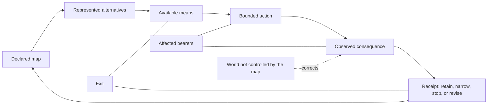

# The Emergentist Manifesto

## Preamble and Quickstart

<!-- MANIFESTO-P: scope -->
This is the Preamble and Quickstart of a staged full reader, not a new source
of doctrine. It borrows a reader-compression pattern—one sentence, one image,
one short argument, one essay, then a visible record—from *The Network State*.
It does **not** borrow
its state-building, sovereignty, founder, alignment, territorial, census, or
growth logic. This draft proposes no political project; the exclusions are part
of its editorial scope, recorded in the source contract.

<!-- MANIFESTO-P: scope_source_map -->
The source map is [`manifesto-contract.json`](manifesto-contract.json); the
full-book chapter contract is
[`FULL_BOOK_1_CONTRACT.json`](FULL_BOOK_1_CONTRACT.json). The books remain
distinct evidence-bearing modules; this manuscript gives them one argument and
one honest reader route.

### How to read the marks

<!-- MANIFESTO-P: tier_legend -->
Each source card carries its own warrant: `[A]` analytic or machine-checked
inside stated definitions; `[B]` observed, sourced, or receipted contact;
`[S]` structural consequence inside a declared framework; `[I]` interpretation
or synthesis; `[C]` a conjecture able to lose; and `[D]` deliberately unresolved
or awaiting a defined test. This draft is an editorial `[D]` projection. It
does not upgrade any card it names.

## In one sentence

<!-- MANIFESTO-P: one_sentence -->
> **Emergentism is a fallibilist worldview and practice for finite beings:
> distinguish the map from the world, possibility from actual record, act under
> visible constraints, then correct—or leave.**

Source cards: `OS01-13`, `OS01-20`, `OS01-25`, `OS01-26`.

## In one image

<!-- MANIFESTO-P: one_image_diagram -->

<!-- MANIFESTO-P: one_image_caption -->
The image is a reader aid, not a causal theory, an ontology, or an optimization
formula. It keeps five things visibly different: a map, alternatives it
represents, available means, an actual attempt, an observed consequence, and a
correction or exit.

Source cards: `OS01-08`, `OS01-09`, `OS01-13`, `OS01-26`, `FIN01-01`.

## The short argument

<!-- MANIFESTO-P: short_argument_condition -->
We are finite beings. We do not begin with a completed view of the world, yet
we still have to choose, act, cooperate, refuse, and live with consequences. In
this reader, a culture, scientific model, institutional rule, or personal plan
is treated as a map made by finite bearers under conditions that can correct it.
Emergentism begins there—not with a revelation, a completed ontology, or a
demand for belief.

<!-- MANIFESTO-P: short_argument_distinction -->
Its first discipline is distinction. A symbol is not the thing symbolized. A
model is not its territory. A theorem can establish a result inside stated
definitions; it does not thereby establish what reality ultimately is. An
elegant pattern may be useful, but it does not cause events merely because it is
beautiful. Some apparent contradictions are exposed by making a domain or type
explicit. Where no mismatch is identified, the problem remains open. Ordinary
mathematics retains its ordinary meanings.

<!-- MANIFESTO-P: short_argument_receipt -->
The same discipline matters when we act. A plan, a commitment, an attempted
act, and an observed consequence are different facts. We should say which one
we mean and keep a record that can be challenged. The world is allowed to
disagree with the map. That disagreement is not a defect in the process; it is
the process becoming honest.

<!-- MANIFESTO-P: short_argument_finity -->
Finity is the smallest practice offered here. It is a selected set of questions
for framing one decision: clarify the map, distinguish what is possible from
what is currently available, name authority and bearers, choose a bounded
action, predeclare review, and record the outcome. It is not an authorization,
a spiritual rank, or a demonstrated improvement over ordinary decision tools.
No improvement over ordinary decision tools is claimed.

<!-- MANIFESTO-P: short_argument_justice -->
Emergentism also makes a constitutional choice. Justice is not derived from
geometry, arithmetic, beauty, or the number of people who agree. It is a
declared constitutional premise: no equation alone produces an ought. In this
reader, roles are voluntary functions of equal worth, never identities or ranks
of human worth. A holder may contest the frame or put it down.

<!-- MANIFESTO-P: short_argument_collective -->
At collective scale, the same restraint applies. A collective description is a
bounded trace hypothesis, not a collective person or intention. Shared meanings
may coordinate coalitions; conflict remains causally plural. Several axes may
correspond without becoming a hierarchy of human worth.

<!-- MANIFESTO-P: short_argument_corpus_boundary -->
The corpus also contains formal research and historical critical editions. They
are not credentials for this reader and do not enter its current claim body.
Their presence is a reason to keep correction and exit visible, not a reason to
announce the manifesto correct.

<!-- MANIFESTO-P: short_argument_invitation -->
So this manifesto offers no conversion. It offers a way to proceed: use a
bounded practice, attack a claim, or leave. Keep correction possible, preserve
the record, and do not let a beautiful system take from a holder the right to
put it down.

<!-- MANIFESTO-P: body_card_index -->
Current-body source cards: `OS01-01`, `OS01-03`, `OS01-04`, `OS01-06`,
`OS01-08`, `OS01-09`, `OS01-13`, `OS01-14`, `OS01-17`–`OS01-22`, `OS01-25`,
`OS01-26`, and `FIN01-01`. Research and historical material named above remains
separately typed in the book map below; it has not been promoted by appearing
in this draft.

## The reader argument

### 1. A map that can lose

<!-- MANIFESTO-P: article_map -->
We choose no map that cannot be corrected by the world, by another bearer, or
by a result it did not predict. We treat finite, embodied agency as answerable
to consequence. We leave phenomenal consciousness, death, and metaphysical
remainder open rather than filling them with an answer because an answer feels
complete.

Source cards: `OS01-13`, `OS01-20`, `OS01-21`, `OS01-26`.

### 2. Frames are not things

<!-- MANIFESTO-P: article_frames -->
We can select a vocabulary without turning it into furniture of the universe.
Titan labels are frames, not beings, operands, or causal agents. Ordinary
mathematics remains ordinary mathematics. Type discipline may diagnose a local
mistake; it does not grant a universal solution to every difficult question.

Source cards: `OS01-01`, `OS01-03`, `OS01-04`.

### 3. Records, means, and receipts

<!-- MANIFESTO-P: article_receipts -->
A state description, a commitment, an attempted act, and an observed record
must remain separately legible. Available means are not a completed outcome.
Consequence belongs in a receipt that another person can inspect, challenge,
and use to revise the map.

Source cards: `OS01-06`, `OS01-08`, `OS01-09`, `OS01-13`.

### 4. Finity: a bounded first practice

<!-- MANIFESTO-P: article_finity -->
Finity is an optional seven-prompt compression for one live decision. It asks
for a declared map, possibilities, actual means, authority, bearers, a bounded
act, and a review point. It neither authorizes action nor proves itself better
than a simpler worksheet. A reader can use it privately, test it, alter it, or
set it aside.

Source cards: `FIN01-01`, `OS01-13`, `OS01-26`.

### 5. Justice, roles, and exit

<!-- MANIFESTO-P: article_justice -->
Justice is our declared constitutional premise, not the output of a calculation
or a cosmology. No equation alone produces an ought. Roles are voluntary
functions, never ranks of human worth. Any holder may contest the frame or put
it down.

Source cards: `OS01-19`, `OS01-20`, `OS01-22`, `OS01-26`.

### 6. Collective descriptions without collective persons

<!-- MANIFESTO-P: article_collective -->
Where collective description is needed, the source map treats it as a
five-marker trace hypothesis, not collective personhood. Shared meanings may
coordinate coalitions; conflict remains causally plural. Several axes may
correspond without becoming a hierarchy of human worth.

Source cards: `OS01-14`, `OS01-17`, `OS01-18`, `OS01-19`.

## Research record — not part of the current claim body

<!-- MANIFESTO-P: research_intro -->
The following pages locate source-only, staged, frozen, and research material
without promoting it. They are a custody and reading map, not additional
manifesto propositions.

### The formal research frontier

<!-- MANIFESTO-P: research_formal -->
The formal programme is not the manifesto’s credential. *The Titans: The
Infinite, Finity & Infinity* is a separately staged research volume. This draft
neither summarizes nor promotes its proposals. It makes no claim of a completed
algebra, a total ontology, universal paradox resolution, or science unification.

<!-- MANIFESTO-P: research_formal_boundary -->
Research boundary: `TIT01-01`–`TIT01-06` are source-only at this drafting
state.

### The immune-protocol record

<!-- MANIFESTO-P: research_immune -->
This draft treats no internal audit as a safety certificate. The source-only
critical editions retain their own claim records and custody rules; they do not
transfer those claims into this reader. The current body keeps correction and
exit visible.

<!-- MANIFESTO-P: research_immune_boundary -->
Research and genealogy boundary: `SES01-*`, `SV01-*`, and `RIP01-*` remain
source-only, staged, frozen, or custody material as recorded in the book map.

### A corpus with one argument, not one authority

<!-- MANIFESTO-P: research_corpus_map -->
The books do not become one authority by appearing under one title. The
One-Sitting edition supplies the current reader spine; Finity supplies one
optional practice; Titans holds formal research; the other works retain their
distinct research, critical, historical, or frozen boundaries. The table below
states those jobs without overriding any source owner.

## The close: exit, criticism, and the open invitation

<!-- MANIFESTO-P: close -->
Read one sentence, follow one source card, try one bounded practice, attack one
claim, or leave. None is a membership test. No agreement, popularity,
publication, or AI endorsement upgrades a proposition. If the map no longer
serves, any holder may put it down.

Source cards: `OS01-13`, `OS01-25`, `OS01-26`, `FIN01-01`.

## One corpus, differentiated jobs

<!-- MANIFESTO-P: book_table -->
| Work | Reader job | Release state | Public route |
|---|---|---|---|
| *The Emergentist Weltanschauung — One-Sitting Edition* | current reader spine | `source_active_projection_review_open` | `../12_PUBLIC_SITE/book/index.html` |
| *The Finity Card — Lived Compass Practice* | optional bounded first practice | `source_active_public_projection` | `../12_PUBLIC_SITE/practice/index.html` |
| *The Titans — The Infinite, Finity & Infinity* | formal research annex | `research_critical_edition_staged_not_public` | — |
| *The Self-Eating Serpent* | critical immune-protocol genealogy | `historical_readonly_critical_edition_staged` | — |
| *Dharma Yuddha* | justice casebook | `critical_edition_staged_not_public` | — |
| *Six-Fold Revelation / Six Lenses* | comparative-method appendix | `historical_readonly_critical_edition_staged` | — |
| *Sarpasya Vijayam* | critical genealogy and dissolution record | `historical_readonly_critical_edition_staged` | — |
| *The Reciprocal / Infinite Play* | frozen genealogy | `legacy_and_frozen_critical_edition_staged` | — |
| *The Evolutionary Network* | institutional research dossier | `proposal_critical_edition_staged_not_public` | — |

## What this manifesto refuses

<!-- MANIFESTO-P: refusals -->
1. A theorem is not an ontology.
2. A model is not the territory.
3. A symbol is not a causal agent.
4. Justice is not derived merely because a geometry is elegant.
5. A worldview is not validated by adherents, popularity, publication, or AI agreement.
6. Any holder may put it down.

## From draft to public reader

<!-- MANIFESTO-P: release_gates -->
This document is intentionally private and staged. Before it can become a
public front door, every substantive paragraph needs source-card and revision
coverage; fresh readers must be able to distinguish proof, interpretation,
conjecture, and open question; hostile review must catch barred claims; and the
public projection must pass its parity, deterministic build, predeploy, and
immutable-artifact gates. Until then, the live public site remains the released
reader projection and this remains a staged manuscript.
