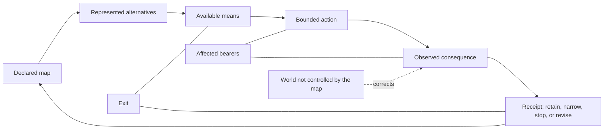

# STAGED — do not publish

This file is the candidate **public current-body** of Book I:
Preamble + chapters 1–11 + 17.

It is **not** the 17-chapter private manuscript.
It is **not** a `/book/` replacement.
It does **not** contain research chapters 12–15, genealogy chapter 16,
appendices, or Reciprocal custody prose.

G10 (fresh-reader, hostile review, public parity, predeploy, immutable
artifact, host/DNS, explicit public-release approval) remains unpaid.
A green extract is not the Amrita. It is firewood, stacked off-stage.

---

# The Emergentist Manifesto

## A worldview for finite beings

<!-- FULLBOOK-P: book_private_scope -->
This is a staged private full-reader manuscript. It is a projection of reviewed source cards and preserves their evidence tiers and lifecycle boundaries. It is not a completed ontology, a public release, a membership test, a political programme, or proof of its own truth. A reader may use a part, test it, criticize it, fork it, or put it down.

Source cards: OS01-13, OS01-25, OS01-26.

<!-- FULLBOOK-P: book_layer_scope -->
The book separates four layers: current-body prose grounded only in `bounded_current` cards; research records that retain their rivals and kill routes; critical genealogy that does not revive legacy authority; and frozen custody that does not regenerate claims. Its claim atlas is part of the reader: an argument is not made stronger by being hidden from its rival or its failure condition.

Source cards: OS01-13, OS01-26.

---

## Preamble and Quickstart

<!-- FULLBOOK-P: preamble_scope -->
This is the Preamble and Quickstart of a staged full reader, not a new source
of doctrine. It borrows a reader-compression pattern—one sentence, one image,
one short argument, one essay, then a visible record—from *The Network State*.
It does **not** borrow
its state-building, sovereignty, founder, alignment, territorial, census, or
growth logic. This draft proposes no political project; the exclusions are part
of its editorial scope, recorded in the source contract.
Source cards: none — editorial control.
<!-- FULLBOOK-P: preamble_scope_source_map -->
The source map is [`manifesto-contract.json`](manifesto-contract.json); the
full-book chapter contract is
[`FULL_BOOK_1_CONTRACT.json`](FULL_BOOK_1_CONTRACT.json). The books remain
distinct evidence-bearing modules; this manuscript gives them one argument and
one honest reader route.
Source cards: none — editorial control.
### How to read the marks

<!-- FULLBOOK-P: preamble_tier_legend -->
Each source card carries its own warrant: `[A]` analytic or machine-checked
inside stated definitions; `[B]` observed, sourced, or receipted contact;
`[S]` structural consequence inside a declared framework; `[I]` interpretation
or synthesis; `[C]` a conjecture able to lose; and `[D]` deliberately unresolved
or awaiting a defined test. This draft is an editorial `[D]` projection. It
does not upgrade any card it names.
Source cards: none — editorial control.
## In one sentence

<!-- FULLBOOK-P: preamble_one_sentence -->
> **Emergentism is a fallibilist worldview and practice for finite beings:
> distinguish the map from the world, possibility from actual record, act under
> visible constraints, then correct—or leave.**

Source cards: `OS01-13`, `OS01-20`, `OS01-25`, `OS01-26`.

## In one image

<!-- FULLBOOK-P: preamble_one_image_diagram -->

Source cards: OS01-08, OS01-09, OS01-13, OS01-26, FIN01-01.
<!-- FULLBOOK-P: preamble_one_image_caption -->
The image is a reader aid, not a causal theory, an ontology, or an optimization
formula. It keeps five things visibly different: a map, alternatives it
represents, available means, an actual attempt, an observed consequence, and a
correction or exit.

Source cards: `OS01-08`, `OS01-09`, `OS01-13`, `OS01-26`, `FIN01-01`.

## The short argument

<!-- FULLBOOK-P: preamble_short_argument_condition -->
We are finite beings. We do not begin with a completed view of the world, yet
we still have to choose, act, cooperate, refuse, and live with consequences. In
this reader, a culture, scientific model, institutional rule, or personal plan
is treated as a map made by finite bearers under conditions that can correct it.
Emergentism begins there—not with a revelation, a completed ontology, or a
demand for belief.
Source cards: OS01-13, OS01-20, OS01-26.
<!-- FULLBOOK-P: preamble_short_argument_distinction -->
Its first discipline is distinction. A symbol is not the thing symbolized. A
model is not its territory. A theorem can establish a result inside stated
definitions; it does not thereby establish what reality ultimately is. An
elegant pattern may be useful, but it does not cause events merely because it is
beautiful. Some apparent contradictions are exposed by making a domain or type
explicit. Where no mismatch is identified, the problem remains open. Ordinary
mathematics retains its ordinary meanings.
Source cards: OS01-01, OS01-03, OS01-04, OS01-26.
<!-- FULLBOOK-P: preamble_short_argument_receipt -->
The same discipline matters when we act. A plan, a commitment, an attempted
act, and an observed consequence are different facts. We should say which one
we mean and keep a record that can be challenged. The world is allowed to
disagree with the map. That disagreement is not a defect in the process; it is
the process becoming honest.
Source cards: OS01-08, OS01-13.
<!-- FULLBOOK-P: preamble_short_argument_finity -->
Finity is the smallest practice offered here. It is a selected set of questions
for framing one decision: clarify the map, distinguish what is possible from
what is currently available, name authority and bearers, choose a bounded
action, predeclare review, and record the outcome. It is not an authorization,
a spiritual rank, or a demonstrated improvement over ordinary decision tools.
No improvement over ordinary decision tools is claimed.
Source cards: FIN01-01, OS01-13, OS01-26.
<!-- FULLBOOK-P: preamble_short_argument_justice -->
Emergentism also makes a constitutional choice. Justice is not derived from
geometry, arithmetic, beauty, or the number of people who agree. It is a
declared constitutional premise: no equation alone produces an ought. In this
reader, roles are voluntary functions of equal worth, never identities or ranks
of human worth. A holder may contest the frame or put it down.
Source cards: OS01-19, OS01-22, OS01-26.
<!-- FULLBOOK-P: preamble_short_argument_collective -->
At collective scale, the same restraint applies. A collective description is a
bounded trace hypothesis, not a collective person or intention. Shared meanings
may coordinate coalitions; conflict remains causally plural. Several axes may
correspond without becoming a hierarchy of human worth.
Source cards: OS01-14, OS01-17, OS01-18, OS01-19.
<!-- FULLBOOK-P: preamble_short_argument_corpus_boundary -->
The corpus also contains formal research and historical critical editions. They
are not credentials for this reader and do not enter its current claim body.
Their presence is a reason to keep correction and exit visible, not a reason to
announce the manifesto correct.
Source cards: OS01-13, OS01-26.
<!-- FULLBOOK-P: preamble_short_argument_invitation -->
So this manifesto offers no conversion. It offers a way to proceed: use a
bounded practice, attack a claim, or leave. Keep correction possible, preserve
the record, and do not let a beautiful system take from a holder the right to
put it down.
Source cards: FIN01-01, OS01-13, OS01-26.
<!-- FULLBOOK-P: preamble_body_card_index -->
Current-body source cards: `OS01-01`, `OS01-03`, `OS01-04`, `OS01-06`,
`OS01-08`, `OS01-09`, `OS01-13`, `OS01-14`, `OS01-17`–`OS01-22`, `OS01-25`,
`OS01-26`, and `FIN01-01`. Research and historical material named above remains
separately typed in the book map below; it has not been promoted by appearing
in this draft.
Source cards: OS01-01, OS01-03, OS01-04, OS01-06, OS01-08, OS01-09, OS01-13, OS01-14, OS01-17, OS01-18, OS01-19, OS01-20, OS01-21, OS01-22, OS01-25, OS01-26, FIN01-01.
## The reader argument

### 1. A map that can lose

<!-- FULLBOOK-P: preamble_article_map -->
We choose no map that cannot be corrected by the world, by another bearer, or
by a result it did not predict. We treat finite, embodied agency as answerable
to consequence. We leave phenomenal consciousness, death, and metaphysical
remainder open rather than filling them with an answer because an answer feels
complete.

Source cards: `OS01-13`, `OS01-20`, `OS01-21`, `OS01-26`.

### 2. Frames are not things

<!-- FULLBOOK-P: preamble_article_frames -->
We can select a vocabulary without turning it into furniture of the universe.
Titan labels are frames, not beings, operands, or causal agents. Ordinary
mathematics remains ordinary mathematics. Type discipline may diagnose a local
mistake; it does not grant a universal solution to every difficult question.

Source cards: `OS01-01`, `OS01-03`, `OS01-04`.

### 3. Records, means, and receipts

<!-- FULLBOOK-P: preamble_article_receipts -->
A state description, a commitment, an attempted act, and an observed record
must remain separately legible. Available means are not a completed outcome.
Consequence belongs in a receipt that another person can inspect, challenge,
and use to revise the map.

Source cards: `OS01-06`, `OS01-08`, `OS01-09`, `OS01-13`.

### 4. Finity: a bounded first practice

<!-- FULLBOOK-P: preamble_article_finity -->
Finity is an optional seven-prompt compression for one live decision. It asks
for a declared map, possibilities, actual means, authority, bearers, a bounded
act, and a review point. It neither authorizes action nor proves itself better
than a simpler worksheet. A reader can use it privately, test it, alter it, or
set it aside.

Source cards: `FIN01-01`, `OS01-13`, `OS01-26`.

### 5. Justice, roles, and exit

<!-- FULLBOOK-P: preamble_article_justice -->
Justice is our declared constitutional premise, not the output of a calculation
or a cosmology. No equation alone produces an ought. Roles are voluntary
functions, never ranks of human worth. Any holder may contest the frame or put
it down.

Source cards: `OS01-19`, `OS01-20`, `OS01-22`, `OS01-26`.

### 6. Collective descriptions without collective persons

<!-- FULLBOOK-P: preamble_article_collective -->
Where collective description is needed, the source map treats it as a
five-marker trace hypothesis, not collective personhood. Shared meanings may
coordinate coalitions; conflict remains causally plural. Several axes may
correspond without becoming a hierarchy of human worth.

Source cards: `OS01-14`, `OS01-17`, `OS01-18`, `OS01-19`.

## The close: exit, criticism, and the open invitation

<!-- FULLBOOK-P: preamble_close -->
Read one sentence, follow one source card, try one bounded practice, attack one
claim, or leave. None is a membership test. No agreement, popularity,
publication, or AI endorsement upgrades a proposition. If the map no longer
serves, any holder may put it down.

Source cards: `OS01-13`, `OS01-25`, `OS01-26`, `FIN01-01`.

## What this manifesto refuses

<!-- FULLBOOK-P: preamble_refusals -->
1. A theorem is not an ontology.
2. A model is not the territory.
3. A symbol is not a causal agent.
4. Justice is not derived merely because a geometry is elegant.
5. A worldview is not validated by adherents, popularity, publication, or AI agreement.
6. Any holder may put it down.
Source cards: OS01-22, OS01-26.
## From draft to public reader

<!-- FULLBOOK-P: preamble_release_gates -->
This document is intentionally private and staged. Before it can become a
public front door, every substantive paragraph needs source-card and revision
coverage; fresh readers must be able to distinguish proof, interpretation,
conjecture, and open question; hostile review must catch barred claims; and the
public projection must pass its parity, deterministic build, predeploy, and
immutable-artifact gates. Until then, the live public site remains the released
reader projection and this remains a staged manuscript.
Source cards: none — editorial control.

---

# Part I — The Finite Condition

<!-- FULLBOOK-P: p1-001 -->
**Source boundary.** This is a private, staged reader draft, not a new source
of doctrine. It uses only the twelve bounded-current One-Sitting cards named in
its source boundary. It does not import a candidate proof, source-only practice,
historical manuscript, frozen material, or an uncarded conclusion. Its task is
narrower than a completed worldview: to make a finite-agent interpretation
readable while preserving the distinctions through which it could be corrected,
narrowed, or put down. A later public edition would need its own source and
public gates; this manuscript does not claim to have passed them.

Source cards: OS01-13, OS01-20, OS01-25, OS01-26.

## 1. The Finite Predicament

<!-- FULLBOOK-P: p1-002 -->
Every person acts from somewhere. A body has a location, a history, a limited
span of attention, a changing store of energy, and access to some tools rather
than others. A person also encounters other people, records, environments, and
consequences that do not wait for a theory to become complete. Calling this the
finite predicament is not a biological, metaphysical, or psychological theory
of the human being. It is an interpretive starting point: our agency is
embodied, situated, and answerable to consequence, rather than an act of total
self-authorship outside the conditions in which it occurs.

Source cards: OS01-20, OS01-26.

<!-- FULLBOOK-P: p1-003 -->
The word finite does not mean small in spirit, passive in practice, or incapable
of imagination. It means that a person does not hold every relevant fact at
once, cannot pursue every available path at once, and cannot make an outcome
true merely by wanting it. A plan may be excellent and still meet a closed
door, a changed market, a faulty instrument, another person's refusal, or a
fact previously unseen. The limitation is not an insult to agency. It is the
reason an account of agency needs a place for preparation, contact, revision,
and departure rather than a promise that a sufficiently sincere map controls
what it maps.

Source cards: OS01-13, OS01-20, OS01-26.

<!-- FULLBOOK-P: p1-004 -->
This reader starts from the practical fact that a finite being must often move
before certainty is available. Someone arranging a journey may have a weather
forecast, a timetable, a budget, and several routes, yet still has to choose a
departure time. None of those representations is the journey itself. The
traveller's map can improve the choice without becoming a guarantee that the
train runs, that the road remains open, or that the experience will unfold as
imagined. The same distinction holds in more serious or more ordinary cases:
an account can guide action while remaining distinct from the consequence it
hopes to meet.

Source cards: OS01-09, OS01-13, OS01-20.

<!-- FULLBOOK-P: p1-005 -->
The finite predicament is therefore not an invitation to sceptical paralysis.
It gives a different question. Instead of asking how to become certain before
acting, ask what must remain visible while an imperfectly informed action is
taken. At minimum, the reader needs to distinguish the map now held, the
possibilities represented by it, the means actually available, the commitment
made, what subsequently occurs, and the way that comparison can be reviewed.
These are not six names for one event. Collapsing them makes a hoped-for outcome
look like an achieved outcome and a private confidence look like a public
record.

Source cards: OS01-08, OS01-09, OS01-13.

<!-- FULLBOOK-P: p1-006 -->
This distinction also makes room for a simple but important refusal: a person
does not become the sum of an available-means profile, a forecast, a successful
action, or a failed one. The framework may describe a situated agent facing
constraints and consequences, but it does not turn a description of situation
into a verdict of worth. The profile of what a person can presently reach is
changeable; the record of what happened is contestable; the map can be revised.
None of those facts supplies a license to reduce a person to a score or to treat
limited means as a permanent human identity.

Source cards: OS01-09, OS01-20, OS01-26.

<!-- FULLBOOK-P: p1-007 -->
An ordinary notebook illustrates the same point. It can contain goals,
appointments, sketches, worries, numbers, and promises. Its usefulness comes
from keeping items available to attention, not from becoming the life it
records. If the notebook says a meeting happened, that entry may be a useful
claim about the meeting; it is not automatically a verified account of what
was decided, who was present, or what followed. The difference is not pedantic.
It tells the reader where a correction belongs: in the note, in the recollection,
in the plan, in the report, or in the claimed consequence.

Source cards: OS01-08, OS01-13, OS01-20.

<!-- FULLBOOK-P: p1-008 -->
The finite condition is also an antidote to a familiar form of grandeur. A
worldview can promise that it sees through every local uncertainty because it
has found the final scale on which all uncertainty is placed. This book makes
no such promise. It does not settle the ultimate status of consciousness,
personal death, or metaphysical remainder by fitting them into a polished
diagram. These questions remain open here. Openness is not a coded answer, a
spiritual accomplishment, or a convenient way to avoid argument; it names the
boundary of what this reader currently warrants.

Source cards: OS01-20, OS01-21, OS01-25.

<!-- FULLBOOK-P: p1-009 -->
Leaving a question open is harder than leaving it vague. A vague phrase lets a
writer imply that an answer exists without saying what would distinguish it from
a rival. An open question instead tells the reader not to treat absence of an
answer as evidence for a preferred answer. If a future account offers a better
explanation or relevant evidence, the item should be updated under its native
burden. Nothing in this framework earns the right to protect a mystery merely
because mystery gives the framework atmosphere. The survivor is revision, not
a sacred remainder immune from contact.

Source cards: OS01-21, OS01-26.

<!-- FULLBOOK-P: p1-010 -->
The reader should notice the difference between a boundary and a denial. To
leave phenomenal consciousness open is not to deny lived experience. To leave
death open is not to deny mortality, grief, or the significance of a life. To
leave metaphysical remainder open is not to affirm a hidden world behind the
visible one. It is a refusal to insert conclusions that the stated framework has
not earned. Such restraint can feel unsatisfying when one wants a definitive
answer. It is nevertheless clearer than claiming a resolution whose support is
only the desire that unresolved questions should have been resolved.

Source cards: OS01-20, OS01-21, OS01-26.

<!-- FULLBOOK-P: p1-011 -->
Several serious rivals begin from the same human pressure without using this
reader's language. A naturalist might offer a different account of embodied
agency; a compatibilist might frame freedom through reasons and constraints; an
existential or phenomenological account might begin from lived choice and
experience. This book does not defeat those accounts by naming them rivals. Its
finite-agent interpretation earns only a practical comparison: does it clarify
what a person can distinguish, what a consequence can correct, and how a claim
can remain revisable without pretending to be a completed science of persons?

Source cards: OS01-13, OS01-20, OS01-21.

<!-- FULLBOOK-P: p1-012 -->
The comparison cannot be settled by declaring that every rival secretly means
the same thing. Differences in explanation, vocabulary, and practical
consequence matter. A rival may explain the relevant situation more clearly,
with fewer assumptions, or with better contact to a domain. Where that happens,
the responsible response is narrowing or replacing the local interpretation,
not recoding the rival as a hidden victory for the framework. A finite map has
no privilege to absorb every other map; its strength, if any, lies in making
the point of comparison visible.

Source cards: OS01-13, OS01-20, OS01-26.

<!-- FULLBOOK-P: p1-013 -->
Finitude includes dependence. A person acts through language learned from
others, bodies maintained through material conditions, instruments made by
other hands, and records that can outlast the moment in which they were made.
The framework does not draw from this observation a total theory of society or
an account of what anyone owes anyone else. It draws a narrower operational
lesson: an action and an outcome may involve more bearers and more conditions
than the actor's own story acknowledges. That is why a record needs a contest
path rather than merely a place for the actor to declare success.

Source cards: OS01-08, OS01-13, OS01-20.

<!-- FULLBOOK-P: p1-014 -->
Finitude also includes temporal asymmetry at the level of practical life. A
person can remember an earlier decision, make a representation of a later
possibility, and act now with whatever body, tools, access, and time are
actually present. The represented future may be vivid, frightening, or
attractive, but it is not a completed outcome. The present action is the point
at which a claim about the future encounters actual means and later receives a
record. Keeping this sequence visible keeps anticipation from quietly becoming
a receipt for an event that has not occurred.

Source cards: OS01-08, OS01-09, OS01-13, OS01-20.

<!-- FULLBOOK-P: p1-015 -->
No private feeling of humility guarantees this discipline. A person can say
that they are open to correction while arranging their terms so that no possible
observation counts against the story they prefer. A worldview can recite its
own limits while treating every objection as evidence that critics have not yet
understood it. The refusal in this book is practical: self-description does not
award a result, and self-audit does not prove safety. The relevant question is
whether the map, move, outcome, correction, and exit are actually kept distinct
where they matter.

Source cards: OS01-08, OS01-13, OS01-26.

<!-- FULLBOOK-P: p1-016 -->
One modest test follows. When someone says, “This worked,” ask what exactly the
word “this” names. Does it name an idea, an intention, a written plan, a
performed action, an observed effect, or a later interpretation of an effect?
Does “worked” name a hoped-for effect, a measured result, a temporary response,
or a conclusion from insufficient observation? The question does not presume
failure. It creates a surface on which success and failure can be meaningfully
discussed. Without the distinctions, the sentence may remain rhetorically
strong while carrying too little information to learn from.

Source cards: OS01-08, OS01-13, OS01-26.

<!-- FULLBOOK-P: p1-017 -->
The alternative to a guaranteed worldview is not a worldview with no shape. It
is a framework that states its shape as a framework. It can say: here is a
selected interpretation of finite agency; here is what it leaves open; here is
what would count as a failure of a local use; here is how a reader may retain,
narrow, revise, or leave. This does not make the framework true. It makes its
ambition inspectable. The reader need not grant it any more authority than the
sources, distinctions, and consequences made visible in its own record.

Source cards: OS01-13, OS01-20, OS01-21, OS01-26.

<!-- FULLBOOK-P: p1-018 -->
The book's exit rule begins here rather than at the final page. If the vocabulary
does not make a situation clearer, if it repeatedly creates unhelpful status
effects, if it conceals a needed rival, or if it blocks correction, a reader may
put it down. Departure is not evidence that the reader failed a test of loyalty.
It is an ordinary possibility within a voluntary framework. A map that requires
compulsory holding has made its own continuation more important than the
question it was meant to help investigate.

Source cards: OS01-13, OS01-25, OS01-26.

<!-- FULLBOOK-P: p1-019 -->
The selected D6 label is one way this book remembers nonclosure and exit. It is
not a discovery about an afterlife, a hidden object, a human attainment, or a
sixth kind of freedom. It is a boundary marker: a reminder that the work of
articulation can stop without forcing the remainder to become another entity.
If the label does not improve this discipline—if it becomes a badge, an
identity, or a covert ontology—it should be retired. Plain language about
nonclosure and leaving remains available.

Source cards: OS01-25, OS01-26.

<!-- FULLBOOK-P: p1-020 -->
The finite predicament therefore begins with a discipline of proportion. The
map may be useful without becoming the world. The agent may be capable without
being unlimited. A possibility may be meaningful without being an achievement.
A result may be promising without being final. A mystery may matter without
being possessed. These distinctions do not solve the trouble of living with
partial knowledge. They make it harder to conceal that trouble behind a word
such as destiny, system, or certainty. That is their first practical value.

Source cards: OS01-09, OS01-13, OS01-20, OS01-21, OS01-26.

<!-- FULLBOOK-P: p1-021 -->
The chapter has not established an ontology. It has offered an interpretation
with explicit boundaries: finite, embodied, situated agents act amid conditions
and consequences they do not wholly author; central mysteries remain open; and
the account is removable. Its failure condition is equally explicit. If this
interpretation becomes less clear or less useful than a fair rival, or if it is
used to smuggle in a hidden conclusion about persons, consciousness, death, or
authority, it should be narrowed or discarded in that use. The reader retains
the right to prefer a more adequate map.

Source cards: OS01-20, OS01-21, OS01-25, OS01-26.

<!-- FULLBOOK-P: p1-022 -->
The next question is what sort of language can serve a finite reader without
being mistaken for furniture in the world. A symbol, a model, and a formal
operation may each be useful. Their usefulness depends in part on keeping their
types clear. The task is not to ban framing language. It is to prevent frames
from acquiring bodies, causes, proofs, or commands simply because they are
vividly named. That is the beginning of type discipline.

Source cards: OS01-01, OS01-03, OS01-04, OS01-26.

## 2. Frames Are Not Furniture

<!-- FULLBOOK-P: p1-023 -->
Before using an important word, ask what sort of thing the word is doing. It
may be a formal term, a physical description, a relation, a model component, a
record, a metaphor, a procedure, or an unanswered question. These kinds can
interact, but they are not interchangeable. Trouble begins when a label that
organizes attention is treated as an object inside the world, when a diagram is
treated as a mechanism, or when a formal result is treated as an inventory of
everything that exists. The question of type is therefore not a decorative
technicality; it is a way to locate the exact step at which a claim changes
what kind of thing it purports to be.

Source cards: OS01-01, OS01-03, OS01-04, OS01-26.

<!-- FULLBOOK-P: p1-024 -->
The Titan labels make the point deliberately visible. They are selected
metaframes, used here to orient attention to boundary conditions such as origin
or absence, finite presence, and a horizon that exceeds a finite inventory. The
labels are not three entities, particles, gods, arithmetic operands, causal
agents, or a census of reality. Their visual compactness can make them memorable;
that is a reason to state the boundary more carefully, not a reason to assign
them extra power. A reader can reject the imagery and keep the survivor: a
boundary frame is not one more object located within the frame.

Source cards: OS01-01, OS01-26.

<!-- FULLBOOK-P: p1-025 -->
Consider a map legend. A blue line may mark a river, a road, or a border,
depending on the legend. The line does not become wet, paved, or politically
binding because it is drawn. Its relation to what it depicts is supplied by a
convention, a scale, a date, and a use. A reader who forgets that relation may
mistake a schematic simplification for a physical fact. The Titan labels work
at an even more restrained level: they are not representations whose reference
has been independently established; they are selected framing language, useful
only if it helps readers preserve rather than blur the frame/object distinction.

Source cards: OS01-01, OS01-13, OS01-26.

<!-- FULLBOOK-P: p1-026 -->
The phrase “not furniture” names this restraint. Furniture occupies a room; it
can be counted, moved, bumped into, or measured. A frame is what lets a reader
state a room, an object, a relation, or a limit in the first place. A frame may
be explicit and revisable, but it does not automatically join the list of things
it helps describe. The point is not that every distinction between frame and
object is easy. It is that a writer who crosses it owes an account of the
crossing instead of treating a grammatical convenience as evidence of a new
thing in the world.

Source cards: OS01-01, OS01-04, OS01-26.

<!-- FULLBOOK-P: p1-027 -->
The same discipline applies when a word has mathematical associations. The
selected D1 presentation reads distinction through signed units, while ordinary
arithmetic retains its native definitions. That is a chosen crosswalk, not a
revision of arithmetic. A reader may use it to ask how one orientation is
distinguished from another inside a selected presentation. The reader may not
use it to change what ordinary arithmetic says, to make a boundary label into a
number by rhetoric, or to claim that a familiar formal question has vanished
because its symbols have appeared in a new story.

Source cards: OS01-03, OS01-04.

<!-- FULLBOOK-P: p1-028 -->
Native mathematics remains the place where mathematical claims are settled under
its stated definitions and proof obligations. The D1 reading neither replaces
those definitions nor takes credit for their results. Its only defensible role
is interpretive: it may accompany a named structure if it makes a distinction
clearer while preserving the native result. If it alters the result, obscures
the domain, or contributes no explanatory value, the reading should be removed.
Ordinary mathematics loses nothing when an optional crosswalk fails; that is
precisely why the crosswalk must remain optional.

Source cards: OS01-03, OS01-04, OS01-26.

<!-- FULLBOOK-P: p1-029 -->
This is a useful discipline because symbolic resemblance is cheap. A shape may
look like another shape, a word may echo an older word, or a diagram may suggest
a connection across domains. None of those resemblances by itself transfers
proof, causal force, or existence from one domain to another. A formal
relationship can be formally exact and still leave an empirical claim unearned.
A compelling metaphor can orient inquiry and still be a poor mechanism. The
reader is asked to keep the kind of support visible rather than treating
elegance, familiarity, or symbolic fit as an all-purpose warrant.

Source cards: OS01-01, OS01-03, OS01-26.

<!-- FULLBOOK-P: p1-030 -->
Some apparent contradictions do dissolve when a domain or type is made explicit.
For example, a statement may move without warning between a word used as a
label, the object to which the label refers, and an operation performed on the
object. Repair begins by naming which move occurred and by recovering the native
result in the proper domain. This is a local diagnostic practice, not a universal
paradox machine. It does not allow the writer to announce “type error” whenever
a hard question resists an answer. A diagnosis has earned its name only when a
specific mismatch can be stated and checked.

Source cards: OS01-03, OS01-04, OS01-26.

<!-- FULLBOOK-P: p1-031 -->
The failure condition is as important as the repair. If no exact mismatch is
identified, if the allegedly corrected expression does not recover its native
result, or if the apparent contradiction survives within the same declared
domain, the problem remains open. There is no merit in renaming an unsolved
problem as solved. The ordinary survivor is local type discipline: use the
right domain, say what an operator acts on, and do not confuse an interpretation
of a formal object with a new formal result. That survivor is valuable even
when a larger ambition fails.

Source cards: OS01-03, OS01-04.

<!-- FULLBOOK-P: p1-032 -->
The strongest rival to Titan imagery is not hostility to imagery. It is plain,
typed metalanguage: say boundary, finite unit, horizon, model, object, relation,
or open question without the mythic labels. That rival can be better whenever
the imagery adds confusion, status effects, or a false sense of explanatory
depth. The relevant comparison is reader comprehension. Do the labels help a
reader keep types apart, or do they invite the reader to treat a symbolic frame
as a being, a hierarchy, or a causal power? The reader should prefer the clearer
language in the setting at hand.

Source cards: OS01-01, OS01-11, OS01-26.

<!-- FULLBOOK-P: p1-033 -->
An image can fail by becoming too easy to remember. Suppose a reader sees three
boundary marks often enough that they begin to speak as if the marks themselves
act, desire, decide, or produce events. The problem is not only poetic excess.
It has changed a selected frame into an unearned causal agent. The repair is
not to invent a subtler causal story for the marks. It is to restore the
boundary: the mark is a piece of selected language; any empirical causal claim
would require its own objects, mechanism, evidence, and test.

Source cards: OS01-01, OS01-11, OS01-26.

<!-- FULLBOOK-P: p1-034 -->
The distinction also protects a reader from status inflation. A vocabulary can
become a sign that its user belongs to a more enlightened group, even when its
terms add no precision to the situation. The book rejects that use. No symbol,
translation language, or terminological fluency marks a kind of person or gives
the speaker a special right to interpret everyone else. A reader may translate
an idea into plain functional language, ask for definitions, or leave the terms
behind. The optional language has failed in its own task if it turns voluntary
description into identity or rank.

Source cards: OS01-01, OS01-11, OS01-26.

<!-- FULLBOOK-P: p1-035 -->
The book therefore keeps names and moves separate. A neutral functional
description can name a transformation or a contrast without assigning it a
mythic alias. The selected G7 language, where it appears, is an optional
translation vocabulary. It supplies neither truth nor a verdict. Its symbols
are not agents, identities, evidence, or conclusions about what anyone should
do. If a plain description carries the work more clearly, plain description is
the better tool. The vocabulary earns its place only by reducing confusion,
not by becoming a badge of access to hidden knowledge.

Source cards: OS01-11, OS01-26.

<!-- FULLBOOK-P: p1-036 -->
The frame/object distinction is not a doctrine of silence. It permits careful
speech. A writer can say, “This is a selected boundary label,” “this is a formal
term in a named domain,” “this is an observed record,” or “this is an
interpretation offered for comparison.” Each sentence makes its scope more
inspectable. It becomes easier for another reader to accept a local use, reject
an overreach, or propose a different reading without needing to destroy the
entire vocabulary. Precision creates more places for disagreement, which is a
feature when the aim is correction rather than insulation.

Source cards: OS01-03, OS01-04, OS01-13, OS01-26.

<!-- FULLBOOK-P: p1-037 -->
A useful reader test is to replace a loaded term with a plain phrase and see
what has changed. If nothing substantive is lost, the plain phrase may be
preferable. If something is lost, name exactly what: a distinction, a visual
memory aid, a relation between stated elements, or a question that becomes
easier to hold in view. “It feels deeper” is not yet a sufficient answer. The
test does not punish metaphor; it asks metaphor to disclose its work. It also
prevents the habit of using an unfamiliar word as a substitute for an explained
claim.

Source cards: OS01-01, OS01-11, OS01-13.

<!-- FULLBOOK-P: p1-038 -->
The same test applies to formal language. If a selected D1 reading helps, it
should be possible to say which ordinary structure it accompanies, what native
definitions remain unchanged, and what explanatory task the reading improves.
If those answers cannot be given, the safest description is not “new algebra”
or “solved foundations,” but optional imagery awaiting a clearer use. The
framework loses no integrity by declining an inflated name. It gains a precise
way to preserve the ordinary mathematics while testing whether the crosswalk is
worth keeping.

Source cards: OS01-03, OS01-04, OS01-26.

<!-- FULLBOOK-P: p1-039 -->
Frames can be helpful precisely because they do not have to become furniture.
An empty picture frame lets one attend to a scene without claiming to create the
scene. A question mark can preserve a question without pretending that the
question mark is the answer. A boundary label can orient attention toward what
is not being asserted. The reader should resist the urge to fill every such
space with a new object. Some of the most important work of a frame is negative:
to stop a category mistake, to keep an inference from crossing too early, or to
make room for a result not yet earned.

Source cards: OS01-01, OS01-04, OS01-25, OS01-26.

<!-- FULLBOOK-P: p1-040 -->
This chapter does not solve every conceptual difficulty with a type distinction.
It establishes a stricter standard for any such claim. State the domains. Name
the object, frame, operator, record, or interpretation at issue. Show the exact
mismatch if there is one. Recover the native result. Compare the proposed
language with a plain alternative. Retire it if it creates leakage or confusion.
That is enough to make type discipline useful without making it a universal
answer. It remains a method of local honesty, not a shortcut to possession of
reality.

Source cards: OS01-01, OS01-03, OS01-04, OS01-11, OS01-26.

<!-- FULLBOOK-P: p1-041 -->
The next distinction is practical rather than merely linguistic. A probability
assignment is not an event; a represented possibility is not a present means;
and an intended move is not a received consequence. The reader now turns from
the difference between frames and things to the difference between what a map
can represent, what an agent can actually do, and what a record can honestly
say happened.

Source cards: OS01-06, OS01-08, OS01-09, OS01-13.

## 3. Probability, Record, and Possibility

<!-- FULLBOOK-P: p1-042 -->
Probability is useful precisely because it is not a receipt. A probability
assignment says something about a range of possible outcomes under stated
conditions; it does not say that one outcome has already occurred. This is an
ordinary distinction in forecasts, estimates, and plans. A person can judge a
rainy afternoon likely and still open the door to a clear sky. A project can
have a high estimated chance of completion and still miss its date. The map of
possibilities may be relevant to a decision, but the occurrence of an event is
a separate matter. Conflating them turns preparation into an imagined record.

Source cards: OS01-06, OS01-08, OS01-13.

<!-- FULLBOOK-P: p1-043 -->
The distinction has a precise scientific example. In the named quantum
formalism, a state supplies context-relative outcome probabilities; an actual
record is a distinct event. The state predicts and a record occurs. This reader
uses that difference as a disciplined comparison, not as a license to speak as
though it has solved quantum measurement or chosen among the competing
interpretations of quantum theory. The formalism retains its own objects,
definitions, and evidential burdens. The reader takes only the limited lesson
for its own use: do not rename a probability-bearing description as an observed
outcome.

Source cards: OS01-06, OS01-26.

<!-- FULLBOOK-P: p1-044 -->
The word context matters. A probability is not an all-purpose property that
floats free of how a question is posed or what conditions are specified. The
state description and the record belong to different roles in an account: one
supplies probabilities under a formal context; the other names an event that
must be recorded as such. The reader need not learn the technical formalism to
understand the boundary. A forecast, a model output, and a likelihood estimate
can guide preparation without allowing their holder to say that the forecast,
output, or estimate has already happened.

Source cards: OS01-06, OS01-13.

<!-- FULLBOOK-P: p1-045 -->
This scientific example has a strong boundary. It does not establish a general
ladder of reality, a final account of causation, or a metaphysical explanation
of why records occur. It does not derive an account of consciousness from a
state description, and it does not grant a symbolic framework authority over
native science. A reader who wants answers to those questions should consult
the relevant scientific and philosophical arguments rather than treating an
analogy in this book as their settlement. A formal distinction can remain exact
inside its domain while the broader interpretation stays open.

Source cards: OS01-06, OS01-20, OS01-21, OS01-26.

<!-- FULLBOOK-P: p1-046 -->
The more familiar version appears in everyday speech. “The plan will work” can
mean several different things: someone has a reason to expect success, someone
has chosen to act, someone hopes to act, someone has started, or someone has
seen a result. The sentence becomes more useful when the speaker names which
one is meant. An expectation belongs to a map; a commitment belongs to a
declared move; a performed action belongs to a history; a result belongs to a
record. The distinctions do not make people less able to plan. They prevent one
verb from concealing several untested transitions.

Source cards: OS01-08, OS01-13, OS01-26.

<!-- FULLBOOK-P: p1-047 -->
Suppose two friends plan a small event. They may represent several possible
venues, imagine different attendance levels, and prepare a budget. Those
representations may be thoughtful, but they do not supply a booking, a room,
transport, or the later record of who arrived. A good plan can still be worth
making. The point is not to mock planning but to make its scope honest: the
plan is a present map of possibilities, while the means and consequences to
which it refers remain distinct facts. When the evening is over, the map may be
revised by what actually occurred rather than by what had been pictured.

Source cards: OS01-08, OS01-09, OS01-13.

<!-- FULLBOOK-P: p1-048 -->
The framework names one selected separation inside this territory: possible
power and actual means form a two-axis profile. The phrase possible power
refers to the structured field of options represented in a selected model;
actual means refers to the resources, access, capability, and conditions
available for action in the situation under discussion. The point is not to
announce a new quantity found in nature. It is to keep two questions from
collapsing: what alternatives can presently be represented, and what means are
actually available to pursue an alternative? The profile is a model, not a
measure of a person's intrinsic worth.

Source cards: OS01-09, OS01-20, OS01-26.

<!-- FULLBOOK-P: p1-049 -->
The two axes are easy to see in ordinary cases. A designer may imagine many
possible versions of a product while having little time, money, access, or
technical capacity to build any one of them. Another person may have abundant
means yet possess a narrow or confused representation of the options before
them. Neither description settles what either person will do, what they ought
to do, or who they are. It simply prevents an account of imagination from being
mistaken for an account of means, and an account of means from being mistaken
for an account of the possible field.

Source cards: OS01-09, OS01-20, OS01-26.

<!-- FULLBOOK-P: p1-050 -->
Keeping the profile uncollapsed is often more informative than rushing to a
single score. A pair of axes can reveal a tension that an average hides. A
reader may have a wide range of imagined alternatives but no practical route to
test them. Or the reader may have real resources but no adequately specified
choice among possible uses. The framework does not say that one side is always
more important than the other. It says that they are different inputs and that
a situation can be described without pretending that a universal exchange rate
between them has already been discovered.

Source cards: OS01-09, OS01-13.

<!-- FULLBOOK-P: p1-051 -->
Any attempt to turn the profile into a scalar has additional debts. The scalar
must declare its calibration, the domain in which it is being used, the way its
components are scaled, and the rival models against which it is compared. A
product, a minimum, an additive score, a Pareto relation, a CES-style
combination, or a nonnumeric description may fit some tasks better than others.
The framework currently has no license to call one such combination universally
correct. A scalar that is not defensibly calibrated should be retired rather
than quietly allowed to become a ranking device.

Source cards: OS01-09, OS01-26.

<!-- FULLBOOK-P: p1-052 -->
The practical testing standard is deliberately demanding. Compare a proposed
scalar or profile against component-matched rivals using declared calibration,
independent rescaling checks, and held-out task performance where such testing
is appropriate. If a rival predicts better with fewer assumptions, the proposed
combination loses that use. If rescaling changes the conclusion without an
account of why, the measure has exposed a weakness. If the task does not support
quantification, a nonnumeric account may be more honest. This is a research
discipline for the model, not an assessment of the people described by it.

Source cards: OS01-09, OS01-13.

<!-- FULLBOOK-P: p1-053 -->
The boundary against human ranking deserves repetition because numerical forms
can acquire authority by appearance. A profile can be a temporary description
inside a declared task; it cannot become a name for a human kind, a permanent
rank, or a title to speak over another person. The same applies to any
translation between possibility and means. A reader may use a model to notice a
missing resource or an underexplored alternative. The reader may not infer that
limited access makes someone less of a person, or that a currently expansive
option field makes someone superior. The model is replaceable; the person is not
its output.

Source cards: OS01-09, OS01-20, OS01-26.

<!-- FULLBOOK-P: p1-054 -->
The word possibility also needs restraint. It does not name a second world
whose contents are automatically actual somewhere else, nor does it make a
future event a present causal agent. In this reader it names represented
counterfactual content held in relation to present means and later records.
That narrower use is enough for planning, imagination, comparison, and revision.
It stops the framework from treating every articulate alternative as already
realized, while also stopping a present limitation from being confused with the
full range of alternatives a map might represent.

Source cards: OS01-09, OS01-13, OS01-26.

<!-- FULLBOOK-P: p1-055 -->
This boundary makes a promise more legible. A promise is a present commitment
about a possible future, not a completed performance. The commitment can matter
now because it changes what is publicly declared and what can later be compared,
but its fulfillment still depends on future action, means, and circumstances.
The promise should therefore not be celebrated as though it were its own
receipt. It can be evaluated against what is subsequently done and observed.
That distinction is not cynicism about promises; it is what lets a promise be
meaningful without becoming a verbal substitute for the consequence it names.

Source cards: OS01-08, OS01-09, OS01-13.

<!-- FULLBOOK-P: p1-056 -->
The same point applies to a model of a future. A model can be valuable if it
makes assumptions, alternatives, and constraints explicit. It may help a person
prepare, compare, or avoid a foreseeable mistake. But it remains a model. Its
value cannot be measured by its vividness alone, and it does not receive credit
for a future outcome before the outcome has been observed. A model may be
retained, revised, or set aside after contact; the person using it does not need
to protect it from revision in order to have learned from it.

Source cards: OS01-08, OS01-09, OS01-13, OS01-26.

### An interlude: four reader questions

<!-- FULLBOOK-P: p1-088 -->
The first question is: what kind of claim is being made? A reader should be able
to tell whether a sentence names a selected frame, an interpretation, a formal
result inside stated definitions, a probability-bearing description, an observed
record, or an open question. This does not demand that every conversation turn
into a technical classification exercise. It asks that a claim become more exact
when it is being asked to carry explanatory, practical, or public weight. The
question is especially useful when a sentence sounds decisive. A decisive sound
does not reveal whether the sentence has changed from a symbol to an object, a
prediction to a result, or an interpretation to a fact.

Source cards: OS01-01, OS01-03, OS01-06, OS01-13, OS01-26.

<!-- FULLBOOK-P: p1-089 -->
The second question is: what would make this local use lose? A selected frame
should be retired if it creates type leakage; a D1 crosswalk should be removed
if it alters or adds nothing to native mathematics; a scalar profile should be
retired if it cannot be calibrated or loses to a fair rival; a record should be
narrowed if its observation and comparison cannot support the conclusion drawn.
These are not threats to the book. They are the ordinary conditions under which
its parts avoid becoming protected possessions. A framework that names no
failure condition may be impressive as a performance and unusable as a map.

Source cards: OS01-01, OS01-03, OS01-04, OS01-08, OS01-09, OS01-11, OS01-13, OS01-26.

<!-- FULLBOOK-P: p1-090 -->
The third question is: where does the world enter? A map does not become world
contact merely because its holder feels contact with it. For a claim about an
action, the entry point may be an observed consequence and a contestable
receipt. For a probability assignment, it is not the assignment itself but the
distinct record of an outcome under stated conditions. For a selected symbol,
the relevant test may be reader comprehension and reduced type leakage rather
than an empirical measurement. The form of contact changes with the kind of
claim. What should not change is the rule that a claim does not award itself the
kind of evidence it needs.

Source cards: OS01-01, OS01-06, OS01-08, OS01-13, OS01-26.

<!-- FULLBOOK-P: p1-091 -->
The fourth question is: can the holder leave? This is not an afterthought about
personal taste. Exit reveals whether the framework has turned its language into
a compulsory identity. A reader who can reject Titan imagery without losing the
frame/object distinction, reject G7 language without losing the move/frame
distinction, or reject the entire loop without being branded disloyal has a
genuine alternative. When a framework makes departure unthinkable, it can make
its own survival look like confirmation. The selected D6 marker remains useful
only while it keeps nonclosure and leaving visible rather than becoming a badge
of having reached an imagined final station.

Source cards: OS01-01, OS01-11, OS01-13, OS01-25, OS01-26.

<!-- FULLBOOK-P: p1-092 -->
These questions can be used on this chapter itself. The finite-agent account is
an interpretation, not a completed science of persons. The Titan language is
selected framing, not ontology. The state/record distinction is a bounded use of
a named formalism, not a measurement solution. The possible-power/actual-means
profile is a selected model that owes calibration and comparison before scalar
use. The loop is a correction practice, not a certificate of safety. The exit
is a boundary marker, not a metaphysical conclusion. A reader who finds that
any of these statements has been violated should identify the paragraph and
request narrowing rather than treating the whole book as beyond revision.

Source cards: OS01-01, OS01-03, OS01-04, OS01-06, OS01-08, OS01-09, OS01-11, OS01-13, OS01-20, OS01-21, OS01-25, OS01-26.

<!-- FULLBOOK-P: p1-093 -->
There is a difference between an honest open question and a refusal to learn.
An honest open question names what has not been settled and remains available to
new evidence or argument. A refusal to learn calls every possible answer outside
the frame, or lets the frame reinterpret any result as its own success. The
former preserves nonclosure; the latter makes nonclosure a defence mechanism.
The book intends the former. Its boundary must therefore be judged by whether it
leaves a real route for a better account of consciousness, death, agency, or
any other question it has not closed—not by whether it can repeat the word
"open" with sufficient solemnity.

Source cards: OS01-20, OS01-21, OS01-25, OS01-26.

<!-- FULLBOOK-P: p1-094 -->
There is likewise a difference between a provisional model and an evasive one.
A provisional model says what it currently distinguishes, its rival, the
comparison it needs, and the conditions under which it will be narrowed or
retired. An evasive model changes its language whenever comparison approaches,
so that no finding can bear on it. The two-axis profile and the reader loop are
worth keeping only to the extent that they can be given the first form. Their
purpose is not to make all situations legible in their own vocabulary. It is to
offer removable distinctions where the usual language has blurred map, means,
action, and outcome.

Source cards: OS01-08, OS01-09, OS01-13, OS01-26.

<!-- FULLBOOK-P: p1-095 -->
The book has also set a limit on its tone. It cannot ask the reader to accept a
worldview because it is ancient, aesthetically satisfying, culturally resonant,
or shared by many people. Those may be reasons a reader wishes to inspect it;
they are not the evidence that makes its claims true. Nor can the book turn an
elegant formal image into an account of reality by repetition. The strongest
form of confidence available here is local and conditional: this distinction is
clearer than its rival in this setting; this record bears on this claim; this
symbol helped or failed to help this reader keep types apart.

Source cards: OS01-01, OS01-03, OS01-04, OS01-11, OS01-13, OS01-26.

<!-- FULLBOOK-P: p1-096 -->
These questions continue through the rest of the Part. They do not answer a
claim in advance; they supply a way to ask whether the language has silently
changed its type, evaded a relevant comparison, treated its own assertion as
world contact, or made departure costly in order to preserve agreement. The
reader can apply them to the two-axis profile, the loop, and the text in front
of them without needing to accept the book's imagery. They are prompts for
inspection, not a test of membership and not evidence that the framework has
already passed the scrutiny it asks of itself.

Source cards: OS01-08, OS01-13, OS01-20, OS01-21, OS01-25, OS01-26.

<!-- FULLBOOK-P: p1-057 -->
The framework's selected translation language is deliberately placed behind
this practical boundary. G7 is a chosen vocabulary for describing certain
frames and transformations. It does not supply truth, evidence, causal agency,
or a conclusion about what should be valued. A reader may find its compression
useful, may translate it into plain functional terms, or may avoid it entirely.
The vocabulary is voluntary and replaceable. Its proper test is whether it
improves comprehension while keeping labels from being mistaken for agents,
identities, or verdicts.

Source cards: OS01-01, OS01-11, OS01-26.

<!-- FULLBOOK-P: p1-058 -->
This is especially important when a name carries emotional or cultural force.
A named figure, a visual emblem, or a compact story can seem to explain a move
when it has only redescribed it. The reader should be able to ask: what is the
plain functional description; what is the actual action; what record would show
its consequence; and what part, if any, is supplied by the chosen name? If no
answer remains after the name is removed, the name is not yet doing explanatory
work. It may be a mnemonic, but it should not become a concealed mechanism.

Source cards: OS01-01, OS01-11, OS01-13, OS01-26.

<!-- FULLBOOK-P: p1-059 -->
A more modest use of symbolic language survives this test. A symbol can remind
a reader to keep a distinction in view: map and world, alternative and means,
prediction and record, frame and object. Used this way, the symbol does not add
a new entity to the account. It functions as a reader aid that may be discarded
when it fails to help. The distinction remains even if the symbol disappears.
That reversibility is a virtue: it lets the reader separate what is essential to
the argument from what is merely one selected way of holding it in memory.

Source cards: OS01-01, OS01-11, OS01-13.

<!-- FULLBOOK-P: p1-060 -->
The record is the point at which possibility meets a disciplined account of
actuality. A record need not be grand or bureaucratic. It can be a dated note,
a measurement, a receipt, a shared log, a before-and-after comparison, or a
statement that an observation was not obtained. What matters is that it does
not quietly merge intention with outcome. It should make visible what was
expected, what was done, what was observed, how the observation was obtained,
and how another person could challenge the comparison if the claim matters to
them.

Source cards: OS01-08, OS01-13.

<!-- FULLBOOK-P: p1-061 -->
Not every action permits a clean record, and the framework should not pretend
otherwise. Some outcomes are delayed, mixed, privately experienced, or difficult
to measure. In those cases the honest result may be partial information or no
adequate comparison yet, not a fabricated success or failure. The relevant
discipline is to name the limitation and leave the status open. A record is not
made trustworthy by calling it a receipt; its observation, provenance,
comparison rule, and contest path must remain available enough for the claim at
stake.

Source cards: OS01-08, OS01-13, OS01-26.

<!-- FULLBOOK-P: p1-062 -->
The strongest ordinary rival to this vocabulary may be a simpler worksheet:
state the options, state the resources, state the action, and review what
happened. That rival should be welcomed. The framework has not earned an
advantage merely by using the terms possible power, actual means, or G7. If
ordinary planning language performs the task with less confusion, it should
win. The selected language is retained only when it preserves a useful
distinction that the simpler alternative loses. This is a comparison about
clarity and correction, not an invitation to treat specialised vocabulary as
evidence of depth.

Source cards: OS01-09, OS01-11, OS01-13, OS01-26.

<!-- FULLBOOK-P: p1-063 -->
The same restraint governs claims of achievement. A high-quality possibility
map can be useful while a particular action fails. A narrow map can accidentally
be followed by a good outcome. Neither fact, by itself, turns the map into a
complete theory or proves that the action was well understood. The relationship
between map, means, commitment, outcome, and later explanation is exactly what
requires a loop of comparison. The reader does not need a universal score to
begin learning; the reader needs a way to stop an attractive possibility from
being misreported as an established result.

Source cards: OS01-08, OS01-09, OS01-13, OS01-26.

<!-- FULLBOOK-P: p1-064 -->
This chapter has not made a scientific or mathematical claim beyond its named
boundaries. It has used a precise state/record distinction as one example, a
selected two-axis profile as a provisional modelling discipline, and optional
translation language as a reader aid. Its failure conditions are clear. If the
state/record comparison is stretched beyond its domain, stop the stretch. If a
scalar lacks defensible calibration or loses to a fair rival, retire it. If the
symbols create type leakage or status effects, use plain language. The surviving
discipline is simpler than any particular vocabulary: distinguish possibility,
means, action, and record.

Source cards: OS01-06, OS01-09, OS01-11, OS01-13, OS01-26.

<!-- FULLBOOK-P: p1-065 -->
That distinction becomes useful only when it enters a practice of learning. A
map must be allowed to inform an action without receiving authority over the
outcome. A represented alternative must be allowed to guide preparation without
being mistaken for fulfillment. A record must be able to alter the map without
being treated as a ceremonial confirmation of what the map already said. The
next chapter builds that minimal loop and tests whether the framework can keep
correction and exit inside it.

Source cards: OS01-08, OS01-09, OS01-13, OS01-26.

## 4. A Loop That Can Learn

<!-- FULLBOOK-P: p1-066 -->
The core loop is plain enough to state without any special emblem: a finite
agent holds a fallible map, represents alternatives, identifies available means,
makes a bounded commitment, receives an observed consequence, and changes or
leaves the map in light of that consequence. The loop is a reader model, not a
causal theory of every event and not a claim that every life can be captured in
a sequence. Its work is narrower. It prevents a map from being quietly counted
as an outcome and prevents a later outcome from being narrated as though it had
been guaranteed by the earlier map.

Source cards: OS01-08, OS01-09, OS01-13, OS01-26.

<!-- FULLBOOK-P: p1-067 -->
The first element is a declared map. A map may be a hypothesis, plan, rule of
thumb, explanation, sketch, forecast, or model. It should be clear enough that
a reader can say what it expects or what choice it is meant to inform. A map
that is too vague to be compared may still serve expressive purposes, but it is
not yet a strong guide to learning. Declaring a map does not make it public in
every setting, nor does it demand that another person agree. It simply separates
what was represented before an action from the later story told after an outcome.

Source cards: OS01-08, OS01-13, OS01-20.

<!-- FULLBOOK-P: p1-068 -->
The second element is the alternative field. A map can represent more than one
possible course, outcome, or interpretation. The reader does not need to assume
that all alternatives are equally likely, equally reachable, or equally
desirable in order to keep them distinct. The point is that an agent who has
named no alternative may be mistaking one inherited path for necessity. A
reader who has named many alternatives may still lack the means to pursue them.
The loop preserves both facts at once: possibility is wider than a single
commitment, and representation is not a substitute for actual capacity.

Source cards: OS01-09, OS01-13, OS01-20.

<!-- FULLBOOK-P: p1-069 -->
The third element is actual means. This is where a plan meets the present
conditions in which it can or cannot be attempted: available time, tools,
access, capacity, material support, and other constraints relevant to the stated
task. Naming means is not a confession of defeat. It can make a plan more
realistic, expose a missing resource, or show that a smaller test is possible
before a larger claim is made. It also prevents a person from blaming a map for
failing to perform the work that only an actual attempt under actual conditions
could perform.

Source cards: OS01-09, OS01-13, OS01-20.

<!-- FULLBOOK-P: p1-070 -->
The fourth element is commitment. A commitment is a declared selection among
possibilities in light of the map and means presently available. It should not
be confused with the later outcome. One can make a careful commitment and meet
an unforeseen obstacle; one can make a poor commitment and encounter a lucky
result. The loop does not eliminate contingency. It keeps the move explicit
enough that a later record can distinguish what was chosen from what followed.
That distinction leaves room for learning about the map, the means, the action,
and the conditions rather than compressing them all into one retrospective story.

Source cards: OS01-08, OS01-09, OS01-13.

<!-- FULLBOOK-P: p1-071 -->
The fifth element is observed consequence. An actual consequence is not simply
what the actor hoped would happen or believes happened. It is what is received
and recorded through a stated observation. The framework does not suppose that
every observation is complete, neutral, or beyond dispute. It asks instead that
the observation be treated as a distinct layer of the account. An outcome can
be uncertain, partial, mixed, or contested; those are statuses of the record,
not excuses to let the initial intention choose its own result.

Source cards: OS01-08, OS01-13, OS01-26.

<!-- FULLBOOK-P: p1-072 -->
The sixth element is correction. Correction may mean retaining a map after a
fair comparison, revising it, narrowing its scope, suspending a conclusion,
stopping an action, or replacing the vocabulary used to describe the task. It
is not a ritual word for keeping the original story intact. A map that survives
one comparison has not therefore become immune to further comparison. A map
that fails in one setting need not be erased everywhere without thought. The
record should make clear which local claim changed, why it changed, and what
remains unresolved.

Source cards: OS01-08, OS01-13, OS01-26.

<!-- FULLBOOK-P: p1-073 -->
The final element is exit. Exit means that the reader can stop using a map, a
practice, a symbol, or this entire framework without treating departure as proof
of moral or intellectual defect. An exit can follow a failed comparison, a
better rival, a changed circumstance, or simply a judgment that the language no
longer helps. The D6 boundary label records this nonclosure in one selected
form; it does not transform leaving into a metaphysical event. The exit rule is
part of the loop because a framework that permits only revision within its own
terms may still make its own continuation compulsory.

Source cards: OS01-13, OS01-25, OS01-26.

<!-- FULLBOOK-P: p1-074 -->
A small example can show the loop without making it grand. A reader wants to
test whether changing the time of a daily task helps them complete it. The map
is a modest expectation about timing. The alternatives are several possible
times. The means are the actual schedule and reminders available. The commitment
is to try one time for a stated period. The record is what was completed and
under what conditions. The correction may be to keep the change, change it,
narrow the expectation, or stop. The example does not prove a general theory of
habit; it shows how a claim can be made learnable without calling the first
attempt its own confirmation.

Source cards: OS01-08, OS01-09, OS01-13.

<!-- FULLBOOK-P: p1-075 -->
The loop also reveals where an account can fail. Perhaps the map was vague, the
alternatives were not genuinely available, the means were overstated, the action
was not performed as declared, the observation was too weak, or the comparison
rule changed after the result was known. Each possibility calls for a different
repair. This is why the framework refuses a single word such as “success” as a
final summary. The word can hide a mistake in prediction, an unreported change
in action, a selective record, or an unresolved dispute. A differentiated record
does not make failure pleasant, but it makes its location more intelligible.

Source cards: OS01-08, OS01-09, OS01-13, OS01-26.

<!-- FULLBOOK-P: p1-076 -->
A receipt gives the loop a concrete form. It should state what was committed,
what was done, what was observed, the provenance of the observation, the rule
by which expectation and outcome are compared, and a path by which another
relevant reader can contest the account. The detail needed will vary with the
task. A personal note may be sufficient for a private experiment; a claim that
affects others needs more careful contestability. The framework does not impose
a universal format. It names the separation that any adequate format must
preserve: a self-issued report of success is a statement, not automatically
evidence of the consequence claimed.

Source cards: OS01-08, OS01-13, OS01-26.

<!-- FULLBOOK-P: p1-077 -->
Contestability is not the same as hostility. A contest path can be as simple as
letting another reader see the premise, observation, and comparison rule, then
say where they think the account has gone wrong. It creates the possibility that
the actor's preferred explanation is incomplete. This possibility is necessary
because the actor often has the most intimate relation to the plan and therefore
the strongest temptation to treat intention as proof of outcome. An external
challenge may be mistaken too; its value lies in making the disagreement visible
enough to investigate rather than allowing either side to award itself finality.

Source cards: OS01-08, OS01-13, OS01-26.

<!-- FULLBOOK-P: p1-078 -->
The loop is not validated by the fact that it contains a correction step. A
procedure can list revision while ignoring every result that would require
revision. A group can keep records while rewarding only records that flatter its
existing map. A person can invite criticism while treating all critics as
misreaders. The framework's own refusal therefore applies to itself: self-audit
does not prove safety, and a worldview does not validate itself by its
adherents. The relevant evidence is in the particular corrections, withdrawals,
and exits actually honored, not in a declaration that the loop is self-correcting.

Source cards: OS01-08, OS01-13, OS01-26.

<!-- FULLBOOK-P: p1-079 -->
This refusal leaves the framework exposed to ordinary rivals, as it should. A
lab notebook, an engineering review, a scientific protocol, an incident report,
or a simple personal planning cycle may provide equal or better correction in a
given setting. Emergentism has not earned a special method merely because it
renames these functions. Its contribution, if it has one, must be demonstrated
locally: does the combined distinction between map, possibility, means, action,
record, correction, and exit prevent a real confusion that the rival leaves
unaddressed? If not, use the rival and keep only the simpler survivor.

Source cards: OS01-08, OS01-09, OS01-13, OS01-26.

<!-- FULLBOOK-P: p1-080 -->
The loop also must not be mistaken for a demand that every choice be constantly
quantified, documented, or reopened. A finite person needs judgment about what
kind of record a claim deserves. The framework offers a distinction, not an
infinite administrative burden. The more a claim is expected to carry beyond
the immediate moment, the more useful it becomes to declare what was meant and
what would count as contact. But there can be occasions where the honest record
is brief, partial, or simply a statement that no adequate comparison was made.
The discipline lies in not presenting that absence as a completed result.

Source cards: OS01-08, OS01-13, OS01-20.

<!-- FULLBOOK-P: p1-081 -->
Where a map changes after a record, the holder may change too: not as a mystical
transformation guaranteed by the loop, but as an ordinary revision of attention,
expectation, or next action. The framework does not need a grand theory of the
self to acknowledge this. A person who receives a consequence may choose a
different map or a different commitment. The relevant boundary remains: the
change is not proof that the prior map was right, nor proof that the new map is
final. It is a visible opportunity to separate a revised interpretation from
the record that prompted it.

Source cards: OS01-13, OS01-20, OS01-21.

<!-- FULLBOOK-P: p1-082 -->
The loop can be used badly. A manager might demand receipts only from people
with less power, then reserve the right to define outcomes for themselves. A
writer might require contestability from rivals but treat their own favorite
claims as beyond review. A community might name exit while imposing costs that
make leaving impossible in practice. Those failures do not make the distinction
between map and outcome false; they show that a stated protocol must be judged
by its actual consequences and exits. Any version that turns the loop into a
tool for self-validation has failed its own boundary.

Source cards: OS01-08, OS01-13, OS01-25, OS01-26.

<!-- FULLBOOK-P: p1-083 -->
Because the loop is a selected reader model, it can be improved, narrowed, or
replaced. A reader may discover that a more direct tool better distinguishes
planning from evidence. A source may reveal that a term was used too broadly.
An apparent benefit may fail to reproduce across later cases. The appropriate
response is not to preserve every element for the sake of the book's unity. The
point of a modular framework is that a local element may die while a simpler
distinction survives. A map that cannot lose a component is not yet practicing
the fallibility it recommends.

Source cards: OS01-09, OS01-13, OS01-26.

<!-- FULLBOOK-P: p1-084 -->
The loop's smallest durable survivor is not a special name. It is the sequence
of questions: what map was held; what alternatives were represented; what means
were actually available; what commitment was made; what happened; how was it
observed; what changed; and can the holder leave? A reader can express these in
other languages and still retain the discipline. That portability is important.
It means the book does not ask the reader to adopt its symbols in order to
practice correction. The symbols are optional; the right to distinguish and
revise is not dependent on them.

Source cards: OS01-08, OS01-09, OS01-11, OS01-13, OS01-26.

<!-- FULLBOOK-P: p1-085 -->
Part I ends where it began: with a finite being who has no entitlement to turn a
map into the world, a forecast into an event, a symbol into a causal agent, or
the elegance of a pattern into proof that a further conclusion follows. The
reader has received no total ontology, no completed mathematical foundation, and
no automatic account of value. Instead, the reader has a set of separations that
can be carried into later chapters: frames and objects, probability and record,
possibility and means, commitment and outcome, correction and self-praise,
continuation and exit.

Source cards: OS01-01, OS01-03, OS01-04, OS01-06, OS01-08, OS01-09, OS01-11, OS01-13, OS01-20, OS01-21, OS01-25, OS01-26.

<!-- FULLBOOK-P: p1-086 -->
These separations are not a proof that the worldview is true. They are an
invitation to test whether this way of keeping claims apart improves clarity in
the reader's own work. If it does not, the reader may take the plain-language
survivors and leave the rest. If it does, that practical usefulness still does
not settle the questions the framework leaves open. The book's refusal is its
closing condition: no theorem becomes an ontology by force of admiration, no
model becomes its territory by force of repetition, and no holder is required
to keep holding the lens.

Source cards: OS01-13, OS01-21, OS01-25, OS01-26.

<!-- FULLBOOK-P: p1-087 -->
The next part turns from the finite condition to the question of practice. It
must do so without laundering these boundaries away: a practical tool cannot
authorize itself, a decision cannot award its own consequence, and a claimed
improvement cannot become a fact before it has faced an adequate comparison.
The remaining argument will be strongest if it preserves this Part's unfinished
status rather than treating its reader-friendly language as a substitute for
the work still owed.

Source cards: OS01-08, OS01-09, OS01-13, OS01-26.

---

# Part II — The Practical Wager

## Lifecycle boundary

<!-- FULLBOOK-P: p2-boundary-01 -->
This is a private, staged reader manuscript rather than a public route or a new source of doctrine. Its job is to make a small current body readable without increasing its authority. Every affirmative paragraph below is restricted to the named bounded-current cards. The boundaries are part of the argument: a worksheet does not become a theorem because it is useful, a social description does not become a person because it is vivid, and a declared value does not become an objective fact because a framework organizes it elegantly. The reader is invited to examine the limits as closely as the proposals, and to treat the source cards, their rivals, and their kill conditions as part of what is being offered.

Source cards: `FIN01-01`, `OS01-13`, `OS01-22`, `OS01-26`.

<!-- FULLBOOK-P: p2-boundary-02 -->
The practical wager is deliberately narrower than a promise of total philosophy. Finite people still need to decide while knowledge, capacity, consent, consequence, and time remain incomplete. A framework can help if it keeps the difference between a map, an action, an observed consequence, a correction, and an exit visible. It fails when it uses that same framework to certify its own truth, authorize an unconsented act, turn a symbol into a cause, or make adherence a condition of standing. The chapters that follow therefore begin with a decision practice, move through a chosen constitutional premise, and then ask how collective life can be discussed without installing a collective sovereign behind the people who actually act.

Source cards: `OS01-08`, `OS01-13`, `OS01-20`, `OS01-22`, `OS01-26`.

## 5. The Finity Card

<!-- FULLBOOK-P: p2-05-01 -->
The Finity Card is a selected seven-prompt way of framing one decision. It is a compression of an existing practice of asking what is at stake, what is known, what remains possible, what means are actually available, who may bear the cost, what small step is authorized, and what later observation could change the decision. It is not formal Finity, a mathematical result, a theory of the universe, a measure of intelligence, a therapy, or a licence to direct another person. Its name earns nothing by itself. At most, it names a compact field in which a decision can become more inspectable before someone converts a preferred story into an irreversible move.

Source cards: `FIN01-01`, `OS01-13`, `OS01-26`.

<!-- FULLBOOK-P: p2-05-02 -->
Why begin with a card instead of a grand declaration? Because practical confusion often starts before a grand question appears. An actor may confuse an imagined future with a presently available option, a plan with a commitment, a commitment with an action, or an action with the consequence it was supposed to produce. A card cannot abolish those distinctions for a reader. It can make them awkward to ignore. The person using it has to say what is being decided rather than merely name a desirable mood; has to distinguish an observation from an inference; and has to leave room for the eventual record to disagree with the original expectation. This is a discipline of separation, not a promise of mastery.

Source cards: `FIN01-01`, `OS01-08`, `OS01-13`.

<!-- FULLBOOK-P: p2-05-03 -->
The first prompt is **Decision**: what exactly is being decided? A decision that cannot be stated often hides several decisions inside one urgent sentence. “We need to move faster” might contain a choice about scope, a choice about staffing, a choice about whose time is spent, a choice about whether consent is sought, and a choice about which risks are tolerated. The card does not insist that every decision becomes simple. It insists that a bearer should not call a bundle of unexamined moves inevitable simply because the bundle arrived under one label. Naming the decision is a way to make alternatives, authority, and future correction possible.

Source cards: `FIN01-01`, `OS01-13`.

<!-- FULLBOOK-P: p2-05-04 -->
The second prompt is **Actual**: what is true now, and what means are truly available? The practical importance of this question is not that present facts are easy to obtain. They may be disputed, incomplete, privately held, or distorted by incentives. The prompt is an invitation to mark the difference between what has been observed, what has been reported, what has been inferred, and what the actor merely hopes will be true. It also asks about means rather than wishes: time, money, skill, authority, access, cooperation, physical capacity, and the ability to repair a mistake. A future cannot be enacted merely because it has been narrated.

Source cards: `FIN01-01`, `OS01-09`, `OS01-13`, `OS01-20`.

<!-- FULLBOOK-P: p2-05-05 -->
The third prompt is **Possibility**: what remains genuinely open, and what would change the present map? Possibility here does not mean that every imagined future is equally near, permitted, or desirable. It means that an actor distinguishes represented alternatives from the actual means required to move among them. A possibility may be blocked by a fact the actor does not yet know, by a person whose consent is needed, by a constraint of law or material reality, or by the cost of protecting a more exposed bearer. The question protects against despair and fantasy at once: it resists the claim that no alternative exists when one has not been looked for, and it resists the claim that an alternative is available when no pathway to it has been made real.

Source cards: `FIN01-01`, `OS01-09`, `OS01-13`.

<!-- FULLBOOK-P: p2-05-06 -->
The distinction between map and means can be represented as a two-axis profile: an actor may have a rich picture of possible futures with almost no capacity to enact one, or substantial means with little ability to discriminate a sensible direction. This is a conjectural framing tool, not a hidden score for people. It should not be used to rank persons, justify a hierarchy, or let a resource-rich actor claim superior moral standing. If a scalar summary is ever proposed, it needs its calibration, its comparison basis, and its failure conditions declared; it remains replaceable if a simpler profile or rival model works better. Until then, the safer result is simply that maps and means are different inputs.

Source cards: `OS01-09`, `OS01-18`, `OS01-19`, `OS01-26`.

<!-- FULLBOOK-P: p2-05-07 -->
The fourth prompt is **Finity** in the practical sense: what longest responsible horizon must this decision serve, and what shortest observable review boundary can return an honest result without betraying that responsibility? A quick metric can make a proposal look good before its delayed costs become visible. A distant promise can become immune to correction when no nearer observation is permitted to matter. The card asks the actor to hold both tensions in view. The long horizon is not literally infinite; it is the longest period for which bearers, pathways, uncertainties, costs, and revision points can still be named. The near boundary is not a guarantee that nothing harmful happens; it is a declared occasion to look again.

Source cards: `FIN01-01`, `OS01-08`, `OS01-13`, `OS01-22`.

<!-- FULLBOOK-P: p2-05-08 -->
A review boundary is most useful when it is designed before the actor is invested in a story of success. What observation would show that the proposal has failed? Whose account would count as a serious challenge? Which delayed cost is foreseeable enough that a short horizon must not hide it? These questions do not turn an uncertain future into a controlled experiment. They prevent a decision from being protected by vagueness. If a proposed benefit will mature only later, the record should say so rather than claiming an early proxy has settled the case. If no near observation could count against a proposal, that is not a reason to be impressed by its confidence.

Source cards: `FIN01-01`, `OS01-08`, `OS01-13`, `OS01-26`.

<!-- FULLBOOK-P: p2-05-09 -->
The fifth prompt is **Next Move**: what is the smallest authorized real step that can be taken now? Smallness does not mean timidity, nor does it guarantee that a step is harmless. It means that an actor should not take a larger, less reversible, or less accountable action merely because its scale flatters the identity of the planner. Where a smaller reversible move can reveal relevant information, it is usually the more honest first move. Where reversal is impossible, the card asks for the smallest lawful commitment, an early review point, and a declared repair route. A framing tool cannot supply authority; it can only expose where authority has not been shown.

Source cards: `FIN01-01`, `OS01-13`, `OS01-22`.

<!-- FULLBOOK-P: p2-05-10 -->
This is why the adjective *authorized* cannot be omitted. A lucid private plan does not authorize someone to alter another person’s body, livelihood, property, safety, time, or future. The actor still owes the ordinary and domain-specific conditions of consent, legal permission, professional competence, custody, and contest. In many cases, the right next move is not execution. It may be asking the relevant bearer, seeking qualified judgment, disclosing uncertainty, refusing a mandate one does not possess, or stopping. A method becomes dangerous when the quality of its internal reflection is used to bypass the actual relations that make a material intervention accountable.

Source cards: `FIN01-01`, `OS01-20`, `OS01-22`, `OS01-26`.

<!-- FULLBOOK-P: p2-05-11 -->
The sixth prompt is **Shared Value**: whose capacity may expand if this works, and who bears cost or risk? It does not calculate an objective moral total. It does something prior to calculation: it makes it more difficult to call a result a gain after moving its damage outside the frame. The actor must identify at least some bearers who may benefit, some who may carry risk, and some future or absent people whose exposure cannot be treated as nonexistent merely because they are not present to contest the decision. The requirement is not perfect representation. It is a duty to make uncertainty visible rather than using uncertainty as a permit to ignore someone.

Source cards: `FIN01-01`, `OS01-20`, `OS01-22`, `OS01-26`.

<!-- FULLBOOK-P: p2-05-12 -->
The seventh prompt is **Receipt**: what outcome would tell the actor to continue, revise, or stop, and what residue would remain? A receipt is not a victory certificate issued by the person who made the plan. It is a contestable account of what followed an action, grounded enough that other bearers can ask whether the promised consequence occurred, whether another cost has appeared, and whether the comparison rule was altered after the fact. A self-report can be part of the record, but it is not automatically outcome evidence. The card insists on this distinction because a framework that allows commitments to award themselves consequences no longer has a correction mechanism.

Source cards: `FIN01-01`, `OS01-08`, `OS01-13`, `OS01-26`.

<!-- FULLBOOK-P: p2-05-13 -->
Consider a modest, reversible case. A small group is considering a change to a shared schedule. The Finity Card would not tell them that the change is good. It would ask them to state the exact decision, list the actual constraints and alternatives, identify who gains time and who loses it, obtain the relevant agreement, try a limited version only if that is authorized, set a review date, and record complaints or missed obligations alongside any claimed efficiency gain. The example has no power to prove that the card improves group decisions. It merely shows what becomes visible when proposal, consent, consequence, and repair are not blurred together.

Source cards: `FIN01-01`, `OS01-08`, `OS01-13`, `OS01-22`.

<!-- FULLBOOK-P: p2-05-14 -->
The same card can expose when it should not be used. If a decision is trivial, writing a seven-prompt record may create more burden than correction. If an existing checklist, a conversation, an ordinary decision journal, or a domain-specific protocol makes the relevant distinctions more clearly, the simpler rival should win. The name *Finity* has no immunity. The appropriate comparison would give the rival comparable attention and instruction, count the overhead of the added prompts, and ask whether correction, bearer visibility, delayed-harm awareness, or practical value actually improves. Until such a comparison is done, the card remains a selected practice rather than a demonstrated advance.

Source cards: `FIN01-01`, `OS01-13`, `OS01-26`.

<!-- FULLBOOK-P: p2-05-15 -->
There is also a difference between making a record and making a person into a record. The card may help an actor describe their own decision. It does not permit them to turn affected people into data points, speak in their name without basis, or use a bearer analysis as a substitute for hearing dissent. Where someone is materially exposed, the analysis should create more room for their contest, not less. Where another person does not consent to participation in the exercise, the actor must respect that boundary. A practice designed to keep bearers visible would defeat itself if it made the bearer’s own voice optional.

Source cards: `FIN01-01`, `OS01-19`, `OS01-22`, `OS01-26`.

<!-- FULLBOOK-P: p2-05-16 -->
The card’s proper endpoint is not loyalty to a form. Any holder may change it, use part of it, replace it with a rival practice, or put it down. That exit protects both the reader and the practice. It protects the reader because no framework gets to own a person’s judgment. It protects the practice because a method that cannot lose a comparison, survive a refusal, or yield to a clearer tool is no longer being tested; it is being protected. The survivor, if the Finity name or prompts are retired, is not an empty space. It is the simpler discipline of distinguishing map, action, consequence, correction, and exit.

Source cards: `FIN01-01`, `OS01-13`, `OS01-25`, `OS01-26`.

<!-- FULLBOOK-P: p2-05-17 -->
The card therefore offers no shortcut around uncertainty. It can sharpen a question, but it cannot determine every value conflict. It can name a review boundary, but it cannot reverse every harm. It can make an authority gap visible, but it cannot fill it. It can help distribute attention across immediate and delayed effects, but it cannot guarantee that all affected people or consequences have been found. Its value, if it has value, is practical humility: one finishes the card knowing more clearly what remains unpaid, not believing that a blank worksheet has turned a finite decision into a solved problem.

Source cards: `FIN01-01`, `OS01-13`, `OS01-21`, `OS01-26`.

<!-- FULLBOOK-P: p2-05-18 -->
This chapter calls the card a beginning, not a verdict. It places the decision in a field where facts, possibilities, means, horizons, authority, bearers, and later observation can all disagree with the actor’s first desire. That disagreement is not a defect in the method. It is why a method should be used at all. A practicable worldview has to remain able to receive a consequence it did not choose, recognize a harmed bearer it did not expect, revise a plan it preferred, and let a person leave when the lens no longer helps. The next chapter turns to the constitutional premise that constrains what the card may be used to pursue.

Source cards: `FIN01-01`, `OS01-08`, `OS01-13`, `OS01-22`, `OS01-26`.

## 6. Justice Is Chosen

<!-- FULLBOOK-P: p2-06-01 -->
Justice is not presented here as the conclusion of a theorem, a diagram, a formal symmetry, a population count, or a successful practice. It is a declared constitutional premise. The admission matters because a worldview can become deceptive when it moves from describing a pattern to issuing a duty without naming the extra premise that makes the move possible. A beautiful form can be beautiful and still fail to tell us what may be done to another person. A capable actor can have more means and still lack the authority to use them. Emergentism crosses the practical seam openly: it chooses Justice as the condition under which accountable potential is discussed.

Source cards: `OS01-09`, `OS01-22`, `OS01-26`.

<!-- FULLBOOK-P: p2-06-02 -->
To say that Justice is chosen is not to say it is arbitrary or beyond criticism. It means that its status is disclosed rather than smuggled in. Readers may compare it with naturalist, non-naturalist, constructivist, contractualist, consequentialist, virtue, theological, capabilities, or error-theory accounts; the current practice does not declare that comparison over. What it asks is that competing accounts make their premises, bearer protections, action guidance, revision paths, and tragic residue visible too. If no objective bridge is earned, the honest result is not to call Justice discovered. It is to keep it as an explicit, contestable commitment.

Source cards: `OS01-22`, `OS01-26`.

<!-- FULLBOOK-P: p2-06-03 -->
The associated orientation is durable, bearer-complete potential rather than raw expansion. More options for one actor, a more impressive capacity score, or a faster metric do not by themselves make a move better. An apparent gain may depend on another person losing security, time, consent, future possibility, or the ability to contest the relation. The constitutional question is therefore not merely “How much can be achieved?” It is “What does this action do to the people and conditions through which it is achieved?” This does not yield a universal arithmetic. It refuses the easier move of declaring the hidden cost irrelevant because the chosen measure did not count it.

Source cards: `OS01-09`, `OS01-20`, `OS01-22`.

<!-- FULLBOOK-P: p2-06-04 -->
Justice requires attention to actual bearers, not only to an imagined collective good. A bearer can be a person who acts, a person who is affected, a person whose consent is needed, a person who cannot presently speak for themselves, or a future person exposed by a decision made today. Naming these categories does not create perfect knowledge of anyone’s interest. It makes a narrower demand: do not let an aggregate label erase the question of who bears the consequence. When uncertainty is serious, it should reduce the confidence with which a gain is claimed, not become a rhetorical device for pushing the uncertainty onto the least visible person.

Source cards: `FIN01-01`, `OS01-20`, `OS01-22`, `OS01-26`.

<!-- FULLBOOK-P: p2-06-05 -->
There is no authorized conversion of this concern into a single score of human worth. The two-axis distinction between represented possibilities and actual means is not a worth scale, and the presence of a role, capacity, or credential does not elevate one person into a more real kind of bearer. A framework that talks about potential must remain especially alert to this failure: potential can become a euphemism for selecting whose future matters. Justice rejects that conversion. It treats persons as equal in standing even when their capacities, knowledge, responsibilities, and immediate choices differ.

Source cards: `OS01-09`, `OS01-19`, `OS01-22`, `OS01-26`.

<!-- FULLBOOK-P: p2-06-06 -->
This changes how functional differentiation is described. People may take up different tasks because a group has real needs for inquiry, maintenance, boundary checking, coordination, execution, explanation, and correction. Yet a function is not an inherited kind of person, a permanent caste, a claim to govern, or a licence to extract. A function must remain voluntary, trainable, combinable, contestable, and changeable. If a division of work begins to block dissent, turn expertise into unquestionable entitlement, or make leaving cost a person their dignity or property, it no longer satisfies the conditions under which functional cooperation could be defended.

Source cards: `OS01-18`, `OS01-19`, `OS01-22`, `OS01-26`.

<!-- FULLBOOK-P: p2-06-07 -->
The practical consequence is that specialization remains a proposal to be evaluated, not a metaphysical diagnosis of people. One person may know a field better, carry a particular responsibility, or be temporarily entrusted with a defined task. None of those facts turns the person into the owner of another’s judgment. The role must be bounded by scope, affected bearers, repair duties, and an exit path. Roles change; people combine them; people refuse them; people may be wrong while performing them. The only durable status asserted here is equal worth, not a hierarchy of proximity to truth.

Source cards: `OS01-18`, `OS01-19`, `OS01-20`, `OS01-26`.

<!-- FULLBOOK-P: p2-06-08 -->
Power needs the same separation as a plan. Resources, expertise, institutional access, persuasive force, technical capacity, and control over time can increase what an actor is able to do. They do not automatically provide permission to do it. A powerful person’s future is still a represented future held by a finite bearer; it does not become a command over the people who would have to inhabit its consequences. Justice turns this into a practical demand for disclosure: who acts, what authorizes the act, what may be changed, who can contest it, what is held in custody, when does permission end, and who repairs harm if the decision fails?

Source cards: `FIN01-01`, `OS01-09`, `OS01-20`, `OS01-22`.

<!-- FULLBOOK-P: p2-06-09 -->
The need for authorization becomes sharper, not weaker, as a proposal becomes more consequential. A plan that affects only the planner may still require honesty about its costs. A plan that reaches into another person’s livelihood, body, safety, time, resources, or future requires the relevant consent, authority, legal and professional constraints, and avenues of contest. The Finity Card can help reveal that these are missing; it cannot issue them. Nor can success in a prior case establish an open mandate for a later one. Every material action remains situated in its own bearers, boundaries, and consequences.

Source cards: `FIN01-01`, `OS01-13`, `OS01-22`, `OS01-26`.

<!-- FULLBOOK-P: p2-06-10 -->
Nothing in this chapter authorizes coercion or physical force. A value premise, a story of civilizational importance, a claimed emergency, an elegant map, or a record of past success does not supply such authorization. The current text does not offer field commands, create an enforcement body, assign anyone a right to rule, or prescribe how a political order should be built. It confines itself to a refusal: no moral prestige attaches to hiding the bearer who pays, and no conceptual clarity converts an unconsented imposition into a just one.

Source cards: `OS01-19`, `OS01-22`, `OS01-26`.

<!-- FULLBOOK-P: p2-06-11 -->
Justice does not promise a clean answer in every case. There can be conflicts between bearers, harms that cannot be fully reversed, decisions whose costs are uncertain, and situations in which every available option leaves residue. The framework does not solve this by calling the winning account pure or by assigning the loss to someone outside moral concern. It requires that the remaining harm, uncertainty, and repair obligation be named. Naming a residue does not absolve an actor. It prevents the moral account from declaring itself complete while another person continues to carry what the account left out.

Source cards: `FIN01-01`, `OS01-13`, `OS01-21`, `OS01-22`.

<!-- FULLBOOK-P: p2-06-12 -->
When no harmless action exists, the disciplined question is not “Which story makes us feel innocent?” It is which available move keeps the largest number of relevant distinctions open: actual authority, exposed bearers, foreseeable costs, reversible portions, near review, long responsibility, contest, and repair. There may be no calculation that settles the comparison. The refusal of a false total is itself part of the practice. It avoids laundering an irreversible concentrated harm through a large aggregate benefit whose distribution remains hidden or whose beneficiaries are made to look like the only people who count.

Source cards: `FIN01-01`, `OS01-09`, `OS01-22`, `OS01-26`.

<!-- FULLBOOK-P: p2-06-13 -->
The word *chosen* also preserves the right of disagreement. A reader may find another ethical framework more convincing, use another decision practice, or reject the teleological language entirely. That disagreement is not evidence of inferior worth, capture, bad faith, or an enemy identity. The public ceiling of the present claim is modest: Justice is the declared orientation of this practice, not a conclusion that every reasonable person must accept. A worldview worthy of voluntary adoption must let a person depart without treating their departure as a moral injury to the worldview.

Source cards: `OS01-20`, `OS01-22`, `OS01-25`, `OS01-26`.

<!-- FULLBOOK-P: p2-06-14 -->
Justice is therefore less a result than a discipline of what may not be hidden. It blocks proof transfer from mathematics to ethics; it blocks the conversion of symbols into causal authorities; it blocks adherence as a substitute for evidence; and it blocks the temptation to sacrifice a bearer to a story of efficiency without recording who is being sacrificed. Its force is practical rather than magical. It has to show up in actual choices: in consent sought, scope limited, records kept, repairs made, rights to contest preserved, and exits honored.

Source cards: `OS01-08`, `OS01-19`, `OS01-22`, `OS01-26`.

<!-- FULLBOOK-P: p2-06-15 -->
The practice can be assessed in ordinary terms. Does it make a hidden cost easier to see? Does it preserve a route by which an affected person can challenge a decision? Does it reduce the tendency to turn a task into a rank? Does it make it easier to admit a mistake, alter a scope, or stop? If the answer is persistently no, then the Justice language should be treated as aspiration rather than evidence of safety. A framework does not validate itself by printing its own refusals; it earns credibility only when its members and critics can point to a record in which those refusals changed the outcome.

Source cards: `OS01-08`, `OS01-13`, `OS01-22`, `OS01-26`.

<!-- FULLBOOK-P: p2-06-16 -->
Justice begins this book’s practical politics of attention, but it does not complete an institutional programme. It lets the next chapter ask about conflict without pretending that a moral premise identifies a single cause, assigns a simple enemy, or tells anyone what force to use. The first responsibility in a conflict account is still descriptive: distinguish a map of conflict from the conflict itself, distinguish shared meanings from material stakes, and distinguish a proposed explanation from evidence that the explanation has earned its place.

Source cards: `OS01-17`, `OS01-20`, `OS01-22`, `OS01-26`.

## 7. Conflict, Responsibility, and Residue

<!-- FULLBOOK-P: p2-07-01 -->
Conflict is not a moral category waiting for a worldview to name its enemy. It is a causal and human question involving actual people, material conditions, fears, capacities, injuries, commitments, and constraints. The current proposal permits one limited hypothesis: shared meanings may help coalitions coordinate. It does not permit the stronger conclusion that worldviews universally cause conflict, that a cultural pattern is a conscious agent, or that one side’s framework provides a licence to harm another. The difference between those claims is not stylistic. It is the difference between a cautious variable in a plural explanation and a story that turns a complex event into an excuse.

Source cards: `OS01-17`, `OS01-18`, `OS01-19`, `OS01-26`.

<!-- FULLBOOK-P: p2-07-02 -->
Persons in conflict can face bodily danger, safety concerns, resource scarcity, coercion, loss of status, family obligations, local histories, and direct constraints on action. These are not reducible to slogans or symbols. A coalition also requires bodies, logistics, communication, organization, and decisions made under uncertainty. Any account that ignores such material and institutional conditions in favor of a single spiritual, ideological, or memetic cause has simplified before it has explained. The framework begins with causal plurality because no preferred lens is entitled to erase the rivals that make it inconvenient.

Source cards: `OS01-17`, `OS01-20`, `OS01-26`.

<!-- FULLBOOK-P: p2-07-03 -->
Shared language, identity, ritual, legitimacy, command structures, and present models of the future may still matter. They can help people coordinate attention, recruit, persist, interpret a cost, or defect from a coalition. That is why worldview coordination is retained as a candidate variable rather than dismissed as irrelevant. Yet a candidate variable is not a grand explanation. It must show incremental value over security dilemmas, capacity, coercion, geography, elite competition, resource finance, organizational opportunity, local revenge, and other plausible rivals. If it adds nothing, it should be narrowed to the weaker claim that coalitions often use shared meanings while conducting material conflict.

Source cards: `OS01-17`, `OS01-26`.

<!-- FULLBOOK-P: p2-07-04 -->
The test must be harder than finding a story that resembles an outcome after the fact. A serious comparison would define a coordination measure in advance and ask whether it predicts something held out from the explanation: recruitment, endurance, defection, cost-bearing, or a change in coalition behavior. It would then compare that performance with models built from the strongest material, institutional, and strategic rivals. If the coordination measure does not improve the account, its explanatory ambition contracts. Internal coherence, reader agreement, and the emotional force of a narrative are not substitutes for that kind of discrimination.

Source cards: `OS01-17`, `OS01-26`.

<!-- FULLBOOK-P: p2-07-05 -->
This is also a caution about scale. At an individual level, a person may make a decision from immediate exposure, hope, fear, kinship, safety, opportunity, or coercion. At a collective level, records, language, roles, and shared narratives may coordinate many such decisions without becoming an independent person behind them. The useful question is not whether either scale is “really” the cause. It is whether each proposed variable explains something that the other leaves unexplained, and whether the explanation survives contact with rival accounts. A scale shift is not a proof transfer.

Source cards: `OS01-14`, `OS01-17`, `OS01-20`, `OS01-26`.

<!-- FULLBOOK-P: p2-07-06 -->
The language used to describe opponents matters because language can either preserve or erase the conditions of correction. If disagreement is described as proof that another person is impure, asleep, subhuman, permanently captured, or beyond the field of Justice, then the description has stopped functioning as an explanation and begun functioning as a permission structure. The current core supplies no taxonomy of enemy kinds. It treats people as finite, situated bearers who may hold different maps, interests, evidence, and values, and whose claims remain open to challenge without their personhood becoming the stake of the challenge.

Source cards: `OS01-17`, `OS01-19`, `OS01-20`, `OS01-22`, `OS01-26`.

<!-- FULLBOOK-P: p2-07-07 -->
A conflict story should therefore identify its own payers and beneficiaries. Who bears physical danger? Who loses a livelihood, a relationship, a home, a future option, or a right to refuse? Who gains status, resources, security, or a sense of moral clarity from the story being told? Whose costs are kept off the ledger because the group’s preferred metric cannot see them? These are not questions that turn every conflict into a neutral technical problem. They are questions that prevent a worldview from becoming a device for laundering one side’s harm through a heroic description of its own motives.

Source cards: `OS01-17`, `OS01-20`, `OS01-22`, `OS01-26`.

<!-- FULLBOOK-P: p2-07-08 -->
Responsibility includes the distinction between intention and consequence. A collective may sincerely believe that it is defending a good, and still cause harms that its own account did not predict or record. A person may act under pressure and still face consequences that require attention. A receipt practice cannot settle guilt, repair every harm, or make a contested history simple. It can require a group to state what it claimed, what it did, what it observed, who challenges the account, and how its map changes when the consequence fails to resemble the intention. No shared commitment gets to award itself the outcome it wanted.

Source cards: `OS01-08`, `OS01-13`, `OS01-17`, `OS01-26`.

<!-- FULLBOOK-P: p2-07-09 -->
The conflict chapter offers no operational doctrine of force. It neither directs physical action nor provides a ranking of harms that would authorize one bearer to override another. The scope is analytical and ethical: preserve the causal rivals, keep the bearer record visible, treat participation as neither proof of belief nor proof of consent, and leave room for nonviolent disagreement, withdrawal, contest, and repair. Any attempt to use these paragraphs as a battlefield directive would exceed their source cards and violate their stated boundary.

Source cards: `OS01-17`, `OS01-19`, `OS01-22`, `OS01-26`.

<!-- FULLBOOK-P: p2-07-10 -->
Residue is especially important after a group has acted. An account may explain why a choice seemed necessary without erasing the person who paid for it. It may identify a strategic constraint without making the constraint morally self-justifying. It may record a repair effort without converting that effort into proof that repair is complete. The point of naming residue is to prevent a later story of victory, survival, or collective necessity from closing the record too soon. Some outcomes remain unresolved; some losses cannot be restored; some testimonies continue to challenge the map long after the decision-makers have moved on.

Source cards: `OS01-08`, `OS01-13`, `OS01-21`, `OS01-22`, `OS01-26`.

<!-- FULLBOOK-P: p2-07-11 -->
The presence of a residual cost does not imply that every action is forbidden or that a finite person can wait for perfect certainty. It means the account must be proportionate to what it can honestly claim. A responsible actor names the uncertainty, prefers a smaller and more reversible move where that option exists, leaves an early review point, and describes the repair path rather than declaring a clean moral balance. Where a move affects others, the actor’s own confidence is not the relevant final measure. The affected bearer’s ability to contest, withdraw, or seek repair remains part of the practical field.

Source cards: `FIN01-01`, `OS01-13`, `OS01-22`, `OS01-26`.

<!-- FULLBOOK-P: p2-07-12 -->
Exit is not desertion from reality. A person may refuse a role, decline a collective narrative, withdraw from a practice, or contest the description under which they are being organized. Their departure does not remove obligations to account for actions already taken, nor does it guarantee that every consequence disappears. It does prevent a group from making continued belonging the condition for retaining dignity or basic standing. Any collective that treats exit as proof of betrayal is at risk of converting a coordination device into a mechanism of possession.

Source cards: `OS01-19`, `OS01-25`, `OS01-26`.

<!-- FULLBOOK-P: p2-07-13 -->
The familiar war metaphor is therefore unsuitable as a total description of intellectual life. A framework can be criticized, compared, rejected, revised, or outperformed without its users treating other readers as enemies to be subdued. The relevant competition is for explanatory clarity, practical correction, and voluntary use—not for a right to define who counts as a person. The closer a worldview gets to describing itself as a sole civilizational necessity, the more urgent its own refusal clauses become: it must show the rival, keep the kill criterion, record its errors, and let holders leave.

Source cards: `OS01-17`, `OS01-20`, `OS01-25`, `OS01-26`.

<!-- FULLBOOK-P: p2-07-14 -->
At this point the book returns to a simpler rule: no account of collective conflict should grow stronger than the evidence it has earned. A coordination hypothesis remains a hypothesis. A patterned trace remains a candidate description. A role remains a temporary function. A justice premise remains declared rather than deduced. The discipline of keeping these types separate can feel less satisfying than a unified story, but it preserves the possibility that a more accurate explanation will arrive and that those already affected will not have to wait for an elegant total theory before their cost becomes visible.

Source cards: `OS01-14`, `OS01-17`, `OS01-19`, `OS01-22`, `OS01-26`.

<!-- FULLBOOK-P: p2-07-15 -->
The next part moves from conflict to collective traces and ordinary coordination. It does not assume that social patterns are unreal because they are not individuals, nor that they are persons because they persist across people. It asks a more precise question: when does a trace help explain a recurrent selection pattern, what would count against that description, and how can people coordinate across difference without turning difference into a ranking or a justification for domination?

Source cards: `OS01-14`, `OS01-16`, `OS01-18`, `OS01-19`, `OS01-26`.

# Part III — Collective Life Without Collective Personhood

## 8. The Social Loop and Collective Traces

<!-- FULLBOOK-P: p2-08-01 -->
No person begins with a private inventory of language, norms, records, procedures, prices, stories, tools, and habits. People inherit and alter traces that were carried by other people and material arrangements before them. Those traces can shape what later people notice, describe, reward, fear, or treat as ordinary. That observation does not require a mystical social organism. It is compatible with ordinary causal pathways: teaching, imitation, records, incentives, direct coordination, common environments, and durable artifacts. The question is whether a proposed description of a trace adds explanatory clarity without concealing the persons, material carriers, and costs through which the trace persists.

Source cards: `OS01-14`, `OS01-18`, `OS01-20`, `OS01-26`.

<!-- FULLBOOK-P: p2-08-02 -->
The Social Loop is the reader-facing name for this reciprocal situation. Persons use inherited traces to make sense of a world and coordinate an action; the action changes records, habits, environments, and expectations; later persons encounter the altered field and make further selections within it. The loop can be illuminating precisely because it does not erase the difference between a person and a pattern. People act and bear consequences. A trace can persist, bias selection, or constrain attention. It does not thereby become a hidden subject that feels, chooses, owns, suffers, or deserves obedience.

Source cards: `OS01-13`, `OS01-14`, `OS01-20`, `OS01-26`.

<!-- FULLBOOK-P: p2-08-03 -->
The term *Egregoreotype* is kept under a strict candidate condition. It is not a synonym for culture, an institutional brand, a group identity, a religion, a nation, a community, or an organization. It names a possible collective description only when a trace-mediated pattern meets all five proposed markers and continues to outperform ordinary rivals. The restraint is intentional. A vivid word can create the illusion that a pattern has been explained merely because it has been named. Here the word is useful only if it forces a harder test: what trace is alleged, which carriers persist it, what selection effect recurs, what intervention could distinguish it, and who pays for its reproduction?

Source cards: `OS01-14`, `OS01-26`.

<!-- FULLBOOK-P: p2-08-04 -->
The first marker is a **persistent shared trace**. There must be something identifiable that can be inspected across occasions: a record, rule, interface, repeated form of communication, routine, symbol system, schedule, procedure, or other carrier-bound pattern. A mere moment of simultaneous behavior is not enough. Nor is an observer’s ability to tell a compelling story about a group. The trace has to be specific enough that another observer could look for its recurrence and describe what is being tracked. If no trace can be located, the candidate has already failed its first condition.

Source cards: `OS01-14`.

<!-- FULLBOOK-P: p2-08-05 -->
The second marker is **survival through turnover among human or material carriers**. A pattern that lasts only because the same person commands it may be better described as an individual’s influence, a stable incentive arrangement, or a direct relation of power. The Egregoreotype candidate begins only when the trace remains available across changes in the people or artifacts carrying it. This is not proof of a supra-personal agent. It is a way of distinguishing a persistent arrangement from a transient individual preference. Turnover matters because it makes the explanatory burden more precise rather than allowing longevity alone to do the work.

Source cards: `OS01-14`, `OS01-20`.

<!-- FULLBOOK-P: p2-08-06 -->
The third marker is the hardest: **trace intervention** must reweight later selection beyond carrier identity, incentives, direct coordination, and common environment. The formulation matters because a trace that appears correlated with an outcome may simply be a label attached to people who already share interests, are subjected to the same command, or occupy the same conditions. A stronger inquiry would change or interrupt the trace as fairly as possible while observing whether the proposed selection pattern shifts. If ordinary explanations absorb the effect, the special candidate should be withdrawn rather than defended by a more elaborate story.

Source cards: `OS01-14`, `OS01-26`.

<!-- FULLBOOK-P: p2-08-07 -->
The fourth marker is a **recurrent objective-like bias**. The phrase does not assign an objective to a collective. It describes a recurring directional pattern that can be observed in selections, allocations, attention, or behavior. An institution may appear to pursue something because its rules, records, incentives, and repeated practices produce a stable bias across changing participants. “Appears to pursue” is not equivalent to “intends.” A useful description stays close to the pattern: what keeps recurring, under what conditions, and how does that recurrence compare with rival mechanisms that use no collective-language explanation?

Source cards: `OS01-14`, `OS01-18`, `OS01-26`.

<!-- FULLBOOK-P: p2-08-08 -->
The fifth marker is **visible substrate and bearer cost**. A pattern never floats free of material and human support. Someone maintains the record, performs the routine, obeys the rule, keeps the infrastructure running, receives the incentive, carries the risk, or is excluded by the arrangement. The candidate is weakened when its explanatory language hides those costs behind a word such as “system,” “culture,” or “collective.” Making the substrate visible does not mean that every cost is unjust, or that all coordination is harmful. It means the pattern cannot be credited with a benefit while the people and materials that make it possible disappear from the account.

Source cards: `OS01-14`, `OS01-19`, `OS01-22`, `OS01-26`.

<!-- FULLBOOK-P: p2-08-09 -->
The rival set is deliberately broad: carrier identity, ordinary incentives, command, direct signaling, common environment, remembered history, and observer narrative may each account for a pattern without any additional construct. A good collective description earns its keep by helping an inquiry notice a causal structure that these rivals miss, not by absorbing every social event into a single vocabulary. If a rival is simpler and explains the pattern at least as well, the rival should be preferred. The survivor after a failed Egregoreotype claim is still valuable: a shared trace description, a more ordinary causal account, and the refusal to mistake naming for explanation.

Source cards: `OS01-14`, `OS01-26`.

<!-- FULLBOOK-P: p2-08-10 -->
This candidate has a visible failure condition. If any of the five markers fails, or if the ordinary rivals absorb the explanatory effect, the Egregoreotype label should be rejected for that case. It should not be rescued by calling the missing evidence invisible, spiritual, too complex to test, or apparent only to insiders. Such moves turn a candidate description into a doctrine of exemption. The point of a five-marker threshold is that the label becomes harder to apply when the evidence is weak, not easier to preserve when it is challenged.

Source cards: `OS01-14`, `OS01-13`, `OS01-26`.

<!-- FULLBOOK-P: p2-08-11 -->
The refusal of collective personhood has ethical force. Once a social pattern is treated as a person, an organization can be spoken of as if it owns a conscience, a destiny, a right to sacrifice, or a right to demand sacrifice. Individual dissenters can then be redescribed as threats to an entity rather than as bearers with claims, testimony, and exit rights. The current text rejects that move. A collective trace cannot own property, give consent, inherit dignity, suffer as a person, exercise moral agency, or issue a command. Actual persons and their accountable actions remain the relevant moral bearers.

Source cards: `OS01-14`, `OS01-19`, `OS01-22`, `OS01-26`.

<!-- FULLBOOK-P: p2-08-12 -->
This does not make collective analysis impossible. It makes it more exact. One can still examine durable records, routine exclusions, incentive structures, organizational memories, recurring failures, and accumulated effects across time. One can still ask why a pattern persists even after a particular leader leaves. One can still consider interventions that change a trace, provided the intervention has appropriate authority, consent, scope, and repair conditions. The boundary says only that the explanation must not become a transfer of responsibility from people to a metaphor. A pattern may influence choices; it does not absolve the people who enact a choice.

Source cards: `OS01-13`, `OS01-14`, `OS01-22`, `OS01-26`.

<!-- FULLBOOK-P: p2-08-13 -->
The Social Loop also resists the opposite simplification: the belief that an individual’s present intention is all that needs to be considered. A person can be sincere while working inside inherited records and incentives that channel attention in ways they do not see. This is a reason for humility and inquiry, not a reason to deny agency. The current framework treats finite agency as situated and answerable rather than as total self-authorship. An actor can examine a trace, revise a practice, seek correction, and leave a role, while still acknowledging that no one begins from a neutral point outside history and material conditions.

Source cards: `OS01-13`, `OS01-14`, `OS01-20`, `OS01-21`.

<!-- FULLBOOK-P: p2-08-14 -->
Several coordinates can be useful in examining a social situation, but they must not be collapsed into a human ladder. Ecological strata can describe matter and energy flow. Replicator layers can describe modes of persistence. Work functions can describe temporary tasks. Mating domains can describe a bounded kind of competition. A resemblance across these axes does not make one axis a proof of another, and it does not tell us which people are superior, naturally fitted to rule, or reducible to a biological destiny. The discipline is to keep the axes separate enough that a helpful analogy cannot quietly become a hierarchy.

Source cards: `OS01-18`, `OS01-19`, `OS01-26`.

<!-- FULLBOOK-P: p2-08-15 -->
Functional language should be held to the same standard. A group may need people to carry different tasks at different times, but a task remains legitimate only while it is voluntary, changeable, bounded by its scope, open to contest, and accompanied by repair and exit. There is no special human class licensed by an interpretive schema. No one becomes a permanent authority because they have taken a role, mastered a vocabulary, or been placed near a symbol. The question is always practical: does this allocation of work preserve equal standing, visible limits, correction, and the possibility of leaving?

Source cards: `OS01-18`, `OS01-19`, `OS01-22`, `OS01-26`.

<!-- FULLBOOK-P: p2-08-16 -->
The social account remains incomplete by design. It does not supply a total theory of language, institutions, religious ritual, political order, economic behavior, or collective consciousness. It supplies a small candidate test for a particular kind of persistent trace, a discipline against reification, and a reminder that inherited coordination does not erase the bearer who acts or pays. A reader should prefer a better social science account when one explains the case more clearly and with stronger evidence. The value of the boundary is that the book knows where its current explanatory authority stops.

Source cards: `OS01-14`, `OS01-20`, `OS01-21`, `OS01-26`.

<!-- FULLBOOK-P: p2-08-17 -->
The demand for a trace intervention does not give an observer a right to intervene in people’s lives merely to satisfy an explanation. An inquiry can be well framed and still lack permission, competence, consent, or a repair path. The same distinction between a possible test and an authorized action applies at collective scale. If an intervention would expose people to material risk, alter their access to a resource, or impose an unchosen classification, the fact that it might be informative does not settle whether it may be performed. The candidate hypothesis retains its evidential debt rather than converting research interest into a mandate.

Source cards: `FIN01-01`, `OS01-14`, `OS01-22`, `OS01-26`.

<!-- FULLBOOK-P: p2-08-18 -->
One useful result of the Social Loop is that it leaves room for ordinary artifacts without making them mystical. A calendar, an archive, a form, a price, a repeated phrase, or a routine can preserve a pattern across time. It may thereby change what later people find easy to choose. Yet it still depends on carriers, maintenance, interpretation, and a material setting. The artifact does not become a causal agent in the moral sense, and it does not relieve any participant of responsibility for how they use it. This modest account can be more informative than either extreme: neither private intention alone nor an invisible collective mind is required to describe persistent coordination.

Source cards: `OS01-08`, `OS01-14`, `OS01-20`, `OS01-26`.

<!-- FULLBOOK-P: p2-08-19 -->
The five-marker discipline also protects people from being classified by a pattern they did not choose. A person may participate in a practice, inherit a language, work inside an organization, or use a shared record without consenting to be treated as the embodiment of a collective. No trace label can override their right to contest a description, refuse a role, or depart from a practice. This is especially important where a label begins to predict character, loyalty, or worth. The candidate construct is for explaining a pattern, if it earns that role; it is never a license to turn the people near the pattern into a human type.

Source cards: `OS01-14`, `OS01-18`, `OS01-19`, `OS01-26`.

## 9. Thin Coordination Across Difference

<!-- FULLBOOK-P: p2-09-01 -->
Coordination does not require that people share a comprehensive worldview, a deep moral agreement, a common ancestry, or an identical language. They may still need a way to make an offer, a refusal, an exchange, a boundary, or an exit legible enough for a limited interaction. This chapter calls such an arrangement *thin coordination*. The word is meant to lower the claim, not enlarge it. A thin protocol may help people organize one exchange while leaving large differences in values, narrative, trust, law, authority, or mutual understanding unresolved.

Source cards: `OS01-16`, `OS01-18`, `OS01-19`, `OS01-26`.

<!-- FULLBOOK-P: p2-09-02 -->
An object, token, price, interface, record, or repeated signal can sometimes serve as a bridge in this limited sense. It can make an invitation or a refusal more legible than a situation in which every participant must infer everything from gesture and circumstance. But legibility is not consent; an offered exchange is not fairness; a repeated signal is not a shared ethic; and a useful mechanism is not evidence that the parties now inhabit a common social world. Thin coordination deserves its name because it must not carry more moral or explanatory weight than the interaction can bear.

Source cards: `OS01-16`, `OS01-19`, `OS01-22`, `OS01-26`.

<!-- FULLBOOK-P: p2-09-03 -->
The bounded macaque object-for-food episodes are useful precisely because they are not made to prove too much. They are observed learned-exchange behavior: an object can become part of a repeated interaction through which food is obtained. The observation does not establish human contracting, moral trade, fairness, language, law, or shared intention. Nor does it demonstrate an origin story for human institutions. Its modest lesson is that learned signaling or exchange-like behavior can occur without importing the dense categories of a human legal and ethical order into the description.

Source cards: `OS01-16`, `OS01-26`.

<!-- FULLBOOK-P: p2-09-04 -->
The strongest rival is often the better first description. Conditioned signaling, opportunistic bargaining, or another narrow ethological account may explain the observed behavior without the word *trade*. If so, the narrower account should be retained. The book uses the episode only as an analogy warning against a false dichotomy: either total shared worldview or no coordination at all. It does not use the episode as biological proof for a theory of society. A comparison becomes more honest when it lets the simplest adequate description survive rather than insisting that every behavior validate the preferred vocabulary.

Source cards: `OS01-16`, `OS01-13`, `OS01-26`.

<!-- FULLBOOK-P: p2-09-05 -->
Human interaction introduces further obligations that an animal example does not settle. A human agreement may involve consent, deception, coercion, unequal power, custody, legal constraints, durability of terms, ability to refuse, and the right to challenge a record. An object that changes hands does not by itself tell us whether any of those conditions are present. This is why the analogy must remain bounded. It helps distinguish a learned signal from a metaphysical gulf between species; it does not erase the ethical and institutional work required for a human relation to be accountable.

Source cards: `OS01-16`, `OS01-20`, `OS01-22`, `OS01-26`.

<!-- FULLBOOK-P: p2-09-06 -->
Thin coordination can be useful where people do not need to agree on everything in order to cooperate on one explicit matter. A shared ledger can preserve a record of an exchange. A clear interface can make a refusal visible. A narrow protocol can specify what one party will and will not do. These are practical possibilities, not promises. Their value depends on whether the record is contestable, whether people understand the relevant boundary, whether the arrangement hides costs, and whether a materially affected person retains a meaningful route to withdraw or challenge what has happened.

Source cards: `OS01-08`, `OS01-16`, `OS01-19`, `OS01-22`.

<!-- FULLBOOK-P: p2-09-07 -->
Deep coordination is a different matter. Shared language, norms, ritual, narratives, and repeated practices may coordinate people across many situations, but shared synchronization is not proof that their map is true or their action is good. It can also produce false coherence: people may agree because they share information, because they share pressure, because they fear a cost of dissent, or because a trace has narrowed what they can notice. The current core therefore does not equate agreement with evidence or coordination with Justice. A practice must still show what it does to the people who do not share its language or who bear its costs.

Source cards: `OS01-17`, `OS01-18`, `OS01-19`, `OS01-26`.

<!-- FULLBOOK-P: p2-09-08 -->
The map-and-means distinction matters here as well. A group may share a vivid future yet lack the material means, authority, or consent to enact it. Another group may possess considerable means yet lack a shared or discriminating map of what those means should serve. Neither condition makes the group better. A scalar score of collective potential would inherit the same calibration and worth problems as an individual score, along with harder problems of whose perspective is represented. The safer practice is to keep the alternatives, means, bearers, and authority conditions visible rather than collapsing them into an image of collective power.

Source cards: `OS01-09`, `OS01-19`, `OS01-22`, `OS01-26`.

<!-- FULLBOOK-P: p2-09-09 -->
The possibility of coordination across difference does not imply that all differences should be dissolved. A thin protocol may be preferable precisely because it lets people cooperate at a boundary while retaining divergent beliefs, identities, narratives, or practices. It can be an alternative to demanding that a participant first become culturally identical, intellectually convinced, or personally loyal. But this advantage disappears if the protocol is used to conceal unequal terms or make exit prohibitively costly. Openness to difference becomes real only when someone can decline the exchange or contest its record without being stripped of their standing.

Source cards: `OS01-16`, `OS01-19`, `OS01-22`, `OS01-25`.

<!-- FULLBOOK-P: p2-09-10 -->
The phrase *thin* also protects against romanticism about markets, systems, or interfaces. An exchange arrangement can be useful and still be unjust. A ledger can be accurate and still omit a harmed bearer. A price can coordinate a choice and still conceal the conditions under which a person was forced to accept it. A shared token can make an offer legible without making the surrounding relationship free of coercion. The protocol is not a moral substitute. It is a place where moral and practical questions become more visible, provided the parties refuse to treat successful exchange as proof that all relevant costs have been accounted for.

Source cards: `OS01-08`, `OS01-16`, `OS01-22`, `OS01-26`.

<!-- FULLBOOK-P: p2-09-11 -->
There is no need to ask a thin protocol to carry a complete worldview. Its narrow success condition can be ordinary: did the participants understand the offer, did they have a meaningful ability to refuse, did the record preserve what occurred, did the exchange produce the outcome described, and did an affected person retain a route to contest or repair it? Those questions do not prove a theory of trade. They discipline one interaction. The moment a protocol is used to infer total trust, shared moral agreement, or a permanent right to govern participants, it has exceeded its evidence.

Source cards: `OS01-08`, `OS01-13`, `OS01-16`, `OS01-22`.

<!-- FULLBOOK-P: p2-09-12 -->
The same restraint applies to language itself. Language can carry a great deal of coordination, but its presence does not tell us that speakers agree on the map, that their incentives align, or that their norms deserve allegiance. Two people can use the same word while assigning it different consequences. Two groups can share a ritual or interface while contesting who has authority. An honest framework treats these differences as material for further inquiry, not as evidence that one group is more awake or more real than another. Communication can support correction; it cannot replace it.

Source cards: `OS01-17`, `OS01-19`, `OS01-20`, `OS01-26`.

<!-- FULLBOOK-P: p2-09-13 -->
The practical test for a proposed coordination bridge is therefore limited and public in principle. Does it add legibility without hiding a payer? Does it allow refusal without retaliation? Does it record enough that a claimed outcome can be challenged? Does it preserve the distinction between a process that works for one exchange and a theory that claims authority over a whole life? If the bridge fails those tests, the appropriate response is to narrow it, revise it, or stop using it. A coordination tool that cannot lose an honest comparison risks becoming another trace that protects itself from the people it coordinates.

Source cards: `OS01-08`, `OS01-13`, `OS01-19`, `OS01-22`, `OS01-26`.

<!-- FULLBOOK-P: p2-09-14 -->
Thin coordination is thus neither a universal social solution nor a trivial observation. It is a reminder that a shared object or procedure may create a narrow space for exchange across difference, while leaving all larger questions of evidence, equality, consent, justice, and collective explanation open. Keeping it narrow creates a useful discipline for the next chapter. An institution should be judged not by the grandeur of its self-description but by whether its functions, records, responsibilities, and exits remain visible to the people inside and around it.

Source cards: `OS01-16`, `OS01-19`, `OS01-22`, `OS01-25`, `OS01-26`.

<!-- FULLBOOK-P: p2-09-15 -->
Asymmetry is a reason to make a coordination tool more inspectable, not a reason to call it neutral. One participant may know more about the terms, control the relevant record, have greater power to wait, or face less cost if the exchange fails. A thin protocol can reveal some of these differences by stating its terms and preserving a contestable receipt. It cannot eliminate them by definition. A reader should therefore be cautious whenever a procedure presents itself as frictionless while a less powerful participant cannot understand the boundary, refuse it, or challenge the outcome. Formal legibility without meaningful contest can still conceal a burden.

Source cards: `OS01-08`, `OS01-16`, `OS01-20`, `OS01-22`.

<!-- FULLBOOK-P: p2-09-16 -->
There is a practical virtue in stopping a protocol at the boundary of the interaction it actually supports. A shared record for one exchange need not become a claim about friendship, community, moral agreement, or permanent affiliation. A common interface for a particular task need not become a test of whether someone belongs. By allowing a limited arrangement to stay limited, participants can avoid the coercive demand that every useful cooperation become a whole way of life. The exit remains meaningful because the relation has not been inflated into an identity that one side must surrender themselves to preserve.

Source cards: `OS01-16`, `OS01-19`, `OS01-25`, `OS01-26`.

<!-- FULLBOOK-P: p2-09-17 -->
Translation across difference also has a limit. A token, phrase, or interface may help one person infer what another is offering, but it cannot guarantee that the underlying concepts are identical or that the future consequence will be understood in the same way. This is why a record should include an opportunity for clarification and a way to revise a misunderstanding. A map carried by one party does not become the other party’s map merely because both touched the same object or used the same word. Thin coordination succeeds only when it remains open to that possibility of mismatch.

Source cards: `OS01-08`, `OS01-09`, `OS01-13`, `OS01-16`.

## 10. Institutions That Can End

<!-- FULLBOOK-P: p2-10-01 -->
An institution, in the modest sense used here, is an arrangement of people, roles, records, procedures, and material supports through which coordination persists beyond a single encounter. It may be useful, harmful, mixed, or unfinished. It is not a person simply because it lasts longer than any one participant, and it does not gain moral standing that outranks the people whose labor, consent, resources, or exposure sustain it. This chapter does not propose a state, an enforcement organism, a membership system, or a design for governing strangers. It asks a narrower constitutional question: what would keep a durable arrangement from turning its own persistence into a claim over its participants?

Source cards: `OS01-14`, `OS01-19`, `OS01-22`, `OS01-26`.

<!-- FULLBOOK-P: p2-10-02 -->
The first answer is that a function is not an identity. A person may take a task inside an arrangement because they have knowledge, capacity, availability, or a willingness to serve. The arrangement may need different tasks to be carried at different moments. But no task creates a hereditary rank, a permanent metaphysical type, a special class of human being, or a standing entitlement to command. A role remains a temporary, voluntary, and contestable function of equal-worth people. When a role is described as the natural destiny of its holder, it stops being a functional description and becomes a mechanism for closing correction.

Source cards: `OS01-18`, `OS01-19`, `OS01-20`, `OS01-26`.

<!-- FULLBOOK-P: p2-10-03 -->
The second answer is scope. Every consequential role should be able to say what it is for, what it may change, what it may not change, whose purposes it represents, and when its permission expires or can be revoked. A title is not scope. Expertise is not scope. A record of successful decisions is not scope. These may be relevant facts, but they do not remove the need for an explicit boundary between a task that has been entrusted and a general claim to direct others. The wider the reach of an arrangement, the more important it is that those boundaries be contestable by the people who bear the effects.

Source cards: `FIN01-01`, `OS01-13`, `OS01-19`, `OS01-22`.

<!-- FULLBOOK-P: p2-10-04 -->
The third answer is consent and contest. Participation in a group, use of a shared language, or dependence on an infrastructure does not automatically prove agreement with every rule that surrounds it. A durable arrangement should make room for a person to ask what is being decided, to question the stated authority, to challenge a record, and to refuse a role without forfeiting their status as a person. These are not decorative rights added after a collective has defined itself. They are conditions that prevent coordination from becoming a way to make affected people legible only as inputs to someone else’s plan.

Source cards: `FIN01-01`, `OS01-19`, `OS01-22`, `OS01-26`.

<!-- FULLBOOK-P: p2-10-05 -->
The fourth answer is a receipt. An institution can announce intentions, visions, values, and goals; none of those is evidence that the stated consequence occurred. A contestable record should preserve enough information to ask what the arrangement claimed, what action was taken, what outcome followed, whose account complicates the claim, and what repair or revision becomes due. The record need not turn every relation into a bureaucracy. It does need to resist the habit by which a group treats its own narration of success as an outcome that other people must accept.

Source cards: `OS01-08`, `OS01-13`, `OS01-19`, `OS01-26`.

<!-- FULLBOOK-P: p2-10-06 -->
The fifth answer is repair. No durable arrangement can guarantee that it will not make a mistake, exclude a bearer, create a burden it did not anticipate, or preserve a procedure after the reason for it has disappeared. The appropriate response is not to declare the arrangement inherently safe. It is to leave an accessible path for a complaint, correction, reversal where possible, and repair where reversal is not possible. A group’s refusal clauses are credible only when someone can point to cases in which a wrong record was corrected, a scope was narrowed, a role was changed, or a harmed person was heard without first proving their loyalty.

Source cards: `FIN01-01`, `OS01-13`, `OS01-19`, `OS01-22`, `OS01-26`.

<!-- FULLBOOK-P: p2-10-07 -->
The sixth answer is exit. An arrangement may outlast its original participants, but that does not entitle it to convert continued membership into the price of dignity, property, safety, or personhood. A person may leave a function, refuse a classification, challenge an institutional description, or stop using a framework. Leaving does not make prior responsibilities vanish; a person may still owe an account of a material action or a repair they have undertaken. But exit prevents a more basic capture: the idea that the organization owns the person who helped sustain it.

Source cards: `OS01-19`, `OS01-25`, `OS01-26`.

<!-- FULLBOOK-P: p2-10-08 -->
An exit route must be more than a slogan. If departure produces retaliation, loss of basic standing, confiscation, unanswerable stigma, or the suppression of a person’s own record, then the claimed exit is not meaningful. The framework cannot guarantee the practical conditions of every real-world departure. It can insist that an institutional proposal be judged partly by the costs of leaving and by whether it gives an affected person a path to contest a decision before the cost becomes irreversible. A group that says it values freedom while making dissent impossible has a contradiction that its own record should expose.

Source cards: `FIN01-01`, `OS01-19`, `OS01-22`, `OS01-25`, `OS01-26`.

<!-- FULLBOOK-P: p2-10-09 -->
The possibility of turnover is also a practical test. A role or record may persist while particular people come and go. That persistence can be useful, because it lets accumulated learning survive a person’s departure. It can also conceal stale assumptions, diffuse responsibility, or make an arrangement appear inevitable. The right response is neither to abolish every durable trace nor to treat durability as legitimacy. It is to ask whether the trace can be inspected, whether people can intervene in it, whether the costs of its continuation are visible, and whether a more ordinary explanation of the pattern is adequate.

Source cards: `OS01-14`, `OS01-19`, `OS01-26`.

<!-- FULLBOOK-P: p2-10-10 -->
Specialization has a similar double edge. Differentiated work can make learning, care, maintenance, error detection, and coordination more capable. It can also create an excuse for one group to become unanswerable to another. The constitutional boundary is therefore not “no specialization,” nor “expertise rules.” It is that functions remain separable from human worth; their powers are declared; their limits are visible; their holders can be challenged; and their work does not become a pretext for exporting unacknowledged cost. This is a practice rule, not a sociology of all institutions.

Source cards: `OS01-18`, `OS01-19`, `OS01-22`, `OS01-26`.

<!-- FULLBOOK-P: p2-10-11 -->
An institution that can end also needs to tolerate the possibility that a simpler arrangement is better. A more elaborate structure may add overhead without increasing correction, transparency, bearer protection, or practical value. The same comparative discipline applied to the Finity Card applies here: a proposed layer should explain what it adds, name its costs, and permit a fair rival to outperform it. If a function or procedure adds no identifiable benefit after its burden is counted, it should be narrowed, replaced, or retired rather than retained for the prestige of having a system.

Source cards: `FIN01-01`, `OS01-13`, `OS01-19`, `OS01-26`.

<!-- FULLBOOK-P: p2-10-12 -->
This is not an argument for institutional fragility as a virtue. Some commitments must last long enough for a responsibility to be carried, a record to be maintained, a repair to be completed, or a future bearer to be considered. The point is that endurance needs a reason and an accounting. A group should not invoke a distant purpose to avoid all near observation, and it should not invoke a short-term metric to hide a cost that matures later. Long responsibility and short correction are both needed, but neither creates a blank cheque for those who currently hold a role.

Source cards: `FIN01-01`, `OS01-08`, `OS01-19`, `OS01-22`.

<!-- FULLBOOK-P: p2-10-13 -->
The language of a collective should remain grammatical rather than metaphysical. It can be convenient to say that an organization decided, learned, failed, or changed. Such shorthand becomes dangerous when it replaces the names of people with power, the documents that carried a decision, the procedures that constrained them, and the bearers who absorbed its result. A collective description may help organize inquiry, but it cannot take responsibility away from actual actors. The more consequential the decision, the less acceptable it is to let a broad noun obscure the human and material pathway through which it occurred.

Source cards: `OS01-08`, `OS01-14`, `OS01-20`, `OS01-26`.

<!-- FULLBOOK-P: p2-10-14 -->
The chapter therefore sets no blueprint for a new political order. It does not appoint a founding group, define a sovereign, prescribe a territory, or create a criterion for membership. It cannot confer authority to act in anyone’s name. Its contribution is constitutional and negative: do not build a durable coordination arrangement whose rhetoric outruns its consent, whose roles become ranks, whose records cannot be challenged, whose costs are hidden, or whose members cannot leave. If a future proposal cannot survive those questions, its first task is correction rather than expansion.

Source cards: `OS01-19`, `OS01-22`, `OS01-25`, `OS01-26`.

<!-- FULLBOOK-P: p2-10-15 -->
The reader can use this as a modest audit checklist. What is the function? Who acts? What authorizes it? Which people are affected? What record could falsify the claimed success? Where is the contest route? What repair is owed? What does exit cost? The questions do not establish that an arrangement is just if it can answer them. They make it harder for an arrangement to hide the fact that it cannot. An unanswered question may be a reason to wait, narrow scope, consult the affected bearer, or refuse the next move rather than pretending that institutional language has made the gap disappear.

Source cards: `FIN01-01`, `OS01-08`, `OS01-13`, `OS01-22`, `OS01-26`.

<!-- FULLBOOK-P: p2-10-16 -->
Institutions that can end are not disposable because people are disposable. They are revisable because people are not instruments for their continuation. This reversal helps preserve the most useful part of durable coordination—shared learning, reliable handoff, and visible responsibility—without making persistence into a moral claim. It also prepares the final chapter: a worldview may compete in clarity and usefulness, but it must not turn its own survival into the purpose that overrides the people who are asked to use it.

Source cards: `OS01-13`, `OS01-19`, `OS01-22`, `OS01-25`, `OS01-26`.

<!-- FULLBOOK-P: p2-10-17 -->
Dissolution is not a permission to abandon an obligation by changing the name of the arrangement. An institution may end while people still owe an account of actions taken, while records remain in custody, or while a repair path remains active for someone harmed by a prior decision. The question is whether those obligations are kept visible rather than hidden behind an entity’s claimed necessity. Ending a structure may sometimes reduce further harm or unblock correction; it may sometimes create new risk for people who relied on it. The framework supplies no automatic verdict. It asks that the decision to continue, narrow, or end be treated as another consequential action with bearers, authority, observation, and residue.

Source cards: `FIN01-01`, `OS01-08`, `OS01-13`, `OS01-22`, `OS01-26`.

<!-- FULLBOOK-P: p2-10-18 -->
Records deserve special care during turnover or exit. A record can support correction by preserving what was claimed and what occurred; it can also become an instrument of capture when someone cannot inspect it, challenge it, or retain access to the material needed to dispute an account made about them. The current text does not prescribe a particular custody system. It does make a constitutional distinction: a record of a person’s participation or exposure should not be treated as property of the institution’s self-story alone. The people affected by that record retain an interest in contest and repair that a durable arrangement must not erase for convenience.

Source cards: `OS01-08`, `OS01-13`, `OS01-19`, `OS01-22`, `OS01-26`.

<!-- FULLBOOK-P: p2-10-19 -->
An institution cannot prove its own safety by declaring itself corrigible. The relevant evidence is behavioral and contestable: whether criticism can change a rule, whether a harmed bearer can receive a hearing, whether a scope can be revoked, whether an exit remains practical, whether a failure is recorded rather than buried, and whether a rival arrangement is allowed a fair comparison. These tests do not certify an institution as good. They make it harder for a description of goodness to become a shield against the people whose experience would otherwise falsify it.

Source cards: `OS01-08`, `OS01-13`, `OS01-19`, `OS01-22`, `OS01-26`.

## 11. Worldview Competition Without a War Metaphysics

<!-- FULLBOOK-P: p2-11-01 -->
Worldviews can be compared. They can offer different descriptions of persons, different accounts of knowledge, different ethical premises, different decision practices, different hypotheses about coordination, and different ways of recording error. Comparison is not a flaw in a worldview; it is one of the conditions under which a worldview can learn. The danger begins when comparison is redescribed as a war in which another person’s existence, dignity, or right to dissent becomes an obstacle to be overcome. The present text reserves competition for a narrower field: clarity, explanatory economy, visible assumptions, correction, practical consequence, and voluntary adoption.

Source cards: `OS01-17`, `OS01-20`, `OS01-22`, `OS01-26`.

<!-- FULLBOOK-P: p2-11-02 -->
No worldview wins merely by having adherents. Agreement can result from insight, but it can also result from inheritance, pressure, shared incentives, repetition, fear of exit, or a trace that has narrowed what people can question. A large following is not a proof; a small following is not a refutation. The relevant question is whether the framework makes its own assumptions legible, exposes itself to serious rivals, predicts or explains more with fewer unsupported moves, learns from outcome contact, and remains willing to narrow or abandon a claim when the evidence fails.

Source cards: `OS01-13`, `OS01-14`, `OS01-17`, `OS01-26`.

<!-- FULLBOOK-P: p2-11-03 -->
No worldview wins merely by being internally elegant. A formal pattern can organize a thought without supplying an ontology. A model can be useful without being the territory. A symbol can orient attention without acting as a cause. A value can be declared without becoming a theorem. These refusals are not an embarrassment to be hidden from a reader. They identify the exact point at which a framework must seek further warrant rather than silently convert a metaphor, a correspondence, or a feeling of coherence into a claim about the world or a right to direct another person.

Source cards: `OS01-09`, `OS01-22`, `OS01-25`, `OS01-26`.

<!-- FULLBOOK-P: p2-11-04 -->
No worldview wins merely by producing a satisfying identity. A vocabulary can give a reader a sense of belonging, a role can give a person a way to contribute, and a shared practice can create solidarity. None of those experiences licenses a hierarchy of human worth. A function remains a function, not a human kind; a participant remains a person with a right to contest or leave; and a collective trace remains a candidate description rather than a sovereign being. The more a framework asks people to see themselves as part of something larger, the more carefully it must refuse to turn that larger description into a claimant over them.

Source cards: `OS01-14`, `OS01-18`, `OS01-19`, `OS01-26`.

<!-- FULLBOOK-P: p2-11-05 -->
Competition that serves inquiry begins with the strongest rival, not the weakest caricature. A practical worksheet should be compared with a plain decision journal or established checklist. A proposed collective description should compete with individual incentives, command, environment, and narrative explanations. A conflict variable should compete with security, capacity, coercion, geography, finance, opportunity, and local history. A chosen constitutional premise should be compared openly with other ethical accounts. A framework that only defeats versions of its rivals that nobody serious holds is defending an identity, not improving a map.

Source cards: `FIN01-01`, `OS01-14`, `OS01-17`, `OS01-22`, `OS01-26`.

<!-- FULLBOOK-P: p2-11-06 -->
The relevant standards differ by claim type. A practical stipulation may be assessed by whether it improves correction, bearer visibility, exit, or repair relative to a simpler rival. A conjecture may require a discriminator, a held-out prediction, and a kill criterion. An interpretation may be judged by clarity and practical consequence without pretending to settle a native science. A constitutional premise must be declared rather than posed as discovered. Keeping these standards distinct is slower than assigning every assertion the same glow of certainty, but it prevents a local success from being smuggled across the borders of proof, ontology, ethics, and politics.

Source cards: `FIN01-01`, `OS01-09`, `OS01-13`, `OS01-22`, `OS01-26`.

<!-- FULLBOOK-P: p2-11-07 -->
Worldview coordination may be a variable in how coalitions recruit, endure, defect, or bear costs. It does not make people who hold a different worldview enemy kinds. It does not show that all conflict is a clash of metaphysical systems. It does not authorize a reader to treat another person’s language, ritual, or inherited trace as evidence of moral inferiority. A hypothesis about coordination must remain causally plural and must contract when its measures fail to add explanatory value beyond stronger rivals. In the absence of that evidence, the safer description remains ordinary disagreement among finite bearers with different stakes and stories.

Source cards: `OS01-14`, `OS01-17`, `OS01-20`, `OS01-26`.

<!-- FULLBOOK-P: p2-11-08 -->
War metaphysics also corrupts the reader’s relation to correction. If every critic is presumed hostile, a counterexample becomes an attack, a rival becomes a threat, and a withdrawal becomes betrayal. The framework then gains a way to preserve itself from the very information it claims to value. The current text rejects that structure. A critic can expose a missing bearer, a false inference, an unfounded causal claim, an inadequate comparison, or an exit cost that the framework’s proponents had overlooked. The appropriate response is not automatic agreement, but a visible record of the challenge, the evidence, the revision, or the reason for retaining the claim.

Source cards: `OS01-08`, `OS01-13`, `OS01-22`, `OS01-26`.

<!-- FULLBOOK-P: p2-11-09 -->
The phrase *voluntary adoption* carries a practical constraint. A worldview may be offered, explained, criticized, adapted, or refused. It may not make participation the price of dignity, basic standing, or access to a right of exit. It may not recruit by promising a holder a superior human nature, a sacred mandate, or a share in a collective being that places them above outsiders. The current core is not a conversion programme. It is a set of distinctions and practices made available for comparison. Its authority, if any, ends where a reader’s voluntary judgment and the rights of affected bearers begin.

Source cards: `OS01-19`, `OS01-20`, `OS01-22`, `OS01-25`, `OS01-26`.

<!-- FULLBOOK-P: p2-11-10 -->
The distinction between description and authorization is especially important when a worldview is publicly successful. A framework may gain attention, develop a shared vocabulary, inspire collaboration, or produce useful practices. None of that entitles its contributors to govern strangers, define a collective destiny, or impose an action on people who did not consent. Visibility can increase responsibility because more people may be affected by the language and structures that a framework introduces. It cannot convert popularity into a source of moral warrant.

Source cards: `OS01-17`, `OS01-19`, `OS01-22`, `OS01-26`.

<!-- FULLBOOK-P: p2-11-11 -->
The public competition of ideas should therefore remain nonviolent in form. It can consist of better definitions, clearer scope, more honest evidence tiers, stronger comparisons, open records, reversible demonstrations, and practical tools that a reader can decline. It does not require a totalizing story in which the loser is erased, humiliated, or treated as material for the winner’s project. Even where disagreement concerns profound values, the framework must keep a distinction between criticizing a claim and denying the standing of the person who holds it.

Source cards: `OS01-17`, `OS01-19`, `OS01-22`, `OS01-26`.

<!-- FULLBOOK-P: p2-11-12 -->
This does not make all positions equally supported, equally harmless, or equally useful. It means that the way a framework distinguishes better from worse must remain answerable to its stated standards. If it claims truth, it owes proportioned evidence and correction. If it claims practical benefit, it owes a fair comparison and a record of burden. If it proposes a social mechanism, it owes a rival set and a discriminator. If it invokes Justice, it owes visible bearers, consent, contest, and repair. If it cannot meet a given burden, it may keep the question open; it may not silently downgrade the burden because the preferred answer is attractive.

Source cards: `FIN01-01`, `OS01-13`, `OS01-14`, `OS01-22`, `OS01-26`.

<!-- FULLBOOK-P: p2-11-13 -->
The difference between a map and a territory also protects against despair. A framework can fail at a claim without making its reader worthless, its critics enemies, or the world unintelligible. A decision card may lose to a simpler practice; a candidate collective description may be absorbed by ordinary explanations; a conflict hypothesis may add no prediction; an ethical premise may remain chosen rather than objective. In each case, something can survive: the record of the failure, the clearer rival, the preserved distinction, and the freedom to continue inquiry without pretending the lost claim was a sacred identity.

Source cards: `FIN01-01`, `OS01-13`, `OS01-14`, `OS01-17`, `OS01-22`, `OS01-26`.

<!-- FULLBOOK-P: p2-11-14 -->
This is the positive sense in which a worldview may compete. It tries to offer a more useful arrangement of distinctions, a more accountable practice of action, and a more honest account of what it does not yet know. It invites readers to compare the result with alternatives in their own lives and domains, without representing that invitation as a command. Its desired measure is not the number of people who repeat its language. It is whether people can use the distinctions to see a hidden assumption, correct a harmful move, preserve a bearer’s standing, or leave a framework without being punished for doing so.

Source cards: `FIN01-01`, `OS01-13`, `OS01-19`, `OS01-22`, `OS01-25`, `OS01-26`.

<!-- FULLBOOK-P: p2-11-15 -->
The final discipline is nonclosure. Some questions remain open: what persons ultimately are, how consciousness is to be explained, how a complete moral realism could be justified, whether a particular social description has earned its causal role, and which future consequences will arrive from a present choice. The existence of open questions does not prohibit action; it prohibits claiming a closure that has not been earned. A finite agent can decide, receive a consequence, revise a map, and keep a place for what has not yet been resolved.

Source cards: `OS01-13`, `OS01-20`, `OS01-21`, `OS01-22`, `OS01-25`.

<!-- FULLBOOK-P: p2-11-16 -->
The book’s refusal is therefore practical. No theorem is an ontology. No model is the territory. No symbol is a causal agent. No elegant geometry derives an ethic. No number of adherents validates a worldview. No human role becomes a rank. No collective trace becomes a person. No conflict hypothesis becomes a licence for violence. And no holder must keep holding the map. What remains is a difficult but ordinary discipline: make the distinction, name the bearer, record what followed, correct the map, and leave when the lens no longer serves.

Source cards: `OS01-08`, `OS01-13`, `OS01-14`, `OS01-17`, `OS01-18`, `OS01-19`, `OS01-22`, `OS01-25`, `OS01-26`.

<!-- FULLBOOK-P: p2-11-17 -->
The comparison need not end in a single total score. A framework may be clearer in one domain and weaker in another; a simple practice may be more usable even if a richer theory is more expressive; an ethical premise may guide action while remaining philosophically contested. Collapsing these differences into a universal ranking can conceal the very trade-offs a comparative inquiry should expose. A better decision matrix keeps formal, practical, ethical, social, and empirical burdens distinct long enough for a reader to see where a claim has support and where it remains only a question, an interpretation, or a chosen rule.

Source cards: `FIN01-01`, `OS01-09`, `OS01-13`, `OS01-22`, `OS01-26`.

<!-- FULLBOOK-P: p2-11-18 -->
This matters because a worldview can be coherent without being complete, useful without being universal, and corrigible without being safe by declaration. A reader can take a bounded practice from it while rejecting its wider language. Another reader can find a better account of persons, society, or value while preserving the distinction between plan and consequence. These are not failures of a voluntary framework. They are the conditions of its honest competition. What survives an adverse comparison should survive because it did real explanatory or practical work, not because the framework made departure feel like a loss of identity.

Source cards: `FIN01-01`, `OS01-13`, `OS01-20`, `OS01-21`, `OS01-26`.

<!-- FULLBOOK-P: p2-11-19 -->
The reader is therefore not asked to become a bearer of a total answer. The reader may use the Finity Card, decline it, compare it with a simpler practice, test a collective description against its rivals, reject a role, question the Justice premise, or leave the entire map. The only requested discipline is proportion: do not award a claim more than its source, evidence, and consequence record can carry. If that discipline makes the book less triumphant, it also makes it more capable of being corrected by the world and by the people who would otherwise be asked to live inside its errors.

Source cards: `FIN01-01`, `OS01-08`, `OS01-13`, `OS01-14`, `OS01-19`, `OS01-22`, `OS01-25`, `OS01-26`.

<!-- FULLBOOK-P: p2-11-20 -->
There is no promise here that disciplined language will remove conflict, prevent error, settle metaphysics, or make a finite community immune to capture. The promise is narrower and testable in practice: the framework should make a bad move easier to name, a missing bearer harder to ignore, a rival easier to state fairly, a source boundary harder to evade, and an exit easier to honor. When it fails at those tasks, the correct response is not to defend the worldview as such. It is to correct the record, narrow the claim, repair what can be repaired, and preserve the evidence of failure for the next reader. A map that cannot lose is not a map of a world shared with other people; it is a possession seeking protection.

Source cards: `OS01-08`, `OS01-13`, `OS01-22`, `OS01-25`, `OS01-26`.

---

## 17. Exit, Record, and the Right to Put It Down

<!-- FULLBOOK-P: p5-17-001 -->
The final chapter returns to the current body. It does not ask a reader to
accept research proposals or historical apparatus. Those layers live in
the private full manuscript and are not part of this current-body extract. Its
small claim is that a finite agent should keep map, action, outcome, correction,
and exit visibly distinct. The distinction applies to a book as well as to a
decision. This manuscript is a map-like object. Reading it is not a commitment
to act on it. A sympathetic response is not an outcome receipt. A correction
is not a public humiliation. And departure is not proof that a reader has
failed a loyalty test.

Source cards: OS01-13, OS01-25, OS01-26.

<!-- FULLBOOK-P: p5-17-002 -->
Exit starts with a permission to stop interpreting. A reader may find that the
language does not clarify a question, that a native discipline is more exact,
that the book's framing is not useful for a situation, or that a boundary is
being crossed. The appropriate response can be to close the book, retain one
useful distinction, use a better rival, or describe the objection in plain
language. No person must carry the Titan vocabulary, the D labels, a worksheet,
or a narrative of the framework in order to count as a serious participant in
an inquiry. The vocabulary is optional; the consequence of an action remains
the action's consequence whether or not the vocabulary is used.

Source cards: OS01-01, OS01-03, OS01-13, OS01-25, OS01-26.

<!-- FULLBOOK-P: p5-17-003 -->
Exit is not evasion. A person may leave a group, a practice, an argument, or a
project while records, commitments, property, harm, and repair still require
attention. The point of the distinction is precisely to stop an institution
from treating departure as an eraser and to stop a participant from using
departure as one. A visible record can say what was proposed, what happened,
who contests the account, and what remains unfinished. It need not turn that
record into an identity prison. It can preserve a claim's history while leaving
the claimant free to change, disagree, or go elsewhere.

Source cards: OS01-08, OS01-13, OS01-25, OS01-26.

<!-- FULLBOOK-P: p5-17-004 -->
The selected D6 boundary label is one way of remembering nonclosure. It is not
D0, an afterlife, a rank, an object, or a sixth freedom. It is a removable
marker for the fact that articulation can reach a point where no further
framework statement is required. The remainder need not be made into another
object simply because a system feels incomplete without it. If the label starts
to operate as an achievement, a status, or a covert metaphysical promise, it
should be retired. Plain language about uncertainty, incompleteness, and
leaving remains fully available.

Source cards: OS01-25, OS01-26.

<!-- FULLBOOK-P: p5-17-005 -->
The right to put a worldview down is not a clever final disclaimer. It tests
whether the worldview has been allowed to become more important than its
bearers. A framework that counts departure as treason, treats a critic as an
enemy kind, or makes its own categories a condition of dignity has converted a
map into a possession claim. This book supplies no such authority. It retains
explicit refusals: a theorem is not an ontology, a model is not the territory,
a symbol is not a causal agent, an elegant geometry does not derive an ethic,
and adherence does not validate a worldview. These are boundaries to honor,
not achievements to recite.

Source cards: OS01-13, OS01-19, OS01-22, OS01-25, OS01-26.

<!-- FULLBOOK-P: p5-17-006 -->
The practical meaning of correction is that an objection must be able to alter
the claim it addresses. A reader might discover that a paragraph exceeds a
card, that a card omits a stronger rival, that an experiment compares the
wrong baseline, that a source revision is stale, or that a person affected by a
proposal has been left out of the account. Each observation has a different
route: revise the prose, narrow the card, change the research design, correct
the source link, or repair the practical consequence. Saying merely “we are
open to feedback” is too vague because it leaves unclear what can change and
who bears the cost while nothing does.

Source cards: OS01-08, OS01-13, OS01-26.

<!-- FULLBOOK-P: p5-17-007 -->
A record is not the same as a verdict. It can preserve a version, a source
location, a rival, an outcome, and a correction without declaring that history
has reached final closure. This matters especially for a project that keeps
research and genealogy in a private manuscript, off this current-body. A later reader needs to know which paragraphs were
current, which were only private research, which were historical critique, and
which material was frozen without being restated. That classification does not
make any sentence true. It makes it possible to see what sentence is being
asked to carry which burden, and to refuse a hidden promotion from one layer to
another.

Source cards: OS01-13, OS01-25, OS01-26.

<!-- FULLBOOK-P: p5-17-008 -->
Forking can be an honest response to a limitation. A reader may reuse a
distinction while removing the imagery, compare the Finity prompts with a
better worksheet, take a question to a native field, or build an unrelated
practice under ordinary law and consent. None of those actions grants the
reader an authorization from Emergentism, and none requires an identity of
succession. It is enough to make the source and the modification visible where
that visibility matters. The framework's purpose is not to create a family of
official descendants. It is to leave the material contestable and the person
free to work elsewhere.

Source cards: OS01-01, OS01-03, OS01-13, OS01-25, OS01-26.

<!-- FULLBOOK-P: p5-17-009 -->
The scale of the book should not affect the scale of its claim. A long reader
can offer context, examples, research protocols, correction records, and an
atlas of its own limits. It cannot turn accumulation into validation. A
well-designed index does not prove an ontology; a multiplicity of cards does
not prove a science; and readers who recognize themselves in a vocabulary do
not make it a causal explanation of their lives. The book is only more honest
if its length makes the unpaid work easier to find rather than harder to see.

Source cards: OS01-13, OS01-26.

<!-- FULLBOOK-P: p5-17-010 -->
The exit rule also protects disagreement between people who care about similar
things. Two readers may share a concern for correction, justice, or practical
repair and still disagree about ontology, method, religion, politics, or the
value of this vocabulary. The framework provides no human-rank ontology by
which one of them becomes more real, more evolved, or more entitled to decide
for the other. A role in a project may be useful and revisable; a person remains
more than the role, and voluntary coordination remains different from command.
The simplest available language is often best when a grander one would create a
status effect.

Source cards: OS01-19, OS01-20, OS01-22, OS01-26.

<!-- FULLBOOK-P: p5-17-011 -->
There is no paradox in saying that a framework can be useful and removable. A
map can orient a journey while the traveller remains free to take another map;
a worksheet can slow a decision long enough to make a bearer visible while a
plain checklist may be better next time; a research programme can ask a serious
question while its most interesting hypothesis remains unearned. The
alternative to self-certification is not emptiness. It is a relation to claims
in which their use, limit, rival, consequence, correction, and exit are held
together without being collapsed into a single word such as truth, victory, or
belonging.

Source cards: OS01-08, OS01-09, OS01-13, OS01-25, OS01-26.

<!-- FULLBOOK-P: p5-17-012 -->
The final invitation is therefore narrow. Take a distinction if it helps. Ask
what it excludes. Ask what ordinary account competes with it. Name the action
separately from the hoped-for result. Keep the person affected by the action
visible. Leave room for a correction that changes the record. Leave a route for
repair where a cost was imposed. And where the framework no longer earns its
place, put it down without making that departure an accusation against the
person who leaves. The book has no stronger conclusion to enforce, and it does
not need one in order to be read critically.

Source cards: OS01-13, OS01-19, OS01-22, OS01-25, OS01-26.

<!-- FULLBOOK-P: p5-17-013 -->
The book can lose without becoming useless in advance. A reader may discover
that a current distinction was too vague, that an apparent type repair did not
fit the problem, that a rival method discovers errors more reliably, or that a
proposed practical form burdens people without improving their protection. In
each case the relevant response is local before it is dramatic: correct the
paragraph, narrow the claim, prefer the rival, retain a better record, or
withdraw the practice. The framework does not need every component to survive
in order for a source, a person, or a question to remain worth attention. What
it may not do is demand that the reader reinterpret a loss as proof of a deeper
victory. A map that cannot honestly lose cannot honestly learn.

Source cards: OS01-04, OS01-13, OS01-25, OS01-26.

<!-- FULLBOOK-P: p5-17-014 -->
This is why the reader separates its layers even at the point of departure. A
current card makes a bounded statement available for review; it does not make a
research card current. This extract contains no research, historical, or custody chapters. A research card can preserve an ambitious question; it
does not become an achievement because it appears in a long book. A historical
record can preserve a correction; it does not restore the former authority.
And a custody record can make a withdrawal auditable without repeating the
withdrawn argument. The distinctions may feel less satisfying than a single
story of ascent, but they let a reader decide what to retain, what to test, and
what to leave without having to accept more than the material has earned.

Source cards: OS01-13, OS01-25, OS01-26.

---
