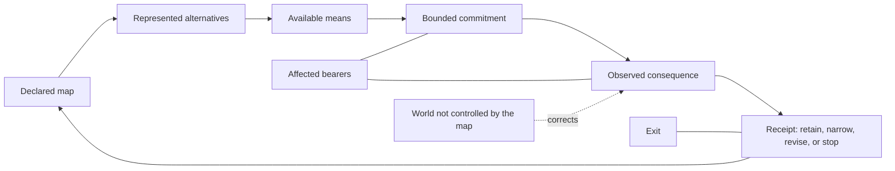

# The Emergentist Manifesto

## Preamble — A Frame That Can Be Put Down

<!-- FULLBOOK-P: preamble-01 -->
This book begins with a modest condition rather than a revelation. We are finite
beings: embodied, situated, capable of representing alternatives, and answerable
to what follows from what we do. We do not stand outside the world with a final
inventory of it. We act from partial contact, inherited language, limited means,
and models that can be mistaken. That is not a defect to be concealed before a
worldview may begin. It is the condition under which a worldview becomes needed:
we must still decide, cooperate, refuse, repair, and live with consequences while
what exceeds our maps remains partly unknown.

Source cards: `OS01-20`, `OS01-13`, `OS01-21`.

<!-- FULLBOOK-P: preamble-02 -->
Emergentism is offered as a discipline for this condition. It asks a reader to
keep several things visibly different: the world and a map of it; a possibility
and an actual record; an intention and a performed act; a stated success and an
observed consequence; a correction and a story that merely says it has been
corrected. These distinctions do not make a person infallible. They make it
harder to hide the exact place at which an inference, action, or account of
success might fail.

Source cards: `OS01-08`, `OS01-13`, `OS01-26`.

<!-- FULLBOOK-P: preamble-03 -->
The book therefore asks for neither conversion nor protected agreement. Its
terms are optional; its symbols are optional; its practical prompts are optional.
The reader may use a distinction, test a practice, compare a rival, or decline
the whole frame. Holding the framework is not evidence for it, and leaving it is
not a failure of loyalty. A worldview that makes exit into betrayal has already
confused its continuation with the truth of what it says.

Source cards: `OS01-13`, `OS01-25`, `OS01-26`.

<!-- FULLBOOK-P: preamble-04 -->
That restraint governs the book's ambition. A theorem can settle a result inside
stated definitions; it does not by itself settle what ultimately exists. A
symbol can orient attention; it does not thereby become an agent in the world.
An elegant pattern may be worth studying; beauty alone does not yield an ethic.
And a vocabulary that helps one reader need not be the final language in which
anyone else must speak. The point is not to shrink inquiry. It is to stop
inquiry from being mistaken for possession.

Source cards: `OS01-01`, `OS01-03`, `OS01-22`, `OS01-26`.

<!-- FULLBOOK-P: preamble-05 -->
Some of the deepest questions remain open here: phenomenal consciousness, death,
and metaphysical remainder are not filled in with a comforting conclusion. The
book treats openness as a boundary of what it currently warrants, not as an
answer hidden behind a more impressive word. A reader can find this unsatisfying;
that dissatisfaction is real and belongs in the record. It does not license the
book to call its unevidenced wishes knowledge.

Source cards: `OS01-20`, `OS01-21`, `OS01-26`.

### In one sentence

<!-- FULLBOOK-P: preamble-06 -->
**Emergentism is a fallibilist worldview and practice for finite beings: keep
the map distinct from the world, possibility distinct from actual record, act
under visible constraints, then correct—or leave.** The sentence is a door, not
a proof. Everything that follows is an attempt to make its distinctions usable,
contestable, and reversible where a situation permits.

Source cards: `OS01-08`, `OS01-13`, `OS01-20`, `OS01-25`, `OS01-26`.

### In one image

<!-- FULLBOOK-P: preamble-07 -->

Source cards: `OS01-08`, `OS01-09`, `OS01-13`, `OS01-25`, `OS01-26`, `FIN01-01`.

<!-- FULLBOOK-P: preamble-08 -->
The diagram is a reader aid, not a causal theory or a general formula for human
life. It keeps a declared map, represented alternatives, available means, an
actual commitment, and an observed consequence from collapsing into one word
such as “success.” It also places affected bearers and exit beside the loop,
because a decision practice supplies no mandate and requires the bearer,
consent, contest, and exit questions to remain visible.

Source cards: `OS01-08`, `OS01-09`, `OS01-13`, `OS01-22`, `OS01-26`, `FIN01-01`.

### The reader's pact

<!-- FULLBOOK-P: preamble-09 -->
The book uses a simple pact with the reader. Where it presents an inherited
formal result, it names the stated domain. Where it makes a selected
interpretation, it says that it is selected. Where it recommends a practice, it
does not quietly turn the practice into authorization. Where it faces an open
question, it leaves the question open. The discipline is not complete because
it has these rules; the rules instead give a reader places from which to object.

Source cards: `OS01-03`, `OS01-04`, `OS01-08`, `OS01-13`, `OS01-26`.

<!-- FULLBOOK-P: preamble-10 -->
The practical consequence is ordinary but demanding. Before claiming that a
map has led to a good outcome, distinguish the map from the act, the act from
the outcome, and the outcome from the report that celebrates it. Before naming
a pattern a cause, distinguish its description from the mechanism that would
produce an effect. Before calling an account ethical, name the normative premise
that does the ethical work. These are not rhetorical cautions placed at the
front of a finished system. They are rules for refusing to finish too soon.

Source cards: `OS01-01`, `OS01-08`, `OS01-13`, `OS01-22`, `OS01-26`.

## Part I — The Finite Condition

### 1. No map receives immunity

<!-- FULLBOOK-P: p1-01 -->
Every person already lives with maps. A map can be a spoken explanation, a
scientific model, a memory, a budget, a plan, a moral story, a ritual, a
prediction, or a word we use to make a situation manageable. The variety does
not erase the common condition: each map selects, simplifies, and directs
attention. None becomes the territory merely because it is familiar, socially
shared, technically elaborate, or emotionally indispensable.

Source cards: `OS01-13`, `OS01-20`, `OS01-26`.

<!-- FULLBOOK-P: p1-02 -->
This does not imply that all maps are equally empty or equally useful. It
implies a different test. A map earns continued use when a reader can see what
it says, what it leaves out, what action it informs, what consequence would
bear on it, and how the holder could revise or leave it. A framework may be
clearer than another in a stated setting; it still does not acquire immunity
from correction merely by being internally coherent.

Source cards: `OS01-08`, `OS01-13`, `OS01-26`.

<!-- FULLBOOK-P: p1-03 -->
A complete story can appear to make uncertainty easier to bear. But a story
that treats every anomaly as already accounted for, every objection as
confirmation, and every departure as proof of misunderstanding blocks the
framework's own correction rule. A map cannot validate itself through agreement
with its own terms; the world, other bearers, and outcomes not awarded by the
map remain necessary sources of correction.

Source cards: `OS01-08`, `OS01-13`, `OS01-26`.

<!-- FULLBOOK-P: p1-04 -->
To call a map fallible is not to call every map equally useful, nor to promise
that every question will become decidable. It is to keep the status of a claim
legible enough that a reader can see when a conclusion has outrun its warrant,
when an outcome has not been observed, or when a question remains open. Revision
then concerns the map and its stated claim; it does not turn uncertainty into a
hidden answer.

Source cards: `OS01-13`, `OS01-20`, `OS01-21`, `OS01-26`.

<!-- FULLBOOK-P: p1-05 -->
This is why the framework begins with the finite condition rather than a
metaphysical origin story. We encounter a world already in motion, with bodies,
records, institutions, memories, tools, and unfinished consequences. We can
make representations of what might happen, but those representations occur in
the present and do not suspend the constraints of present means. A possible
future is not yet an actual result, however vivid the imagination that carries
it.

Source cards: `OS01-09`, `OS01-13`, `OS01-20`.

<!-- FULLBOOK-P: p1-06 -->
The question for a finite worldview is therefore not “How can a map become
unquestionable?” It is “What kind of map keeps a claim, a move, its consequence,
and what remains unresolved visibly distinct?” The answer offered here is
procedural rather than possessive: make the relevant distinctions explicit,
declare the move, receive the consequence, and preserve the right to revise or
stop.

Source cards: `OS01-08`, `OS01-13`, `OS01-22`, `OS01-25`, `OS01-26`.

### 2. The first distinction: frames are not things

<!-- FULLBOOK-P: p1-07 -->
Before using a concept, ask what kind of thing it is meant to be. Is it a
number, a physical object, a relation, a formal marker, a metaphor, a rule of
description, an observation, or a question? The question sounds elementary,
but it prevents a common collapse: treating a label that organizes thought as
though it were automatically an object inside the world it helps us describe.

Source cards: `OS01-01`, `OS01-03`, `OS01-04`, `OS01-26`.

<!-- FULLBOOK-P: p1-08 -->
The Titan labels provide one deliberately limited example. They are selected
boundary labels: a way to point toward origin or absence, finite unit, and an
unbounded horizon without claiming that the labels name three physical entities,
three gods, three arithmetic operands, or a census of what reality contains.
The reader may discard the imagery and retain its useful survivor: a frame is
not an object merely because the frame can be named.

Source cards: `OS01-01`, `OS01-26`.

<!-- FULLBOOK-P: p1-09 -->
The same restraint applies to selected D1 language. One may read distinction
through signed units in a chosen presentation while leaving ordinary arithmetic
inside its native definitions. The interpretation does not amend arithmetic,
turn a familiar symbol into a new number, or grant a privileged account of what
mathematics is ultimately about. If the selected crosswalk does not improve
understanding while preserving ordinary results, the crosswalk may be removed
without loss to ordinary mathematics.

Source cards: `OS01-03`, `OS01-04`.

<!-- FULLBOOK-P: p1-10 -->
This is not a programme for dismissing difficult questions as mere language
mistakes. Some apparent contradictions may become clearer when the relevant
domain, operation, or type is made explicit. That possibility earns exactly one
burden: name the mismatch and show how the local result is recovered. Where no
mismatch has been identified, the problem remains open. Naming a type boundary
is a diagnosis only when it is specific enough to be wrong.

Source cards: `OS01-03`, `OS01-04`, `OS01-26`.

<!-- FULLBOOK-P: p1-11 -->
The distinction between a frame and a thing also protects ethics. A symbol can
be beautiful without becoming an authorization to act. A diagram can make a
relation visible without proving an ought. Agreement among many holders does
not turn adherence into moral evidence. Emergentism treats each of these moves
as a change of type that must be stated rather than smuggled across.

Source cards: `OS01-01`, `OS01-22`, `OS01-26`.

<!-- FULLBOOK-P: p1-12 -->
This chapter's positive lesson is small enough to use anywhere: let a term do
only the work it has earned. A mathematical term may retain a mathematical
meaning. A selected image may remain an image. An observation may remain an
observation until an inference is declared. A moral choice may remain a moral
choice rather than pretending to have emerged automatically from form. The
discipline does not eliminate ambiguity; it locates it.

Source cards: `OS01-03`, `OS01-04`, `OS01-22`, `OS01-26`.

### 3. Possibility is not actuality

<!-- FULLBOOK-P: p1-13 -->
Finite beings do more than register what has already happened. We represent
alternatives: futures we fear, plans we prefer, promises we make, paths we may
take, and actions we may refuse. That capacity matters because it changes how a
present person can deliberate. Yet the represented alternative and the actual
means available to pursue it remain different axes. A rich description of a
possible future does not supply the body, energy, tools, access, or time that
an actual move may require.

Source cards: `OS01-09`, `OS01-13`, `OS01-20`.

<!-- FULLBOOK-P: p1-14 -->
The framework names this separation without making it into a score of human
worth. A current map may represent a broad field of alternatives, while actual
means remain narrow; another person may have substantial means but a poor or
undiscriminating map. The two conditions can be kept visible as a profile before
any attempt is made to combine them. If someone wishes to turn them into a
single number, that combination requires a stated calibration, a declared
domain, and a way to replace it if a better account is available.

Source cards: `OS01-09`, `OS01-20`, `OS01-26`.

<!-- FULLBOOK-P: p1-15 -->
This matters because a possible future can exert practical influence only
through present carriers and present action. A plan may be written, spoken,
remembered, modelled, or shared; its effects still depend on what actual people
and systems do with it. The possibility is not being denied. It is being kept
from becoming a substitute for the means and observed consequence that would
make a claim about its realization answerable.

Source cards: `OS01-08`, `OS01-09`, `OS01-13`, `OS01-22`.

<!-- FULLBOOK-P: p1-16 -->
The same distinction can be seen in a narrower scientific register. A quantum
state supplies context-relative probabilities; an actual record is a different
event. The state predicts and a record occurs. That contrast does not settle
the measurement problem, select an interpretation, or entitle this book to
turn a scientific formalism into a metaphysics. It is retained here because it
is an exact example of a general reader discipline: do not call a prediction an
outcome before the outcome has occurred.

Source cards: `OS01-06`, `OS01-26`.

<!-- FULLBOOK-P: p1-17 -->
The distinction does not determine which commitment is right. It asks a more
exact practical question: given the map now held and the means now available,
which commitment can be named honestly, with a review boundary and a way to
record what follows? In either case, the framework asks the holder not to treat
the vividness of an imagined future as evidence that it has already entered the
record.

Source cards: `OS01-08`, `OS01-09`, `OS01-13`, `OS01-22`, `FIN01-01`.

<!-- FULLBOOK-P: p1-18 -->
Keeping possibility distinct from actuality also protects a reader from a more
subtle inflation. A model can contain many possible paths without any path
being morally permitted; available power can be substantial without being
wisely or lawfully usable. The gap between what might be done, what can be done,
and what ought to be done is not an embarrassment to be concealed by one
master variable. It is where evidence, a declared moral premise, and the
separate questions a decision practice asks of authority and affected bearers
have to enter separately.

Source cards: `OS01-09`, `OS01-22`, `OS01-26`, `FIN01-01`.

### 4. The world answers back

<!-- FULLBOOK-P: p1-19 -->
An intention is not yet an action. An action is not yet an outcome. An outcome
is not yet a sound account of what it means. These distinctions become visible
through a receipt: a record that states what was intended, what was actually
done, what followed, how the observation was made, and how another bearer can
challenge the comparison. A self-issued declaration of success can record a
commitment or a belief; by itself it is not outcome evidence.

Source cards: `OS01-08`, `OS01-13`, `OS01-26`.

<!-- FULLBOOK-P: p1-20 -->
The receipt matters because a map is tested at the point of consequence. The
framework has no magic defence against a mistaken comparison or an incomplete
record. It asks instead for a visible comparison between what the map expected
and what followed, with a contest path for the observation. If the comparison
is unavailable, the honest status is not victory but uncertainty.

Source cards: `OS01-08`, `OS01-13`, `OS01-22`, `OS01-26`.

<!-- FULLBOOK-P: p1-21 -->
This makes correction an event rather than a posture. A claim may need to be
retained, revised, narrowed, suspended, or stopped after a contestable
comparison. Emergentism cannot ensure that holders will make those changes. It
can keep the relevant distinctions in view and refuse to count an internal
declaration of humility as the correction itself.

Source cards: `OS01-08`, `OS01-13`, `OS01-25`, `OS01-26`.

<!-- FULLBOOK-P: p1-22 -->
The consequence is a different picture of learning. Learning is not simply an
accumulation of confident statements. It is a contestable change in a map after
an actual attempt and an observation that the map did not award itself. The
change may be retention, revision, narrowing, suspension, or stopping. The
important point is not that every loop ends happily, but that the loop leaves a
place for the world to say no.

Source cards: `OS01-08`, `OS01-13`, `OS01-26`.

<!-- FULLBOOK-P: p1-23 -->
The reader should notice what this does not promise. A receipt is not a proof
of a complete worldview. A visible record may itself be incomplete, contested,
or misleading. The surviving commitment is narrower: distinguish the declared
move from the received consequence, make the comparison contestable, and do not
let an elegant account erase the need for further contact.

Source cards: `OS01-08`, `OS01-13`, `OS01-26`.

### 5. Justice enters as a choice

<!-- FULLBOOK-P: p1-24 -->
The distinctions so far do not produce an ethic by themselves. For that reason,
Emergentism states its normative bridge openly: Justice is a declared
constitutional premise. It is not derived from geometry, arithmetic, evidence
alone, aesthetic coherence, or the number of people who applaud a result.

Source cards: `OS01-09`, `OS01-22`, `OS01-26`.

<!-- FULLBOOK-P: p1-25 -->
To say that Justice is chosen makes the source of normativity inspectable. A
consequential decision practice can then ask who acts, who is exposed, what
authority is present, how a claim may be contested, and how exit remains
available. No elegant abstraction can substitute for those questions. The
ethical work therefore appears where it belongs: in a declared premise and in
the visible consequences that the premise must face.

Source cards: `OS01-08`, `OS01-13`, `OS01-22`, `OS01-26`, `FIN01-01`.

<!-- FULLBOOK-P: p1-26 -->
This is also why the book rejects measures of human worth. A map-and-means
profile may help diagnose a practical limitation inside a declared context. It
does not rank persons, establish permanent identities, or convert unequal
resources into a moral title. A framework that speaks about potential must
retain this boundary or it will confuse a temporary description of capacity with
a verdict about who deserves voice, dignity, or exit.

Source cards: `OS01-09`, `OS01-19`, `OS01-22`, `OS01-26`.

<!-- FULLBOOK-P: p1-27 -->
The full practical apparatus comes later in this book. At this point, the
reader needs only the first restraint: no inference from what can be imagined
or technically achieved to what should be done. The step from description to
action crosses evidence, consequence, a chosen normative premise, and the
separate authority-and-bearer questions of a decision practice. If these
questions are not made visible, the conclusion has left its normative bridge
unstated.

Source cards: `OS01-08`, `OS01-09`, `OS01-22`, `OS01-26`, `FIN01-01`.

### 6. Nonclosure

<!-- FULLBOOK-P: p1-28 -->
Every worldview faces a final temptation: to turn its own boundary into one more
positive possession. Emergentism instead marks nonclosure. Its D6 label names
an exit from further articulation, not a sixth freedom, a human rank, an
afterlife, a hidden object, or an identity with an origin point. The label is
selected boundary language, and it must remain no more than that.

Source cards: `OS01-01`, `OS01-25`, `OS01-26`.

<!-- FULLBOOK-P: p1-29 -->
Nonclosure has a practical meaning. There are questions a map has not answered,
actions it has not justified, harms it has not repaired, and readers it has not
persuaded. The appropriate response is not necessarily despair. It may be a
new investigation, a smaller claim, an honest refusal, a transfer to a better
method, or a departure. What it may not become is an excuse to pretend that
unanswered remainder proves a secret completion.

Source cards: `OS01-13`, `OS01-21`, `OS01-25`, `OS01-26`.

<!-- FULLBOOK-P: p1-30 -->
Exit is therefore structural, not ceremonial. A reader may put down a symbol,
a practice, a hypothesis, or the book itself. A decision practice supplies no
mandate and its exit route remains part of its stated boundary. The freedom to
leave keeps correction possible because it denies the worldview the power to
make its own continued holding the final test.

Source cards: `OS01-08`, `OS01-13`, `OS01-22`, `OS01-25`, `OS01-26`, `FIN01-01`.

<!-- FULLBOOK-P: p1-31 -->
Part I has established no total ontology and offered no finished mathematics. It
has done something prior: it has named the finite condition, separated frames
from things, possibility from actuality, commitment from consequence, and a
chosen ethic from a formal pattern. The next part can ask how those distinctions
become an accountable practical discipline. It remains a selected framework,
not a completed result, and any reader may narrow, replace, or leave it.

Source cards: `OS01-03`, `OS01-04`, `OS01-08`, `OS01-13`, `OS01-22`, `OS01-25`, `OS01-26`, `FIN01-01`.

## Part I refusal

<!-- FULLBOOK-P: p1-32 -->
Do not turn a theorem into an ontology. Do not turn a model into its territory.
Do not turn a symbol into a causal agent. Do not turn an elegant geometry into
an ethic. Do not turn adherence into evidence. Do not turn a reader's departure
into a moral failure. These refusals are not the end of the book's argument;
they are the condition under which the argument may continue without demanding
that a reader surrender the right to correct it.

Source cards: `OS01-01`, `OS01-22`, `OS01-25`, `OS01-26`.
