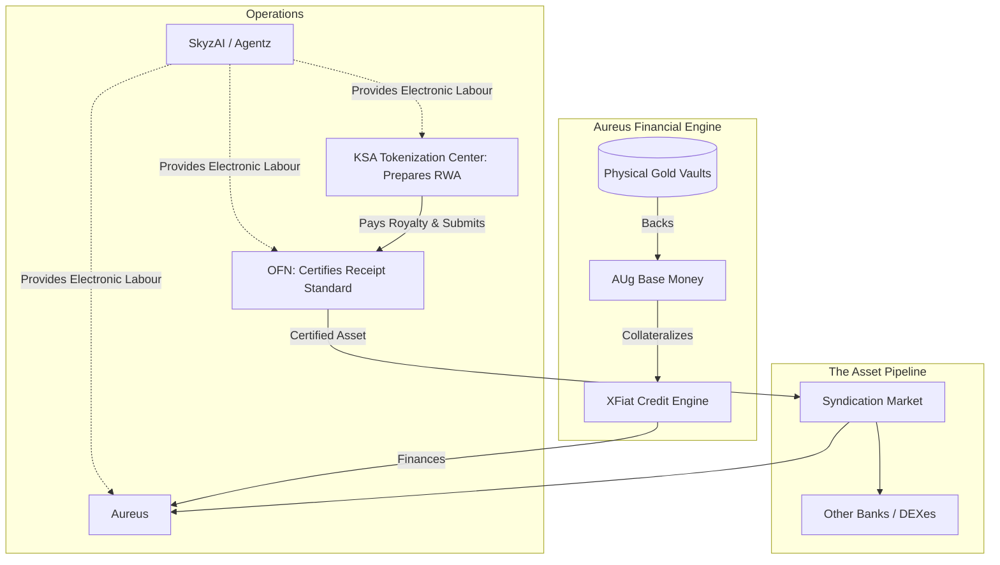

---
rosetta:
  primary_level: L5
  primary_column: System Architecture
  secondary:
    - level: L4
      column: Value Alignment
      role: "map liability separation, phase sequencing, and operating firewalls"
    - level: L3
      column: Methodology
      role: "downgrade entity claims unless owner-lane receipts support them"
    - level: L6
      column: Core State
      role: "bound this as synthesis note, not Aureus/OFN/Tokencen source canon"
  operator: "Brahmā ○"
  tier: "Executive"
  regime: "Brāhmaṇa"
  register: "[I/C]"
  canonical_phrase: "Tokencen / Aureus Ecosystem Architecture — Synthesis Note"
---

# The Tokencen / Aureus Ecosystem Architecture

[I/C] This synthesis note maps an intended entity separation model. It is not the source authority for Aureus, OFN, Tokencen, or SkyzAI operating facts; those claims require owner-lane receipts.

This document maps the structural interplay between the four core layers of the tokenized real-world asset (RWA) ecosystem. To maintain clean balance sheets and isolate risk, the ecosystem strictly separates origination, certification, finance, and operations.

## The Four Pillars

### 1. KSA Tokenization Center (Origination / Capability Layer)
* **Role**: The Saudi-based national institutional capability layer.
* **Function**: The Center acts as a zero-liability architect. It builds awareness, maps assets, and prepares the legal, regulatory, and Sharia readiness for tokenization. Once a deal is structured, it is syndicated to 4-5 underwriting banks and DEXes (including Aureus).
* **Risk Profile**: Absolute zero liability. The Center does not take a cut of the deal flow, act as a broker, or hold credit risk.

### 2. OFN (Certification Layer)
* **Role**: The receipt standard and issuance certifier.
* **Function**: Before an asset can enter the financial engine, OFN audits and certifies the asset. In this model, it attests that the Receipt Standard (legal, physical, format) is met and checks that the asset is ready for on-chain issuance. It outputs a cryptographic payload (`ofn_signature`) that Agentz ingests.
* **Risk Profile**: OFN assumes zero credit or custody risk. It monetizes purely through certification and oracle query fees.

### 3. Aureus (Investment Bank / Financial Engine Layer)
* **Role**: The gold-reserve liquidity provider.
* **Function**: Aureus is described here as a proposed financial-engine lane. Under that model, it would hold allocated physical gold, issue the AUg base money, and run the XFiat credit engine. It would use **Agentz (SkyzAI)** to evaluate assets checked by OFN and the KSA Tokenization Center, with XFiat credit decisions based on Agentz algorithmic underwriting.
* **Risk Profile**: Aureus does not originate assets, nor does it perform operational labor. It is a pure hard-asset balance sheet.

### 4. SkyzAI / Agentz (Electronic Labour Layer)
* **Role**: The operational and administrative engine.
* **Function**: SkyzAI houses the "Electronic Labour." It runs the automated agents (AI/Agentz) that evaluate everything. Agentz handles the underwriting, risk monitoring, asset evaluation, Oracle updates, and smart contract execution for the entire ecosystem. When Aureus needs to decide if an asset is credit-worthy, Agentz does the cognitive labor to make that determination. 
* **Risk Profile**: SkyzAI performs the labor but carries no custody and holds no credit risk. 

## The Operating Pipeline

## The Phased Execution Sequence

To protect the zero-liability firewall and build sovereign capability, the ecosystem rolls out in three distinct phases:

* **Phase 1 (KSA Tokenization Center)**: This is the low-regulatory-complexity entry point. It builds awareness, policy alignment, institutional education, Sharia coordination, market mapping, investor dialogue, partner engagement and pilot preparation.
* **Phase 2 (RWA Capital Formation Capability)**: The commercial engine that turns assets into verified, documented, legally structured, Sharia-reviewed, token-ready investment products. This includes evidence rooms, asset verification, and investor documentation.
* **Phase 3 (Regulated Digital Liquidity Infrastructure)**: This creates the future pathway toward marketplace access, custody, settlement, bank integration, lending, collateral use and lifecycle servicing.

## Summary

In plain English: The **KSA Tokenization Center** consults and prepares the asset class without taking liability, **OFN** (Swiss) stamps it for quality and collects royalties, **SkyzAI** handles the paperwork/underwriting automation, and **Aureus** (along with other syndicated banks) uses its verified gold reserves to finance it. This separation is intended to keep origination liability, certification, operational labor, and balance-sheet risk in distinct entity lanes.
